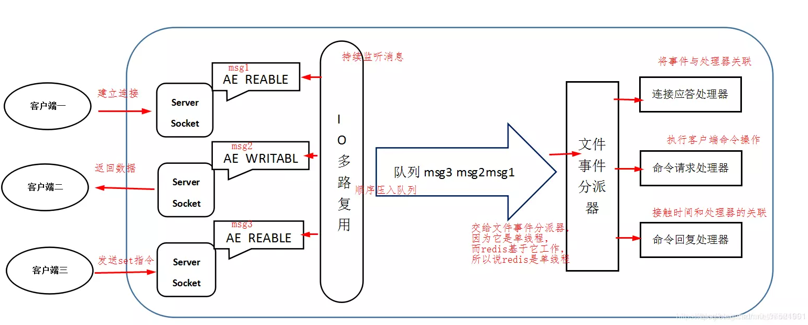
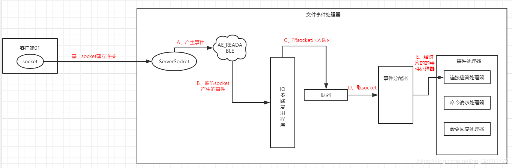

# docker redis

```bash
#redis
docker run -d --name f-redis -p 6379:6379 redis redis-server
#客户端连接
docker exec -it f-redis redis-cli
```


# 概述

Redis 是一个开源（BSD许可）的，**内存**中的**数据结构存储系统**，它可以用作**==数据库、缓存和消息中间件==**。 它支持多种类型的数据结构，如 字符串（strings）， 散列（hashes）， 列表（lists）， 集合（sets）， 有序集合（sorted sets） 与范围查询， bitmaps， hyperloglogs 和 地理空间（geospatial） 索引半径查询。 Redis 内置了 复制（replication），LUA脚本（Lua scripting）， LRU驱动事件（LRU eviction），事务（transactions） 和不同级别的 磁盘持久化（persistence）， 并通过 Redis哨兵（Sentinel）和自动 分区（Cluster）提供高可用性（high availability）。

Redis是现在最受欢迎的**==NoSQL==**数据库之一，Redis是一个使用ANSI C编写的开源、包含多种数据结构、支持网络、基于内存、可选持久性的键值对存储数据库，其具备如下特性：

- 基于内存运行，性能高效
- 支持分布式，理论上可以无限扩展
- key-value存储系统
- 开源的使用ANSI C语言编写、遵守BSD协议、支持网络、可基于内存亦可持久化的日志型、Key-Value数据库，并提供多种语言的API

相比于其他数据库类型，Redis具备的特点是：

- C/S通讯模型
- 单进程单线程模型
- 丰富的数据类型
- 操作具有原子性
- 持久化
- 高并发读写
- 支持lua脚本

Redis 的应用场景包括：缓存系统（“热点”数据：高频读、低频写）、计数器、消息队列系统、排行榜、社交网络和实时系统。


## 为什么这么快

Redis 内部做了非常多的性能优化，比较重要的有下面 3 点：

1. Redis 基于内存，内存的访问速度是磁盘的上千倍；
2. Redis 基于 Reactor 模式设计开发了一套高效的事件处理模型，主要是单线程事件循环和 IO 多路复用
3. Redis 内置了多种优化过后的数据类型/结构实现，性能非常高。


内存：快

K,V

单线程worker iothreads

连接很多：**epoll**

V: 类型（5）

本地方法：计算向数据移动，IO优化

串行化/原子	并行vs串行


# 线程模型

## 单线程

1. 从redis的性能上进行考虑，单线程避免了上下文频繁切换问题，效率高；
2. 从redis的内部结构设计原理进行考虑，redis是基于**Reactor模式**开发了自己的网络事件处理器： 这个处理器被称为**文件事件处理器**（file event handler）。而这个文件事件处理器是单线程的，所以才叫redis的**单线程模型**，这也决定了redis是单线程的。

## 文件事件处理器

4个组成结构：

- 多个socket套接字
- IO多路复用程序
- 文件事件分派器
- 事件处理器
  - 连接应答处理器
  - 命令请求处理器
  - 命令回复处理器


> 文件事件的类型

I/O 多路复用程序可以监听多个套接字的ae.h/AE_READABLE事件和ae.h/AE_WRITABLE事件，这两类事件和套接字操作之间的对应关系如下：

- 当套接字变得可读时（客户端对套接字执行write操作，或者执行close操作），或者有新的可应答（acceptable）套接字出现时（客户端对服务器的监听套接字执行connect操作），套接字产生AE_READABLE 事件。
- 当套接字变得可写时（客户端对套接字执行read操作），套接字产生AE_WRITABLE事件。I/O多路复用程序允许服务器同时监听套接字的AE_READABLE事件和AE_WRITABLE事件，如果一个套接字同时产生了这两种事件，那么文件事件分派器会优先处理AE_READABLE事件，等到AE_READABLE事件处理完之后，才处理AE_WRITABLE 事件。这也就是说，如果一个套接字又可读又可写的话，那么服务器将先读套接字，后写套接字。



## 工作流程及原理


客户端与redis进行通信大致流程：
1、首先在redis启动初始化的时候，redis会先将事件处理器中的连接应答处理器和AE_READABLE事件关联起来;
2、如果客户端向redis发起连接，会产生AE_READABLE事件(步骤A)，产生该事件后会被IO多路复用程序监听到(步骤B)，然后IO多路复用程序会把监听到的socket信息放入到队列中(步骤C)，事件分配器每次从队列中取出一个socket(步骤D)，然后事件分派器把socket给对应的事件处理器(步骤E)。由于连接应答处理器和AE_READABLE事件在redis初始化的时候已经关联起来，所以由连接应答处理器来处理跟客户端建立连接，然后通过ServerSocket创建一个与客户端一对一对应的socket，如叫socket01，同时将这个socket01的AE_READABLE事件和命令请求处理器关联起来。



4、当客户端向redis发生请求时(读、写操作)，首先就会在对应的socket如socket01上会产生AE_READABLE事件(步骤A)，产生该事件后会被IO多路复用程序监听到(步骤B)，然后IO多路复用程序会把监听到的socket信息放入到队列中(步骤C)，事件分配器每次从队列中取出一个socket(步骤D)，然后事件分派器把socket给对应的事件处理器(步骤E)。由于命令处理器和socket01的AE_READABLE事件关联起来了，然后对应的命令请求处理器来处理。这个命令请求处理器会从事件分配器传递过来的socket01上读取相关的数据，如何执行相应的读写处理。操作执行完之后，redis就会将准备好相应的响应数据(如你在redis客户端输入 set a 123回车时会看到响应ok)，并将socket01的AE_WRITABLE事件和命令回复处理器关联起来。


5、当客户端会查询redis是否完成相应的操作，就会在socket01上产生一个AE_WRITABLE事件，会由对应的命令回复处理器来处理，就是将准备好的相应数据写入socket01(由于socket连接是双向的),返回给客户端，如读操作，客户端会显示ok。


6、如果命令回复处理器执行完成后，就会删除这个socket01的AE_WRITABLE事件和命令回复处理器的关联。
7、这样客户端就和redis进行了一次通信。由于连接应答处理器执行一次就够了，如果客户端在次进行操作就会由命令请求处理器来处理，反复执行。

## 消息处理流程

- 文件事件处理器使用I/O多路复用(multiplexing)程序来同时监听多个套接字，并根据套接字目前执行的任务来为套接字关联不同的事件处理器。
- 当被监听的套接字准备好执行连接应答(accept)、读取(read)、写入(write)、关闭(close)等操作时，与操作相对应的文件事件就会产生，这时文件事件处理器就会调用套接字之前关联好的事件处理器来处理这些事件。

尽管多个文件事件可能会并发地出现，但I/O多路复用程序总是会将所有产生事件的套接字都推到一个队列里面，然后通过这个队列，以有序（sequentially）、同步（synchronously）、每次一个套接字的方式向文件事件分派器传送套接字：当上一个套接字产生的事件被处理完毕之后（该套接字为事件所关联的事件处理器执行完毕）， I/O多路复用程序才会继续向文件事件分派器传送下一个套接字。

## I/O 多路复用程序的实现

Redis的I/O多路复用程序的所有功能是通过包装select、epoll、evport和kqueue这些I/O多路复用函数库来实现的，每个I/O多路复用函数库在Redis源码中都对应一个单独的文件，比如ae_select.c、ae_epoll.c、ae_kqueue.c等。

因为Redis为每个I/O多路复用函数库都实现了相同的API，所以I/O多路复用程序的底层实现是可以互换的，如下图所示。


> 有关epoll的详细讲解，可以点击查看java-io-epoll，彻底搞懂epoll高效运行的原理

Redis在I/O多路复用程序的实现源码中用#include宏定义了相应的规则，程序会在编译时自动选择系统中性能最好的I/O多路复用函数库来作为Redis的I/O多路复用程序的底层实现：

```c
/* Include the best multiplexing layer supported by this system.
 * The following should be ordered by performances, descending. */
#ifdef HAVE_EVPORT
#include "ae_evport.c"
#else
    #ifdef HAVE_EPOLL
    #include "ae_epoll.c"
    #else
        #ifdef HAVE_KQUEUE
        #include "ae_kqueue.c"
        #else
        #include "ae_select.c"
        #endif
    #endif
#endif
```


# Redis keys

​		Redis key值是**二进制安全的**，这意味着可以用任何二进制序列作为key值，从形如”foo”的简单字符串到一个JPEG文件的内容都可以。空字符串也是有效key值。

关于key的几条规则：

- 太长的键值不是个好主意，例如1024字节的键值就不是个好主意，不仅因为消耗内存，而且在数据中查找这类键值的计算成本很高。
- 太短的键值通常也不是好主意，如果你要用”u:1000:pwd”来代替”user:1000:password”，这没有什么问题，但后者更易阅读，并且由此增加的空间消耗相对于key object和value object本身来说很小。当然，没人阻止您一定要用更短的键值节省一丁点儿空间。
- 最好坚持一种模式。例如：”`object-type:id:field`”就是个不错的注意，像这样”user:1000:password”。我喜欢对多单词的字段名中加上一个点，就像这样：”`comment:1234:reply.to`”。


# 基本数据类型

## String: 字符串

​		**二进制安全**：只存字节数组（只关心二进制化的字符串,不关心具体格式.只会严格的按照二进制的数据存取。不会妄图以某种特殊格式解析数据）

​		如客户端utf-8格式`set k1 中` 占三个字节`"\xe4\xb8\xad"`，改为gbk格式占俩个字节`"\xd6\xd0"`

> 场景

字符串 ：session、对象、小文件

数值int：秒杀（在db中做）redis 起到限流削峰、计数


**bitmap**二进制：

```bash
man ascii
```

```bash
127.0.0.1:6379> setbit k1 1 1
(integer) 0
127.0.0.1:6379> get k1
"@"
127.0.0.1:6379> setbit k1 7 1
(integer) 0
127.0.0.1:6379> get k1
"A"
127.0.0.1:6379> setbit k2 1 1
(integer) 0
127.0.0.1:6379> setbit k2 6 1
(integer) 0
127.0.0.1:6379> get k2
"B"
127.0.0.1:6379> BITOP and andkey k1 k2
(integer) 1
127.0.0.1:6379> get andkey
"@"
127.0.0.1:6379> BITOP or  orkey k1 k2
(integer) 1
127.0.0.1:6379> get orkey
"C"
```

0000 0000	若偏移大于7自动向后添加字节

setbit k1 1 1	设为0100 0000 => @

setbit k1 7 1	设为0100 0001 => A


bitmap      位信息    任意统计 web、离线分析

- 统计任意时间窗口 一个用户的登录情况
- 2E 注册数 礼品  活跃用户数        统计->决策
- OA 权限 linux rwx int4 32字节
- 布隆过滤器 模块化


## Hash: 散列

- 聚集数据


- 详情页


## List: 列表

同向 lpush lpop	栈

异向 队列

数组 Lindex	

ltrim优化redis 内存量


顺序概念 放入的顺序

> 场景

- 评论列表


- 消息队列


- 替代java容器	让jvm无状态	数据共享迁出


## Set: 集合

去重无序	hashset底层hashmap的value为null,元素变多rehash

srandmember k1 3/-3	正数去重 负数可能重复


sunion	合集

sinter	交集

sdiff	key值顺序参照第一个key做差集

> 场景

- 抽奖  

- 验证码


- 扑克牌游戏


- 随机时间


- 共同好友 


- 好友推荐


## Sorted Set: 有序集合

去重

有序（排序）


zreverange


排行榜

评论 有序	分页


==动态排序 没有重排序==

排序方式数据结构ziplist -> **skiplist** 最大64层


## Redis数据结构


## Redis针对数据结构做了哪些优化

redis数据模型：

在Redis中，会给每一个key-value键值对分配一个字典实体，就是`dicEntry`。`dicEntry`包含三部分： **key的指针、val的指针、next指针**，next指针指向下一个dicteEntry形成链表，这个next指针可以将多个哈希值相同的键值对链接在一起，**通过链地址法来解决哈希冲突的问题**


- **sds** ：**Simple Dynamic String**，简单动态字符串，存储字符串数据。
- **redisObject**：Redis的5种常用类型都是以RedisObject来存储的，redisObject中的**type**字段指明了值的数据类型（也就是5种基本类型)。**ptr**字段指向对象所在的地址。

1、String： sds实现，自定义类型加入了长度，每次获取字符串长度的时间复杂度就是O(1)，而利用len和free属性对追加字符串进行优化，也可以降低重新分配内存的次数。

2、Hash： zip-list 或者 hash-table（数组+链表）扩容机制采用渐进式扩容。

3、Set： int-Set

4、Zset： skip-list

4、List： zip-list -> linked-list -> quick-list （前两者合并之后创建了快速链表）

## 各个数据类型应用场景

| 类型                 | 简介                                                   | 特性                                                         | 场景                                                         |
| :------------------- | :----------------------------------------------------- | :----------------------------------------------------------- | :----------------------------------------------------------- |
| String(字符串)       | 二进制安全                                             | 可以包含任何数据,比如jpg图片或者序列化的对象,一个键最大能存储512M | ---                                                          |
| Hash(字典)           | 键值对集合,即编程语言中的Map类型                       | 适合存储对象,并且可以像数据库中update一个属性一样只修改某一项属性值(Memcached中需要取出整个字符串反序列化成对象修改完再序列化存回去) | 存储、读取、修改用户属性                                     |
| List(列表)           | 链表(双向链表)                                         | 增删快,提供了操作某一段元素的API                             | 1,最新消息排行等功能(比如朋友圈的时间线) 2,消息队列          |
| Set(集合)            | 哈希表实现,元素不重复                                  | 1、添加、删除,查找的复杂度都是O(1) 2、为集合提供了求交集、并集、差集等操作 | 1、共同好友 2、利用唯一性,统计访问网站的所有独立ip 3、好友推荐时,根据tag求交集,大于某个阈值就可以推荐 |
| Sorted Set(有序集合) | 将Set中的元素增加一个权重参数score,元素按score有序排列 | 数据插入集合时,已经进行天然排序                              | 1、排行榜 2、带权重的消息队列                                |

### 异步队列

​		一般使用list结构作为队列，rpush生产消息，lpop消费消息。当lpop没有消息的时候，要适当sleep一会再重试。

​		如果不用sleep，list还有个指令叫blpop，在没有消息的时候，它会阻塞住直到消息到来。

​		如果想要生产一次消费多次，可以使用pub/sub主题订阅者模式，可以实现1:N的消息队列，但在消费者下线后，生产的消息会丢失，想要持久化的话，需要使用消息队列如rabbitmq等。

### 延时队列

​		使用sortedset，拿时间戳作为score，消息内容作为key调用zadd来生产消息，消费者用zrangebyscore指令获取N秒之前的数据轮询进行处理。


# **其他特殊数据类型**

- HyperLogLog	基数统计的算法
- geospatial     存储地理位置信息
- bitmap      位信息    任意统计
  - 统计任意时间窗口 一个用户的登录情况
  - 2E 注册数 礼品  活跃用户数        统计->决策
- stream   消息的持久化和主备复制功能

# 3钟常见的缓存读写策略

## Cache Aside Pattern（旁路缓存模式）

**是我们平时使用比较多的一个缓存读写模式，比较适合读请求比较多的场景。**

Cache Aside Pattern 中服务端需要同时维系 db 和 cache，并且是以 db 的结果为准。

下面我们来看一下这个策略模式下的缓存读写步骤。

### **写**：

- 先更新 db
- 然后直接删除 cache 。

### **读** :

- 从 cache 中读取数据，读取到就直接返回
- cache 中读取不到的话，就从 db 中读取数据返回
- 再把数据放到 cache 中。

### **缺陷**：

**缺陷 1：首次请求数据一定不在 cache 的问题**

解决办法：可以将热点数据可以提前放入 cache 中。

**缺陷 2**：写操作比较频繁的话导致 cache 中的数据会被频繁被删除，这样会影响缓存命中率 。

解决办法：

- 数据库和缓存数据强一致场景：更新 db 的时候同样更新 cache，不过我们需要加一个锁/分布式锁来保证更新 cache 的时候不存在线程安全问题。
- 可以短暂地允许数据库和缓存数据不一致的场景：更新 db 的时候同样更新 cache，但是给缓存加一个比较短的过期时间，这样的话就可以保证即使数据不一致的话影响也比较小。

## Read/Write Through Pattern（读写穿透）

Read/Write Through Pattern 中服务端把 cache 视为主要数据存储，从中读取数据并将数据写入其中。cache 服务负责将此数据读取和写入 db，从而减轻了应用程序的职责。

这种缓存读写策略小伙伴们应该也发现了在平时在开发过程中非常少见。抛去性能方面的影响，大概率是因为我们经常使用的分布式缓存 Redis 并没有提供 cache 将数据写入 db 的功能。

**写（Write Through）：**

- 先查 cache，cache 中不存在，直接更新 db。
- cache 中存在，则先更新 cache，然后 cache 服务自己更新 db（**同步更新 cache 和 db**）。

**读(Read Through)：**

- 从 cache 中读取数据，读取到就直接返回 。
- 读取不到的话，先从 db 加载，写入到 cache 后返回响应。

Read-Through Pattern 实际只是在 Cache-Aside Pattern 之上进行了封装。在 Cache-Aside Pattern 下，发生读请求的时候，如果 cache 中不存在对应的数据，是由客户端自己负责把数据写入 cache，而 Read Through Pattern 则是 cache 服务自己来写入缓存的，这对客户端是透明的。

和 Cache Aside Pattern 一样， Read-Through Pattern 也有首次请求数据一定不再 cache 的问题，对于热点数据可以提前放入缓存中。

## Write Behind Pattern（异步缓存写入）

Write Behind Pattern 和 Read/Write Through Pattern 很相似，两者都是由 cache 服务来负责 cache 和 db 的读写。

但是，两个又有很大的不同：**Read/Write Through 是同步更新 cache 和 db，而 Write Behind 则是只更新缓存，不直接更新 db，而是改为异步批量的方式来更新 db。**

很明显，这种方式对数据一致性带来了更大的挑战，比如 cache 数据可能还没异步更新 db 的话，cache 服务可能就就挂掉了。

这种策略在我们平时开发过程中也非常非常少见，但是不代表它的应用场景少，比如消息队列中消息的异步写入磁盘、MySQL 的 Innodb Buffer Pool 机制都用到了这种策略。

Write Behind Pattern 下 db 的写性能非常高，非常适合一些数据经常变化又对数据一致性要求没那么高的场景，比如浏览量、点赞量。


# 单点吞吐量

单点TPS达到8万/秒，QPS达到10万/秒，补充下TPS和QPS的概念

1. ==**QPS**==: **应用系统每秒钟最大能接受的用户访问量**。每秒钟处理完请求的次数，注意这里是处理完，具体是指发出请求到服务器处理完成功返回结果。可以理解在server中有个counter，每处理一个请求加1，1秒后counter=QPS。
2. **==TPS==**：**每秒钟最大能处理的请求数**。每秒钟处理完的事务次数，一个应用系统1s能完成多少事务处理，一个事务在分布式处理中，可能会对应多个请求，对于衡量单个接口服务的处理能力，用QPS比较合理。


# 事务

`MULTI` 、 `EXEC` 、 `DISCARD` 和 `WATCH` 是 Redis 事务相关的命令。

```
multi : 标记一个事务块的开始（ queued ）
exec : 执行所有事务块的命令 （ 一旦执行exec后，之前加的监控锁都会被取消掉 ）　
discard : 取消事务，放弃事务块中的所有命令
unwatch : 取消watch对所有key的监控
```

Redis事务可以一次执行多个命令，有以下特点：

- 批量操作在发送 EXEC 命令前被放入队列缓存。
- 收到 EXEC 命令后进入事务执行，事务中任意命令执行失败，其余的命令依然被执行。
- 在事务执行过程，其他客户端提交的命令请求不会插入到事务执行命令序列中。

事务可以理解为**一个打包的批量执行脚本，但批量指令并非原子化的操作，中间某条指令的失败不会导致前面已做指令的回滚，也不会造成后续的指令不做。**


# Jedis

# SpringBoot整合

Jedis:采用直连，多线程操作不安全，避免不安全使用jedis pool连接池。类似BIO模式

lettuce:采用netty，实例可以在多个线程中共享，不存在线程不安全情况。NIO模式


#  持久化

## AOF (append only file)

是将`Redis`执行的每次写命令记录到单独的日志文件中，当重启`Redis`会重新将持久化的日志中文件恢复数据。AOF有一个**重写模式**，当日志文件过大时可以对其进行压缩。AOF往往效率低于RDB一些。

**AOF的追写策略**：建议使用每秒同步一次`（everysec）`策略。

**rewrite机制**：rewrite会记录上次重写时AOF文件的大小，当AOF文件是上一次大小的二倍且大于64M时触发。


日志	慢；冗余

worker 单线程

实时？

丢数据？ sync 

os kernel:pagecache?	5秒/10% （30）

每秒


DB DIO(direct IO)

DMA 协处理器

MMU 段/页 -paddr


## RDB (snapshotting)

开启一个新的线程来完成往`rdb`文件中的写操作。主线程继续处理命令。**使用单独的子线程来进行持久化**。主线程不进行任何的IO操作。保证`redis`的高性能。缺点是可能会丢失一些数据。

命令触发：

BGSAVE：后台处理，不会阻塞工作线程。

SAVE：会导致工作线程的阻塞。


全量	丢失比较大	体积相近 恢复速度快	IO read


# 参数配置

| 序号 | 配置项                                                       | 说明                                                         |
| ---- | :----------------------------------------------------------- | ------------------------------------------------------------ |
| 1    | `daemonize no`                                               | Redis 默认不是以守护进程的方式运行，可以通过该配置项修改，使用 yes 启用守护进程（Windows 不支持守护线程的配置为 no ） |
| 2    | `pidfile /var/run/redis.pid`                                 | 当 Redis 以守护进程方式运行时，Redis 默认会把 pid 写入 /var/run/redis.pid 文件，可以通过 pidfile 指定 |
| 3    | `port 6379`                                                  | 指定 Redis 监听端口，默认端口为 6379，作者在自己的一篇博文中解释了为什么选用 6379 作为默认端口，因为 6379 在手机按键上 MERZ 对应的号码，而 MERZ 取自意大利歌女 Alessia Merz 的名字 |
| 4    | `bind 127.0.0.1`                                             | 绑定的主机地址                                               |
| 5    | `timeout 300`                                                | 当客户端闲置多长秒后关闭连接，如果指定为 0 ，表示关闭该功能  |
| 6    | `loglevel notice`                                            | 指定日志记录级别，Redis 总共支持四个级别：debug、verbose、notice、warning，默认为 notice |
| 7    | `logfile stdout`                                             | 日志记录方式，默认为标准输出，如果配置 Redis 为守护进程方式运行，而这里又配置为日志记录方式为标准输出，则日志将会发送给 /dev/null |
| 8    | `databases 16`                                               | 设置数据库的数量，默认数据库为0，可以使用SELECT 命令在连接上指定数据库id |
| 9    | `save <seconds> <changes>`Redis 默认配置文件中提供了三个条件：<br>**save 900 1**  <br/>**save 300 10**  <br/>**save 60 10000**分别表示 900 秒（15 分钟）内有 1 个更改，300 秒（5 分钟）内有 10 个更改以及 60 秒内有 10000 个更改。 | 指定在多长时间内，有多少次更新操作，就将数据同步到数据文件，可以多个条件配合 |
| 10   | `rdbcompression yes`                                         | 指定存储至本地数据库时是否压缩数据，默认为 yes，Redis 采用 LZF 压缩，如果为了节省 CPU 时间，可以关闭该选项，但会导致数据库文件变的巨大 |
| 11   | `dbfilename dump.rdb`                                        | 指定本地数据库文件名，默认值为 dump.rdb                      |
| 12   | `dir ./`                                                     | 指定本地数据库存放目录                                       |
| 13   | `slaveof <masterip> <masterport>`                            | 设置当本机为 slave 服务时，设置 master 服务的 IP 地址及端口，在 Redis 启动时，它会自动从 master 进行数据同步 |
| 14   | `masterauth <master-password>`                               | 当 master 服务设置了密码保护时，slav 服务连接 master 的密码  |
| 15   | `requirepass foobared`                                       | 设置 Redis 连接密码，如果配置了连接密码，客户端在连接 Redis 时需要通过 AUTH <password> 命令提供密码，默认关闭 |
| 16   | ` maxclients 128`                                            | 设置同一时间最大客户端连接数，默认无限制，Redis 可以同时打开的客户端连接数为 Redis 进程可以打开的最大文件描述符数，如果设置 maxclients 0，表示不作限制。当客户端连接数到达限制时，Redis 会关闭新的连接并向客户端返回 max number of clients reached 错误信息 |
| 17   | `maxmemory <bytes>`                                          | 指定 Redis 最大内存限制，Redis 在启动时会把数据加载到内存中，达到最大内存后，Redis 会先尝试清除已到期或即将到期的 Key，当此方法处理 后，仍然到达最大内存设置，将无法再进行写入操作，但仍然可以进行读取操作。Redis 新的 vm 机制，会把 Key 存放内存，Value 会存放在 swap 区 |
| 18   | `appendonly no`                                              | 指定是否在每次更新操作后进行日志记录，Redis 在默认情况下是异步的把数据写入磁盘，如果不开启，可能会在断电时导致一段时间内的数据丢失。因为 redis 本身同步数据文件是按上面 save 条件来同步的，所以有的数据会在一段时间内只存在于内存中。默认为 no |
| 19   | `appendfilename appendonly.aof`                              | 指定更新日志文件名，默认为 appendonly.aof                    |
| 20   | `appendfsync everysec`                                       | 指定更新日志条件，共有 3 个可选值：**no**：表示等操作系统进行数据缓存同步到磁盘（快）**always**：表示每次更新操作后手动调用 fsync() 将数据写到磁盘（慢，安全）**everysec**：表示每秒同步一次（折中，默认值） |
| 21   | `vm-enabled no`                                              | 指定是否启用虚拟内存机制，默认值为 no，简单的介绍一下，VM 机制将数据分页存放，由 Redis 将访问量较少的页即冷数据 swap 到磁盘上，访问多的页面由磁盘自动换出到内存中（在后面的文章我会仔细分析 Redis 的 VM 机制） |
| 22   | `vm-swap-file /tmp/redis.swap`                               | 虚拟内存文件路径，默认值为 /tmp/redis.swap，不可多个 Redis 实例共享 |
| 23   | `vm-max-memory 0`                                            | 将所有大于 vm-max-memory 的数据存入虚拟内存，无论 vm-max-memory 设置多小，所有索引数据都是内存存储的(Redis 的索引数据 就是 keys)，也就是说，当 vm-max-memory 设置为 0 的时候，其实是所有 value 都存在于磁盘。默认值为 0 |
| 24   | `vm-page-size 32`                                            | Redis swap 文件分成了很多的 page，一个对象可以保存在多个 page 上面，但一个 page 上不能被多个对象共享，vm-page-size 是要根据存储的 数据大小来设定的，作者建议如果存储很多小对象，page 大小最好设置为 32 或者 64bytes；如果存储很大大对象，则可以使用更大的 page，如果不确定，就使用默认值 |
| 25   | `vm-pages 134217728`                                         | 设置 swap 文件中的 page 数量，由于页表（一种表示页面空闲或使用的 bitmap）是在放在内存中的，，在磁盘上每 8 个 pages 将消耗 1byte 的内存。 |
| 26   | `vm-max-threads 4`                                           | 设置访问swap文件的线程数,最好不要超过机器的核数,如果设置为0,那么所有对swap文件的操作都是串行的，可能会造成比较长时间的延迟。默认值为4 |
| 27   | `glueoutputbuf yes`                                          | 设置在向客户端应答时，是否把较小的包合并为一个包发送，默认为开启 |
| 28   | `hash-max-zipmap-entries 64 hash-max-zipmap-value 512`       | 指定在超过一定的数量或者最大的元素超过某一临界值时，采用一种特殊的哈希算法 |
| 29   | `activerehashing yes`                                        | 指定是否激活重置哈希，默认为开启（后面在介绍 Redis 的哈希算法时具体介绍） |
| 30   | `include /path/to/local.conf`                                | 指定包含其它的配置文件，可以在同一主机上多个Redis实例之间使用同一份配置文件，而同时各个实例又拥有自己的特定配置文件 |

# 过期键的删除策略

- **定时过期**：每个设置过期时间的key都需要创建一个**定时器**，到过期时间就会立即清除。该策略可以立即清除过期的数据，对内存很友好；但是会占用大量的CPU资源去处理过期的数据，从而影响缓存的响应时间和吞吐量。
- **惰性过期**：只有当访问一个key时，才会判断该key是否已过期，过期则清除。该策略可以最大化地节省CPU资源，却对内存非常不友好。极端情况可能出现大量的过期key没有再次被访问，从而不会被清除，占用大量内存。

# 内存淘汰策略

Redis的内存淘汰策略是指在Redis的用于缓存的内存不足时，怎么处理需要新写入且需要申请额外空间的数据。

- **noeviction**：新写入操作会报错。
- **allkeys-lru**：在键空间中，移除最近最少使用的key。
- **allkeys-random**：在键空间中，随机移除某个key。
- **volatile-lru**：在设置了过期时间的键空间中，移除最近最少使用的key。
- **volatile-random**：在设置了过期时间的键空间中，随机移除某个key。
- **volatile-ttl**：在设置了过期时间的键空间中，存活时间更短的key优先移除。

一般使用策略规则：

- 如果数据呈现幂律分布，也就是一部分数据访问频率高，一部分数据访问频率低，则使用allkeys-lru
- 如果数据呈现平等分布，也就是所有的数据访问频率都相同，则使用allkeys-random


**==redis如何知道数据最近最少使用？？？？==**

**Redis的LRU(Least Recently Used )实现**

**Redis维护了一个24位时钟，可以简单理解为当前系统的时间戳，每隔一定时间会更新这个时钟。**

**每个key对象内部同样维护了一个24位的时钟**，当新增key对象的时候会把系统的时钟赋值到这个内部对象时钟。

比如我现在要进行LRU，那么首先拿到当前的全局时钟，然后再找到内部时钟与全局时钟距离时间最久的（差最大）进行淘汰，

这里值得注意的是全局时钟只有24位，按秒为单位来表示才能存储194天，

所以可能会出现key的时钟大于全局时钟的情况，如果这种情况出现那么就两个相加而不是相减来求最久的key。


# 发布订阅


# redis集群


主从复制 速度 AP 同步不清准-> ==大厂tradoff 用一台redis实例（成本）==

​	1业务剥离 2运维：真服务器 冗余设备，多电源/网卡 3忽略拜占庭	

cluster集群 锁就是一个key,不同的锁访问不同的节点，不要认为cluster模式节点多就可靠，不是一个level


分布式要在同一个物理的数据中心完成

redis性能 同主机和其他进程 10W以上

同一物理局域网性能 4W

NAT，云主机 掉到千/百的qps

网络损耗其实很大！！！

## 主从复制

Redis replication -> 主从架构 -> 读写分离 -> 水平扩容支撑读高并发

```bash
info replication
```

复制3个配置文件，修改对应的信息(6379、6380、6381)

- port端口
- pid文件名字
- log文件名字
- dump.rdb名字


**一主二从**

​	**默认每台Redis服务器都是主节点** ；一般只需要配置从机就好了

在80、81上配置

```bash
slaveof 127.0.0.1 6379 # 命令配置 关机失效
```

**配置文件redis.conf文件中`slaveof <masterip> <masterport>` 打开配置，永久生效**

> 细节

**主机可以写，从机不能写只能读**！主机中的所有信息和数据，都会自动被从机保存！

> 复制原理

slave启动成功连接到master后会发送一个sync命令。

master接到命令，启动后台的存盘进程，同时收集所有接收到的用于修改数据集命令，在后台进程执行完毕之后，**master将传送这个数据文件到slave。**

- **全量复制**：slave服务在接收到数据库文件数据后，将其存盘并加载到内存中
- **增量复制**：master继续将新的所有收集到的修改命令依次传给slave,完成同步。

但是只要是重新连接master，依次完全同步（全量复制）将被自动执行。

> 层层链路

> 谋朝篡位

​	如果主机断开了连接，使用 `slaveof no one` 让自己变成主机，其他节点可以手动连接到最新的主机。（**手动**）


##  哨兵模式（自动选举主机）

Redis Sentinal着眼于**高可用**，在master宕机时会自动将slave提升为master，继续提供服务。

Redis Cluster着眼于**扩展性**，在单个redis内存不足时，使用Cluster进行**分片存储**。

​	目前一主二从！

1、新建配置文件sentinel.conf

```bash
#sentinel monitor 被监控名称 host port 1
sentinel monitor myredis 127.0.0.1 6379 1
```

数字1代表主机挂了，slave投票谁接替主机

2、启动哨兵

```bash
redis-sentinel sentinel.conf
```

如果master节点断开，就从从机中随机选择一个作为主机（投票算法）

如果断开的主机此时回来了，只能归并到新的主机下当作从机。


## 分片集群

代码手动分片

proxy

redis内部 槽位16384


### 数据分配策略？

采用一种叫做`哈希槽` (hash slot)的方式来分配数据，`redis cluster` 默认分配了 16384 个slot。将key的 `hashCode % 16384`得出数据的槽位。

### 分布式寻址算法

#### hash 算法（大量缓存重建）

#### 一致性 hash 算法（自动缓存迁移）+ 虚拟节点（自动负载均衡）

首先面对海量数据，一台`redis`肯定是不够用的，一致性hash算法主要是用来将数据按照一定的算法规律存储到指定的`redis`服务器中。

常规的hash算法会导致一个问题：当`redis`的实例个数变了那么所有的hash值都需要重新计算，这是非常耗时的。一致性hash的出现解决了这种问题。

1. hash(IP) % 2^32 -1 求出`redis`主机在圆环中的位置，
2. 使用hash(key) % 2^32-1求出数据在环上的位置，从该位置顺时针查找到的第一个主机即该数据存储的位置。
3. 这样一来及有一个标准化的计算过程了。

#### `redis` cluster（集群） 的 hash slot （槽）算法


## AKF


# RedLock

`Redis` 官方站提出了一种权威的基于 `Redis` 实现分布式锁的方式名叫 *`Redlock`*，此种方式比原先的单节点的方法更安全。它可以保证以下特性：

1. 安全特性：互斥访问，即永远只有一个 client 能拿到锁
2. 避免死锁：最终 client 都可能拿到锁，不会出现死锁的情况，即使原本锁住某资源的 client crash 了或者出现了网络分区
3. 容错性：只要大部分 `Redis` 节点存活就可以正常提供服务

# 缓存穿透和雪崩（面试高频、工作常用）

----

服务的高可用问题

**==实质都是缓存穿透，特殊表现形式为缓存击穿和缓存雪崩==**

## 缓存穿透

缓存穿透说简单点就是大量请求的 key 是不合理的，**根本不存在于缓存中，也不存在于数据库中** 。这就导致这些请求直接到了数据库上，根本没有经过缓存这一层，对数据库造成了巨大的压力，可能直接就被这么多请求弄宕机了。

*redis查不到*	

不怕低频缓存穿透，害怕高频缓存穿透

> 解决方案

- 缓存空对象（查询出的null值）

- **布隆过滤器**
是`redis`中的一种数据结构，它将MySQL数据库中所有可能存在的数据都缓存到布隆过滤器中。当攻击者访问不存在的数据时**迅速返回**避免请求打到数据库上导致数据库宕机问题。
  **原理：**Bloom Filter 是一种空间效率很高的**随机数据结构**，Bloom filter 可以看做是对 bit-map 的扩展。当一个元素被加入集合时，通过 **K 个 Hash 函数**将这个元素映射成一个位阵列（Bit array）中的 K 个点，把它们置为 1。 检索时，我们只要看看这些点是不是都是 1 就（大约）知道集合中有没有它。 **值得注意的是**：如果这些点有任何一个 0，则被检索元素一定不在。 如果都是 1，则被检索元素很可能在。

  布隆算法：通过一定的错误率来降低内存的占用

  **布隆算法告诉你数据存在，那么可能不存在；如果告诉你数据不存在，那么一定不存在。**（hash碰撞）

  降低错误率：（都需要控制好程度）
  
- 加大bit数组长度
  - 增加hash函数个数

  删除数据库数据时，不能轻易更改bit数组，解决--布谷鸟算法？？？
  

**优点**

**空间效率**和**查询效率**都远远超过一般的算法，布隆过滤器存储空间和插入 / 查询时间都是常数O(k)。 另外, 散列函数相互之间没有关系，方便由硬件并行实现。 **布隆过滤器不需要存储元素本身，在某些对保密要求非常严格的场合有优势。**

**缺点**

布隆过滤器的缺点和优点一样明显。 **误算率**是其中之一。随着存入的元素数量增加，误算率随之增加。但是如果元素数量太少，则使用散列表就可以。 另外，一般情况下不能从布隆过滤器中删除元素. 我们很容易想到把位数组变成整数数组，每插入一个元素相应的计数器加 1, 这样删除元素时将计数器减掉就可以了。然而要保证安全地删除元素并非如此简单。首先我们必须保证删除的元素的确在布隆过滤器里面。这一点单凭这个过滤器是无法保证的。另外计数器回绕也会造成问题。


## 缓存击穿

*热点数据缓存过期，并发访问该数据*

> 解决方案

- 设置热点数据永不过期或过期时间比较长。(命令 expire / persist)

- 加互斥锁

  ​	分布式锁：保证对于每个Key同时只有一个线程去查询后端服务，其他线程等待。将高并发压力转移到分布式锁上。
  
  分布式锁三种实现方式（数据库、redis、zookeeper）
  
  zookeeper 分布式一致性服务 使用目录系统实现分布式锁  临时有顺序 注册时间回调函数
  
  redis: setnx expire delete
  
  数据库使用悲观锁 select … where … for update 排他锁，需要where字段走索引否则会锁表；乐观锁CAS使用递增版本号实现。
  


- 若缓存的数据是基本不会发生更新的，则可尝试将该热点数据设置为永不过期。
- 若缓存的数据更新不频繁，且缓存刷新的整个流程耗时较少的情况下，则可以采用基于 Redis、zookeeper 等分布式中间件的分布式互斥锁，或者本地互斥锁以保证仅少量的请求能请求数据库并重新构建缓存，其余线程则在锁释放后能访问到新缓存。
- 若缓存的数据更新频繁或者在缓存刷新的流程耗时较长的情况下，可以利用定时线程在缓存过期前主动地重新构建缓存或者延后缓存的过期时间，以保证所有的请求能一直访问到对应的缓存。


## 缓存雪崩

*某个时间段，缓存集中过期失效。或者Redis宕机！*

> 解决方案

****针对**热点缓存失效的情况：**

- redis中的数据有效期都是一样的——给每条数据设置随机有效期，给缓冲时间解决问题。
- 缓存永不失效（不太推荐，实用性太差）。
- 设置二级缓存。

****针对**Redis 服务不可用的情况：**

- redis高可用	搭建集群（异地多活）（副本集群、切片集群）
- 限流降级，避免同时处理大量的请求。
- 数据预热


- 事前：Redis 高可用，主从+哨兵，Redis cluster，避免全盘崩溃。
- 事中：本地 ehcache 缓存 + hystrix 限流&降级，避免 MySQL 被打死。
- 事后：Redis 持久化，一旦重启，自动从磁盘上加载数据，快速恢复缓存数据。


# 双写一致性

> **严格要求** “缓存+数据库” 必须保持一致性的话

​		**读请求和写请求串行化**，串到一个**内存队列**里去。

​		串行化可以保证一定不会出现不一致的情况，但是它也会导致系统的吞吐量大幅度降低，用比正常情况下多几倍的机器去支撑线上的一个请求。

> 不严格要求

​		最经典的缓存+数据库读写的模式，就是 **Cache Aside Pattern。**

- 读的时候，先读缓存，缓存没有的话，就读数据库，然后取出数据后放入缓存，同时返回响应。

- 更新的时候，**先更新数据库，然后再删除缓存**。

  具体看业务！


# 分布式锁

[详见->系统架构-分布式锁](系统架构.md)

在有分布式锁的情况下，能保证多级多进程多线程访问资源的一致性。这时候还是**==需要==**进程内部的JVM锁。中间件IO吞吐有效操作，保证性能。

分布式锁需要用到系统调用，网络IO

- **类CAS 自旋分布式锁	询问的方式尝试加锁**
  - mysql
  - redis
- **event事件通知我后续锁的变化，没有轮询向外的过程**
  - zookeeper
  - etcd

## mysql

- 数据库使用悲观锁 select … where … for update 排他锁，需要where字段走索引否则会锁表；

- 乐观锁CAS使用递增版本号实现。

## redis

1. 一个线程尝试去获取锁lock，通过`setnx`(lock，`uuid`，过期时间)。如果lock不存在就会设置成功，返回true，否则返回false。
2. 获取分布式锁成功之后，需要使用`expire`命令设置锁有效期，防止死锁。
3. 执行相关业务逻辑
4. 释放锁，首先获取到lock对应的value，将此value与`uuid`对比，如果相同的话执行delete指令删除锁。注意！上述两个步骤需要保证**原子性**。需要使用`lua`脚本。

worker 单线程 串行的

本地方法 setnx expire delete

假设c1 c2客户端抢锁，c1抢到

1. 如果c1运行一段时间挂了：死锁 =>+timeout
2. 当c1拿到锁后，c2要做什么？c2在通过IO发送setnx指令做自旋！！
   1. 发布订阅，阻塞队列 + 超时（C+Redis）解决自旋。
3. c1没有挂，但是执行时间超时timeout。：开辟线程增加时间
4. 锁加标识 UUID方式
5. redis会挂
   1. redlock解决	只要过半就可以获得锁。场景
      1. redis单机挂了
      2. redlock，多机，多主
      3. 不是redis实现，是client实现的算法
   2. redisson


## zookeeper

zookeeper 分布式一致性服务 使用目录系统实现分布式锁  临时有顺序 注册时间回调函数


分布式协调，分布式锁，分布式ID，分布式配置，分布式注册发现，分布式HA

leader是单机的

俩阶段提交

过半通过

性能低于redis

选举 推让制

​	互相发消息，带着自己数据的id zxid,serverid

session带超时时间，不需要续命 tcp

path node	

​	持久

​	临时node绑定session

​	自动递增

watch	监控回调

## 总结

redis v.s. zookeeper(etcd)	看需求：很关注lock用zk；马马虎虎用redis

还可以使用队列、异步、响应式的方式绕开分布式锁。就是为了资源性能提升。


# redis与memcached的区别？（平安科技）

1. **支持存储的数据类型**：`redis`支持五种类型。`memcached`支持文本类型与二进制类型。
2. **网络IO模型**：`redis`是单线程的多路IO复用模型，`memcached`是多线程的非阻塞IO模式。
3. **`redis`支持数据持久化**，`memcached`不支持
4. 使用场景：`redis`适用于复杂的数据结构环境，有持久化需求。`memcached`适用于纯<k,v>且数据量巨大的环境下。

# redis常见的性能问题与对应的解决方案？（新浪）（shopee）

1. **Master最好不要做任何持久化工作**，包括内存快照和AOF日志文件，特别是不要启用内存快照做持久化。
2. **如果数据比较关键，某个Slave开启AOF备份数据，策略为每秒同步一次**。
3. 为了主从复制的速度和连接的稳定性，Slave和Master最好在同一个局域网内。
4. 尽量避免在压力较大的主库上增加从库
5. Master调用BGREWRITEAOF重写AOF文件，AOF在重写的时候会占大量的CPU和内存资源，导致服务load过高，出现短暂服务暂停现象。
6. 为了Master的稳定性，主从复制不要用图状结构，用单向链表结构更稳定，即主从关系为：Master<–Slave1<–Slave2<–Slave3…，这样的结构也方便解决单点故障问题，实现Slave对Master的替换，也即，如果Master挂了，可以立马启用Slave1做Master，其他不变。

# Redis 中的 zset 为什么要用跳跃表，而不是B+ Tree 呢？

跳跃表是一种随机化的数据结构，它通过多层链表来实现，在每一层中只保留一部分节点，从而提高查询效率。跳跃表最早是由William Pugh在1990年提出的，被用来代替平衡树（如AVL树和红黑树）来实现有序集合。跳跃表的查询复杂度为O(log n)，与平衡树相当，但由于其实现较为简单，所以在实际使用中比平衡树更加高效。

B+ Tree是一种经典的多路平衡查找树，它通常被用来实现磁盘上的数据结构。在B+ Tree中，每个节点可以包含多个键值对，而且所有叶子节点都被连接成一个链表。B+ Tree的查询复杂度也是O(log n)，但由于其实现较为复杂，所以在实际使用中通常用于数据库系统等需要高效读写的场景中。

- **简单实现**
  跳跃表的实现相对简单，相比B+ Tree而言，代码实现难度要小很多。在实际应用中，简单的实现通常能够提高代码的可读性和可维护性，因此跳跃表比B+ Tree更适合Redis这种注重性能和易用性的应用。
- **更好的内存效率**
  在存储相同数量的元素时，跳跃表通常需要更少的内存。这是因为跳跃表在实现过程中，节点的层数是随机的，并且每个节点只需要记录下一层节点的指针，而不是像B+ Tree那样需要记录所有子节点的指针。这样一来，跳跃表在存储相同数量的元素时，所需的内存通常比B+ Tree要少。
- **更高的写入性能**
  在写入操作方面，跳跃表比B+ Tree具有更高的性能。这是因为在跳跃表中，每个节点都是独立的，当需要进行插入或删除操作时，只需要修改少量节点即可，而B+ Tree需要从根节点开始遍历到叶子节点，才能找到正确的位置进行插入或删除操作。因此，在频繁进行写入操作的场景中，跳跃表比B+ Tree更加高效。
- **更好的可扩展性**
  在Redis中，当有序集合中的元素数量达到一定阈值时，系统会自动将有序集合转换为基于B+ Tree的实现方式。这是因为在元素数量较大时，B+ Tree相比跳跃表具有更好的查询性能。但是，由于B+ Tree实现的复杂性和高成本，跳跃表更适合于Redis的起始场景。

**跳跃表的局限性**：

- **内存占用问题**

  虽然跳跃表在存储相同数量的元素时需要更少的内存，但在处理大量元素的情况下，跳跃表的内存占用也会变得非常高。这是因为跳跃表中节点的层数是随机的，有时会出现非常高的节点，这些高层节点会占用大量内存。为了避免这个问题，Redis中使用了一个自适应的机制，即在每次插入操作之后，随机生成节点层数，从而尽量保证整个跳跃表的高度不会过高。

- **不适合范围查询**

  跳跃表对于范围查询的支持不如B+ Tree，因为在跳跃表中，范围查询需要遍历整个有序集合，这会导致查询性能变得非常低效。而在B+ Tree中，范围查询只需要遍历部分叶子节点即可，因此B+ Tree对于范围查询具有更好的支持。

**总结**

跳跃表是一种高效的数据结构，能够实现有序集合的快速查询和写入操作。Redis中使用跳跃表来实现有序集合的原因是跳跃表的实现简单且高效，适合处理小规模数据集的有序集合。相比于B+ Tree，跳跃表具有更少的内存占用、更高的写入性能和更好的可扩展性，这些特性使得Redis中的有序集合在读写性能上有很大的优势。然而，跳跃表也有一些局限性，例如不适合范围查询和容易产生高层节点的问题。因此，在设计应用程序时，我们需要根据实际情况来选择合适的数据结构。


