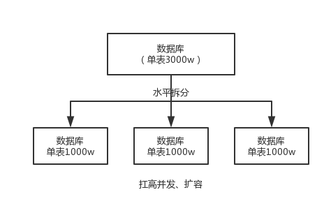
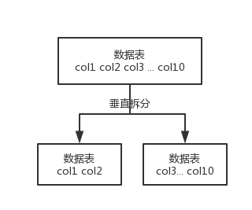

# 概念

## 主键（primary key）

​		**能够唯一标识表中某一行的属性或属性组。**一个表只能有一个主键，但可以有多个候选索引。主键常常与外键构成参照完整性约束，防止出现数据不一致。主键可以保证记录的唯一和主键域非空,数据库管理系统对于主键自动生成唯一索引（unique index），所以**主键也是一个特殊的索引**。

## 外键（foreign key）

​		**用于建立和加强两个表数据之间的链接的一列或多列。**外键约束主要用来维护两个表之间数据的一致性。简言之，表的外键就是另一表的主键，外键将两表联系起来。一般情况下，要删除一张表中的主键必须首先要确保其它表中的没有相同外键（即该表中的主键没有一个外键和它相关联）。

## 索引（index）

​		**用来快速地寻找那些具有特定值的记录。**主要是为了检索的方便，是为了加快访问速度， 按一定的规则创建的，一般起到排序作用。所谓**唯一性索引**，这种索引和前面的“普通索引”基本相同，但有一个区别：索引列的所有值都只能出现一次，即必须唯一。

> **总结：**

- 主键一定是唯一性索引，唯一性索引并不一定就是主键。
-  一个表中可以有多个唯一性索引，但只能有一个主键。
- 主键列不允许空值，而唯一性索引列允许空值。
- 主键可以被其他字段作外键引用，而索引不能作为外键引用。

### 几种索引

1. 单一索引：
2. 复合索引：根据创建联合索引的顺序，以**最左前缀匹配原则**进行where检索。
3. 覆盖索引：查询的字段与建立索引的字段一一对应就叫做覆盖索引。

### 普通索引与唯一索引该怎么选

在查询性能上两者差距微乎其微，在更新性能上由于普通索引可以利用change buffer的优化机制性能更优。


# 分库分表

​		分库分表一定是为了**支撑高并发、数据量大**两个问题的。

## 分表

​		**就是把一个表的数据放到多个表中，然后查询的时候你就查一个表**。比如按照用户 id 来分表，将一个用户的数据就放在一个表中。然后操作的时候你对一个用户就操作那个表就好了。这样可以控制每个表的数据量在可控的范围内，比如每个表就固定在 200 万以内。

​		比如你单表都几千万数据了，你确定你能扛住么？绝对不行，**单表数据量太大**，会极大影响你的 sql **执行的性能**，到了后面你的 sql 可能就跑的很慢了。一般来说，就以我的经验来看，单表到几百万的时候，性能就会相对差一些了，你就得分表了。

## 分库

​		**就是你一个库一般我们经验而言，最多支撑到并发 2000，一定要扩容了，而且一个健康的单库并发值你最好保持在每秒 1000 左右，不要太大。**那么你可以将一个库的数据拆分到多个库中，访问的时候就访问一个库好了。

​		这就是所谓的**分库分表**，为啥要分库分表？你明白了吧。

| #            | 分库分表前                   | 分库分表后                                   |
| ------------ | ---------------------------- | -------------------------------------------- |
| 并发支撑情况 | MySQL 单机部署，扛不住高并发 | MySQL 从单机到多机，能承受的并发增加了多倍   |
| 磁盘使用情况 | MySQL 单机磁盘容量几乎撑满   | 拆分为多个库，数据库服务器磁盘使用率大大降低 |
| SQL 执行性能 | 单表数据量太大，SQL 越跑越慢 | 单表数据量减少，SQL 执行效率明显提升         |


## 分库分表中间件

- **Cobar**

  ​		阿里 b2b 团队开发和开源的，属于 proxy 层方案，就是介于应用服务器和数据库服务器之间。应用程序通过 JDBC 驱动访问 Cobar 集群，Cobar 根据 SQL 和分库规则对 SQL 做分解，然后分发到 MySQL 集群不同的数据库实例上执行。早些年还可以用，但是最近几年都没更新了，基本没啥人用，差不多算是被抛弃的状态吧。而且不支持读写分离、存储过程、跨库 join 和分页等操作。

- **TDDL**

  ​	淘宝团队开发的，属于 client 层方案。支持基本的 crud 语法和读写分离，但不支持 join、多表查询等语法。目前使用的也不多，因为还依赖淘宝的 diamond 配置管理系统。

- **Atlas**

  ​		360 开源的，属于 proxy 层方案，以前是有一些公司在用的，但是确实有一个很大的问题就是社区最新的维护都在 5 年前了。所以，现在用的公司基本也很少了。

- **Sharding-jdbc**

  ​		当当开源的，属于 client 层方案，是 ShardingSphere的 client 层方案，ShardingSphere 还提供 proxy 层的方案 Sharding-Proxy。确实之前用的还比较多一些，因为 SQL 语法支持也比较多，没有太多限制，而且截至 2019.4，已经推出到了 4.0.0-RC1 版本，支持分库分表、读写分离、分布式 id 生成、柔性事务（最大努力送达型事务、TCC 事务）。而且确实之前使用的公司会比较多一些（这个在官网有登记使用的公司，可以看到从 2017 年一直到现在，是有不少公司在用的），目前社区也还一直在开发和维护，还算是比较活跃，个人认为算是一个现在也**可以选择的方案**。

- **Mycat**

  ​		基于 Cobar 改造的，属于 proxy 层方案，支持的功能非常完善，而且目前应该是非常火的而且不断流行的数据库中间件，社区很活跃，也有一些公司开始在用了。但是确实相比于 Sharding jdbc 来说，年轻一些，经历的锤炼少一些。

> 总结

​		综上，现在其实建议考量的，就是 Sharding-jdbc 和 Mycat，这两个都可以去考虑使用。

​		Sharding-jdbc 这种 client 层方案的**优点在于不用部署，运维成本低，不需要代理层的二次转发请求，性能很高**，但是如果遇到升级啥的需要各个系统都重新升级版本再发布，各个系统都需要**耦合** Sharding-jdbc 的依赖；

​		Mycat 这种 proxy 层方案的**缺点在于需要部署**，自己运维一套中间件，运维成本高，但是**好处在于对于各个项目是透明的**，如果遇到升级之类的都是自己中间件那里搞就行了。

​		通常来说，这两个方案其实都可以选用，但是我个人建议中小型公司选用 Sharding-jdbc，client 层方案轻便，而且维护成本低，不需要额外增派人手，而且中小型公司系统复杂度会低一些，项目也没那么多；但是中大型公司最好还是选用 Mycat 这类 proxy 层方案，因为可能大公司系统和项目非常多，团队很大，人员充足，那么最好是专门弄个人来研究和维护 Mycat，然后大量项目直接透明使用即可。


## 数据库垂直拆分/水平拆分

- **水平拆分**（技术层面的拆分）

  ​		**把一个表的数据给弄到多个库的多个表里去，但是每个库的表结构都一样，只不过每个库表放的数据是不同的，所有库表的数据加起来就是全部数据。**水平拆分的意义，就是将数据均匀放更多的库里，然后用多个库来扛更高的**并发**，还有就是用多个库的存储容量来进行**扩容**。

  

- **垂直拆分**（**业务的拆分**）

  ​		**把一个有很多字段的表给拆分成多个表**，**或者是多个库上去**。每个库表的结构都不一样，每个库表都包含部分字段。一般来说，会**将较少的访问频率很高的字段放到一个表里去**，然后**将较多的访问频率很低的字段放到另外一个表里去**。因为数据库是有缓存的，你访问频率高的行字段越少，就可以在缓存里缓存更多的行，性能就越好。这个一般在表层面做的较多一些。



​		这个其实挺常见的，不一定我说，大家很多同学可能自己都做过，把一个大表拆开，订单表、订单支付表、订单商品表。

​		还有**表层面的拆分**，就是分表，将一个表变成 N 个表，就是**让每个表的数据量控制在一定范围内**，保证 SQL 的性能。否则单表数据量越大，SQL 性能就越差。一般是 200 万行左右，不要太多，但是也得看具体你怎么操作，也可能是 500 万，或者是 100 万。你的 SQL 越复杂，就最好让单表行数越少。

​		好了，无论分库还是分表，上面说的那些数据库中间件都是可以支持的。就是基本上那些中间件可以做到你分库分表之后，**中间件可以根据你指定的某个字段值**，比如说 userid，**自动路由到对应的库上去，然后再自动路由到对应的表里去**。

​		你就得考虑一下，你的项目里该如何分库分表？一般来说，垂直拆分，你可以在表层面来做，对一些字段特别多的表做一下拆分；水平拆分，你可以说是并发承载不了，或者是数据量太大，容量承载不了，你给拆了，按什么字段来拆，你自己想好；分表，你考虑一下，你如果哪怕是拆到每个库里去，并发和容量都 ok 了，但是每个库的表还是太大了，那么你就分表，将这个表分开，保证每个表的数据量并不是很大。


## 分库分表的策略

- 一种是按照 **range** 来分，就是每个库一段连续的数据，这个一般是按比如**时间范围**来的，但是这种一般较少用，因为很容易产生热点问题，大量的流量都打在最新的数据上了。
- 或者是按照某个字段 **hash** 一下均匀分散，这个较为常用。

​		range 来分，好处在于说，扩容的时候很简单，因为你只要预备好，给每个月都准备一个库就可以了，到了一个新的月份的时候，自然而然，就会写新的库了；缺点，但是大部分的请求，都是访问最新的数据。实际生产用 range，要看场景。

​		hash 分发，好处在于说，可以平均分配每个库的数据量和请求压力；坏处在于说扩容起来比较麻烦，会有一个数据迁移的过程，之前的数据需要重新计算 hash 值重新分配到不同的库或表。


## 动态切换分库分表

​		现在有一个未分库分表的系统，未来要分库分表，如何设计才可以让系统从未分库分表**动态切换**到分库分表上？

### 停机迁移方案

​		我先给你说一个最 low 的方案，就是很简单，大家伙儿凌晨 12 点开始运维，网站或者 app 挂个公告，说 0 点到早上 6 点进行运维，无法访问。

​		接着到 0 点停机，系统停掉，没有流量写入了，此时老的单库单表数据库静止了。然后你之前得写好一个**导数的一次性工具**，此时直接跑起来，然后将单库单表的数据哗哗哗读出来，写到分库分表里面去。

​		导数完了之后，就 ok 了，修改系统的数据库连接配置啥的，包括可能代码和 SQL 也许有修改，那你就用最新的代码，然后直接启动连到新的分库分表上去。

​		验证一下，ok 了，完美，大家伸个懒腰，看看看凌晨 4 点钟的北京夜景，打个滴滴回家吧。

​		但是这个方案比较 low，谁都能干，我们来看看高大上一点的方案。

https://adjava.netlify.app/docs/high-concurrency/images/database-shard-method-1.png


### 双写迁移方案

​		这个是我们常用的一种迁移方案，比较靠谱一些，不用停机，不用看北京凌晨 4 点的风景。

​		简单来说，就是在线上系统里面，之前所有写库的地方，增删改操作，**除了对老库增删改，都加上对新库的增删改**，这就是所谓的**双写**，同时写俩库，老库和新库。

​		然后**系统部署**之后，新库数据差太远，用之前说的导数工具，跑起来读老库数据写新库，写的时候要根据 gmt_modified 这类字段判断这条数据最后修改的时间，除非是读出来的数据在新库里没有，或者是比新库的数据新才会写。简单来说，就是不允许用老数据覆盖新数据。

​		导完一轮之后，有可能数据还是存在不一致，那么就程序自动做一轮校验，比对新老库每个表的每条数据，接着如果有不一样的，就针对那些不一样的，从老库读数据再次写。反复循环，直到两个库每个表的数据都完全一致为止。

​		接着当数据完全一致了，就 ok 了，基于仅仅使用分库分表的最新代码，重新部署一次，不就仅仅基于分库分表在操作了么，还没有几个小时的停机时间，很稳。所以现在基本玩儿数据迁移之类的，都是这么干的。


https://adjava.netlify.app/docs/high-concurrency/images/database-shard-method-2.png


### 动态扩容缩容的分库分表方案

1. 设定好几台数据库服务器，每台服务器上几个库，每个库多少个表，推荐是 32 库 * 32 表，对于大部分公司来说，可能几年都够了。
2. 路由的规则，orderId 模 32 = 库，orderId / 32 模 32 = 表
3. 扩容的时候，申请增加更多的数据库服务器，装好 MySQL，呈倍数扩容，4 台服务器，扩到 8 台服务器，再到 16 台服务器。
4. 由 DBA 负责将原先数据库服务器的库，迁移到新的数据库服务器上去，库迁移是有一些便捷的工具的。
5. 我们这边就是修改一下配置，调整迁移的库所在数据库服务器的地址。
6. 重新发布系统，上线，原先的路由规则变都不用变，直接可以基于 n 倍的数据库服务器的资源，继续进行线上系统的提供服务。


## 总结

- 垂直分表：可以把一个宽表的字段按访问频次、是否是大字段的原则拆分为多个表，这样既能使业务清晰，还能提升部分性能。拆分后，尽量从业务角度避免联查，否则性能方面将得不偿失。

- 垂直分库：可以把多个表按业务耦合松紧归类，分别存放在不同的库，这些库可以分布在不同服务器，从而使访问压力被多服务器负载，大大提升性能，同时能提高整体架构的业务清晰度，不同的业务库可根据自身情况定制优化方案。但是它需要解决跨库带来的所有复杂问题。

- 水平分库：可以把一个表的数据(按数据行)分到多个不同的库，每个库只有这个表的部分数据，这些库可以分布在不同服务器，从而使访问压力被多服务器负载，大大提升性能。它不仅需要解决跨库带来的所有复杂问题，还要解决数据路由的问题。

- 水平分表：可以把一个表的数据(按数据行)分到多个同一个数据库的多张表中，每个表只有这个表的部分数据，这样做能小幅提升性能，它仅仅作为水平分库的一个补充优化。

​		一般来说，在系统设计阶段就应该根据业务耦合松紧来确定垂直分库，垂直分表方案，在数据量及访问压力不是特别大的情况，首先考虑缓存、读写分离、索引技术等方案。若数据量极大，且持续增长，再考虑水平分库水平分表方案。


## 分库分表后，ID主键处理

​		需要一个**全局唯一**的 id 来支持。

### 基于数据库的实现方案

#### 数据库自增ID

​		这个方案的好处就是方便简单，谁都会用；

​		**缺点就是单库生成**自增 id，要是高并发的话，就会有瓶颈的；如果你硬是要改进一下，那么就专门开一个服务出来，这个服务每次就拿到当前 id 最大值，然后自己递增几个 id，一次性返回一批 id，然后再把当前最大 id 值修改成递增几个 id 之后的一个值；但是**无论如何都是基于单个数据库**。

> **适合的场景**：

​		你分库分表就俩原因，要不就是单库并发太高，要不就是单库数据量太大；除非是你**并发不高，但是数据量太大**导致的分库分表扩容，你可以用这个方案，因为可能每秒最高并发最多就几百，那么就走单独的一个库和表生成自增主键即可。

#### 设置数据库 sequence 或者表自增字段步长

​		可以通过设置数据库 sequence 或者表的自增字段步长来进行水平伸缩。

​		比如说，现在有 8 个服务节点，每个服务节点使用一个 sequence 功能来产生 ID，每个 sequence 的起始 ID 不同，并且依次递增，步长都是 8。

> **适合的场景**：

​		在用户防止产生的 ID 重复时，这种方案实现起来比较简单，也能达到性能目标。但是服务节点固定，步长也固定，将来如果还要增加服务节点，就不好搞了。


### UUID

​		好处就是本地生成，不要基于数据库来了；不好之处就是，UUID 太长了、占用空间大，**作为主键性能太差**了；更重要的是，UUID 不具有有序性，会导致 B+ 树索引在写的时候有过多的随机写操作（连续的 ID 可以产生部分顺序写），还有，由于在写的时候不能产生有顺序的 append 操作，而需要进行 insert 操作，将会读取整个 B+ 树节点到内存，在插入这条记录后会将整个节点写回磁盘，这种操作在记录占用空间比较大的情况下，性能下降明显。

> 适合的场景：

​		如果你是要随机生成个什么文件名、编号之类的，你可以用 UUID，但是作为主键是不能用 UUID 的。


### 获取系统当前时间

​		这个就是获取当前时间即可，但是问题是，**并发很高的时候**，比如一秒并发几千，**会有重复的情况**，这个是肯定不合适的。基本就不用考虑了。

> 适合的场景：

​		一般如果用这个方案，是将当前时间跟很多其他的业务字段拼接起来，作为一个 id，如果业务上你觉得可以接受，那么也是可以的。你可以将别的业务字段值跟当前时间拼接起来，组成一个全局唯一的编号。


### snowflake 算法

​		snowflake 算法是 twitter 开源的分布式 id 生成算法，采用 Scala 语言实现，是把一个 64 位的 long 型的 id，1 个 bit 是不用的，用其中的 41 bits 作为毫秒数，用 10 bits 作为工作机器 id，12 bits 作为序列号。

- 1 bit：不用，为啥呢？因为二进制里第一个 bit 为如果是 1，那么都是负数，但是我们生成的 id 都是正数，所以第一个 bit 统一都是 0。
- 41 bits：表示的是时间戳，单位是毫秒。41 bits 可以表示的数字多达 `2^41 - 1` ，也就是可以标识 `2^41 - 1` 个毫秒值，换算成年就是表示 69 年的时间。
- 10 bits：记录工作机器 id，代表的是这个服务最多可以部署在 2^10 台机器上，也就是 1024 台机器。但是 10 bits 里 5 个 bits 代表机房 id，5 个 bits 代表机器 id。意思就是最多代表 `2^5` 个机房（32 个机房），每个机房里可以代表 `2^5` 个机器（32 台机器）。
- 12 bits：这个是用来记录同一个毫秒内产生的不同 id，12 bits 可以代表的最大正整数是 `2^12 - 1 = 4096` ，也就是说可以用这个 12 bits 代表的数字来区分**同一个毫秒内**的 4096 个不同的 id。

```sh
0 | 0001100 10100010 10111110 10001001 01011100 00 | 10001 | 1 1001 | 0000 00000000
```

```java
public class IdWorker {

    private long workerId;
    private long datacenterId;
    private long sequence;

    public IdWorker(long workerId, long datacenterId, long sequence) {
        // sanity check for workerId
        // 这儿不就检查了一下，要求就是你传递进来的机房id和机器id不能超过32，不能小于0
        if (workerId > maxWorkerId || workerId < 0) {
            throw new IllegalArgumentException(
                    String.format("worker Id can't be greater than %d or less than 0", maxWorkerId));
        }
        if (datacenterId > maxDatacenterId || datacenterId < 0) {
            throw new IllegalArgumentException(
                    String.format("datacenter Id can't be greater than %d or less than 0", maxDatacenterId));
        }
        System.out.printf(
                "worker starting. timestamp left shift %d, datacenter id bits %d, worker id bits %d, sequence bits %d, workerid %d",
                timestampLeftShift, datacenterIdBits, workerIdBits, sequenceBits, workerId);

        this.workerId = workerId;
        this.datacenterId = datacenterId;
        this.sequence = sequence;
    }

    private long twepoch = 1288834974657L;

    private long workerIdBits = 5L;
    private long datacenterIdBits = 5L;

    // 这个是二进制运算，就是 5 bit最多只能有31个数字，也就是说机器id最多只能是32以内
    private long maxWorkerId = -1L ^ (-1L << workerIdBits);

    // 这个是一个意思，就是 5 bit最多只能有31个数字，机房id最多只能是32以内
    private long maxDatacenterId = -1L ^ (-1L << datacenterIdBits);
    private long sequenceBits = 12L;

    private long workerIdShift = sequenceBits;
    private long datacenterIdShift = sequenceBits + workerIdBits;
    private long timestampLeftShift = sequenceBits + workerIdBits + datacenterIdBits;
    private long sequenceMask = -1L ^ (-1L << sequenceBits);

    private long lastTimestamp = -1L;

    public long getWorkerId() {
        return workerId;
    }

    public long getDatacenterId() {
        return datacenterId;
    }

    public long getTimestamp() {
        return System.currentTimeMillis();
    }

    public synchronized long nextId() {
        // 这儿就是获取当前时间戳，单位是毫秒
        long timestamp = timeGen();

        if (timestamp < lastTimestamp) {
            System.err.printf("clock is moving backwards.  Rejecting requests until %d.", lastTimestamp);
            throw new RuntimeException(String.format(
                    "Clock moved backwards.  Refusing to generate id for %d milliseconds", lastTimestamp - timestamp));
        }

        if (lastTimestamp == timestamp) {
            // 这个意思是说一个毫秒内最多只能有4096个数字
            // 无论你传递多少进来，这个位运算保证始终就是在4096这个范围内，避免你自己传递个sequence超过了4096这个范围
            sequence = (sequence + 1) & sequenceMask;
            if (sequence == 0) {
                timestamp = tilNextMillis(lastTimestamp);
            }
        } else {
            sequence = 0;
        }

        // 这儿记录一下最近一次生成id的时间戳，单位是毫秒
        lastTimestamp = timestamp;

        // 这儿就是将时间戳左移，放到 41 bit那儿；
        // 将机房 id左移放到 5 bit那儿；
        // 将机器id左移放到5 bit那儿；将序号放最后12 bit；
        // 最后拼接起来成一个 64 bit的二进制数字，转换成 10 进制就是个 long 型
        return ((timestamp - twepoch) << timestampLeftShift) | (datacenterId << datacenterIdShift)
                | (workerId << workerIdShift) | sequence;
    }

    private long tilNextMillis(long lastTimestamp) {
        long timestamp = timeGen();
        while (timestamp <= lastTimestamp) {
            timestamp = timeGen();
        }
        return timestamp;
    }

    private long timeGen() {
        return System.currentTimeMillis();
    }

    // ---------------测试---------------
    public static void main(String[] args) {
        IdWorker worker = new IdWorker(1, 1, 1);
        for (int i = 0; i < 30; i++) {
            System.out.println(worker.nextId());
        }
    }

}
```

​		怎么说呢，大概这个意思吧，就是说 41 bit 是当前毫秒单位的一个时间戳，就这意思；然后 5 bit 是你传递进来的一个**机房** id（但是最大只能是 32 以内），另外 5 bit 是你传递进来的**机器** id（但是最大只能是 32 以内），剩下的那个 12 bit 序列号，就是如果跟你上次生成 id 的时间还在一个毫秒内，那么会把顺序给你累加，最多在 4096 个序号以内。

​		所以你自己利用这个工具类，自己搞一个服务，然后对每个机房的每个机器都初始化这么一个东西，刚开始这个机房的这个机器的序号就是 0。然后每次接收到一个请求，说这个机房的这个机器要生成一个 id，你就找到对应的 Worker 生成。

​		利用这个 snowflake 算法，你可以开发自己公司的服务，甚至对于机房 id 和机器 id，反正给你预留了 5 bit + 5 bit，你换成别的有业务含义的东西也可以的。

​		这个 snowflake 算法相对来说还是比较靠谱的，所以你要真是搞分布式 id 生成，如果是高并发啥的，那么用这个应该性能比较好，一般每秒几万并发的场景，也足够你用了。


# 读写分离

## MySQL	

​	MySQL 的读写分离就是基于**主从复制架构**，简单来说，就搞一个主库，挂多个从库，然后我们就单单只是写主库，然后主库会自动把数据给同步到从库上去。

### 主从复制原理

​		主库将变更写入 binlog 日志，然后从库连接到主库之后，从库有一个 IO 线程，将主库的 binlog 日志拷贝到自己本地，写入一个 relay 中继日志中。接着从库中有一个 SQL 线程会从中继日志读取 binlog，然后执行 binlog 日志中的内容，也就是在自己本地再次执行一遍 SQL，这样就可以保证自己跟主库的数据是一样的。


​		这里有一个非常重要的一点，就是从库同步主库数据的过程是**串行化**的，也就是说主库上并行的操作，在从库上会串行执行。所以这就是一个非常重要的点了，由于从库从主库拷贝日志以及串行执行 SQL 的特点，在高并发场景下，从库的数据一定会比主库慢一些，是**有延时**的。所以经常出现，刚写入主库的数据可能是读不到的，要过几十毫秒，甚至几百毫秒才能读取到。

​		而且这里还有另外一个问题，就是如果主库突然宕机，然后恰好数据还没同步到从库，那么有些数据可能在从库上是没有的，有些数据可能就丢失了。

​		所以 MySQL 实际上在这一块有两个机制，一个是**半同步复制**，用来解决主库数据丢失问题；一个是**并行复制**，用来解决主从同步延时问题。

- **半同步复制**，也叫 `semi-sync` 复制，指的就是主库写入 binlog 日志之后，就会将**强制**此时立即将数据同步到从库，从库将日志写入自己本地的 relay log 之后，接着会返回一个 ack 给主库，主库接收到**至少一个从库**的 ack 之后才会认为写操作完成了。

- **并行复制**，指的是从库开启多个线程，并行读取 relay log 中不同库的日志，然后**并行重放不同库的日志**，这是库级别的并行。

### MySQL 主从同步延时问题（精华）

​		以前线上确实处理过因为主从同步延时问题而导致的线上的 bug，属于小型的生产事故。

​		是这个么场景。有个同学是这样写代码逻辑的。先插入一条数据，再把它查出来，然后更新这条数据。在生产环境高峰期，写并发达到了 2000/s，这个时候，主从复制延时大概是在小几十毫秒。线上会发现，每天总有那么一些数据，我们期望更新一些重要的数据状态，但在高峰期时候却没更新。用户跟客服反馈，而客服就会反馈给我们。

​		我们通过 MySQL 命令：

```sql
show slave status
```

​		查看 `Seconds_Behind_Master` ，可以看到从库复制主库的数据落后了几 ms。

​		一般来说，如果主从延迟较为严重，有以下解决方案：

- 分库，将一个主库拆分为多个主库，每个主库的写并发就减少了几倍，此时主从延迟可以忽略不计。
- 打开 MySQL 支持的并行复制，多个库并行复制。如果说某个库的写入并发就是特别高，单库写并发达到了 2000/s，并行复制还是没意义。
- 重写代码，写代码的同学，要慎重，插入数据时立马查询可能查不到。
- 如果确实是存在必须先插入，立马要求就查询到，然后立马就要反过来执行一些操作，对这个查询**设置直连主库**。**不推荐**这种方法，你要是这么搞，读写分离的意义就丧失了。


# 存储引擎

## MySQL

### MyISAM、InnoDB

​		**MyISAM**：是MySQL的默认数据库引擎（5.5版之前），由早期的ISAM（Indexed Sequential Access Method：有索引的顺序访问方法）所改良。虽然性能极佳提供的大量的特性，包括**全文索引、压缩、空间函数（GIS）等，但MyISAM并不支持事务（transaction）以及行级锁，而且一个毫无疑问的缺陷是崩溃后无法安全恢复。**对于只读的数据，或者表比较小，可以忍受修复操作，则依然可以使用MyISAM（但请不要默认使用MyISAM，而是应该默认使用InnoDB）。在这几年的发展下，MySQL也导入了InnoDB（另一种数据库引擎），以强化参考完整性与并发违规处理机制，后来就逐渐取代MyISAM。

​		**InnoDB**：是MySQL的数据库引擎之一，为MySQL AB发布binary的标准之一。InnoDB由Innobase Oy公司所开发，2006年五月时由甲骨文公司并购。与传统的ISAM与MyISAM相比，InnoDB的最大特色就是**支持了ACID（原子性、一致性、隔离性和持久性）兼容的事务（Transaction）功能**，类似于PostgreSQL。它被设计成为大量的短期事务，短期事务大部分情况下是正常提交的，很少被回滚。InnoDB的性能与**自动崩溃恢复**的特性，使得它在非事务存储需求中也很流行。除非有非常特别的原因需要使用其他的存储引擎，否则应该优先考虑InnoDB引擎。目前InnoDB采用双轨制授权，一是GPL授权，另一是专有软件授权。


### 引擎区别

1、 **存储结构**

**MyISAM：**表定义文件frm、数据文件myd、索引文件myi。

**InnoDB：**表定义文件frm，是数据文件ibd。所有的表都保存在同一个数据文件中（也可能是多个文件，或者是独立的表空间文件），InnoDB表的大小只受限于操作系统文件的大小，一般为2GB。

2、 **存储空间**

**MyISAM：** MyISAM支持支持三种不同的存储格式：静态表(默认，但是注意数据末尾不能有空格，会被去掉)、动态表、压缩表。当表在创建之后并导入数据之后，不会再进行修改操作，可以使用压缩表，极大的减少磁盘的空间占用。

**InnoDB：** 需要更多的内存和存储，它会在主内存中建立其专用的缓冲池用于高速缓冲数据和索引。

3、 **可移植性、备份及恢复**

**MyISAM：**数据是以文件的形式存储，所以在跨平台的数据转移中会很方便。在备份和恢复时可单独针对某个表进行操作。

**InnoDB：**免费的方案可以是拷贝数据文件、备份 binlog，或者用 mysqldump，在数据量达到几十G的时候就相对痛苦了。

4、 **事务支持**

**MyISAM：**强调的是性能，每次查询具有原子性,其执行数度比InnoDB类型更快，但是不提供事务支持。

**InnoDB：**提供事务支持事务，外部键等高级数据库功能。 具有事务(commit)、回滚(rollback)和崩溃修复能力(crash recovery capabilities)的事务安全(transaction-safe (ACID compliant))型表。对于InnoDB每一条SQL语言都默认封装成事务，自动提交，这样会影响速度，所以最好把多条SQL语言放在begin和commit之间，组成一个事务

5、 **AUTO_INCREMENT** 

**MyISAM：**可以和其他字段一起建立联合索引。引擎的自动增长列必须是索引，如果是组合索引，自动增长可以不是第一列，他可以根据前面几列进行排序后递增。

**InnoDB：**InnoDB中必须包含只有该字段的索引。引擎的自动增长列必须是索引，如果是组合索引也必须是组合索引的第一列。

6、 **表锁差异**

**MyISAM：** 只支持表级锁，用户在操作myisam表时，select，update，delete，insert语句都会给表自动加锁，如果加锁以后的表满足insert并发的情况下，可以在表的尾部插入新的数据。

**InnoDB：** 支持事务和行级锁，是innodb的最大特色。行锁大幅度提高了多用户并发操作的新能。但是InnoDB的行锁，只是在WHERE的主键是有效的，非主键的WHERE都会锁全表的。InnoDB的行锁是实现在索引上的，而不是锁在物理行记录上。潜台词是，如果访问没有命中索引，也无法使用行锁，将要退化为表锁。

```sql
例 t_user(uid, uname,age, sex) innodb;
uid PK 无其他索引
update t_user set age= 10 where uid=1; 				命中索引，行锁。

update t_user set age=10 where uid != 1;           	未命中索引，表锁。
 
update t_user set age=10 where name='chackca';    	无索引，表锁。
```

7、 **全文索引**

**MyISAM：**支持 FULLTEXT类型的全文索引

**InnoDB：**不支持FULLTEXT类型的全文索引，但是innodb可以使用sphinx插件支持全文索引，并且效果更好。==**PS：5.7以后的InnoDB支持全文索引了**==

​		全文搜索的语法：`MATCH(col1,col2,…) AGAINST (expr[search_modifier])`。其中MATCH中的内容为已建立FULLTEXT索引并要从中查找数据的列，AGAINST中的expr为要查找的文本内容，search_modifier为可选搜索类型。search_modifier的可能取值有：IN NATURAL LANGUAGEMODE、IN NATURAL LANGUAGE MODE WITH QUERY EXPANSION、IN BOOLEAN MODE、WITH QUERY EXPANSION。search_modifier的每个取值代表一种类型的全文搜索，分别为自然语言全文搜索、带查询扩展的自然语言全文搜索、布尔全文搜索、查询扩展全文搜索（默认使用IN NATURAL LANGUAGE MODE）。

​		MySQL中全文索引的关键字为FULLTEXT，目前可对MyISAM表和InnoDB表的CHAR、VARCHAR、TEXT类型的列创建全文索引。全文索引同其他索引一样，可在创建表是由CREATE TABLE语句创建也可以在表创建之后用ALTER TABLE或者CREATE INDEX命令创建(对于要导入大量数据的表先导入数据再创建FULLTEXT索引比先创建索引后导入数据会更快)。

8、**表主键**

**MyISAM：**允许没有任何索引和主键的表存在，索引都是保存行的地址。

**InnoDB：**如果没有设定主键或者非空唯一索引，就会自动生成一个6字节的主键(用户不可见)，数据是主索引的一部分，附加索引保存的是主索引的值。

9、**表的具体行数**

**MyISAM：** 保存有表的总行数，如果`select count(*) from table`；会直接取出出该值。

**InnoDB：** 没有保存表的总行数，如果使用`select count(*) from table`；就会遍历整个表，消耗相当大，但是在加了wehre条件后，myisam和innodb处理的方式都一样。

10、**CRUD操作**

**MyISAM：**如果执行大量的SELECT，MyISAM是更好的选择。

**InnoDB：**如果你的数据执行大量的INSERT或UPDATE，出于性能方面的考虑，应该使用InnoDB表。

11、 **外键**

**MyISAM：**不支持

**InnoDB：**支持。对一个包含外键的 InnoDB 表转为 MYISAM 会失败。

12、 **索引结构**

**MyISAM**：非聚集索引，使用B+Tree作为索引结构，索引和数据文件是分离的，索引保存的是数据文件的指针。主键索引和辅助索引是独立的。

**InnoDB**：聚集索引，使用B+Tree作为索引结构，数据文件是和（主键）索引绑在一起的（表数据文件本身就是按B+Tree组织的一个索引结构），必须要有主键，通过主键索引效率很高。但是辅助索引需要两次查询，先查询到主键，然后再通过主键查询到数据。因此，主键不应该过大，因为主键太大，其他索引也都会很大。

​		也就是说：**MyISAM的B+树主键索引和辅助索引的叶子节点都是数据文件的地址指针；而InnoDB的B+树主键索引的叶子节点就是数据文件，辅助索引的叶子节点是主键的值。**


### 选择1

1.  是否要支持事务，如果要请选择 InnoDB，如果不需要可以考虑 MyISAM；
2. 如果表中绝大多数都只是读查询，可以考虑 MyISAM，如果既有读写也挺频繁，请使用InnoDB。
3. 系统奔溃后，MyISAM恢复起来更困难，能否接受，不能接受就选 InnoDB；
4.  MySQL5.5版本开始Innodb已经成为Mysql的默认引擎(之前是MyISAM)，说明其优势是有目共睹的。如果你不知道用什么存储引擎，那就用InnoDB，至少不会差。

### 选择2

​		通过上述的分析，基本上可以考虑使用InnoDB来替代MyISAM引擎了，原因是InnoDB自身很多良好的特点，比如事务支持、存储 过程、视图、行级锁定等等，在并发很多的情况下，相信InnoDB的表现肯定要比MyISAM强很多。另外，任何一种表都不是万能的，只用恰当的针对业务类型来选择合适的表类型，才能最大的发挥MySQL的性能优势。如果不是很复杂的Web应用，非关键应用，还是可以继续考虑MyISAM的，这个具体情况可以自己斟酌。

存储引擎选择的基本原则：

采用**MyISAM**引擎

- R/W > 100:1 且update相对较少
- 并发不高
- 表数据量小
- 硬件资源有限

采用**InnoDB**引擎

- R/W比较小，频繁更新大字段
- 表数据量超过1000万，并发高
- 安全性和可用性要求高

采用**Memory**引擎

- 有足够的内存
- 对数据一致性要求不高，如在线人数和session等应用
- 需要定期归档数据


### InnoDB为什么推荐使用自增ID作为主键？

​		答：自增ID可以保证每次插入时B+索引是从右边扩展的，可以避免B+树和频繁合并和分裂（对比使用UUID）。如果使用字符串主键和随机主键，会使得数据随机插入，效率比较差。

###  innodb引擎的4大特性

- 插入缓冲（insert buffer）

- 二次写（double write）

- 自适应哈希索引（ahi）

- 预读（read ahead）


# MVCC是什么？原理？

**多版本并发控制**（Multi-Version Concurrency Control），与之相对的是**基于锁的并发控制**。

**MVCC最大的优势：读不加锁，读写不冲突。在读多写少的OLTP应用中，读写不冲突是非常重要的，极大的增加了系统的并发性能**

**MVCC实现**

而 MVCC 利用了多版本快照的思想，写操作更新最新的版本快照，而读操作去读旧版本快照(read view)根据隔离级别不同读取的规则也不同，没有互斥关系。

# sql joins


# B+树==//todo==

B+ Tree是一种经典的多路平衡查找树，它通常被用来实现磁盘上的数据结构。在B+ Tree中，每个节点可以包含多个键值对，而且所有叶子节点都被连接成一个链表。B+ Tree的查询复杂度也是O(log n)，但由于其实现较为复杂，所以在实际使用中通常用于数据库系统等需要高效读写的场景中。


