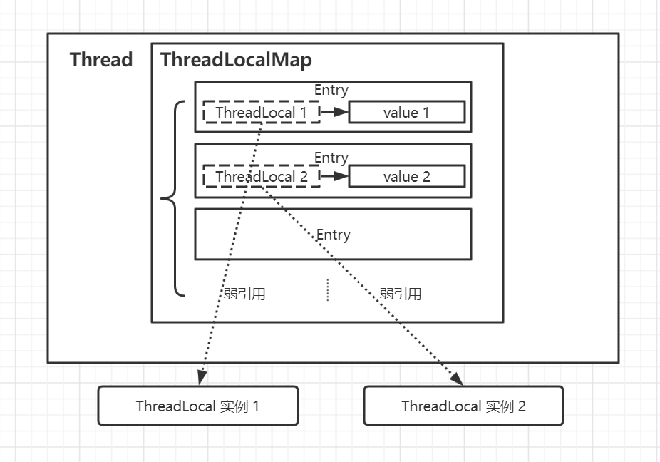

# 进程线程概念

**进程是操作系统进行==资源分配==的基本单位，**

**线程是操作系统进行==调度==的基本单位**。

# Java对象头

[详见JVM-==对象的内存布局==](#对象的内存布局)

- **对象头（ Header ）**
  - **MarkWord**
  - **指向类的指针**
  - **数组长度（只有数组对象才有）**
- **实例数据（ Instance Data ）**
- **对齐填充（ Padding ）**


Mark Word在32位JVM中的长度是32bit，在64位JVM（**未开启压缩指针**）中长度是64bit。在32位JVM中是这么存的：


指向类的指针在32位JVM中的长度是32bit，在64位JVM中长度是64bit。

数组长度只有数组对象保存了这部分数据。

==由于HotSpot VM 的自动内存管理系统要求对象起始地址必须是8 字节的整数倍，换句话说，就是**对象的大小必须是8 字节的整数倍**。==


```bash
#类指针压缩
-XX:+UseCompressedClassPointers	 

#普通对象指针压缩 oops: ordinary object pointer
-XX:+UseCompressedOops	
```

**==堆内存超过32G，压缩失效==**


32位系统最大寻址空间2^32^=4G，每个对象大小一定是8字节的倍数，那么可以encode把地址0、8、16改为0、1、2记录，即左移3位来完成，那么就可以多出8倍的寻址空间，使用指针压缩使jvm可支持4G×8=32G内存访问。**==所以堆内存超过32G，压缩失效==**

64位系统 现在最大48位寻址=256T内存	无良硬件厂商就造了48根地址总线？


## 64位系统测试

**64位系统默认开启了指针压缩**

pom.xml添加jol依赖

```xml
<dependency>
  <groupId>org.openjdk.jol</groupId>
  <artifactId>jol-core</artifactId>
  <version>0.9</version>
</dependency>
```

- 空对象
  其中Mark Word 8字节，类指针压缩后4字节，对齐4字节。总16字节。

```java
public class Test {
    static class Dog {    
    }
    public static void main( String[] args ){
        Dog dog =new Dog();
        System.out.println(ClassLayout.parseInstance(dog).toPrintable());
    }
}
```

```java
 OFFSET  SIZE   TYPE DESCRIPTION                               VALUE
      0     4        (object header)                           01 00 00 00 (00000001 00000000 00000000 00000000) (1)
      4     4        (object header)                           00 00 00 00 (00000000 00000000 00000000 00000000) (0)
      8     4        (object header)                           43 c1 00 f8 (01000011 11000001 00000000 11111000) (-134168253)
     12     4        (loss due to the next object alignment)
Instance size: 16 bytes
```

- 有成员变量

```java
public class Test {
    static class Dog {
        //依次放开查看数据内存具体占用
        //基本数据类型
        private int age;
        private char date;
        //String引用类型
        private String name;
    }

    public static void main(String[] args) {
        Dog d = new Dog();
        System.out.println(ClassLayout.parseInstance(d).toPrintable());
    }
}
```

```java
 OFFSET  SIZE               TYPE DESCRIPTION                   VALUE
      0     4                    (object header)               01 00 00 00 (00000001 00000000 00000000 00000000) (1)
      4     4                    (object header)               00 00 00 00 (00000000 00000000 00000000 00000000) (0)
      8     4                    (object header)               43 c1 00 f8 (01000011 11000001 00000000 11111000) (-134168253)
     12     4                int Dog.age                       0
     16     2               char Dog.date                                 
     18     2                    (alignment/padding gap)                  
     20     4   java.lang.String Dog.name                      null
Instance size: 24 bytes
```

**VM options关闭指针压缩**

```bash
-XX:-UseCompressedClassPointers -XX:-UseCompressedOops
```

```java
OFFSET  SIZE               TYPE DESCRIPTION                     VALUE
      0     4                    (object header)                01 00 00 00 (00000001 00000000 00000000 00000000) (1)
      4     4                    (object header)                00 00 00 00 (00000000 00000000 00000000 00000000) (0)
      8     4                    (object header)                50 35 3c 17 (01010000 00110101 00111100 00010111) (389821776)
     12     4                    (object header)                dd 01 00 00 (11011101 00000001 00000000 00000000) (477)
     16     4                int Dog.age                        0
     20     2               char Dog.date                                   
     22     2                    (alignment/padding gap)                  
     24     8   java.lang.String Dog.name                       null
Instance size: 32 bytes
```

==**对象为数组类型**==

- **基本数据类型**数组计算方式为 (数组个数x单个元素大小),比如int数组，每个int是4字节，如果有5个元素，则数组占20字节。
- **引用类型**就不一样了，
  - 开启指针压缩情况下为(数组长度x4字节)，每个引用4字节；
  - 关闭指针压缩情况下为(数组长度x8字节)，每个引用8字节。如，数组长度为8，每个引用8字节，最终占64字节(关闭指针压缩)。


# volatile

- **线程可见性** 
- **禁止指令重排**

```java
//反证法证明cpu存在乱序执行
//若不存在乱序 则不可能出现x=0 y=0,结果出现了所以得证存在乱序
public class Disorder{
    private static int x =0, y = 0;
    private static int a =0, b = 0;
    
    public static void main(String[] args) throws InterruptedException {
        int i = 0;
        for(;;){
            i++;
            x = 0; y = 0;
            a = 0; b = 0;
            Thread one = new Thread(()->{
                //由于线程one先启动，下面这句话让它等一等线程two,可适当调整等待时间
                //shortWait(100000);
                a = 1;
                x = b;
            });
            
            Thread other = new Thread(()->{
                b = 1;
                y = a;
            })
            one.start();other.start();
            one.join();other.join();
            String result = "第" + i + "次（" + x + "," + y +"）";
            if(x == 0 && y == 0){
                System.out.println(result);
                break;
            } else {
                //System.out.println(result);
            }          
        }              
    } 
    public static void shortWait(long interval){
        long start = System.nanoTime();
        long end;
        do{
            end = System.nanoTime();
        }while(start + interval >= end);        
    }
}
```

## 对象创建过程

```java
//  1.在堆中给对象分配内存并设置实例变量默认零值。	m=0				(≈类加载准备阶段)
//  2.调用对象<init>方法初始化实例变量。	m=8				(≈类加载初始化阶段)
//  3.把对象引用指向堆内对象实例。
class T {
    int m = 8;
}
T t = new T();
```

​		跑一下后idea->View->Show Bytecode with Jclasslib

```assembly
#汇编码	0 4 8 对应创建3步
0 new #2 <T>
3 dup
4 invokespecial #3 <T.<init>>
7 astore_1
8 return
```


## volatile如何实现内存可见性？

**volatile为什么会出现：**（字节跳动）

首先先分析一下没有volatile的情况下线程在自己的私有内存中对共享变量做出了改变之后无法及时告知其他线程，这就是volatile的作用，解决内存可见性问题。这种问题用synchronized关键字可以解决。但是一个问题是synchronized是重量级锁，同一时间内只允许一个线程去操作共享变量。操作完成之后在将改变后的变量值刷新回共享内存空间中。这样一来的话并发性就没有了。而且**synchronized关键词的使用基于操作系统实现**，会使得线程从用户态陷入内核态。这一步是很耗时间的。于使volatile应运而生。它是一个轻量级的synchronized。只是用来解决内存可见性问题的。

**1、volatile可见性实现原理：**（字节跳动）

变量被volatile关键字修饰后，底层**汇编指令**中会出现一个**lock前缀指令**。会导致以下两种事情的发生：

1. 修改volatile变量时会**强制**将修改后的值刷新到主内存中。
2. 修改volatile变量后会导致其他线程工作内存中对应的变量值失效。因此，再读取该变量值的时候就需要重新从读取主内存中的值。

**2、volatile有序性实现原理：**（字节跳动）

**指令重排序：**编译器在不改变单线程程序语义的前提下，重新安排语句的执行顺序，指令重排序在单线程下不会有问题，但是在多线程下，可能会出现问题。

volatile有序性的保证就是通过**禁止指令重排序**来实现的。指令重排序包括编译器和处理器重排序，JMM会分别限制这两种指令重排序。禁止指令重排序又是通过加**内存屏障**实现的。

> 内存屏障（memory barriers）：一组处理器指令，用于实现对内存操作的顺序限制。

添加了volatile关键字可以避免半初始化的指令重排。

## 内存屏障

### X86 CPU内存屏障

- sfence	指令前的写操作必须在指令后的写操作前完成
- lfence   读...
- mfence  读写...


### JSR内存屏障

- LoadLoad屏障
- StoreStore屏障
- LoadStore屏障
- StoreLoad屏障


### JVM层面volatile实现细节

```java
---StoreStoreBarrier---
	Volatile写
---StoreLoadBarrier---
```

```java
	Volatile读	
---LoadLoadBarrier---
---LoadStoreBarrier---
```

**happens-before原则**

as-if-serial 不管如何重排序，单线程执行结果不会改变


### hotspot实现

` lock;addl $0,0(%%rsp)`	锁总线


# AQS ==//todo==

## 1. 介绍

全路径：java.util.concurrent.locks.**AbstractQueuedSynchronizer** 

​		AQS是一个用来构建锁和同步器的框架，使用AQS能简单且高效地构造出应用广泛的大量的同步器，比如我们提到的ReentrantLock，Semaphore，ReentrantReadWriteLock，SynchronousQueue，FutureTask等等皆是基于AQS的。当然，我们也能利用AQS非常轻松地构造出符合我们自己需求的同步器。

## 2. 数据结构

​		==**AQS核心思想是，如果被请求的共享资源空闲，则将当前请求资源的线程设置为有效的工作线程，并且**
**将共享资源设置为锁定状态。如果被请求的共享资源被占用，那么就需要⼀套线程阻塞等待以及被唤醒**
**时锁分配的机制，这个机制AQS是⽤CLH队列锁实现的，即将暂时获取不到锁的线程加⼊到队列中。**==

​		CLH(Craig, Landin, and Hagersten)队列是一个虚拟的双向队列(FIFO)（即不存在队列实例，仅存在节点之间的关联关系）。AQS是将每条请求共享资源的线程封装成一个CLH锁队列的一个节点（Node）来实现锁的分配。

数据结构图：


AQS 使用一个volatile的**int 成员变量 `state` 表示同步状态**，通过内置的 **FIFO 线程等待/等待队列** 来完成获取资源线程的排队工作，通过 CAS 完成对 State 值的修改。

```java
private volatile int state;// 共享变量，使用volatile修饰保证线程可见性
```

下面提供了几个访问这个字段的方法且这几个方法都是 `final` 修饰的，在子类中无法被重写。

```java
protected final int getState() {
	return state;
}

protected final void setState(int newState) {
	state = newState;
}

// 原子地将同步状态值设置为给定update，如果当前同步状态的值等于期望值expect
protected final boolean compareAndSetState(int expect, int update) {
	return unsafe.compareAndSwapInt(this, stateOffset, expect, update);
}
```


## 3. 资源共享模式

资源有两种共享模式，或者说两种同步方式：

- ==**独占模式（Exclusive）**==：资源是独占的，一次只能一个线程获取。如ReentrantLock。
- ==**共享模式（Share）**==：同时可以被多个线程获取，具体的资源个数可以通过参数指定。如Semaphore/CountDownLatch。


​		一般情况下，子类只需要根据需求实现其中一种模式，当然也有同时实现两种模式的同步类，如`ReentrantReadWriteLock`。

```java
static final class Node {
    // 标记一个结点（对应的线程）在共享模式下等待
    static final Node SHARED = new Node();
    // 标记一个结点（对应的线程）在独占模式下等待
    static final Node EXCLUSIVE = null; 

    // waitStatus的值，表示该结点（对应的线程）已被取消
    static final int CANCELLED = 1; 
    // waitStatus的值，表示后继结点（对应的线程）需要被唤醒
    static final int SIGNAL = -1;
    // waitStatus的值，表示该结点（对应的线程）在等待某一条件
    static final int CONDITION = -2;
    /*waitStatus的值，表示有资源可用，新head结点需要继续唤醒后继结点（共享模式下，多线程并发释放资源，而head唤醒其后继结点后，需要把多出来的资源留给后面的结点；设置新的head结点时，会继续唤醒其后继结点）*/
    static final int PROPAGATE = -3;

    // 等待状态，取值范围，-3，-2，-1，0，1
    volatile int waitStatus;
    volatile Node prev; // 前驱结点
    volatile Node next; // 后继结点
    volatile Thread thread; // 结点对应的线程
    Node nextWaiter; // 等待队列里下一个等待条件的结点


    // 判断共享模式的方法
    final boolean isShared() {
        return nextWaiter == SHARED;
    }

    Node(Thread thread, Node mode) {     // Used by addWaiter
        this.nextWaiter = mode;
        this.thread = thread;
    }
    
    Node(Thread thread, int waitStatus) { // Used by Condition
        this.waitStatus = waitStatus;
        this.thread = thread;
    }

    // 其它方法忽略，可以参考具体的源码
}

// AQS里面的addWaiter私有方法
private Node addWaiter(Node mode) {
    // 使用了Node的这个构造函数
    Node node = new Node(Thread.currentThread(), mode);
    // 其它代码省略
}
```

> 注意：通过Node我们可以实现两个队列，一是通过prev和next实现CLH队列(线程同步队列,双向队列)，二是nextWaiter实现Condition条件上的等待线程队列(单向队列)，这个Condition主要用在ReentrantLock类中。

## 4. 主要方法源码解析

​		AQS的设计是基于**==模板方法模式==**的，它有一些方法必须要子类去实现的，它们主要有：

```java
isHeldExclusively() //该线程是否正在独占资源。只有用到condition才需要去实现它。
tryAcquire(int) //独占方式。尝试获取资源，成功则返回true，失败则返回false。
tryRelease(int) //独占方式。尝试释放资源，成功则返回true，失败则返回false。
tryAcquireShared(int) //共享方式。尝试获取资源。负数表示失败；0表示成功，但没有剩余可用资源；正数表示成功，且有剩余资源。
tryReleaseShared(int) //共享方式。尝试释放资源，如果释放后允许唤醒后续等待结点返回true，否则返回false。
```

​		默认抛出UnsupportedOperationException`。


# 工具类

## CountDownLatch

初始化：`CountDownLatch countDownLatch = new CountDownLatch(3);` 到达3个线程开放

使用：`countDownLatch.countDown();` 到达后-1，为0时放开

```java
package com.ly.concurrent.util;

import java.util.Random;
import java.util.concurrent.CountDownLatch;

/**
 * @Description CountDownLatch类的原理挺简单的，内部同样是一个继承了AQS的实现类Sync
 *  构造器中的计数值（count）实际上就是闭锁需要等待的线程数量。这个值只能被设置一次，而且CountDownLatch没有提供任何机制去重新设置这个计数值。
 * @Created by Administrator
 * @Date 2020/10/12 15:16
 */
public class CountDownLatchDemo {
    // 定义前置任务线程
    static class PreTaskThread implements Runnable {

        private String task;
        private CountDownLatch countDownLatch;

        public PreTaskThread(String task, CountDownLatch countDownLatch) {
            this.task = task;
            this.countDownLatch = countDownLatch;
        }

        @Override
        public void run() {
            try {
                Random random = new Random();
                Thread.sleep(random.nextInt(1000));
                System.out.println(task + " - 任务完成");
                countDownLatch.countDown();
            } catch (InterruptedException e) {
                e.printStackTrace();
            }
        }
    }

    public static void main(String[] args) {
        // 假设有三个模块需要加载
        CountDownLatch countDownLatch = new CountDownLatch(3);

        // 主任务
        new Thread(() -> {
            try {
                System.out.println("等待数据加载...");
                System.out.println(String.format("还有%d个前置任务", countDownLatch.getCount()));
                countDownLatch.await();
                System.out.println("数据加载完成，正式开始游戏！");
            } catch (InterruptedException e) {
                e.printStackTrace();
            }
        }).start();

        // 前置任务
        new Thread(new PreTaskThread("加载地图数据", countDownLatch)).start();
        new Thread(new PreTaskThread("加载人物模型", countDownLatch)).start();
        new Thread(new PreTaskThread("加载背景音乐", countDownLatch)).start();
    }

}
```

## CyclicBarrier

初始化：到达3个线程开放

```java
//parties 栅栏barrier打破前必须调用的线程数
//barrierAction 打破栅栏后执行的任务,最后一个进入栅栏的线程执行。
CyclicBarrier cyclicBarrier = new CyclicBarrier(3, () -> {
    System.out.println("本关卡所有前置任务完成，开始游戏...");
});
```

使用：`cyclicBarrier.await();` 到达后+1，为3时放开
`cyclicBarrier.reset(); // 重置栅栏` 

```java
package com.ly.concurrent.util;

import java.util.Random;
import java.util.concurrent.BrokenBarrierException;
import java.util.concurrent.CyclicBarrier;

/**
 * @Description CyclicBarrier内部使用的是ReentrantLock + Condition实现的等待/通知模式
 * 可查看private int dowait(boolean timed, long nanos)源码
 * @Created by Administrator
 * @Date 2020/10/12 15:19
 */
public class CyclicBarrierDemo {

    static class PreTaskThread implements Runnable {

        private String task;
        private CyclicBarrier cyclicBarrier;

        public PreTaskThread(String task, CyclicBarrier cyclicBarrier) {
            this.task = task;
            this.cyclicBarrier = cyclicBarrier;
        }

        @Override
        public void run() {
            // 假设总共五个关卡
            for (int i = 1; i < 6; i++) {
                try {
                    Random random = new Random();
                    Thread.sleep(random.nextInt(1000));
                    System.out.println(String.format("关卡%d的任务%s完成", i, task));
                    cyclicBarrier.await();
                } catch (InterruptedException | BrokenBarrierException e) {
                    e.printStackTrace();
                }
                cyclicBarrier.reset(); // 重置栅栏 
            }
        }
    }

    public static void main(String[] args) {
        //parties 栅栏barrier打破前必须调用的线程数
        //barrierAction 打破栅栏后执行的任务,最后一个进入栅栏的线程执行。
        CyclicBarrier cyclicBarrier = new CyclicBarrier(3, () -> {
            System.out.println("本关卡所有前置任务完成，开始游戏...");
        });

        new Thread(new PreTaskThread("加载地图数据", cyclicBarrier)).start();
        new Thread(new PreTaskThread("加载人物模型", cyclicBarrier)).start();
        new Thread(new PreTaskThread("加载背景音乐", cyclicBarrier)).start();
    }
}
```

## Exchanger

**Exchanger类用于两个线程交换数据。它支持泛型，也就是说你可以在两个线程之间传送任何数据。**

当一个线程调用exchange方法后，它是处于阻塞状态的，只有当另一个线程也调用了exchange方法，它才会继续向下执行。看源码可以发现它是使用park/unpark来实现等待状态的切换的，但是在使用park/unpark方法之前，使用了CAS检查，估计是为了提高性能。

特性：

- 此类提供对外的操作是同步的；
- 用于成对出现的线程之间交换数据；
- 可以视作双向的同步队列；
- 可应用于基因算法、流水线设计等场景。

> 需要注意的是，exchange是可以重复使用的。也就是说。两个线程可以使用Exchanger在内存中不断地再交换数据。(若是3个线程调用同一个实例的exchange()会有一个线程阻塞。)

```java
package com.ly.concurrent.util;

import java.util.concurrent.Exchanger;

/**
 * @Description Exchanger类用于两个线程交换数据。它支持泛型，也就是说你可以在两个线程之间传送任何数据。
 * @Created by Administrator
 * @Date 2020/10/12 15:13
 */
public class ExchangerDemo {
    public static void main(String[] args) throws InterruptedException {
        Exchanger<String> exchanger = new Exchanger<>();

        new Thread(() -> {
            try {
                System.out.println("这是线程A，得到了另一个线程的数据："
                        + exchanger.exchange("这是来自线程A的数据"));
            } catch (InterruptedException e) {
                e.printStackTrace();
            }
        }).start();

        System.out.println("这个时候线程A是阻塞的，在等待线程B的数据");
        Thread.sleep(1000);

        new Thread(() -> {
            try {
                System.out.println("这是线程B，得到了另一个线程的数据："
                        + exchanger.exchange("这是来自线程B的数据"));
            } catch (InterruptedException e) {
                e.printStackTrace();
            }
        }).start();
    }
}
```

## Phaser

用来控制某个阶段的线程数量很有用,增强的CyclicBarrier

初始化：`Phaser phaser = new Phaser(4);` 

`phaser.arriveAndDeregister(); // 移除一个模块` 即到达线程数4 - 1

`phaser.arriveAndAwaitAdvance();` 等待线程到达指定数量

```java
package com.ly.concurrent.util;

import java.util.Random;
import java.util.concurrent.Phaser;

/**
 * @Description Phaser类用来控制某个阶段的线程数量很有用,增强的CyclicBarrier
 *      内部使用了两个基于Fork-Join框架的原子类辅助
 * @Created by Administrator
 * @Date 2020/10/12 15:25
 */
public class PhaserDemo {

    static class PreTaskThread implements Runnable {

        private String task;
        private Phaser phaser;

        public PreTaskThread(String task, Phaser phaser) {
            this.task = task;
            this.phaser = phaser;
        }

        @Override
        public void run() {
            for (int i = 1; i < 4; i++) {
                try {
                    // 第二次关卡起不加载NPC，跳过
                    if (i >= 2 && "加载新手教程".equals(task)) {
                        continue;
                    }
                    Random random = new Random();
                    Thread.sleep(random.nextInt(1000));
                    System.out.println(String.format("关卡%d，需要加载%d个模块，当前模块【%s】",
                            i, phaser.getRegisteredParties(), task));

                    // 从第二个关卡起，不加载NPC
                    if (i == 1 && "加载新手教程".equals(task)) {
                        System.out.println("下次关卡移除加载【新手教程】模块");
                        phaser.arriveAndDeregister(); // 移除一个模块
                    } else {
                        phaser.arriveAndAwaitAdvance();
                    }
                } catch (InterruptedException e) {
                    e.printStackTrace();
                }
            }
        }
    }

    public static void main(String[] args) {
        //匿名内部类 继承Phaser重写onAdvance方法
        Phaser phaser = new Phaser(4) {
            @Override
            protected boolean onAdvance(int phase, int registeredParties) {
                System.out.println(String.format("第%d次关卡准备完成", phase + 1));
                return phase == 3 || registeredParties == 0;
            }
        };

        new Thread(new PreTaskThread("加载地图数据", phaser)).start();
        new Thread(new PreTaskThread("加载人物模型", phaser)).start();
        new Thread(new PreTaskThread("加载背景音乐", phaser)).start();
        new Thread(new PreTaskThread("加载新手教程", phaser)).start();
    }
}
```

## Semaphore

初始化：`Semaphore semaphore = new Semaphore(3);` 3个资源

使用：`semaphore.acquire(); // 获取permit`
`semaphore.release(); // 释放permit`

availablePermits() 可用资源

getQueueLength() 队列中等待线程数

```java
package com.ly.concurrent.util;

import java.util.Random;
import java.util.concurrent.Semaphore;

/**
 * @Description Semaphore往往用于资源有限的场景中，去限制线程的数量。
 * 		如下限制同时只能有3个线程在工作。
 * @Created by Administrator
 * @Date 2020/10/12 15:10
 */
public class SemaphoreDemo {
    static class MyThread implements Runnable {

        private int value;
        private Semaphore semaphore;

        public MyThread(int value, Semaphore semaphore) {
            this.value = value;
            this.semaphore = semaphore;
        }

        @Override
        public void run() {
            try {
                semaphore.acquire(); // 获取permit
                System.out.println(String.format("当前线程是%d, 还剩%d个资源，还有%d个线程在等待",
                        value, semaphore.availablePermits(), semaphore.getQueueLength()));
                // 睡眠随机时间，打乱释放顺序
                Random random = new Random();
                Thread.sleep(random.nextInt(1000));
                System.out.println(String.format("线程%d释放了资源", value));
            } catch (InterruptedException e) {
                e.printStackTrace();
            } finally {
                semaphore.release(); // 释放permit
            }
        }
    }

    public static void main(String[] args) {
        Semaphore semaphore = new Semaphore(3);
        for (int i = 0; i < 10; i++) {
            new Thread(new MyThread(i, semaphore)).start();
        }
    }
}
```


# Synchronized

```java
public class SynDemo{ 
	public static void main(String[] arg){
		Runnable t1=new MyThread();
		new Thread(t1,"t1").start();
		new Thread(t1,"t2").start();
	}
}
class MyThread implements Runnable {
	@Override
	public void run() {
		synchronized (this) {
			for(int i=0;i<10;i++)
				System.out.println(Thread.currentThread().getName()+":"+i);
		}		
	} 
}
```

实现线程同步，让多个线程排队依次获取某个资源，保证数据不会出错。

## Synchronized实现原理

要说清楚锁升级的过程。

每个对象（在对象头中）有一个**监视器锁**`（monitor）`，当monitor被占用时就处于锁定状态。线程执行`monitorenter`（汇编指令）尝试获取monitor的所有权。

1. 如果monitor计数器当前值为0，那么该线程进入monitor并将计数器加1，
2. 如果当前monitor计数器值不为0，那么该线程阻塞并进入（OS维护的）队列等待，等到OS的调度。

底层字节码被编译成`monitorenter`和`monitorexit`两个指令。线程执行`monitorexit`指令，monitor计数器减1，如果减到0了，表示当前线程不在拥有该监视器锁。等待队列中的线程有机会获得锁资源。

## synchronized锁定的元素

- 修饰代码块：锁定的是传入的对象
- 修饰方法
  - 非静态方法：锁定的是调用方法的对象
  - 静态方法：锁定的是类的所有对象
- 修饰类：锁定的是类的所有对象

当一个线程访问对象的一个`synchronized(this)`同步代码块时，另一个线程仍然可以访问该对象中的非`synchronized(this)`同步代码块。 

# ReentrantLock

```java
public class SynDemo{ 
	public static void main(String[] arg){
		Runnable t1=new MyThread();
		new Thread(t1,"t1").start();
		new Thread(t1,"t2").start();
	} 
}
class MyThread implements Runnable {
	private Lock lock=new ReentrantLock();
	public void run() {
        lock.lock();
        try{
            for(int i=0;i<5;i++)
                System.out.println(Thread.currentThread().getName()+":"+i);
        }finally{
            lock.unlock();
        }
	}
}
```

## ReentrantLock实现原理

ReentrantLock基于AQS实现，而AQS底层使用的是改进的CLH队列，CAS+阻塞+唤醒，对于暂时获取不到资源以及尚未被父节点唤醒的线程在队列中阻塞休眠，被唤醒后CAS获取资源。并不是单纯的阻塞或者CAS，兼顾了性能和效率。		

ReenTrantLock的实现是一种自旋锁，通过循环调用CAS操作来实现加锁。它的性能比较好也是因为避免了使线程进入内核态的阻塞状态。想尽办法避免线程进入内核的阻塞状态是我们去分析和理解锁设计的关键钥匙。

## 自定义实现ReentrantLock

```java
public class LeeLock  {
    private static class Sync extends AbstractQueuedSynchronizer {
        @Override
        protected boolean tryAcquire (int arg) {
            return compareAndSetState(0, 1);
        }
        @Override
        protected boolean tryRelease (int arg) {
            setState(0);
            return true;
        }
        @Override
        protected boolean isHeldExclusively () {
            return getState() == 1;
        }
    }
    
    private Sync sync = new Sync();
    
    public void lock () {
        sync.acquire(1);
    }
    
    public void unlock () {
        sync.release(1);
    }
}
```

```java
public class LeeMain {
    static int count = 0;
    static LeeLock leeLock = new LeeLock();

    public static void main (String[] args) throws InterruptedException {
        Runnable runnable = new Runnable() {
            @Override
            public void run () {
                try {
                    leeLock.lock();
                    for (int i = 0; i < 10000; i++) {
                        count++;
                    }
                } catch (Exception e) {
                    e.printStackTrace();
                } finally {
                    leeLock.unlock();
                }
            }
        };
        Thread thread1 = new Thread(runnable);
        Thread thread2 = new Thread(runnable);
        thread1.start();
        thread2.start();
        thread1.join();
        thread2.join();
        System.out.println(count);
    }
}
```


# Synchronized与ReentrantLock的区别

> **相似点**：

​		这两种同步方式有很多相似之处，它们都是**加锁方式同步**，而且都是**阻塞**式的同步，也就是说当如果一个线程获得了对象锁，进入了同步块，其他访问该同步块的线程都必须阻塞在同步块外面等待，而进行线程阻塞和唤醒的代价是比较高的（操作系统需要在用户态与内核态之间来回切换，代价很高，不过可以通过对锁优化进行改善）。**都是可重入锁。**

> 用户态：JVM可以自行执行的指令，不需要借助操作系统执行。
>
> 内核态：JVM不可以自行执行，需要操作系统才可以执行。

## 实现原理上：

`Synchronized`是java语言的**关键字**，是原生语法层面的互斥，需要**jvm**实现；而`ReentrantLock`它是JDK 1.5之后提供的**API层面**的互斥锁。

## **使用便利性**：

很明显`Synchronized`的使用比较方便简洁，只需要添加上相关关键字即可，并且由编译器去保证锁的加锁和释放；而`ReentrantLock`需要手工声明来加锁和释放锁，为了避免忘记手工释放锁造成死锁，所以最好在finally中声明释放锁。（`ReentrantLock`需要lock()和unlock()方法配合try/finally语句块来完成。）

## **锁的细粒度和灵活度**：

很明显`ReentrantLock`优于`Synchronized`，主要体现在`reentrantLock`提供了**三个高级功能**:

- ==**等待可中断**==，持有锁的线程长期不释放的时候，正在等待的线程可以选择放弃等待，这相当于Synchronized来说可以避免出现死锁的情况。通过lock.lockInterruptibly()来实现这个机制。（加锁时方法类比lock.lock()）

- **==公平锁==**，多个线程等待同一个锁时，必须按照申请锁的时间顺序获得锁，Synchronized锁非公平锁，ReentrantLock默认的构造函数是创建的非公平锁，可以通过参数true设为公平锁，但公平锁表现的性能不是很好。

  ```java
  //创建一个非公平锁，默认是非公平锁
  Lock lock = new ReentrantLock();
  Lock lock = new ReentrantLock(false);
   
  //创建一个公平锁，构造传参true
  Lock lock = new ReentrantLock(true);
  ```

- ==**锁绑定多个条件**==，一个ReentrantLock对象可以同时绑定多个Condition对象。ReentrantLock提供了一个Condition（条件）类，即**多个等待队列实现分组唤醒需要唤醒的线程们**，而不是像synchronized要么随机唤醒一个线程要么唤醒全部线程。

  ```java
  Lock lock = new ReentrantLock();
  Condition condition1 = lock.newCondition(); //队列 线程t1...
  Condition condition2 = lock.newCondition(); //队列 线程t2...
  
  //t1.run()方法中
  condition1.await();//为当前线程t1产生一个节点并加入等待队列condition1
  ```

  > 持有绑定ReentrantLock锁的线程才能通过Condition进行阻塞和唤醒。
  >
  > 一个Condition代表一个通信通道，但是要注意每个Condition的等待指令只能由同一个Condition唤醒。不同Condition之间是无法交叉唤醒的。

## 性能的区别：

`synchronized`优化之后性能与`ReentrantLock`已经不相上下了，官方甚至更建议使用`synchronized`。

在Synchronized优化以前，synchronized的性能是比ReentrantLock差很多的，但是自从Synchronized引入了偏向锁，轻量级锁（自旋锁）后，两者的性能就差不多了，在两种方法都可用的情况下，官方甚至建议使用synchronized，其实synchronized的优化我感觉就借鉴了ReentrantLock中的CAS技术。都是试图在用户态就把加锁问题解决，避免进入内核态的线程阻塞。

# Thread

## 创建方式

```java
package com.ly.concurrent.thread;

import java.util.concurrent.*;

/**
 * @Description	创建线程方式	全都是实现Runnable!
 * @Created by Administrator
 * @Date 2020/10/11 23:09
 */
public class CreateThreadDemo {

    public static void main(String[] args) throws Exception {
        //1、继承Thread
        Thread myThread = new MyThread();
        myThread.start();

        //2、实现Runnable接口
        new Thread(new MyThread1()).start();
        // Java 8 函数式编程，可以省略MyThread1类
        new Thread(() -> System.out.println("Java 8 匿名内部类")).start();

        //建个线程池
        ExecutorService executor = Executors.newCachedThreadPool();
        //3、实现Callable接口    有返回值，而且支持泛型。
        Task task = new Task();
        Future<Integer> future = executor.submit(task);
        // 注意调用get方法会阻塞当前线程，直到得到结果。
        // 所以实际编码中建议使用可以设置超时时间的重载get方法。
        System.out.println(future.get());

        //3.1、使用FutureTask类
        FutureTask<Integer> futureTask = new FutureTask<>(new Task());
        executor.submit(futureTask);    //无返回值
        System.out.println(futureTask.get());
		//4使用线程池创建工作线程 内部Worker也实现了Runnable
        
        //关闭线程池
        executor.shutdown();

    }

    public static class MyThread extends Thread {
        @Override
        public void run() {
            System.out.println("MyThread extends Thread.");
        }
    }

    public static class MyThread1 implements Runnable {
        @Override
        public void run() {
            System.out.println("MyThread implements Runnable.");
        }
    }

    public static class Task implements Callable<Integer> {
        @Override
        public Integer call() throws Exception {
            // 模拟计算需要一秒
            Thread.sleep(1000);
            return 2;
        }
    }

}
```

## 线程状态图


> **说明：**New新建，Runnable表示就绪状态（万事俱备，只欠CPU），Running表示运行状态，Blocked表示阻塞状态，Terminated结束状态。**阻塞状态**又有多种情况：
>
> - 可能是因为调用wait()方法释放当前锁进入等待池，
> - 也可能是执行同步方法或同步代码块获取对象的同步锁失败则进入等锁池，
> - 或者是调用了sleep()或join()或发出I/O请求时，（等待休眠超时、等待线程结束或超时、I/O处理完毕。）

## 线程相关方法

**==sleep方法是不会释放当前的锁的，而wait方法会。==**

### Object类的线程方法

- **notify()**：通知一个在对象上等待的线程，使其从wait()返回，而返回的前提是该线程获取到了对象的锁。

- **notifyAll()**：通知所有等待在该对象上的线程。

- **wait()**：调用该方法的线程进入WAITING状态，只有等待另外线程的通知或被中断才会返回，需要注意，
  **调用wait()方法后，会释放对象的锁。**

- **wait(long)**：超时等待一段时间，这里的参数是毫秒，也就是等待长达n毫秒，如果没有通知就超时返回。

- **wait(long, int)** ： 对于超时时间更细粒度的控制，可以达到毫秒。

### Thread类的线程方法

- **sleep()**：静态方法，调用此方法会让当前线程暂停执行指定的时间，将执行机会（CPU）让给其他线程，但是**对象的锁依然保持**，因此休眠时间结束后会自动恢复就绪状态。可能需要处理InterruptedException
- **yield()**：让当前线程从运行状态转为就绪状态，以允许具有相同优先级的其他线程获得运行机会。**无法保证达到让步目的。**
- **interrupt()**：通知线程应该中断了，将被调用线程的中断状态设为true。当对一个线程调用 interrupt() 时
  - 如果线程处于被阻塞状态（例如处于sleep, wait, join 等状态），那么线程将立即退出被阻塞状态，并抛出一个InterruptedException异常。仅此而已。
  - 如果线程处于正常活动状态，那么会将该线程的中断标志设置为 true，仅此而已。被设置中断标志的线程将继续正常运行，不受影响。
- isInterrupted()：判断被调用线程的中断状态。
- **interrupted()**：静态方法，只能通过Thread.interrupted()调用。
  - 返回**当前线程**的中断状态；
  - 将当前线程的中断状态设为false

- **join()**：**等待这个线程死亡。**（同join(0)重载方法）作用是阻塞当前线程的执行，等到被调用join的线程对象执行完毕才执行继续执行当前线程。当当前线程调用thread.join()时，如果当前线程中持有了thread对象锁会被释放。
  如main()中调用t1.join()：main()阻塞等待t1执行完毕再执行，原因是main()持有锁t1调用wait()释放锁进入等待池队列而阻塞，t1线程并不阻塞；唤醒进程的方法位于`jvm`中，在线程（调用join方法的线程）结束后主线程被调用。
  .jpg)

- Thread.stop, Thread.suspend, Thread.resume 都已经被废弃了，一个线程不应该由其他线程来强制中断或停止，而是应该由线程自己自行停止。

### LockSupport类的线程方法

- **park()**：静态方法，LockSupport.park()

  ```java
  public static void park() {
      UNSAFE.park(false, 0L);
  }
  ```

- **unpark(th)**：静态方法，LockSupport.unpark(th)

  ```java
  public static void unpark(Thread thread) {
      if (thread != null)
          UNSAFE.unpark(thread);
  }
  ```


## ThreadLocal

ThreadLocal提供了**线程局部变量**，一个线程局部变量在多个线程中，分别有独立的值（副本）。

### 源码

```java
// Thread类里的变量：
ThreadLocal.ThreadLocalMap threadLocals = null;

//ThreadLocal类里的静态内部类/嵌套类：
static class ThreadLocalMap {
        //ThreadLocalMap真正存数据的是Entry，且Entry的key使用的是弱引用(WeakReferences)
    	//弱引用：如果某个对象仅剩下弱引用指向它，那么下一次GC的时候该对象就会被回收掉
        static class Entry extends WeakReference<ThreadLocal<?>> {
            /** The value associated with this ThreadLocal. */
            Object value;

            Entry(ThreadLocal<?> k, Object v) {
                super(k);
                value = v;
            }
            // ....省略
        }
```

### 关系图

Thread、ThreadLocal、ThreadLocalMap、Entry 的关系 如下图所示：(一个线程可设置多个ThreadLocal变量)



### 实现原理

- 每个Thread中都存储着一个成员变量ThreadLocalMap
- ThreadLocal本身不存储数据，像是一个工具类，基于ThreadLocal去操作ThreadLocalMap
- ThreadLocalMap本身就是基于Enrty[]实现的，因为一个线程可以绑定多个ThreadLocal，这样依赖，可能需要存储多个数据，所有采用Entry[]的形式实现。
- 每一个线程都有自己独立的ThreadLocalMap，再基于ThreadLocal对象本身作为key，对value进行存取。
- ThreadLocalMap的key是一个弱引用，即在GC时必须被回收。这里是为了防止key内存泄露。（ThreadLocal对象失去引用后若key是强引用，会导致ThreadLocal对象无法被回收。）

### 内存泄露

- 如果ThreadLocal引用丢失，key因为弱引用会被GC回收掉，如果同时线程还没有被回收，就会导致内存泄露，内存中的value无法被回收，同时也无法被获取到。
- 解决办法：每次使用完`ThreadLocal`对象后，及时手动调用`remove()`方法，移除Entry即可。

**内存泄漏详解**

由于`ThreadLocalMap`的key是弱引用，而`Value`是强引用。这就导致了一个问题，`ThreadLocal`在没有外部对象强引用时，发生GC时（无论是否OOM）弱引用Key会被回收。这个时候就会出现Entry中Key已经被回收，出现一个`null Key`的情况，外部读取`ThreadLocalMap`中的元素是无法通过null Key来找到Value的。因此如果当前线程的生命周期很长，一直存在，那么其内部的`ThreadLocalMap`对象也一直生存下来，这些null key就存在一条强引用链的关系一直存在：`Thread --> ThreadLocalMap-->Entry-->Value`，这条强引用链会导致`Entry`不会回收， `Value`也不会回收，但Entry中的Key却已经被回收的情况，造成**内存泄漏**。

### 应用场景

最常见的`ThreadLocal`使用场景为 用来解决 数据库连接、Session管理等。


# ThreadPool

使用线程池主要有以下三个原因：

1. 创建/销毁线程需要消耗系统资源，线程池可以**复用已创建的线程**。
2. **控制并发的数量**。并发数量过多，可能会导致资源消耗过多，从而造成服务器崩溃。（主要原因）
3. **可以对线程做统一管理**。

## 手动创建线程池

**前5个参数必须**，为最少参数构造函数。

- **corePoolSize**：线程池中核心线程数的最大值
- **maximumPoolSize**：该线程池中线程总数最大值
- **keepAliveTime**：表示非核心线程的存活时间。可设置allowCoreThreadTimeOut=true核心线程也会销毁。
- **unit**：表示keepAliveTime的时间单位。如TimeUnit.SECONDS
- **workQueue**：任务在没有核心线程处理时，先放到用于缓存任务的阻塞队列
  - LinkedBlockingQueue 链式阻塞队列，底层数据结构是链表，默认大小是Integer.MAX_VALUE，也可以指定大小。
  - ArrayBlockingQueue 数组阻塞队列，底层数据结构是数组，需要指定队列的大小。
  - SynchronousQueue  同步队列，内部容量为0，每个put操作必须等待一个take操作，反之亦然。
  - DelayQueue 延迟队列，该队列中的元素只有当其指定的延迟时间到了，才能够从队列中获取到该元素 。
- **threadFactory**：指定创建线程的工厂。（设置线程名、守护线程等）
- **handler**：拒绝策略，表示当workQueue已满，且池中的线程数达到maximumPoolSize时，线程池拒绝添加新任务时采取的策略。
  - ThreadPoolExecutor.AbortPolicy：默认拒绝处理策略，丢弃任务并抛出RejectedExecutionException异常。
  - ThreadPoolExecutor.DiscardPolicy：丢弃新来的任务，但是不抛出异常。
  - ThreadPoolExecutor.DiscardOldestPolicy：丢弃队列头部（最旧的）的任务，然后重新尝试执行程序（如果再次失败，重复此过程）。
  - ThreadPoolExecutor.CallerRunsPolicy：由调用线程处理该任务。

```java
	// ===前5个参数必需，为最少参数构造函数===
	public ThreadPoolExecutor(int corePoolSize,
                              int maximimPoolSize,
                              long keepAliveTime,
                              TimeUnit unit,
                              BlockingQueue<Runnable> workQueue,
                              ThreadFactory threadFactory,
                              RejectedExecutionHandle handle){
        //...   
    }
	//创建
    ExecutorService executor = new ThreadPoolExecutor(
        3,
        5,
        1L,
        TimeUnit.SECONDS,
        new ArrayBlockingQueue<>(3),
        Executors.defaultThreadFactory(),
        new ThreadPoolExecutor.AbortPolicy());
    }

```

## JDK提供的线程池

- 使用：`ExecutorService service = Executors.newFixedThreadPool(50);`
- 执行：execute(Runnable r)；/ <T> Future<T> submit(Callable<T> task)有返回值等重载submit()方法
- 结束：shutdown();

### newCachedThreadPool

当需要执行很多短时间的任务时，CacheThreadPool的线程复用率比较高， 会显著的提高性能。而且线程60s后会回收，意味着即使没有任务进来，CacheThreadPool并不会占用很多资源。

运行流程：

1. 提交任务进线程池。
2. 因为corePoolSize为0的关系，不创建核心线程，线程池最大为Integer.MAX_VALUE。
3. 尝试将任务添加到SynchronousQueue队列。
4. 如果SynchronousQueue入列成功，等待被当前运行的线程空闲后拉取执行。如果当前没有空闲线程，那么就创建一个非核心线程，然后从SynchronousQueue拉取任务并在当前线程执行。
5. 如果SynchronousQueue已有任务在等待，入列操作将会阻塞。

```java
    public static ExecutorService newCachedThreadPool() {
        return new ThreadPoolExecutor(
                0,
                Integer.MAX_VALUE,
                60L,
                TimeUnit.SECONDS,
                new SynchronousQueue<Runnable>());
    }
```

### newFixedThreadPool

**只能创建核心线程**。无界队列LinkedBlockingQueue的默认大小是Integer.MAX_VALUE。没有任务的情况下， FixedThreadPool占用资源更多。

```java
    public static ExecutorService newFixedThreadPool(int nThreads) {
        return new ThreadPoolExecutor(
                nThreads,
                nThreads,
                0L,
                TimeUnit.MILLISECONDS,
                new LinkedBlockingQueue<Runnable>());
    }
```

### newSingleThreadExecutor

**有且仅有一个核心线程**(corePoolSize == maximumPoolSize=1)，使用了LinkedBlockingQueue（容量很大），所以不会创建非核心线程。所有任务按照先来先执行的顺序执行。如果这个唯一的线程不空闲，那么新来的任务会存储在任务队列里等待执行。

```java
	public static ExecutorService newSingleThreadExecutor() {
    	return
            //new FinalizableDelegatedExecutorService
            (new ThreadPoolExecutor(
                    1,
                    1,
                    0L,
                    TimeUnit.MILLISECONDS,
                    new LinkedBlockingQueue<Runnable>()));
	}
```

### newScheduledThreadPool

创建一个定长Integer.MAX_VALUE线程池，支持定时及周期性任务执行。

```java
    public static ScheduledExecutorService newScheduledThreadPool(int corePoolSize) {
        //return new ScheduledThreadPoolExecutor(corePoolSize);
        //return new ThreadPoolExecutor(
        //        corePoolSize,
        //        Integer.MAX_VALUE,
        //        0,
        //        NANOSECONDS,
        //        new DelayedWorkQueue());
        return null;
    }
```

### newWorkStealingPool

基于ForkJoinPool实现，可将大任务拆分成多个小任务，放到当前线程的单独阻塞队列中（**每个线程都有单独的阻塞队列**）。其他的空闲线程可以去处理有任务的线程的阻塞队列中的任务。


# @Contended

```java
//ConcurrenHashMap的addCount()的CounterCell		类似与LongAdder的Cell类
@sun.misc.Contended static final class CounterCell{
    //volatile修饰的value,并且外部基于CAS的方式修改
    volatile long value;
    ConterCell(long x){value = x;}
}
```

@sun.misc.Contended	(JDK1.8)：(如LongAdder的Cell、ConcurrenHashMap的addCount()的CounterCell)

这个注解是为了**解决伪共享的问题（解决缓存行同步带来的性能问题）。**

CPU在操作主内存变量前，会将主内存数据缓存到CPU缓存（L1,L2,L3）中，CPU缓存L1是以缓存行为单位存储数据的，一般默认的大小为64字节。

缓存行同步操作，影响CPU一定的性能。

`@Contended`注解，**会将当前类中的属性独占一个缓存行，从而避免缓存行失效造成的性能问题。**就是将后面的7个位置填充无意义的数据。如long value; 缓存行long l1,l2,l3,l4,l5,l6,l7刚好64字节占满。

