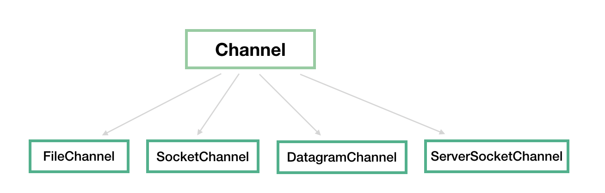
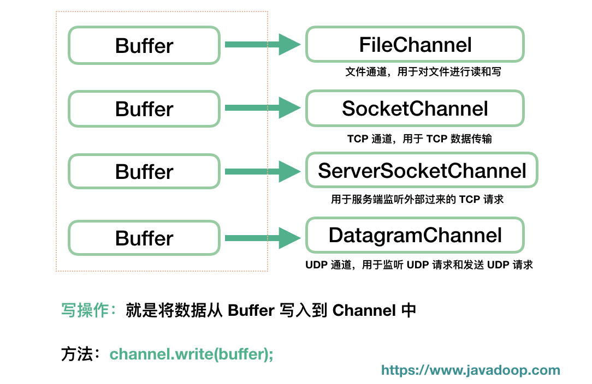

# IO流

## 分类

- **按照流的流向分，可以分为输入流和输出流；**
- **按照操作单元划分，可以划分为字节流和字符流；**
- **按照流的角色划分为节点流和处理流。**

**媒体文件用字节流比较好，如果涉及到字符的话使用字符流比较好。**

- InputStream/Reader: 所有的输入流的基类，前者是字节输入流，后者是字符输入流。
- OutputStream/Writer: 所有输出流的基类，前者是字节输出流，后者是字符输出流。


**IO-操作方式分类 如下图:**


**IO-操作对象分类 如下图:**


# IO理论实质


# BIO (Blocking I/O)

JDK1.4之前常用的编程方式。

> 实现过程：

首先在服务端启动一个ServerSocket来**监听网络请求**，客户端启动Socket发起网络请求，默认情况下ServerSocket会**建立一个线程**来处理此请求，如果服务端没有线程可用，客户端则会**阻塞等待**或遭到**拒绝**，**并发效率比较低**。

服务器实现的模式是**一个连接一个线程**，若有客户端有连接请求服务端就需要启动一个线程进行处理，如果这个连接不做任何事情会造成不必要的**线程开销**。当然，也可以通过线程池机制改善。

> 使用场景

BIO适用于连接数目比较小且固定的架构，对服务器资源要求高，并发局限于应用中。


## java调用linux kernel

启动服务端

```bash
#用jdk1.4编译
/usr/java/j2sdk1.4.2_19/bin/javac  SocketBIO.java
#追踪线程
strace -ff -o out /usr/java/j2sdk1.4.2_19/bin/java SocketBIO
```

另起连接

```bash
#查看监听状态
netstat -natp
```

启动客户端连接

```bash
nc localhost 9090
```

kernel底层

```c
socket = 3
blind(3,9090)
listen(3)
    
while(true){
	accept(3): block | num 5	//阻塞
	clone()->recv(5)	//阻塞抛出线程
}
```


优势：每线程对应每连接，可以接受很多的连接！

问题：线程开销；cpu调度消耗。

原因：blocking阻塞accept recv

解决：nonblocking非阻塞。


# NIO (New I/O)

## 简介

==**OS:Non-Blocking IO**==

==**JAVA:New IO**==

Java NIO (New IO)是Java的一个可选IO API，意味着它可以替代标准的Java IO和Java Networking API's。Java NIO提供了一种不同于传统IO API的IO编程模型。注意：有时NIO被称为非阻塞IO。然而，这并不是NIO最初的意思。另外，部分NIO APIs实际上是阻塞的，例如文件APIs，所以“Non-blocking”标签可能会有点误导。


NIO 本身是基于**事件驱动**思想来完成的，当 socket 有流可读或可写入时，操作系统会相应地**通知**应用程序进行处理，应用再将流读取到缓冲区或写入操作系统。**一个有效的请求**对应**一个线程**，当连接没有数据时，是没有工作线程来处理的。

服务器实现模式为**一个请求一个通道**，即客户端发送的连接请求都会**注册到多路复用器**上，多路复用器轮询到连接**有 I/O 请求时**才**启动**一个线程进行处理。


> 使用场景

NIO 方式适用于连接数目多且连接比较短（轻操作）的架构，比如聊天服务器，并发局限于应用中，编程复杂，JDK1.4 开始支持。

**重要角色：**

- **缓冲区Buffer**
- **通道Channel**
- **多路复用器Selector**

## Buffer

在NIO库中，所有数据都是用**缓冲区（用户空间缓冲区）**处理的。在读取数据时，它是直接读到缓冲区中的；在写入数据时，也是写入到缓冲区中。任何时候访问NIO中的数据，都是通过缓冲区进行操作。
缓冲区实际上是一个数组，并提供了对数据的**结构化访问**以及**维护读写位置**等信息。


| **索引** | **说明**                                                |
| -------- | ------------------------------------------------------- |
| capacity | 缓冲区数组的总长度                                      |
| position | 下一个要操作的数据元素的位置                            |
| limit    | 缓冲区数组中不可操作的下一个元素的位置：limit<=capacity |
| mark     | 用于记录当前position的前一个位置或者默认是-1            |

NIO中的关键Buffer实现有：ByteBuffer, CharBuffer, DoubleBuffer, FloatBuffer, IntBuffer, LongBuffer, ShortBuffer，分别对应基本数据类型: byte, char, double, float, int, long, short。当然NIO中还有MappedByteBuffer, HeapByteBuffer, DirectByteBuffer等这里先不进行陈述。

### 应用固定逻辑

- 分配空间（ByteBuffer buf = ByteBuffer.allocate(1024); 还有一种allocateDirector后面再陈述）
- 写入数据到Buffer(int bytesRead = fileChannel.read(buf);)
- 调用filp()方法（ buf.flip();）
- 从Buffer中读取数据（System.out.print((char)buf.get());）
- 调用clear()方法或者compact()方法


写操作顺序

1. clear()
2. put() -> 写操作
3. flip() ->重置游标
4. SocketChannel.write(buffer); ->将缓存数据发送到网络的另一端
5. clear()

读操作顺序

1. clear()
2. SocketChannel.read(buffer); ->从网络中读取数据
3. buffer.flip()
4. buffer.get() ->读取数据
5. buffer.clear()

## Channel

nio中对数据的读取和写入要通过Channel，它就像**水管一样**，是一个通道。通道不同于流的地方就是通道是**双向**的，可以用于读、写和同时读写操作。

主要实现有：

- FileChannel：文件通道，用于文件的读和写
- DatagramChannel：用于 UDP 连接的接收和发送
- SocketChannel：把它理解为 TCP 连接通道，简单理解就是 TCP 客户端
- ServerSocketChannel：TCP 对应的服务端，用于监听某个端口进来的请求

## Selector

==**多路复用器**==，用于注册通道。客户端发送的连接请求都会注册到多路复用器上，多路复用器轮询到连接有I/O请求时才启动一个线程进行处理。

## 零拷贝

- 我们说的零拷贝，是从操作系统的角度来说的。因为内核缓冲区之间，没有数据是重复的（只有kernel buffer有一份数据）
- 零拷贝不仅仅带来更少的数据复制，还能带来其他的性能优势，例如更少的少下文切换，更少的CPU缓存伪共享以及无CPU校验和计算。

>  实现方式

- mmap 通过内存映射，将**文件映射到内核缓冲区**，同时**用户空间可以共享内核空间的数据**。这样在进行网络传输时可以减少内核空间到用户空间的拷贝次数。
- sendFile


| mmap（内存映射）                     | sendFile                           |
| ------------------------------------ | ---------------------------------- |
| 适合小数据量读写                     | 适合大文件传输                     |
| 需要4次上下文切换，3次数据拷贝       | 需要3次上下文切换，最少2次数据拷贝 |
| 不能（必须从内核拷贝到Socket缓冲区） | 利用DMA方式，减少CPU拷贝           |

DMA: direct memory access 直接内存拷贝（不使用CPU）


FileChannel中的transferTo底层使用零拷贝。

```java
/**
* Many operating systems can transfer bytes directly from the filesystem cache to the target channel without actually copying them.  
*/
public abstract long transferTo(long position, long count, WritableByteChannel target) throws IOException;
```

windows下调用只能发送8M，否则需要分段传输且需注意位置。


## java调用linux kernel

### kernel nio

```c
socket = 3
blind(3,9090)
listen(3)		
    
while(true){
	accept(3): -1 ? 5	//接收 nonblocking
    list.add 5
    for(i in list){
         recv(5)	//读 nonblocking
     }
}
```

优势：规避多线程问题。

问题：==C10K==

​	1w客户端只有一个发来数据，每循环一次必须向内核发送1w次recv的系统调用。

​	这里9999次无意义，浪费时间和资源。（用户空间向内核空间的循环遍历，复杂度在系统调用上）

### kernel 多路复用器

- select/poll	**==只能给你状态==**

```c
socket = 3
blind(3,9090)
listen(3)		

//假设1w连接fds，10个可读
while(true){
    select(fds)/poll(fds) //时间复杂度O(1) 标识一个可读的状态返回
	accept(fds)	
    for(i in fds){	//自己O(n)循环1W fds，找出具体有状态的通道
         recv(i)
     }
}
```

优势：通过一次系统调用，把fds传递给内核进行`遍历`，减少了系统调用的次数。

弊端：

​	1.重复传递fd =>内核需要开辟空间保留fd

​	2.每次select/poll，都要重新遍历全量的fd =>(计算机组成原理深度知识，中断、callback、增强)**它们都只会告诉你有几个通道准备好了，但是不会告诉你具体是哪几个通道**。

- epoll

```c
socket = 3
blind(3,9090)
listen(3)		

epoll_create()= 7						//selector.open()
epoll_ctl(7,ADD,3,accept)				//serverSocketChannel.register(selector, SelectionKey.OP_ACCEPT);
epoll_wait(7  //O(1) 阻塞 timeout		   //selector.select() > 0

//客户端连接
accept(3) = 8 							//SocketChannel client = serverSocketChannel.accept();
epoll_ctl(7,ADD,8,accept)				//client.register(selector, SelectionKey.OP_READ);
epoll_wait (7	//fd7空间里有fd3,fd8
```


## 源码

### Buffer

一个 Buffer 本质上是内存中的一块，我们可以将数据写入这块内存，之后从这块内存获取数据。

java.nio 定义了以下几个 Buffer 的实现，这个图读者应该也在不少地方见过了吧。


其实核心是最后的 **ByteBuffer**，前面的一大串类只是包装了一下它而已，我们使用最多的通常也是 ByteBuffer。

我们应该将 Buffer 理解为一个数组，IntBuffer、CharBuffer、DoubleBuffer 等分别对应 int[]、char[]、double[] 等。

MappedByteBuffer 用于实现内存映射文件，也不是本文关注的重点。

我觉得操作 Buffer 和操作数组、类集差不多，只不过大部分时候我们都把它放到了 NIO 的场景里面来使用而已。下面介绍 Buffer 中的几个重要属性和几个重要方法。

#### position、limit、capacity

就像数组有数组容量，每次访问元素要指定下标，Buffer 中也有几个重要属性：position、limit、capacity。


最好理解的当然是 capacity，它代表这个缓冲区的容量，一旦设定就不可以更改。比如 capacity 为 1024 的 IntBuffer，代表其一次可以存放 1024 个 int 类型的值。一旦 Buffer 的容量达到 capacity，需要清空 Buffer，才能重新写入值。

position 和 limit 是变化的，我们分别看下读和写操作下，它们是如何变化的。

**position** 的初始值是 0，每往 Buffer 中写入一个值，position 就自动加 1，代表下一次的写入位置。读操作的时候也是类似的，每读一个值，position 就自动加 1。

从写操作模式到读操作模式切换的时候（**flip**），position 都会归零，这样就可以从头开始读写了。

**Limit**：写操作模式下，limit 代表的是最大能写入的数据，这个时候 limit 等于 capacity。写结束后，切换到读模式，此时的 limit 等于 Buffer 中实际的数据大小，因为 Buffer 不一定被写满了。


#### 初始化 Buffer

每个 Buffer 实现类都提供了一个静态方法 `allocate(int capacity)` 帮助我们快速实例化一个 Buffer。如：

```java
ByteBuffer byteBuf = ByteBuffer.allocate(1024);
IntBuffer intBuf = IntBuffer.allocate(1024);
LongBuffer longBuf = LongBuffer.allocate(1024);
// ...
```

另外，我们经常使用 wrap 方法来初始化一个 Buffer。

```java
public static ByteBuffer wrap(byte[] array) {
    ...
}
```

#### 填充 Buffer

各个 Buffer 类都提供了一些 put 方法用于将数据填充到 Buffer 中，如 ByteBuffer 中的几个 put 方法：

```java
// 填充一个 byte 值
public abstract ByteBuffer put(byte b);
// 在指定位置填充一个 int 值
public abstract ByteBuffer put(int index, byte b);
// 将一个数组中的值填充进去
public final ByteBuffer put(byte[] src) {...}
public ByteBuffer put(byte[] src, int offset, int length) {...}
```

上述这些方法需要自己控制 Buffer 大小，不能超过 capacity，超过会抛 java.nio.BufferOverflowException 异常。

对于 Buffer 来说，另一个常见的操作中就是，我们要将来自 Channel 的数据填充到 Buffer 中，在系统层面上，这个操作我们称为**读操作**，因为数据是从外部（文件或网络等）读到内存中。

```java
int num = channel.read(buf);
```

上述方法会返回从 Channel 中读入到 Buffer 的数据大小。

#### 提取 Buffer 中的值

前面介绍了写操作，每写入一个值，position 的值都需要加 1，所以 position 最后会指向最后一次写入的位置的后面一个，如果 Buffer 写满了，那么 position 等于 capacity（position 从 0 开始）。

如果要读 Buffer 中的值，需要切换模式，从写入模式切换到读出模式。注意，通常在说 NIO 的读操作的时候，我们说的是从 Channel 中读数据到 Buffer 中，对应的是对 Buffer 的写入操作，初学者需要理清楚这个。

调用 Buffer 的 **flip()** 方法，可以从写入模式切换到读取模式。其实这个方法也就是设置了一下 position 和 limit 值罢了。

```java
public final Buffer flip() {
    limit = position; // 将 limit 设置为实际写入的数据数量
    position = 0; // 重置 position 为 0
    mark = -1; // mark 之后再说
    return this;
}
```

对应写入操作的一系列 put 方法，读操作提供了一系列的 get 方法：

```java
// 根据 position 来获取数据
public abstract byte get();
// 获取指定位置的数据
public abstract byte get(int index);
// 将 Buffer 中的数据写入到数组中
public ByteBuffer get(byte[] dst)
```

附一个经常使用的方法：

```java
new String(buffer.array()).trim();
```

当然了，除了将数据从 Buffer 取出来使用，更常见的操作是将我们写入的数据传输到 Channel 中，如通过 FileChannel 将数据写入到文件中，通过 SocketChannel 将数据写入网络发送到远程机器等。对应的，这种操作，我们称之为**写操作**。

```java
int num = channel.write(buf);
```

#### mark() & reset()

除了 position、limit、capacity 这三个基本的属性外，还有一个常用的属性就是 mark。

mark 用于临时保存 position 的值，每次调用 mark() 方法都会将 mark 设值为当前的 position，便于后续需要的时候使用。

```java
public final Buffer mark() {
    mark = position;
    return this;
}
```

那到底什么时候用呢？考虑以下场景，我们在 position 为 5 的时候，先 mark() 一下，然后继续往下读，读到第 10 的时候，我想重新回到 position 为 5 的地方重新来一遍，那只要调一下 reset() 方法，position 就回到 5 了。

```java
public final Buffer reset() {
    int m = mark;
    if (m < 0)
        throw new InvalidMarkException();
    position = m;
    return this;
}
```


#### rewind() & clear() & compact()

**rewind()**：会重置 position 为 0，通常用于重新从头读写 Buffer。

```java
public final Buffer rewind() {
    position = 0;
    mark = -1;
    return this;
}
```

**clear()**：有点重置 Buffer 的意思，相当于重新实例化了一样。

通常，我们会先填充 Buffer，然后从 Buffer 读取数据，之后我们再重新往里填充新的数据，我们一般在重新填充之前先调用 clear()。

```java
public final Buffer clear() {
    position = 0;
    limit = capacity;
    mark = -1;
    return this;
}
```

**compact()**：和 clear() 一样的是，它们都是在准备往 Buffer 填充新的数据之前调用。

前面说的 clear() 方法会重置几个属性，但是我们要看到，clear() 方法并不会将 Buffer 中的数据清空，只不过后续的写入会覆盖掉原来的数据，也就相当于清空了数据了。

而 compact() 方法有点不一样，调用这个方法以后，会先处理还没有读取的数据，也就是 position 到 limit 之间的数据（还没有读过的数据），先将这些数据移到左边，然后在这个基础上再开始写入。很明显，此时 limit 还是等于 capacity，position 指向原来数据的右边。

### Channel

所有的 NIO 操作始于通道，通道是数据来源或数据写入的目的地，主要地，我们将关心 java.nio 包中实现的以下几个 Channel：



- FileChannel：文件通道，用于文件的读和写
- DatagramChannel：用于 UDP 连接的接收和发送
- SocketChannel：把它理解为 TCP 连接通道，简单理解就是 TCP 客户端
- ServerSocketChannel：TCP 对应的服务端，用于监听某个端口进来的请求

**这里不是很理解这些也没关系，后面介绍了代码之后就清晰了。还有，我们最应该关注，也是后面将会重点介绍的是 SocketChannel 和 ServerSocketChannel。**

Channel 经常翻译为通道，类似 IO 中的流，用于读取和写入。它与前面介绍的 Buffer 打交道，读操作的时候将 Channel 中的数据填充到 Buffer 中，而写操作时将 Buffer 中的数据写入到 Channel 中。




至少读者应该记住一点，这两个方法都是 channel 实例的方法。

#### FileChannel

我想文件操作对于大家来说应该是最熟悉的，不过我们在说 NIO 的时候，其实 FileChannel 并不是关注的重点。而且后面我们说非阻塞的时候会看到，FileChannel 是不支持非阻塞的。

**这里算是简单介绍下常用的操作吧，感兴趣的读者瞄一眼就是了。**

**初始化：**

```java
FileInputStream inputStream = new FileInputStream(new File("/data.txt"));
FileChannel fileChannel = inputStream.getChannel();
```

当然了，我们也可以从 RandomAccessFile#getChannel 来得到 FileChannel。

**读取文件内容：**

```java
ByteBuffer buffer = ByteBuffer.allocate(1024);

int num = fileChannel.read(buffer);
```

前面我们也说了，所有的 Channel 都是和 Buffer 打交道的。

**写入文件内容：**

```java
ByteBuffer buffer = ByteBuffer.allocate(1024);
buffer.put("随机写入一些内容到 Buffer 中".getBytes());
// Buffer 切换为读模式
buffer.flip();
while(buffer.hasRemaining()) {
    // 将 Buffer 中的内容写入文件
    fileChannel.write(buffer);
}
```


#### SocketChannel

我们前面说了，我们可以将 SocketChannel 理解成一个 TCP 客户端。虽然这么理解有点狭隘，因为我们在介绍 ServerSocketChannel 的时候会看到另一种使用方式。

打开一个 TCP 连接：

```java
SocketChannel socketChannel = SocketChannel.open(new InetSocketAddress("https://www.javadoop.com", 80));
```

当然了，上面的这行代码等价于下面的两行：

```java
// 打开一个通道
SocketChannel socketChannel = SocketChannel.open();
// 发起连接
socketChannel.connect(new InetSocketAddress("https://www.javadoop.com", 80));
```

SocketChannel 的读写和 FileChannel 没什么区别，就是操作缓冲区。

```java
// 读取数据
socketChannel.read(buffer);

// 写入数据到网络连接中
while(buffer.hasRemaining()) {
    socketChannel.write(buffer);   
}
```

不要在这里停留太久，先继续往下走。


#### ServerSocketChannel

之前说 SocketChannel 是 TCP 客户端，这里说的 ServerSocketChannel 就是对应的服务端。

ServerSocketChannel 用于监听机器端口，管理从这个端口进来的 TCP 连接。

```java
// 实例化
ServerSocketChannel serverSocketChannel = ServerSocketChannel.open();
// 监听 8080 端口
serverSocketChannel.socket().bind(new InetSocketAddress(8080));

while (true) {
    // 一旦有一个 TCP 连接进来，就对应创建一个 SocketChannel 进行处理
    SocketChannel socketChannel = serverSocketChannel.accept();
}
```

> 这里我们可以看到 SocketChannel 的第二个实例化方式

到这里，我们应该能理解 SocketChannel 了，它不仅仅是 TCP 客户端，它代表的是一个网络通道，可读可写。

ServerSocketChannel 不和 Buffer 打交道了，因为它并不实际处理数据，它一旦接收到请求后，实例化 SocketChannel，之后在这个连接通道上的数据传递它就不管了，因为它需要继续监听端口，等待下一个连接。


#### DatagramChannel

UDP 和 TCP 不一样，DatagramChannel 一个类处理了服务端和客户端。

> 科普一下，UDP 是面向无连接的，不需要和对方握手，不需要通知对方，就可以直接将数据包投出去，至于能不能送达，它是不知道的

**监听端口：**

```java
DatagramChannel channel = DatagramChannel.open();
channel.socket().bind(new InetSocketAddress(9090));
ByteBuffer buf = ByteBuffer.allocate(48);

channel.receive(buf);
```

**发送数据：**

```java
String newData = "New String to write to file..."
                    + System.currentTimeMillis();

ByteBuffer buf = ByteBuffer.allocate(48);
buf.put(newData.getBytes());
buf.flip();

int bytesSent = channel.send(buf, new InetSocketAddress("jenkov.com", 80));
```

### Selector

NIO 三大组件就剩 Selector 了，Selector 建立在非阻塞的基础之上，大家经常听到的 **多路复用** 在 Java 世界中指的就是它，用于实现一个线程管理多个 Channel。

读者在这一节不能消化 Selector 也没关系，因为后续在介绍非阻塞 IO 的时候还得说到这个，这里先介绍一些基本的接口操作。

1. 首先，我们开启一个 Selector。你们爱翻译成**选择器**也好，**多路复用器**也好。

   ```java
   Selector selector = Selector.open();
   ```

2. 将 Channel 注册到 Selector 上。前面我们说了，Selector 建立在非阻塞模式之上，所以注册到 Selector 的 Channel 必须要支持非阻塞模式，**FileChannel 不支持非阻塞**，我们这里讨论最常见的 SocketChannel 和 ServerSocketChannel。

   ```java
   // 将通道设置为非阻塞模式，因为默认都是阻塞模式的
   channel.configureBlocking(false);
   // 注册
   SelectionKey key = channel.register(selector, SelectionKey.OP_READ);
   ```

   register 方法的第二个 int 型参数（使用二进制的标记位）用于表明需要监听哪些感兴趣的事件，共以下四种事件：

   - SelectionKey.OP_READ

     > 对应 00000001，通道中有数据可以进行读取

   - SelectionKey.OP_WRITE

     > 对应 00000100，可以往通道中写入数据

   - SelectionKey.OP_CONNECT

     > 对应 00001000，成功建立 TCP 连接

   - SelectionKey.OP_ACCEPT

     > 对应 00010000，接受 TCP 连接

   我们可以同时监听一个 Channel 中的发生的多个事件，比如我们要监听 ACCEPT 和 READ 事件，那么指定参数为二进制的 000**1**000**1** 即十进制数值 17 即可。

   注册方法返回值是 **SelectionKey** 实例，它包含了 Channel 和 Selector 信息，也包括了一个叫做 Interest Set 的信息，即我们设置的我们感兴趣的正在监听的事件集合。

3. 调用 select() 方法获取通道信息。用于判断是否有我们感兴趣的事件已经发生了。

Selector 的操作就是以上 3 步，这里来一个简单的示例，大家看一下就好了。之后在介绍非阻塞 IO 的时候，会演示一份可执行的示例代码。

```java
Selector selector = Selector.open();

channel.configureBlocking(false);

SelectionKey key = channel.register(selector, SelectionKey.OP_READ);

while(true) {
  // 判断是否有事件准备好
  int readyChannels = selector.select();
  if(readyChannels == 0) continue;

  // 遍历
  Set<SelectionKey> selectedKeys = selector.selectedKeys();
  Iterator<SelectionKey> keyIterator = selectedKeys.iterator();
  while(keyIterator.hasNext()) {
    SelectionKey key = keyIterator.next();

    if(key.isAcceptable()) {
        // a connection was accepted by a ServerSocketChannel.

    } else if (key.isConnectable()) {
        // a connection was established with a remote server.

    } else if (key.isReadable()) {
        // a channel is ready for reading

    } else if (key.isWritable()) {
        // a channel is ready for writing
    }

    keyIterator.remove();
  }
}
```

对于 Selector，我们还需要非常熟悉以下几个方法：

1. **select()**

   调用此方法，会将**上次 select 之后的**准备好的 channel 对应的 SelectionKey 复制到 selected set 中。如果没有任何通道准备好，这个方法会阻塞，直到至少有一个通道准备好。

2. **selectNow()**

   功能和 select 一样，区别在于如果没有准备好的通道，那么此方法会立即返回 0。

3. **select(long timeout)**

   看了前面两个，这个应该很好理解了，如果没有通道准备好，此方法会等待一会

4. **wakeup()**

   这个方法是用来唤醒等待在 select() 和 select(timeout) 上的线程的。如果 wakeup() 先被调用，此时没有线程在 select 上阻塞，那么之后的一个 select() 或 select(timeout) 会立即返回，而不会阻塞，当然，它只会作用一次。

### 小结

到此为止，介绍了 Buffer、Channel 和 Selector 的常见接口。

Buffer 和数组差不多，它有 position、limit、capacity 几个重要属性。put() 一下数据、flip() 切换到读模式、然后用 get() 获取数据、clear() 一下清空数据、重新回到 put() 写入数据。

Channel 基本上只和 Buffer 打交道，最重要的接口就是 channel.read(buffer) 和 channel.write(buffer)。

Selector 用于实现非阻塞 IO，这里仅仅介绍接口使用，后续请关注非阻塞 IO 的介绍。


# AIO (Asynchronous I/O)

进行读写操作时，只须直接调用api的read或write方法即可。一个有效请求对应一个线程，客户端的IO请求都是OS先完成了再通知服务器应用去启动线程进行处理。


AIO 也就是 NIO 2。在 Java 7 中引入了 NIO 的改进版 NIO 2,它是异步非阻塞的IO模型。异步 IO 是基于事件和回调机制实现的，也就是应用操作之后会直接返回，不会堵塞在那里，当后台处理完成，操作系统会通知相应的线程进行后续的操作。

AIO 是异步IO的缩写，虽然 NIO 在网络操作中，提供了非阻塞的方法，但是 NIO 的 IO 行为还是同步的。对于 NIO 来说，我们的业务线程是在 IO 操作准备好时，得到通知，接着就由这个线程自行进行 IO 操作，IO操作本身是同步的。（除了 AIO 其他的 IO 类型都是同步的，这一点可以从底层IO线程模型解释，推荐一篇文章：[《漫话：如何给女朋友解释什么是Linux的五种IO模型？》](https://mp.weixin.qq.com/s?__biz=Mzg3MjA4MTExMw==&mid=2247484746&amp;idx=1&amp;sn=c0a7f9129d780786cabfcac0a8aa6bb7&source=41#wechat_redirect) ）

查阅网上相关资料，我发现就目前来说 AIO 的应用还不是很广泛，Netty 之前也尝试使用过 AIO，不过又放弃了。

> 使用场景

AIO 方式使用于连接数目多且连接比较长（重操作）的架构，比如相册服务器，充分调用 OS 参与并发操作，编程比较复杂，JDK1.7 开始支持。


# [Netty](Netty.md)

# [epoll ](linux.md)

参考linux.md


