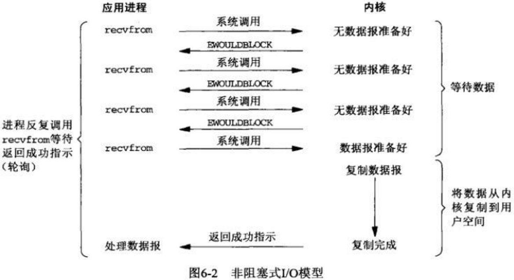

# IO流

## 分类

- **按照流的流向分，可以分为输入流和输出流；**
- **按照操作单元划分，可以划分为字节流和字符流；**
- **按照流的角色划分为节点流和处理流。**

**媒体文件用字节流比较好，如果涉及到字符的话使用字符流比较好。**   ==(byte字节   char字符)==

- InputStream/Reader: 所有的输入流的基类，前者是字节输入流，后者是字符输入流。
- OutputStream/Writer: 所有输出流的基类，前者是字节输出流，后者是字符输出流。

`RandomAccessFile` 比较常见的一个应用就是实现大文件的 **断点续传** 。何谓断点续传？简单来说就是上传文件中途暂停或失败（比如遇到网络问题）之后，不需要重新上传，只需要上传那些未成功上传的文件分片即可。分片（先将文件切分成多个文件分片）上传是断点续传的基础。


**IO-操作方式分类 如下图:**


**IO-操作对象分类 如下图:**


## 编程实现文件拷贝

```java
import java.io.FileInputStream;
import java.io.FileOutputStream;
import java.io.IOException;
import java.io.InputStream;
import java.io.OutputStream;
import java.nio.ByteBuffer;
import java.nio.channels.FileChannel;

public final class MyUtil {
	// 工具类中的方法都是静态方式访问的因此将构造器私有不允许创建对象(绝对好习惯)
	private MyUtil() {
		throw new AssertionError();
	}
	
	public static void fileCopy(String source, String target) throws IOException {
        //用到Java 7的TWR，使用TWR后可以不用在finally中释放外部资源 ，从而让代码更加优雅。
        //貌似支持twr多个资源用";"隔开，自动关闭顺序遵循先开后关。
		try (InputStream in = new FileInputStream(source)) {
			try (OutputStream out = new FileOutputStream(target)) {
				byte[] buffer = new byte[4096];
				int bytesToRead;
				while((bytesToRead = in.read(buffer)) != -1) {
					out.write(buffer, 0, bytesToRead);
				}
			}
		}
	}
	
	public static void fileCopyNIO(String source, String target) throws IOException {
		try (FileInputStream in = new FileInputStream(source)) {
			try (FileOutputStream out = new FileOutputStream(target)) {
				FileChannel inChannel = in.getChannel();
				FileChannel outChannel = out.getChannel();
				ByteBuffer buffer = ByteBuffer.allocate(4096);
				while(inChannel.read(buffer) != -1) {	//将channel中的数据读到buffer中
					buffer.flip();
					outChannel.write(buffer);
					buffer.clear();
				}
			}
		}
	}
}

```


# IO理论实质


# IO

I/O（**I**nput/**O**utpu） 即**输入／输出** 。

## 计算机结构的角度

根据冯.诺依曼结构，计算机结构分为 5 大部分：运算器、控制器、存储器、输入设备、输出设备。


输入设备（比如键盘）和输出设备（比如显示器）都属于外部设备。网卡、硬盘这种既可以属于输入设备，也可以属于输出设备。

输入设备向计算机输入数据，输出设备接收计算机输出的数据。

**从计算机结构的视角来看的话， I/O 描述了计算机系统与外部设备之间通信的过程。**

## 应用程序的角度

根据大学里学到的操作系统相关的知识：为了保证操作系统的稳定性和安全性，==一个进程的地址空间划分为 **用户空间（User space）** 和 **内核空间（Kernel space ）** 。==

像我们平常运行的应用程序都是运行在用户空间，只有内核空间才能进行系统态级别的资源有关的操作，比如文件管理、进程通信、内存管理等等。也就是说，我们想要进行 IO 操作，一定是要依赖内核空间的能力。

并且，用户空间的程序不能直接访问内核空间。

当想要执行 IO 操作时，由于没有执行这些操作的权限，只能发起系统调用请求操作系统帮忙完成。

因此，用户进程想要执行 IO 操作的话，必须通过 **系统调用** 来间接访问内核空间

我们在平常开发过程中接触最多的就是 **磁盘 IO（读写文件）** 和 **网络 IO（网络请求和响应）**。

**从应用程序的视角来看的话，我们的应用程序对操作系统的内核发起 IO 调用（系统调用），操作系统负责的内核执行具体的 IO 操作。也就是说，我们的应用程序实际上只是发起了 IO 操作的调用而已，具体 IO 的执行是由操作系统的内核来完成的。**

当应用程序发起 I/O 调用后，会经历两个步骤：

1. 内核等待 I/O 设备准备好数据
2. 内核将数据从内核空间拷贝到用户空间。

# IO模型

UNIX 系统下， IO 模型一共有 5 种：**同步阻塞 I/O**、**同步非阻塞 I/O**、**I/O 多路复用**、**信号驱动 I/O** 和**异步 I/O**。

Java中的NIO的Selector和Linux中的epoll都是IO多路复用模型。

[系统内核 五种I/O模型](linux.md)

## 基本概念

### 系统调用函数

**recvfrom**
Linux系统提供给用户用于接收网络IO的系统接口。**从套接字上接收一个消息**，可同时应用于面向连接和无连接的套接字。

如果此系统调用返回值<0，并且 errno为EWOULDBLOCK或EAGAIN（套接字已标记为非阻塞，而接收操作被阻塞或者接收超时 ）时，连接正常，**阻塞**接收数据（这很关键，前4种IO模型都设计此系统调用）。

**select**
select系统调用允许程序同时在多个底层文件描述符上，等待输入的到达或输出的完成。以**数组**形式存储文件描述符，64位机器默认**2048**个。当有数据准备好时，无法感知具体是哪个流OK了，所以需要一个一个的遍历，函数的时间复杂度为**O(n)**。

**poll**
以**链表**形式存储文件描述符，没有长度限制。本质与select相同，函数的时间复杂度也为**O(n)**。

**epoll**
是基于事件驱动的，如果某个流准备好了，会以事件通知，知道具体是哪个流，因此不需要遍历，函数的时间复杂度为**O(1)**。

**sigaction**
用于设置对信号的处理方式，也可检验对某信号的预设处理方式。Linux使用**SIGIO信号**来实现IO异步通知机制。

### 同步 异步 阻塞 非阻塞

同步和异步是针对应用程序和内核交互而言的，也可理解为被**被调用者（操作系统）**的角度来说。

- 同步是用户进程触发IO操作并等待或轮询的去查看是否就绪，被调用方得到最终结果之后才返回给调用方
- 异步是指用户进程触发IO操作以后便开始做自己的事情，而当IO操作已经完成的时候会得到IO完成的通知，需要CPU支持。

> **同步** ： 自己亲自出马持银行卡到银行取钱（使用同步 IO 时，Java 自己处理IO 读写）；**！进程做IO！**
>
> **异步** ： 委托一小弟拿银行卡到银行取钱，然后给你（使用异步IO 时，Java 将 IO 读写委托给OS 处理，需要将数据缓冲区地址和大小传给OS(银行卡和密码)，OS 需要支持异步IO操作API）；**！OS做IO！**

阻塞和非阻塞是针对于进程在访问数据的时候，也可理解为**调用者（程序）**角度来说。根据IO操作的就绪状态来采取的不同的方式。

- 阻塞方式下读取或写入方法将一直等待
- 非阻塞方式下读取或写入方法会立即返回一个状态值。

> **阻塞** ： ATM排队取款，你只能等待（使用阻塞IO时，Java调用会一直阻塞到读写完成才返回）；
>
> **非阻塞** ： 柜台取款，取个号，然后坐在椅子上做其它事，等号广播会通知你办理，没到号你就不能去，你可以不断问大堂经理排到了没有，大堂经理如果说还没到你就不能去（使用非阻塞IO时，如果不能读写Java调用会马上返回，当IO事件分发器通知可读写时再继续进行读写，不断循环直到读写完成）

## 阻塞I/O模型

 **bloking IO**

学习过操作系统的知识后，可以知道：不管是网络IO还是磁盘IO，对于读操作而言，都是等到网络的某个数据分组到达后/数据**准备好**后，将数据**拷贝到内核空间的缓冲区中**，再从内核空间**拷贝到用户空间的缓冲区**。

阻塞IO的执行过程是进程进行**系统调用**，**等待内核**将数据准备好并复制到用户态缓冲区后，进程**放弃使用CPU**并**一直阻塞**在此，直到数据准备好。


## 非阻塞I/O模型

**non-blocking IO**

每次应用程序**询问内核**是否有数据准备好。如果就绪，就进行**拷贝**操作；如果未就绪，就**不阻塞程序**，内核直接返回未就绪的返回值，等待用户程序下一个轮询。

大致经历两个阶段：

- **等待数据阶段**：==未阻塞==， 用户进程需要盲等，不停的去轮询内核。
- **数据复制阶段**：==阻塞==，此时进行数据复制。

在这两个阶段中，用户进程只有在数据复制阶段被阻塞了，而等待数据阶段没有阻塞，但是用户进程需要盲等，不停地轮询内核，看数据是否准备好。



## I/O多路复用模型

**multiplexing IO**

多路复用一般都是用于网络IO，服务端与多个客户端的建立连接。

相比于阻塞IO模型，多路复用只是多了一个**select/poll/epoll函数**。select函数会不断地轮询自己所负责的文件描述符/套接字的到达状态，当某个套接字就绪时，就通知用户进程。

**当用户进程调用了select，那么整个进程会被block**，而同时，kernel会“监视”所有select负责的socket，**当任何一个socket中的数据准备好了，select就会返回**。这个时候用户进程再调用read操作，将数据从kernel拷贝到用户进程。

> 多路复用的特点是**通过一种机制一个进程能同时等待IO文件描述符**，内核监视这些文件描述符（套接字描述符），其中的任意一个进入读就绪状态，select， poll，epoll函数就可以返回。对于监视的方式，又可以分为 select， poll， epoll三种方式。

下面的图和blocking IO的图其实并没有太大的不同，事实上，还更差一些。**因为这里需要使用两个system call (select 和 recvfrom)，而blocking IO只调用了一个system call (recvfrom)**。但是，**用select的优势在于它可以同时处理多个connection**。


select负责**轮询等待**，recvfrom负责**拷贝**。当用户进程调用该select，select会监听所有注册好的IO，如果所有IO都没注册好，调用进程就阻塞。

对于客户端来说，一般**感受不到阻塞**，因为请求来了，可以用放到线程池里执行；但对于执行select的操作系统而言，是阻塞的，需要阻塞地**等待某个套接字变为可读**。


==**IO多路复用其实是阻塞在select、poll、epoll这样的系统调用之上，而没有阻塞在真正的I/O系统调用如recvfrom之上。复用的是执行select，poll，epoll的线程。**==


## 信号驱动I/O模型

**signal-driven IO**

信号驱动式I/O：首先我们允许Socket进行信号驱动IO,并安装一个信号处理函数，进程继续运行并不阻塞。当数据准备好时，进程会收到一个SIGIO信号，可以在信号处理函数中调用I/O操作函数处理数据。


## 异步I/O模型

**asynchronous IO**

相对于同步IO，异步IO不是顺序执行。用户进程进行aio_read系统调用之后，无论内核数据是否准备好，都会直接返回给用户进程，然后用户态进程可以去做别的事情。等到socket数据准备好了，内核直接复制数据给进程，然后从内核向进程发送通知。**IO两个阶段，进程都是非阻塞的。**


## 买票举例

故事情节为：老李去买火车票，三天后买到一张退票。参演人员（老李，黄牛，售票员，快递员），往返车站耗费1小时。

**1.阻塞I/O模型**

老李去火车站买票，排队三天买到一张退票。

耗费：在车站吃喝拉撒睡 3天，其他事一件没干。

**2.非阻塞I/O模型**

老李去火车站买票，隔12小时去火车站问有没有退票，三天后买到一张票。

耗费：往返车站6次，路上6小时，其他时间做了好多事。

**3.I/O复用模型**

- **select/poll**

老李去火车站买票，委托黄牛，然后每隔6小时电话黄牛询问，黄牛三天内买到票，然后老李去火车站交钱领票。 

耗费：往返车站2次，路上2小时，黄牛手续费100元，打电话17次

- **epoll**

老李去火车站买票，委托黄牛，黄牛买到后即通知老李去领，然后老李去火车站交钱领票。 

耗费：往返车站2次，路上2小时，黄牛手续费100元，无需打电话

**4.信号驱动I/O模型**

老李去火车站买票，给售票员留下电话，有票后，售票员电话通知老李，然后老李去火车站交钱领票。 

耗费：往返车站2次，路上2小时，免黄牛费100元，无需打电话

**5.异步I/O模型**

老李去火车站买票，给售票员留下电话，有票后，售票员电话通知老李并快递送票上门。 

耗费：往返车站1次，路上1小时，免黄牛费100元，无需打电话


1同2的区别是：自己轮询

2同3的区别是：委托黄牛

3同4的区别是：电话代替黄牛

4同5的区别是：电话通知是自取还是送票上门

## 总结


## epoll详解

### 概念

epoll是一种I/O事件通知机制，是linux 内核实现==**IO多路复用的一个实现**==。
IO多路复用是指，在一个操作里同时监听多个输入输出源，在其中一个或多个输入输出源可用的时候返回，然后对其的进行读写操作。

### I/O

输入输出(input/output)的对象可以是文件(file)， 网络(socket)，进程之间的管道(pipe)。在linux系统中，都用文件描述符(fd)来表示。

### 事件

- 可读事件，当文件描述符关联的内核读缓冲区可读，则触发可读事件。(可读：内核缓冲区非空，有数据可以读取)
- 可写事件，当文件描述符关联的内核写缓冲区可写，则触发可写事件。(可写：内核缓冲区不满，有空闲空间可以写入）

### 通知机制

通知机制，就是当事件发生的时候，则主动通知。通知机制的反面，就是轮询机制。

### epoll的通俗解释

结合以上三条，epoll的通俗解释是一种当文件描述符的内核读缓冲区非空的时候，发出可读信号进行通知，当写缓冲区不满的时候，发出可写信号通知的机制。

### API详解

epoll的核心是3个API，核心数据结构是：1个红黑树和1个链表


#### int epoll_create(int size)

​		==内核会产生一个epoll 实例数据结构并返回一个文件描述符，这个特殊的描述符就是epoll实例的句柄，后面的两个接口都以它为中心（即epfd形参）。==

​		size参数表示所要监视文件描述符的最大值，不过在后来的Linux版本中已经被弃用（同时，size不要传0，会报invalid argument错误）

#### int epoll_ctl(int epfd， int op， int fd， struct epoll_event *event)

​		==将被监听的描述符添加到红黑树或从红黑树中删除或者对监听事件进行修改==

```c
typedef union epoll_data {
    void *ptr; /* 指向用户自定义数据 */
    int fd; /* 注册的文件描述符 */
    uint32_t u32; /* 32-bit integer */
    uint64_t u64; /* 64-bit integer */
} epoll_data_t;

struct epoll_event {
    uint32_t events; /* 描述epoll事件 */
    epoll_data_t data; /* 见上面的结构体 */
};
```

对于需要监视的文件描述符集合，epoll_ctl对红黑树进行管理，红黑树中每个成员由描述符值和所要监控的文件描述符指向的文件表项的引用等组成。

op参数说明操作类型：

- EPOLL_CTL_ADD：向interest list添加一个需要监视的描述符
- EPOLL_CTL_DEL：从interest list中删除一个描述符
- EPOLL_CTL_MOD：修改interest list中一个描述符

struct epoll_event结构描述一个文件描述符的epoll行为。在使用epoll_wait函数返回处于ready状态的描述符列表时，

- data域是唯一能给出描述符信息的字段，所以在调用epoll_ctl加入一个需要监测的描述符时，一定要在此域写入描述符相关信息
- events域是bit mask，描述一组epoll事件，在epoll_ctl调用中解释为：描述符所期望的epoll事件，可多选。

常用的epoll事件描述如下：

- EPOLLIN：描述符处于可读状态
- EPOLLOUT：描述符处于可写状态
- EPOLLET：将epoll event通知模式设置成edge triggered
- EPOLLONESHOT：第一次进行通知，之后不再监测
- EPOLLHUP：本端描述符产生一个挂断事件，默认监测事件
- EPOLLRDHUP：对端描述符产生一个挂断事件
- EPOLLPRI：由带外数据触发
- EPOLLERR：描述符产生错误时触发，默认检测事件

#### int epoll_wait(int epfd， struct epoll_event *events， int maxevents， int timeout)

​		==等待epoll事件从epoll实例中发生， 并返回事件以及对应文件描述符==

- 阻塞等待注册的事件发生，返回事件的数目，并将触发的事件写入events数组中。
- events: 用来记录被触发的events，其大小应该和maxevents一致
- maxevents: 返回的events的最大个数

处于ready状态的那些文件描述符会被复制进ready list中，epoll_wait用于向用户进程返回ready list。events和maxevents两个参数描述一个由用户分配的struct epoll event数组，调用返回时，内核将ready list复制到这个数组中，并将实际复制的个数作为返回值。注意，如果ready list比maxevents长，则只能复制前maxevents个成员；反之，则能够完全复制ready list。
另外，struct epoll event结构中的events域在这里的解释是：在被监测的文件描述符上实际发生的事件。
参数timeout描述在函数调用中阻塞时间上限，单位是ms：

- timeout = -1表示调用将一直阻塞，直到有文件描述符进入ready状态或者捕获到信号才返回；
- timeout = 0用于非阻塞检测是否有描述符处于ready状态，不管结果怎么样，调用都立即返回；
- timeout > 0表示调用将最多持续timeout时间，如果期间有检测对象变为ready状态或者捕获到信号则返回，否则直到超时。

### 两种触发方式

epoll监控多个文件描述符的I/O事件。epoll支持边缘触发(edge trigger，ET)或水平触发（level trigger，LT)，通过epoll_wait等待I/O事件，如果当前没有可用的事件则阻塞调用线程。

> select和poll只支持LT工作模式，epoll的默认的工作模式是LT模式。

#### 水平触发

1. 对于读操作，只要缓冲内容不为空，LT模式返回读就绪。
2. 对于写操作，只要缓冲区还不满，LT模式会返回写就绪。

当被监控的文件描述符上有可读写事件发生时，epoll_wait()会通知处理程序去读写。如果这次没有把数据一次性全部读写完(如读写缓冲区太小)，那么下次调用 epoll_wait()时，它还会通知你在上次没读写完的文件描述符上继续读写，当然如果你一直不去读写，它会一直通知你。如果系统中有大量你不需要读写的就绪文件描述符，而它们每次都会返回，这样会大大降低处理程序检索自己关心的就绪文件描述符的效率。

#### 边缘触发

- 对于读操作

1. 当缓冲区由不可读变为可读的时候，即缓冲区由空变为不空的时候。
2. 当有新数据到达时，即缓冲区中的待读数据变多的时候。
3. 当缓冲区有数据可读，且应用进程对相应的描述符进行EPOLL_CTL_MOD 修改EPOLLIN事件时。

- 对于写操作

1. 当缓冲区由不可写变为可写时。
2. 当有旧数据被发送走，即缓冲区中的内容变少的时候。
3. 当缓冲区有空间可写，且应用进程对相应的描述符进行EPOLL_CTL_MOD 修改EPOLLOUT事件时。

当被监控的文件描述符上有可读写事件发生时，epoll_wait()会通知处理程序去读写。如果这次没有把数据全部读写完(如读写缓冲区太小)，那么下次调用epoll_wait()时，它不会通知你，也就是它只会通知你一次，直到该文件描述符上出现第二次可读写事件才会通知你。这种模式比水平触发效率高，系统不会充斥大量你不关心的就绪文件描述符。

> 在ET模式下， 缓冲区从不可读变成可读，会唤醒应用进程，缓冲区数据变少的情况，则不会再唤醒应用进程。

举例1：

1. 读缓冲区刚开始是空的
2. 读缓冲区写入2KB数据
3. 水平触发和边缘触发模式此时都会发出可读信号
4. 收到信号通知后，读取了1KB的数据，读缓冲区还剩余1KB数据
5. 水平触发会再次进行通知，而边缘触发不会再进行通知

举例2：（以脉冲的高低电平为例）

- 水平触发：0为无数据，1为有数据。缓冲区有数据则一直为1，则一直触发。
- 边缘触发发：0为无数据，1为有数据，只要在0变到1的上升沿才触发。

> JDK并没有实现边缘触发，Netty重新实现了epoll机制，采用边缘触发方式；另外像Nginx也采用边缘触发。

JDK在Linux已经默认使用epoll方式，但是JDK的epoll采用的是水平触发，而Netty重新实现了epoll机制，采用边缘触发方式，netty epoll transport 暴露了更多的nio没有的配置参数，如 TCP_CORK, SO_REUSEADDR等等；另外像Nginx也采用边缘触发。

### epoll与select、poll的对比

#### 1 用户态将文件描述符传入内核的方式

- select：创建3个文件描述符集并拷贝到内核中，分别监听读、写、异常动作。这里受到单个进程可以打开的fd数量限制，默认是1024。
- poll：将传入的struct pollfd结构体数组拷贝到内核中进行监听。
- epoll：执行epoll_create会在内核的高速cache区中建立一颗红黑树以及就绪链表(该链表存储已经就绪的文件描述符)。接着用户执行的epoll_ctl函数添加文件描述符会在红黑树上增加相应的结点。

#### 2 内核态检测文件描述符读写状态的方式

- select：采用轮询方式，遍历所有fd，最后返回一个描述符读写操作是否就绪的mask掩码，根据这个掩码给fd_set赋值。
- poll：同样采用轮询方式，查询每个fd的状态，如果就绪则在等待队列中加入一项并继续遍历。
- epoll：采用回调机制。在执行epoll_ctl的add操作时，不仅将文件描述符放到红黑树上，而且也注册了回调函数，内核在检测到某文件描述符可读/可写时会调用回调函数，该回调函数将文件描述符放在就绪链表中。

#### 3 找到就绪的文件描述符并传递给用户态的方式

- select：将之前传入的fd_set拷贝传出到用户态并返回就绪的文件描述符总数。用户态并不知道是哪些文件描述符处于就绪态，需要遍历来判断。
- poll：将之前传入的fd数组拷贝传出用户态并返回就绪的文件描述符总数。用户态并不知道是哪些文件描述符处于就绪态，需要遍历来判断。
- epoll：epoll_wait只用观察就绪链表中有无数据即可，最后将链表的数据返回给数组并返回就绪的数量。内核将就绪的文件描述符放在传入的数组中，所以只用遍历依次处理即可。这里返回的文件描述符是通过**==mmap==让内核和用户空间共享同一块内存实现传递的，减少了不必要的拷贝。**

#### 4 重复监听的处理方式

- select：将新的监听文件描述符集合拷贝传入内核中，继续以上步骤。
- poll：将新的struct pollfd结构体数组拷贝传入内核中，继续以上步骤。
- epoll：无需重新构建红黑树，直接沿用已存在的即可。

### ==epoll高效原理==

1. select和poll的动作基本一致，只是poll采用链表来进行文件描述符的存储，而select采用fd标注位来存放，所以select会受到最大连接数的限制，而poll不会。
2. select、poll、epoll虽然都会返回就绪的文件描述符数量。但是**select和poll并不会明确指出是哪些文件描述符就绪，而epoll会**。造成的区别就是，系统调用返回后，调用select和poll的程序需要遍历监听的整个文件描述符找到是谁处于就绪，而epoll则直接处理即可。
3. select、poll都需要将有关文件描述符的数据结构拷贝进内核，最后再拷贝出来。而epoll创建的有关文件描述符的数据结构本身就存于内核态中，系统调用返回时利用mmap()文件映射内存加速与内核空间的消息传递：即**epoll使用mmap减少复制开销。**
4. select、poll采用轮询的方式来检查文件描述符是否处于就绪态，而epoll采用回调机制。造成的结果就是，随着fd的增加，select和poll的效率会线性降低，而epoll不会受到太大影响，除非活跃的socket很多。
5. epoll的边缘触发模式效率高，系统不会充斥大量不关心的就绪文件描述符

> 虽然epoll的性能最好，但是在连接数少并且连接都十分活跃的情况下，select和poll的性能可能比epoll好，毕竟epoll的通知机制需要很多函数回调。

### epoll高效的本质在于：???与上一个高效原理相似

- 减少了用户态和内核态的文件句柄拷贝	同上3
- 减少了对可读可写文件句柄的遍历	同上2
- mmap 加速了内核与用户空间的信息传递，epoll是通过内核与用户mmap同一块内存，避免了无谓的内存拷贝
- IO性能不会随着监听的文件描述的数量增长而下降	同上4
- 使用红黑树存储fd，以及对应的回调函数，其插入，查找，删除的性能不错，相比于hash，不必预先分配很多的空间


# Java中IO模型

## Java BIO (Blocking I/O)

 同步阻塞的编程方式。JDK1.4之前常用的编程方式。

> 实现过程：

首先在服务端启动一个ServerSocket来**监听网络请求**，客户端启动Socket发起网络请求，默认情况下ServerSocket会**建立一个线程**来处理此请求，如果服务端没有线程可用，客户端则会**阻塞等待**或遭到**拒绝**，**并发效率比较低**。

服务器实现的模式是**一个连接一个线程**，若有客户端有连接请求服务端就需要启动一个线程进行处理，如果这个连接不做任何事情会造成不必要的**线程开销**。当然，也可以通过线程池机制改善。

> 使用场景

BIO适用于连接数目比较小且固定的架构，对服务器资源要求高，并发局限于应用中。

### java调用linux kernel BIO模型

java代码

```java
package com.ly.io;

import java.io.BufferedReader;
import java.io.IOException;
import java.io.InputStream;
import java.io.InputStreamReader;
import java.net.ServerSocket;
import java.net.Socket;

/**
 * @Description linux单类测试需删除package
 *              否则使用javac -d . xxx.java自动生成目录 麻烦
 *              使用追踪 strace -ff -o out java xxx
 * @Created by fun4ai
 * @Date 2020/12/24 15:05
 */
public class SocketBIO {
    public static void main(String[] args) throws IOException {
        ServerSocket ss = new ServerSocket(9090);
        System.out.println("step1: new ServerSocket(9090)");

        while (true){
            Socket client = ss.accept();    //阻塞1
            System.out.println("step2: client\t" + client.getPort());

            new Thread(()->{
                InputStream is= null;
                try {
                    is = client.getInputStream();
                    BufferedReader reader = new BufferedReader(new InputStreamReader(is));
                    while (true){
                        String s = reader.readLine();   //阻塞2
                        if (s != null){
                            System.out.println(s);
                        }else{
                            client.close();
                            break;
                        }
                    }
                    System.out.println("客户端断开！");

                } catch (IOException e) {
                    e.printStackTrace();
                }finally {
                    if (is != null){
                        try {
                            is.close();
                        } catch (IOException e) {
                            e.printStackTrace();
                        }
                    }
                }
            }).start();

        }
    }
}
```

启动服务端

```bash
#用jdk1.4编译
/usr/java/j2sdk1.4.2_19/bin/javac  SocketBIO.java
#追踪线程
strace -ff -o out /usr/java/j2sdk1.4.2_19/bin/java SocketBIO
```

另起连接

```bash
#查看监听状态
netstat -natp
```

启动客户端连接

```bash
nc localhost 9090
```

kernel底层 BIO模型

```c
socket = 3
blind(3,9090)
listen(3)
    
while(true){
	accept(3): block ? 5	//阻塞
	clone()->recv(5)	//阻塞抛出线程
}
```

### BIO总结

优势：每线程对应每连接，可以接受很多的连接！

问题：线程开销；cpu调度消耗。

原因：blocking阻塞accept recv

解决：nonblocking非阻塞。


## Java NIO (New I/O)

同步非阻塞的编程方式。

### 简介

- ==**OS:Non-Blocking IO**==

- ==**JAVA:New IO**==

Java NIO (New IO)是Java的一个可选IO API，意味着它可以替代标准的Java IO和Java Networking API's。Java NIO提供了一种不同于传统IO API的IO编程模型。注意：有时NIO被称为非阻塞IO。然而，这并不是NIO最初的意思。另外，部分NIO APIs实际上是阻塞的，例如文件APIs，所以“Non-blocking”标签可能会有点误导。

NIO 本身是基于**事件驱动**思想来完成的，主要想解决的是BIO的大并发问题，NIO基于Reactor([Reactor见Netty-线程模型](Netty.md))，当 socket 有流可读或可写入时，操作系统会相应地**通知**应用程序进行处理，应用再将流读取到缓冲区或写入操作系统。这时已经不是一个连接就要对应一个处理线程了，而是**有效的请求**对应一个线程，当连接没有数据时，是没有工作线程来处理的。

服务器实现模式为**一个请求一个通道**，即客户端发送的连接请求都会**注册到多路复用器**上，多路复用器轮询到连接**有 I/O 请求时**才**启动**一个线程进行处理。


> 使用场景

NIO 方式适用于连接数目多且连接比较短（轻操作）的架构，比如聊天服务器，并发局限于应用中，编程复杂，JDK1.4 开始支持。


### java调用linux kernel

#### kernel nio模型

> **Buffer 和数组差不多，它有 position、limit、capacity 几个重要属性。put() 一下数据、flip() 切换到读模式、然后用 get() 获取数据、clear() 一下清空数据、重新回到 put() 写入数据。**

java代码

```java
package com.ly.io;

import java.io.IOException;
import java.net.InetSocketAddress;
import java.nio.ByteBuffer;
import java.nio.channels.ServerSocketChannel;
import java.nio.channels.SocketChannel;
import java.util.LinkedList;

/**
 * @Description 测试系统内核IO模型 Non-blocking IO
 * @Created by fun4ai
 * @Date 2020/12/24 16:55
 */
public class SocketNIO {
    public static void main(String[] args) throws Exception {

        LinkedList<SocketChannel> clients = new LinkedList<>();

        ServerSocketChannel ss = ServerSocketChannel.open();    //服务端开启监听：接受客户端
        ss.bind(new InetSocketAddress(9090));

        //OS non-blocking
        ss.configureBlocking(false);    //只接收客户端 不阻塞

        while (true){
            Thread.sleep(1000);

            //accept 调用内核 客户端连接？客户端fd=5 : -1
            //BIO卡这 NIO直接返回-1
            SocketChannel client = ss.accept(); //接收客户端的连接不会阻塞 -1 null


            if(client == null){
                // System.out.println("null.......");
            }else {
                //客户端连接后的数据读写 不阻塞
                client.configureBlocking(false);

                int port = client.socket().getPort();
                System.out.println("client port: " + port);
                clients.add(client);
            }

            ByteBuffer buffer = ByteBuffer.allocateDirect(4096);  //可以在堆内 堆外

            //遍历连接进来的客户端可不可以读写数据
            for (SocketChannel c : clients) {   //串行化 多线程
                int num = c.read(buffer);   // >0 0 -1  不会阻塞
                if (num > 0){
                    buffer.flip();	//buffer从写模式切换到读模式 position归零 从头开始读
                    byte[] aa = new byte[buffer.limit()];
                    buffer.get(aa);

                    String b = new String(aa);
                    System.out.println(c.socket().getPort() + " : " + b);
                    buffer.clear();
                }

            }
        }
    }
}
```

```c
socket = 3
blind(3,9090)
listen(3)		
    
while(true){
	accept(3): -1 ? 5	//接收 nonblocking
    list.add 5
    for(i in list){
         recv(5)	//读 nonblocking
     }
}
```

#### NIO总结

优势：规避多线程问题。

问题：==C10K==

​	1w客户端只有一个发来数据，每循环一次必须向内核发送1w次recv的系统调用。（轮询内核有无数据消耗CPU资源）

​	这里9999次无意义，浪费时间和资源。（用户空间向内核空间的循环遍历，复杂度在系统调用上）


#### kernel IO多路复用模型

java代码

```java
package com.ly.io;

import java.io.IOException;
import java.net.InetSocketAddress;
import java.nio.ByteBuffer;
import java.nio.channels.*;
import java.util.Iterator;

/**
 * @Description
 * @Created by fun4ai
 * @Date 2020/12/25 1:41
 */
public class SocketMultiplexingSingleThread2 {
    public static void main(String[] args) throws IOException {
        //linux 多路复用器（select poll epoll kqueue） nginx envent{}
        //优先选择epoll 可以通过-D修正
        // 1、获取Selector选择器
        Selector selector = Selector.open();
        // 2、获取通道
        ServerSocketChannel serverSocketChannel = ServerSocketChannel.open();
        // 3.设置为非阻塞
        serverSocketChannel.configureBlocking(false);
        // 4、绑定连接
        serverSocketChannel.bind(new InetSocketAddress(9999));
        /**
         * server = fd3
         * select poll: jvm里开辟一个数组
         * epoll: epoll_ctl(7,ADD,3,accept)
         */
        // 5、将通道注册到选择器上，监听接收事件
        serverSocketChannel.register(selector, SelectionKey.OP_ACCEPT);
        System.out.println("服务器启动========");

        // 6、采用轮询的方式，查询获取“准备就绪”的注册过的操作
        while (true) {
            while (selector.select() > 0) {
                // 7、获取当前选择器中所有注册的选择键（“已经准备就绪的操作”）
                Iterator<SelectionKey> selectedKeys = selector.selectedKeys().iterator();
                while (selectedKeys.hasNext()) {
                    // 8、获取“准备就绪”的事件
                    SelectionKey key = selectedKeys.next();
                    // 15、移除选择键，不移除会重复循环处理
                    selectedKeys.remove();
                    // 9、判断key是具体的什么事件
                    if (key.isAcceptable()) {
                        // 10、若接受的事件是“接收就绪”操作,就获取客户端连接
                        SocketChannel client = serverSocketChannel.accept();
                        // 11、切换为非阻塞模式
                        client.configureBlocking(false);
                        // 12、将该通道注册到selector选择器上，监听可读事件，等待数据
                        client.register(selector, SelectionKey.OP_READ);
                        System.out.println("新客户端： " + client.getRemoteAddress());
                    } else if (key.isReadable()) {
                        // 13、获取该选择器上的“读就绪”状态的通道
                        SocketChannel socketChannel = (SocketChannel) key.channel();
                        // 14、读取数据
                        ByteBuffer byteBuffer = ByteBuffer.allocate(1024);
                        int length = 0;
                        while (true) {
                            length = socketChannel.read(byteBuffer);
                            if (length > 0) {
                                byteBuffer.flip();
                                System.out.println(new String(byteBuffer.array(), 0, length));
                                ByteBuffer writeBuffer = ByteBuffer.wrap("返回给客户端的数据...".getBytes());
                                socketChannel.write(writeBuffer);
                                byteBuffer.clear();
                            } else if (length == 0) {
                                break;
                            } else { //-1 close_wait bug 死循环 CPU 100%
                                socketChannel.close();
                                break;
                            }
                        }
                    }
                }
            }
        }
        // 7、关闭连接
        //serverSocketChannel.close();
    }
}
```

#### IO多路复用总结 select/poll与epoll

- select/poll	**==只能给你状态==**

```c
socket = 3
blind(3,9090)
listen(3)		

//假设1w连接fds，10个可读
while(true){
    select(fds)/poll(fds) //时间复杂度O(1) 标识一个可读的状态返回
	accept(fds)	
    for(i in fds){	//自己O(n)循环1W fds，找出具体有状态的通道
         recv(i)
     }
}
```

优势：通过一次系统调用，把fds传递给内核进行`遍历`，减少了系统调用的次数。

弊端：

​	1.重复传递fd =>内核需要开辟空间保留fd

​	2.每次select/poll，都要**重新遍历全量的fd** =>(计算机组成原理深度知识，中断、callback、增强)**它们都只会告诉你有几个通道准备好了，但是不会告诉你具体是哪几个通道**。

> #select函数实现
> 使用 fd_set 实现，里面装的是文件描述符，大小限制为 1024bit
> select()函数会将 fd_set 数组从用户态一次性的拷入内核态，交由内核处理会大大提升效率
> 当有数据到达一个描述符时，select函数会返回（在此之前是阻塞的）
> 然后遍历 fd_set 找到那个有数据到达的文件描述符 O(n)的时间复杂度获取到相关描述符。
> 缺点：
> 1、fd_set 不可重用
> 2、用户态到内核态数据拷贝的开销
> 3、O(n)时间复杂度的轮询

- epoll

```c
socket = 3
blind(3,9090)
listen(3)		

epoll_create()= 7						//selector.open()
epoll_ctl(7,ADD,3,accept)				//serverSocketChannel.register(selector, SelectionKey.OP_ACCEPT);
epoll_wait(7  //O(1) 阻塞 timeout		   //selector.select() > 0

//客户端连接
accept(3) = 8 							//SocketChannel client = serverSocketChannel.accept();
epoll_ctl(7,ADD,8,read/write)			//client.register(selector, SelectionKey.OP_READ);
epoll_wait (7	//fd7空间里有fd3,fd8
```

mmap 加速了内核与用户空间的信息传递，避免了无谓的内存拷贝（通过内存映射，将**文件映射到内核缓冲区**，同时**用户空间可以共享内核空间的数据**。这样在进行网络传输时可以减少内核空间到用户空间的拷贝次数。）

epoll明确指出是哪些文件描述符就绪，接处理即可。

> // epoll函数实现
> epoll_create() 创建一个白板（是一块用户态和内核态共享的一块内存空间）存放fd_events
> epoll_ctl() 用于向内核注册新的描述符或者是改变某个文件描述符的状态。已注册的描述符在内核中会被维护在一棵红黑树上。
> epoll_wait 通过回调函数内核会将 I/O 准备好的描述符加入到一个链表中管理，进程调用 epoll_wait() 便可以得到事件完成的描述符 O(1)的时间复杂度获取到相关描述符。
> 优点：
> 完全解决了select的所有问题。

### Buffer

> **Buffer 和数组差不多，它有 position、limit、capacity 几个重要属性。put() 一下数据、flip() 切换到读模式、然后用 get() 获取数据、clear() 一下清空数据、重新回到 put() 写入数据。**
>
> Buffer 有读模式和写模式这两种模式，分别用于从 Buffer 中读取数据或者向 Buffer 中写入数据。Buffer 被创建之后默认是写模式，调用 flip() 可以切换到读模式。如果要再次切换回写模式，可以调用 clear() 或者 compact() 方法。

在NIO库中，所有数据都是用**缓冲区（用户空间缓冲区）**处理的。在读取数据时，它是直接读到缓冲区中的；在写入数据时，也是写入到缓冲区中。任何时候访问NIO中的数据，都是通过缓冲区进行操作。
缓冲区实际上是一个数组，并提供了对数据的**结构化访问**以及**维护读写位置**等信息。


| **索引** | **说明**                                                     |
| -------- | ------------------------------------------------------------ |
| capacity | 缓冲区数组的总长度                                           |
| position | 下一个要操作的数据元素的位置                                 |
| limit    | 缓冲区数组中不可操作的下一个元素的位置：limit<=capacity；<br />写操作模式下limit=capacity，读模式时的 limit 等于 Buffer 中实际的数据大小，因为 Buffer 不一定被写满了 |
| mark     | 用于记录当前position的前一个位置或者默认是-1                 |

NIO中的关键Buffer实现有：ByteBuffer, CharBuffer, DoubleBuffer, FloatBuffer, IntBuffer, LongBuffer, ShortBuffer，分别对应基本数据类型: byte, char, double, float, int, long, short。当然NIO中还有MappedByteBuffer, HeapByteBuffer, DirectByteBuffer等这里先不进行陈述。

#### 应用固定逻辑

- ~~分配空间（ByteBuffer buf = ByteBuffer.allocate(1024); 还有一种allocateDirector分配直接内存）~~
- ~~从channel中读取数据到Buffer(int bytesRead = fileChannel.read(buf);)~~
- ~~调用filp()方法重置游标准备读取Buffer（ buf.flip();）~~
- ~~从Buffer中读取数据（System.out.print((char)buf.get());）~~
- ~~调用clear()方法或者compact()方法~~


分配堆空间（ByteBuffer buf = ByteBuffer.allocate(1024); 还有一种allocateDirector分配直接内存）

读操作顺序

1. buffer.clear()
2. SocketChannel.read(buffer); ->**从网络中读取数据（即从channel中读取数据到buffer）**
3. buffer.flip() ->重置游标准备读取buffer
4. buffer.get() ->读取buffer数据
5. buffer.clear()

写操作顺序

1. buffer.clear()
2. buffer.put() -> 向buffer中填充数据
3. buffer.flip() ->重置游标
4. SocketChannel.write(buffer); ->**将缓存数据发送到网络的另一端（将buffer数据写入到channel中）**
5. buffer.clear()

### Channel

nio中对数据的读取和写入要通过Channel，它就像**水管一样**，是一个通道。通道不同于流的地方就是通道是**双向**的，可以用于读、写和同时读写操作。

主要实现有：

- FileChannel：文件通道，用于文件的读和写
- DatagramChannel：用于 UDP 连接的接收和发送
- SocketChannel：把它理解为 TCP 连接通道，简单理解就是 TCP 客户端
- ServerSocketChannel：TCP 对应的服务端，用于监听某个端口进来的请求

Channel 最核心的两个方法：

1. `read` ：将数据从Channle读取到到 Buffer 中。
2. `write` ：将数据从 Buffer 写入到到 Channel 中。

### Selector

==**多路复用器**==，用于注册通道。客户端发送的连接请求都会注册到多路复用器上，多路复用器轮询到连接有I/O请求时才启动一个线程进行处理。

### ==零拷贝==

零拷贝是提升 IO 操作性能的一个常用手段，像 ActiveMQ、Kafka 、RocketMQ、QMQ、Netty 等顶级开源项目都用到了零拷贝。

**零拷贝是指计算机执行 IO 操作时，CPU 不需要将数据从一个存储区域复制到另一个存储区域，从而可以减少上下文切换以及 CPU 的拷贝时间。**也就是说，零拷贝主主要解决操作系统在处理 I/O 操作时频繁复制数据的问题。零拷贝的常见实现技术有： **mmap+write、sendfile和 sendfile + DMA gather copy 。**

下图展示了各种零拷贝技术的对比图：

|                            | CPU 拷贝 | DMA 拷贝 | 系统调用   | 上下文切换 |
| -------------------------- | -------- | -------- | ---------- | ---------- |
| 传统方法                   | 2        | 2        | read+write | 4          |
| mmap+write                 | 1        | 2        | mmap+write | 4          |
| sendfile                   | 1        | 2        | sendfile   | 2          |
| sendfile + DMA gather copy | 0        | 2        | sendfile   | 2          |

可以看出，无论是传统的 I/O 方式，还是引入了零拷贝之后，2 次 **DMA (Direct Memory Access, 直接内存拷贝不使用CPU)** 拷贝是都少不了的。因为两次 DMA 都是依赖硬件完成的。零拷贝主要是减少了 CPU 拷贝及上下文的切换。

- 我们说的零拷贝，是从操作系统的角度来说的。因为内核缓冲区之间，没有数据是重复的（只有kernel buffer有一份数据）
- 零拷贝不仅仅带来更少的数据复制，还能带来其他的性能优势，例如更少的少下文切换，更少的CPU缓存伪共享以及无CPU校验和计算。

>  实现方式

- mmap 通过内存映射，将**文件映射到内核缓冲区**，同时**用户空间可以共享内核空间的数据**。这样在进行网络传输时可以减少内核空间到用户空间的拷贝次数。
- sendFile

| mmap（内存映射）                     | sendFile                           |
| ------------------------------------ | ---------------------------------- |
| 适合小数据量读写                     | 适合大文件传输                     |
| 需要4次上下文切换，3次数据拷贝       | 需要3次上下文切换，最少2次数据拷贝 |
| 不能（必须从内核拷贝到Socket缓冲区） | 利用DMA方式，减少CPU拷贝           |

#### Java 对零拷贝的支持：

- `MappedByteBuffer` 是 NIO 基于内存映射（`mmap`）这种零拷⻉⽅式的提供的⼀种实现，底层实际是调用了 Linux 内核的 `mmap` 系统调用。它可以将一个文件或者文件的一部分映射到内存中，形成一个虚拟内存文件，这样就可以直接操作内存中的数据，而不需要通过系统调用来读写文件。

  ```java
  private void loadFileIntoMemory(File xmlFile) throws IOException {
    FileInputStream fis = new FileInputStream(xmlFile);
    // 创建 FileChannel 对象
    FileChannel fc = fis.getChannel();
    // FileChannle.map() 将文件映射到直接内存并返回 MappedByteBuffer 对象
    MappedByteBuffer mmb = fc.map(FileChannel.MapMode.READ_ONLY, 0, fc.size());
    xmlFileBuffer = new byte[(int)fc.size()];
    mmb.get(xmlFileBuffer);
    fis.close();
  }
  ```

- `FileChannel` 的`transferTo()/transferFrom()`是 NIO 基于发送文件（`sendfile`）这种零拷贝方式的提供的一种实现，底层实际是调用了 Linux 内核的 `sendfile`系统调用。它可以直接将文件数据从磁盘发送到网络，而不需要经过用户空间的缓冲区。关于`FileChannel`的用法可以看看这篇文章：[Java NIO 文件通道 FileChannel 用法](https://www.cnblogs.com/robothy/p/14235598.html)。

  ```java
  /**
  * Many operating systems can transfer bytes directly from the filesystem cache to the target channel without actually copying them.  
  */
  public abstract long transferTo(long position, long count, WritableByteChannel target) throws IOException;
  ```

  windows下调用只能发送8M，否则需要分段传输且需注意位置。


### NIO组件详细分析

参考 [Java NIO：Buffer、Channel 和 Selector](https://javadoop.com/post/java-nio)

#### Buffer

一个 Buffer 本质上是内存中的一块，我们可以将数据写入这块内存，之后从这块内存获取数据。

java.nio 定义了以下几个 Buffer 的实现，这个图读者应该也在不少地方见过了吧。


其实核心是最后的 **ByteBuffer**，前面的一大串类只是包装了一下它而已，我们使用最多的通常也是 ByteBuffer。

我们应该将 Buffer 理解为一个数组，IntBuffer、CharBuffer、DoubleBuffer 等分别对应 int[]、char[]、double[] 等。

MappedByteBuffer 用于实现内存映射文件，也不是本文关注的重点。

我觉得操作 Buffer 和操作数组、类集差不多，只不过大部分时候我们都把它放到了 NIO 的场景里面来使用而已。下面介绍 Buffer 中的几个重要属性和几个重要方法。

##### position、limit、capacity

就像数组有数组容量，每次访问元素要指定下标，Buffer 中也有几个重要属性：position、limit、capacity。


最好理解的当然是 capacity，它代表这个缓冲区的容量，一旦设定就不可以更改。比如 capacity 为 1024 的 IntBuffer，代表其一次可以存放 1024 个 int 类型的值。一旦 Buffer 的容量达到 capacity，需要清空 Buffer，才能重新写入值。

position 和 limit 是变化的，我们分别看下读和写操作下，它们是如何变化的。

**position** 的初始值是 0，每往 Buffer 中写入一个值，position 就自动加 1，代表下一次的写入位置。读操作的时候也是类似的，每读一个值，position 就自动加 1。

从写操作模式到读操作模式切换的时候（**flip**），position 都会归零，这样就可以从头开始读写了。

**Limit**：写操作模式下，limit 代表的是最大能写入的数据，这个时候 limit 等于 capacity。写结束后，切换到读模式，此时的 limit 等于 Buffer 中实际的数据大小，因为 Buffer 不一定被写满了。


##### 初始化 Buffer

每个 Buffer 实现类都提供了一个静态方法 `allocate(int capacity)` 帮助我们快速实例化一个 Buffer。如：

```java
ByteBuffer byteBuf = ByteBuffer.allocate(1024);
IntBuffer intBuf = IntBuffer.allocate(1024);
LongBuffer longBuf = LongBuffer.allocate(1024);
// ...
```

另外，我们经常使用 wrap 方法来初始化一个 Buffer。

```java
public static ByteBuffer wrap(byte[] array) {
    ...
}
```

##### 填充 Buffer

各个 Buffer 类都提供了一些 put 方法用于将数据填充到 Buffer 中，如 ByteBuffer 中的几个 put 方法：

```java
// 填充一个 byte 值
public abstract ByteBuffer put(byte b);
// 在指定位置填充一个 byte 值
public abstract ByteBuffer put(int index, byte b);
// 将一个数组中的值填充进去
public final ByteBuffer put(byte[] src) {...}
public ByteBuffer put(byte[] src, int offset, int length) {...}
```

上述这些方法需要自己控制 Buffer 大小，不能超过 capacity，超过会抛 java.nio.BufferOverflowException 异常。

对于 Buffer 来说，另一个常见的操作中就是，我们要将来自 Channel 的数据填充到 Buffer 中，在系统层面上，这个操作我们称为**读操作**，因为数据是从外部（文件或网络等）读到内存中。

```java
int num = channel.read(buf);
```

上述方法会返回从 Channel 中读入到 Buffer 的数据大小。

##### 提取 Buffer 中的值

前面介绍了写操作，每写入一个值，position 的值都需要加 1，所以 position 最后会指向最后一次写入的位置的后面一个，如果 Buffer 写满了，那么 position 等于 capacity（position 从 0 开始）。

如果要读 Buffer 中的值，需要切换模式，从写入模式切换到读出模式。注意，通常在说 NIO 的读操作的时候，我们说的是从 Channel 中读数据到 Buffer 中，对应的是对 Buffer 的写入操作，初学者需要理清楚这个。

调用 Buffer 的 **flip()** 方法，可以从写入模式切换到读取模式。其实这个方法也就是设置了一下 position 和 limit 值罢了。

```java
public final Buffer flip() {
    limit = position; // 将 limit 设置为实际写入的数据数量
    position = 0; // 重置 position 为 0
    mark = -1; // mark 之后再说
    return this;
}
```

对应写入操作的一系列 put 方法，读操作提供了一系列的 get 方法：

```java
// 根据 position 来获取数据
public abstract byte get();
// 获取指定位置的数据
public abstract byte get(int index);
// 将 Buffer 中的数据写入到数组中
public ByteBuffer get(byte[] dst)
```

附一个经常使用的方法：

```java
new String(buffer.array()).trim();
```

当然了，除了将数据从 Buffer 取出来使用，更常见的操作是将我们写入的数据传输到 Channel 中，如通过 FileChannel 将数据写入到文件中，通过 SocketChannel 将数据写入网络发送到远程机器等。对应的，这种操作，我们称之为**写操作**。

```java
int num = channel.write(buf);
```

##### mark() & reset()

除了 position、limit、capacity 这三个基本的属性外，还有一个常用的属性就是 mark。

mark 用于临时保存 position 的值，每次调用 mark() 方法都会将 mark 设值为当前的 position，便于后续需要的时候使用。

```java
public final Buffer mark() {
    mark = position;
    return this;
}
```

那到底什么时候用呢？考虑以下场景，我们在 position 为 5 的时候，先 mark() 一下，然后继续往下读，读到第 10 的时候，我想重新回到 position 为 5 的地方重新来一遍，那只要调一下 reset() 方法，position 就回到 5 了。

```java
public final Buffer reset() {
    int m = mark;
    if (m < 0)
        throw new InvalidMarkException();
    position = m;
    return this;
}
```


##### rewind() & clear() & compact()

**rewind()**：会重置 position 为 0，通常用于重新从头读写 Buffer。

```java
public final Buffer rewind() {
    position = 0;
    mark = -1;
    return this;
}
```

**clear()**：有点重置 Buffer 的意思，相当于重新实例化了一样。

通常，我们会先填充 Buffer，然后从 Buffer 读取数据，之后我们再重新往里填充新的数据，我们一般在重新填充之前先调用 clear()。

```java
public final Buffer clear() {
    position = 0;
    limit = capacity;
    mark = -1;
    return this;
}
```

**compact()**：和 clear() 一样的是，它们都是在准备往 Buffer 填充新的数据之前调用。

前面说的 clear() 方法会重置几个属性，但是我们要看到，clear() 方法并不会将 Buffer 中的数据清空，只不过后续的写入会覆盖掉原来的数据，也就相当于清空了数据了。

而 compact() 方法有点不一样，调用这个方法以后，会先处理还没有读取的数据，也就是 position 到 limit 之间的数据（还没有读过的数据），先将这些数据移到左边，然后在这个基础上再开始写入。很明显，此时 limit 还是等于 capacity，position 指向原来数据的右边。

#### Channel

所有的 NIO 操作始于通道，通道是数据来源或数据写入的目的地，主要地，我们将关心 java.nio 包中实现的以下几个 Channel：


- FileChannel：文件通道，用于文件的读和写
- DatagramChannel：用于 UDP 连接的接收和发送
- SocketChannel：把它理解为 TCP 连接通道，简单理解就是 TCP 客户端
- ServerSocketChannel：TCP 对应的服务端，用于监听某个端口进来的请求

**这里不是很理解这些也没关系，后面介绍了代码之后就清晰了。还有，我们最应该关注，也是后面将会重点介绍的是 SocketChannel 和 ServerSocketChannel。**

Channel 经常翻译为通道，类似 IO 中的流，用于读取和写入。它与前面介绍的 Buffer 打交道，读操作的时候将 Channel 中的数据填充到 Buffer 中，而写操作时将 Buffer 中的数据写入到 Channel 中。


至少读者应该记住一点，这两个方法都是 channel 实例的方法。

##### FileChannel

我想文件操作对于大家来说应该是最熟悉的，不过我们在说 NIO 的时候，其实 FileChannel 并不是关注的重点。而且后面我们说非阻塞的时候会看到，FileChannel 是不支持非阻塞的。

**这里算是简单介绍下常用的操作吧，感兴趣的读者瞄一眼就是了。**

**初始化：**

```java
FileInputStream inputStream = new FileInputStream(new File("/data.txt"));
FileChannel fileChannel = inputStream.getChannel();
```

当然了，我们也可以从 RandomAccessFile#getChannel 来得到 FileChannel。

**读取文件内容：**

```java
ByteBuffer buffer = ByteBuffer.allocate(1024);

int num = fileChannel.read(buffer);
```

前面我们也说了，所有的 Channel 都是和 Buffer 打交道的。

**写入文件内容：**

```java
ByteBuffer buffer = ByteBuffer.allocate(1024);
buffer.put("随机写入一些内容到 Buffer 中".getBytes());
// Buffer 切换为读模式
buffer.flip();
while(buffer.hasRemaining()) {
    // 将 Buffer 中的内容写入文件
    fileChannel.write(buffer);
}
```


##### SocketChannel

我们前面说了，我们可以将 SocketChannel 理解成一个 TCP 客户端。虽然这么理解有点狭隘，因为我们在介绍 ServerSocketChannel 的时候会看到另一种使用方式。

打开一个 TCP 连接：

```java
SocketChannel socketChannel = SocketChannel.open(new InetSocketAddress("https://www.javadoop.com", 80));
```

当然了，上面的这行代码等价于下面的两行：

```java
// 打开一个通道
SocketChannel socketChannel = SocketChannel.open();
// 发起连接
socketChannel.connect(new InetSocketAddress("https://www.javadoop.com", 80));
```

SocketChannel 的读写和 FileChannel 没什么区别，就是操作缓冲区。

```java
// 读取数据
socketChannel.read(buffer);

// 写入数据到网络连接中
while(buffer.hasRemaining()) {
    socketChannel.write(buffer);   
}
```

不要在这里停留太久，先继续往下走。


##### ServerSocketChannel

之前说 SocketChannel 是 TCP 客户端，这里说的 ServerSocketChannel 就是对应的服务端。

ServerSocketChannel 用于监听机器端口，管理从这个端口进来的 TCP 连接。

```java
// 实例化
ServerSocketChannel serverSocketChannel = ServerSocketChannel.open();
// 监听 8080 端口
serverSocketChannel.socket().bind(new InetSocketAddress(8080));

while (true) {
    // 一旦有一个 TCP 连接进来，就对应创建一个 SocketChannel 进行处理
    SocketChannel socketChannel = serverSocketChannel.accept();
}
```

> 这里我们可以看到 SocketChannel 的第二个实例化方式

到这里，我们应该能理解 SocketChannel 了，它不仅仅是 TCP 客户端，它代表的是一个网络通道，可读可写。

ServerSocketChannel 不和 Buffer 打交道了，因为它并不实际处理数据，它一旦接收到请求后，实例化 SocketChannel，之后在这个连接通道上的数据传递它就不管了，因为它需要继续监听端口，等待下一个连接。


##### DatagramChannel

UDP 和 TCP 不一样，DatagramChannel 一个类处理了服务端和客户端。

> 科普一下，UDP 是面向无连接的，不需要和对方握手，不需要通知对方，就可以直接将数据包投出去，至于能不能送达，它是不知道的

**监听端口：**

```java
DatagramChannel channel = DatagramChannel.open();
channel.socket().bind(new InetSocketAddress(9090));
ByteBuffer buf = ByteBuffer.allocate(48);

channel.receive(buf);
```

**发送数据：**

```java
String newData = "New String to write to file..."
                    + System.currentTimeMillis();

ByteBuffer buf = ByteBuffer.allocate(48);
buf.put(newData.getBytes());
buf.flip();

int bytesSent = channel.send(buf, new InetSocketAddress("jenkov.com", 80));
```

#### Selector

NIO 三大组件就剩 Selector 了，Selector 建立在非阻塞的基础之上，大家经常听到的 **多路复用** 在 Java 世界中指的就是它，用于实现一个线程管理多个 Channel。

读者在这一节不能消化 Selector 也没关系，因为后续在介绍非阻塞 IO 的时候还得说到这个，这里先介绍一些基本的接口操作。

1. 首先，我们开启一个 Selector。你们爱翻译成**选择器**也好，**多路复用器**也好。

   ```java
   Selector selector = Selector.open();
   ```

2. 将 Channel 注册到 Selector 上。前面我们说了，Selector 建立在非阻塞模式之上，所以注册到 Selector 的 Channel 必须要支持非阻塞模式，**FileChannel 不支持非阻塞**，我们这里讨论最常见的 SocketChannel 和 ServerSocketChannel。

   ```java
   // 将通道设置为非阻塞模式，因为默认都是阻塞模式的
   channel.configureBlocking(false);
   // 注册
   SelectionKey key = channel.register(selector, SelectionKey.OP_READ);
   ```

   register 方法的第二个 int 型参数（使用二进制的标记位）用于表明需要监听哪些感兴趣的事件，共以下四种事件：

   - SelectionKey.OP_READ

     > 对应 00000001，通道中有数据可以进行读取

   - SelectionKey.OP_WRITE

     > 对应 00000100，可以往通道中写入数据

   - SelectionKey.OP_CONNECT

     > 对应 00001000，成功建立 TCP 连接

   - SelectionKey.OP_ACCEPT

     > 对应 00010000，接受 TCP 连接

   我们可以同时监听一个 Channel 中的发生的多个事件，比如我们要监听 ACCEPT 和 READ 事件，那么指定参数为二进制的 000**1**000**1** 即十进制数值 17 即可。

   注册方法返回值是 **SelectionKey** 实例，它包含了 Channel 和 Selector 信息，也包括了一个叫做 Interest Set 的信息，即我们设置的我们感兴趣的正在监听的事件集合。

3. 调用 select() 方法获取通道信息。用于判断是否有我们感兴趣的事件已经发生了。

Selector 的操作就是以上 3 步，这里来一个简单的示例，大家看一下就好了。之后在介绍非阻塞 IO 的时候，会演示一份可执行的示例代码。

```java
Selector selector = Selector.open();

channel.configureBlocking(false);

SelectionKey key = channel.register(selector, SelectionKey.OP_READ);

while(true) {
  // 判断是否有事件准备好
  int readyChannels = selector.select();
  if(readyChannels == 0) continue;

  // 遍历
  Set<SelectionKey> selectedKeys = selector.selectedKeys();
  Iterator<SelectionKey> keyIterator = selectedKeys.iterator();
  while(keyIterator.hasNext()) {
    SelectionKey key = keyIterator.next();

    if(key.isAcceptable()) {
        // a connection was accepted by a ServerSocketChannel.

    } else if (key.isConnectable()) {
        // a connection was established with a remote server.

    } else if (key.isReadable()) {
        // a channel is ready for reading

    } else if (key.isWritable()) {
        // a channel is ready for writing
    }

    keyIterator.remove();
  }
}
```

对于 Selector，我们还需要非常熟悉以下几个方法：

1. **select()**

   调用此方法，会将**上次 select 之后的**准备好的 channel 对应的 SelectionKey 复制到 selected set 中。如果没有任何通道准备好，这个方法会阻塞，直到至少有一个通道准备好。

2. **selectNow()**

   功能和 select 一样，区别在于如果没有准备好的通道，那么此方法会立即返回 0。

3. **select(long timeout)**

   看了前面两个，这个应该很好理解了，如果没有通道准备好，此方法会等待一会

4. **wakeup()**

   这个方法是用来唤醒等待在 select() 和 select(timeout) 上的线程的。如果 wakeup() 先被调用，此时没有线程在 select 上阻塞，那么之后的一个 select() 或 select(timeout) 会立即返回，而不会阻塞，当然，它只会作用一次。

#### 小结

到此为止，介绍了 Buffer、Channel 和 Selector 的常见接口。

**Buffer 和数组差不多，它有 position、limit、capacity 几个重要属性。put() 一下数据、flip() 切换到读模式、然后用 get() 获取数据、clear() 一下清空数据、重新回到 put() 写入数据。**

Channel 基本上只和 Buffer 打交道，最重要的接口就是 channel.read(buffer) 和 channel.write(buffer)。

Selector 用于实现非阻塞 IO，这里仅仅介绍接口使用，后续请关注非阻塞 IO 的介绍。


## Java AIO (Asynchronous I/O)

异步非阻塞的编程方式。

进行读写操作时，只须直接调用api的read或write方法即可。一个有效请求对应一个线程，客户端的IO请求都是OS先完成了再通知服务器应用去启动线程进行处理。


AIO 也就是 NIO 2。在 Java 7 中引入了 NIO 的改进版 NIO 2,它是异步非阻塞的IO模型。异步 IO 是基于事件和回调机制实现的，也就是应用操作之后会直接返回，不会堵塞在那里，当后台处理完成，操作系统会通知相应的线程进行后续的操作。

AIO 是异步IO的缩写，虽然 NIO 在网络操作中，提供了非阻塞的方法，但是 NIO 的 IO 行为还是同步的。对于 NIO 来说，我们的业务线程是在 IO 操作准备好时，得到通知，接着就由这个线程自行进行 IO 操作，IO操作本身是同步的。（除了 AIO 其他的 IO 类型都是同步的，这一点可以从底层IO线程模型解释，推荐一篇文章：[《漫话：如何给女朋友解释什么是Linux的五种IO模型？》](https://mp.weixin.qq.com/s?__biz=Mzg3MjA4MTExMw==&mid=2247484746&amp;idx=1&amp;sn=c0a7f9129d780786cabfcac0a8aa6bb7&source=41#wechat_redirect) ）

查阅网上相关资料，我发现就目前来说 AIO 的应用还不是很广泛，Netty 之前也尝试使用过 AIO，不过又放弃了。

> 使用场景

AIO 方式使用于连接数目多且连接比较长（重操作）的架构，比如相册服务器，充分调用 OS 参与并发操作，编程比较复杂，JDK1.7 开始支持。


# [Netty](Netty.md)


