# JVM概览


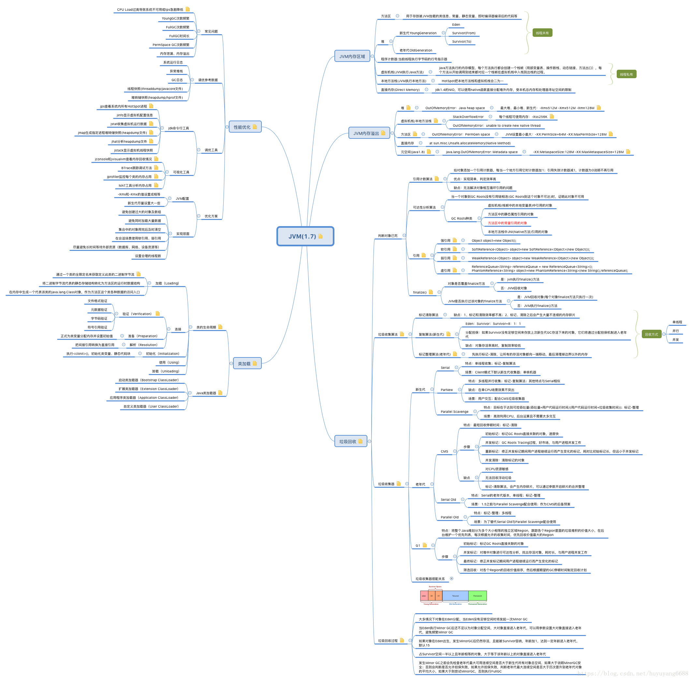

# 运行时数据区域

## 内存模型

### 1.7

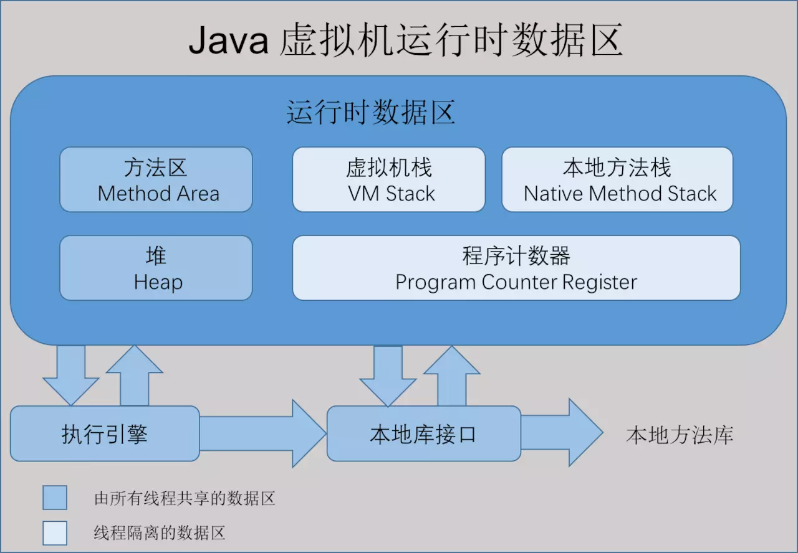

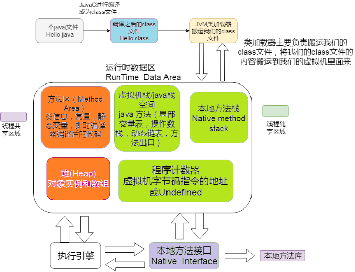

### 1.8

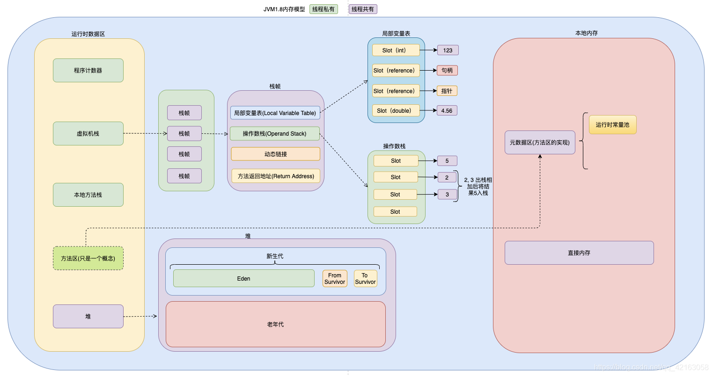

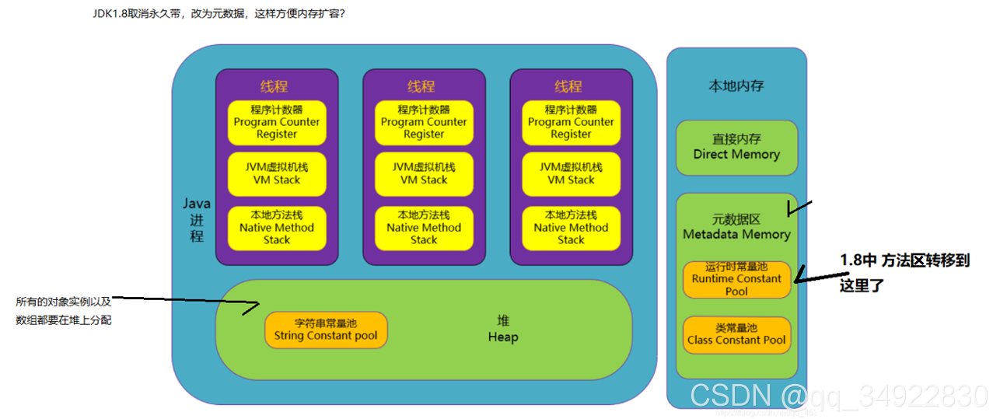

**JDK1.7及以后字符串常量池移至堆内存**

其他内容包括类元信息、字段、静态属性、方法、常量等移动至元空间Metaspace。比如下面代码中的 java/lang/Object 类元信息、静态属性 System.out、整形常量 100000 等。图中显示在常量池中的String，其实际对象是被保存在堆内存中的。

元空间并不在虚拟机中，**而是使用本地内存**。

```java
//可使用javap -verbose Testxxx.class查看
Constant pool:
#1 = Methodref		#6.#28		// java/lang/Object."<init>":()V
#2 = Fieldref		#29.#30		// java/lang/System.out:Ljava/op/PrintStream;
#3 = String			#31    		// hello Jdk11
#4 = Methodref   	#32.#33		//java/io/PrintStream.println:(Ljava/lang/String;)V
#5 = Integer		10000000
#5 = Class    		#34			// java/lang/Object
```


## 程序计数器

(Program Counter Register）也叫PC寄存器，每个线程会通过程序计数器记录当前要执行的的字节码指令的地址

## 虚拟机栈 Stack

虚拟机栈是Java方法执行的内存模型：每个方法在执行的同时都会创建一个栈帧用于存储局部变量表、操作数栈、动态链接、方法出口等信息。**每一个方法从调用直至执行完成的过程，就对应着一个栈帧在虚拟机栈中入栈到出栈的过程。**栈中存放着栈帧，每个栈帧分别对应一个被调用的方法。当程序中某个线程开始执行一个方法时就会相应的创建一个栈帧并且入栈（位于栈顶），在方法结束后，栈帧出栈。

### 栈帧 Stack Frame

用于支持虚拟机进行方法调用和方法执行的数据结构，它是虚拟机运行时数据区中的虚拟机栈的栈元素，每个栈帧中包括：

#### 局部变量表 Local Variable Table

用来存储方法中的局部变量（非静态变量、函数形参）。==当变量为基本数据类型时，直接存储值；当变量为引用类型时，存储的是指向具体对象的引用==

局部变量表存放了编译期可知的各种基本数据类型（ boolean 、byte 、char 、short 、int 、float 、long 、double ）、对象引用（ reference 类型，它不等同于对象本身，可能是一个指向对象起始地址的引用指针，也可能是指向一个代表对象的句柄或其他与此对象相关的位置）和returnAddress 类型（指向了一条字节码指令的地址） 。

其中64位长度的long和double类型的数据会占用2个局部变量空间（Slot），其余的数据类型只占用1个。局部变量表所需的内存空间在编译期间完成分配，当进入一个方法时，这个方法需要在帧中分配多大的局部变量空间是完全确定的，在方法运行期间不会改变局部变量表的大小。


#### 操作数栈 Operand Stack

Java虚拟机的解释执行引擎被称为"基于栈的执行引擎"，其中的栈就是指操作数栈。它是**栈帧中虚拟机在执行指令过程中用来存放临时数据的一块区域。**


#### 动态链接

指向运行时常量池的方法引用，存储程序执行时可能用到常量的引用

？符号引用转变为直接引用。（a()调用b()调用c()）为了支持Java的多态。?(官网文档)

> **方法重载（overload）实现的是编译时的多态性（也称为前绑定），而方法重写（override）实现的是运行时的多态性（也称为后绑定）。**

[比较类加载-解析中的定义](#解析 Resolution)


- **每一个栈帧内部都包含一个指向运行时常量池中该栈帧所属方法的引用**。包含这个引用的目的就是为了支持当前方法的代码能够实现动态链接(Dynamic Linking)。
- 在 Java 源文件被编译到字节码文件中时，所有的变量和方法引用都作为**符号引用**（Symbolic Reference）保存在 Class 文件的常量池中。比如：描述一个方法调用了另外的其他方法时，就是通过常量池中指向方法的符号引用来表示的，那么**动态链接的作用就是为了将这些符号引用转换为调用方法的直接引用**

> JVM 是如何执行方法调用的

方法调用不同于方法执行，方法调用阶段的唯一任务就是确定被调用方法的版本（即调用哪一个方法），暂时还不涉及方法内部的具体运行过程。Class 文件的编译过程中不包括传统编译器中的连接步骤，一切方法调用在 Class文件里面存储的都是**符号引用**，而不是方法在实际运行时内存布局中的入口地址（**直接引用**）。也就是需要在类加载阶段，甚至到运行期才能确定目标方法的直接引用。

【这一块内容，除了方法调用，还包括解析、分派（静态分派、动态分派、单分派与多分派），这里先不介绍，后续再挖】

在 JVM 中，将符号引用转换为调用方法的直接引用与方法的绑定机制有关

- **静态链接**：当一个字节码文件被装载进 JVM 内部时，如果被调用的**目标方法在编译期可知**，且运行期保持不变时。这种情况下将调用方法的符号引用转换为直接引用的过程称之为静态链接
- **动态链接**：**==如果被调用的方法在编译期无法被确定下来，也就是说，只能在程序运行期将调用方法的符号引用转换为直接引用，由于这种引用转换过程具备动态性，因此也就被称之为动态链接==**

对应的方法的绑定机制为：早期绑定（Early Binding）和晚期绑定（Late Binding）。**绑定是一个字段、方法或者类在符号引用被替换为直接引用的过程，这仅仅发生一次**。

- **早期绑定**：**早期绑定就是指被调用的目标方法如果在编译期可知，且运行期保持不变时**，即可将这个方法与所属的类型进行绑定，这样一来，由于明确了被调用的目标方法究竟是哪一个，因此也就可以使用静态链接的方式将符号引用转换为直接引用。
- **晚期绑定**：如果被调用的方法在编译器无法被确定下来，只能够在程序运行期根据实际的类型绑定相关的方法，这种绑定方式就被称为晚期绑定。


#### 方法返回地址 Return Address

存储方法执行完成后的返回地址

### 手动分配栈大小

StackOverflowError

如果我们不指定栈的大小，JVM 将创建一个具有默认大小的栈。大小取决于操作系统和计算机的体系结构。

虚拟机参数 -Xss xxx	(栈大小 字节1024倍数、K/KB、M/MB...)

配置堆栈大小。格式为： -XX:ThreadStackSize=1024

> HotSpot JVM对栈大小的最大值和最小值有要求：
> Windows（64位）下的JDK8测试最小值为180k，最大值为1024m。


## 本地方法栈


## Java堆 Heap

所有Java虚拟机线程之间共享。是为所有类实例和数组分配内存的运行时数据区域。

OutOfMemoryError

## 方法区 Method Area 

实现方式为：1.7 hotspot 永久代 Permanent Generation / 1.8+ MetaData 元数据区

方法区与Java 堆一样，是各个**线程共享**的内存区域，它用于**存储已被虚拟机加载的类信息、常量、静态变量、即时编译器编译后的代码等数据和[运行时常量池](#运行时常量池 Runtime Constant Pool)。**

OutOfMemoryError

## 运行时常量池 Runtime Constant Pool

​		**运行时常量池是方法区的一部分**。Class 文件中除了有类的版本、接口、字段、方法、属性等描述信息外，还有一项信息是**[常量池(详见类文件结构中)](#常量池)，用于存放编译期生成的各种字面量和符号引用，这部分内容将在类加载后进入方法区的运行时常量池中存放。**

​		Java 虚拟机对Class 文件每一部分（自然也包括常量池〉的格式都有严格规定，每一个字节用于存储哪种数据都必须符合规范上的要求才会被虚拟机认可、装载和执行，但对于运行时常量池， Java 虚拟机规范**没有做任何细节的要求**，不同的提供商实现的虚拟机可以按照自己的需要来实现这个内存区域。不过，一般来说，除了保存Class 文件中描述的符号引用外，**还会把==翻译出来的直接引用==也存储在运行时常量池中。**

​		运行时常量池相对于Class文件常量池的另一个重要特征是具备**动态性**，Java语言并不要求常量一定只有在编译期才能产生，也就是并非预置如Class文件中常量池的内容才能进入方法区运行时常量池，运行期间也可能将新的常量放入池中，利用得比较多的便是`String.intern()`方法。


## 直接内存


# ==对象==

## 对象的创建

​		在语言层面创建对象（例如克隆、反序列化）通常仅仅是一个new关键字而已，而在虚拟机中，对象（普通Java对象，不包括数组和Class对象等）的创建是一个怎么样的过程？

1. 虚拟机遇到一条new 指令时，首先将去检查这个指令的参数是否能**在常量池中定位到一个类的符号引用**，并且**检查**这个符号引用代表的类是否已被加载、解析和初始化过。如果没有，那必须先执行相应的**类加载过程**。

2. 在类加载检查通过后，接下来虚拟机将**为新生对象分配内存**。

   - 对象所需内存的大小在类加载完成后便可完全确定，为对象分配空间的任务等同于把一块确定大小的内存从Java 堆中划分出来。目前常用的有**两种分配方式**，选择哪种分配方式由Java堆是否规整决定，而Java堆是否规整又由所采用的的垃圾收集器是否带有压缩整理功能决定。
     - **指针碰撞（Bump the Pointer）**：Serial、ParNew等带Compact压缩整理过程的收集器
       假设Java堆中内存是绝对规整的，所有用过的内存都放在一边，空闲的内存放在另一边，中间放着一个指针作为分界点的指示器，那所分配内存就仅仅是把那个指针向空闲空间那边挪动一段与对象大小相等的距离。

     - **空闲列表（Free List）**：CMS基于Mark-Sweep标记清除算法的收集器
       如果Java 堆中的内存并不是规整的，已使用的内存和空闲的内存相互交错，那就没有办法简单地进行指针碰撞了，虚拟机就必须维护一个列表，记录上哪些内存块是可用的，在分配的时候从列表中找到一块足够大的空间划分给对象实例，井更新列表上的记录。

- 除如何划分可用空间之外，还有另外一个需要考虑的问题是对象创建在虚拟机中是非常频繁的行为，即使是仅仅修改一个指针所指向的位置，在**并发情况**下也并不是**线程安全**的，可能出现正在给对象A 分配内存，指针还没来得及修改，对象B 又同时使用了原来的指针来分配内存的情况。解决这个问题有两种方案： 
  - **对分配内存空间的动作进行同步处理**一一实际上虚拟机采用**CAS** 配上**失败重试**的方式**保证更新操作的原子性**；
  - **把内存分配的动作按照线程划分在不同的空间之中进行**，即**每个线程在Java 堆中预先分配一小块内存**，称为本地线程分配缓冲（ Thread Local Allocation Buffer, **TLAB** ）。哪个线程要分配内存，就在哪个线程的TLAB 上分配，只有TLAB 用完并分配新的TLAB 时，才需要同步锁定。虚拟机是否使用TLAB ，可以通过`-XX:+/-UseTLAB` 参数来设定。

3. 内存分配完成后，虚拟机需要将分配到的内存空间都**初始化为零值（ 不包括对象头）**，如果使用TLAB，这一工作过程也可以提前至TLAB 分配时进行。这一步操作保证了对象的实例字段在Java 代码中可以不赋初始值就直接使用，程序能访问到这些字段的数据类型所对应的零值。

4. 接下来虚拟机要**对对象进行必要的设置**，例如这个对象是哪个类的实例、如何才能找到类的元数据信息、对象的哈希码、对象的GC 分代年龄等信息。这些信息存放在对象的对象头（ Object Header ）之中。根据虚拟机当前的运行状态的不同，如是否启用偏向锁等，对象头会有不同的设置方式。

   > 在上面工作都完成之后，从虚拟机的视角来看，一个新的对象已经产生了，但从Java 程序的视角来看，对象创建才刚刚开始一一<init>方法还没有执行，所有的字段都还为零。所以， 一般来说（由字节码中是否跟随invokespecial 指令所决定）， 执行new 指令之后会接着执行<init>方法，把对象按照程序员的意愿进行初始化，这样一个真正可用的对象才算完全产生出来。

5. **调用对象的init()方法** ,根据传入的属性值给对象属性赋值。初始化实例变量。

6. 在线程**栈中新建对象引用**，并指向堆中刚刚新建的对象实例。

### 示例

```java
//  1.在堆中给对象分配内存并设置实例变量默认零值。	m=0		(≈类加载准备阶段)
//  2.调用对象<init>方法初始化实例变量。	m=8		(≈类加载初始化阶段)
//  3.把对象引用指向堆内对象实例。
class T {
    int m = 8;
}
T t = new T();
```

​		跑一下后idea->View->Show Bytecode with Jclasslib 查看字节码

```assembly
#字节码	0 4 8 对应创建3步
0 new #2 <T>
3 dup
4 invokespecial #3 <T.<init>>
7 astore_1
8 return
```

## 创建对象的几种方式

- 使用new关键字
- Class对象的newInstance()方法
- 构造函数对象的newInstance()方法
- 对象反序列化
- Object对象的clone()方法
- 使用Unsafe类创建对象

## 对象的内存布局

在HotSpot虚拟机中，对象在内存中的存储的布局可以分为3块区域：对象头（Header）、实例数据（Instance Data）和对齐填充（Padding）。

- **对象头（ Header ）**

  - **MarkWord**
  - **类型指针**
  - **数组长度（只有数组对象才有）**占4字节（32bit）

- **实例数据（ Instance Data ）**

  ​		**对象真正存储的有效信息，也是在程序代码中所定义的各种类型的字段内容。无论是从父类继承下来的，还是在子类中定义的，都需要记录起来。**这部分的存储顺序会受到虚拟机分配策略参数（FieldsAllocationStyle）和字段在Java 源码中定义顺序的影响。HotSpot 虚拟机默认的分配策略为longs/doubles 、ints 、shorts/chars 、bytes/booleans 、oops (Ordinary Object Pointers ），从分配策略中可以看出，相同宽度的字段总是被分配到一起。在满足这个前提条件的情况下，在父类中定义的变量会出现在子类之前。如果CompactFields 参数值为true （默认为true ），那么子类之中较窄的变量也可能会插入到父类变量的空隙之中。

- **对齐填充（ Padding ）**

  ​		并不是必然存在的，也没有特别的含义，仅仅起着占位符的作用。==**由于HotSpot VM 的自动内存管理系统要求对象起始地址必须是8 字节的整数倍，换句话说，就是对象的大小必须是8 字节的整数倍。**==而对象头部分正好是8 字节的倍数（ 1 倍或者2 倍），因此，当对象实例数据部分没有对齐时，就需要通过对齐填充来补全。


### 对象头 Header

#### Mark Word

​		用于存储对象自身的运行时数据，如哈希码（HashCode）、GC 分代年龄、锁状态标志、线程持有的锁、偏向线程ID 、偏向时间戳等，**这部分数据的长度在32 位和64 位的虚拟机（未开启压缩指针）中分别为32bit (4字节)和64bit(8字节)。**

​		对象需要存储的运行时数据很多，其实已经超出了32 位、64 位Bitmap 结构所能记录的限度，但是对象头信息是与对象自身定义的数据无关的额外存储成本，考虑到虚拟机的空间效率， Mark Word 被设计成一个非**固定的数据结构**以便在极小的空间内存储尽量多的信息，它会根据对象的状态、复用自己的存储空间。

> 32位JVM中Mark Word：


> 64位JVM中Mark Word：


#### 类型指针

​		指向类的指针，即对象指向它的类元数据的指针，虚拟机通过这个指针来确定这个对象是哪个类的实例。并不是所有的虚拟机实现都必须在对象数据上保留类型指针，换句话说，查找对象的元数据信息并不一定要经过对象本身。（[见对象的访问定位](#对象的访问定位)）

​		**类型指针在32位JVM中的长度是32bit(4字节)，在64位JVM中长度是64bit(8字节)。但jvm1.6后64位系统默认开启了指针压缩占32bit(4字节)。**

```bash
#类指针压缩
-XX:+UseCompressedClassPointers	 

#普通对象指针压缩 oops: ordinary object pointer
-XX:+UseCompressedOops	
```


- 32位系统最大寻址空间2^32^=4G，每个对象大小一定是8字节的倍数，那么可以encode把地址0、8、16改为0、1、2记录，即左移3位来完成，那么就可以多出8倍的寻址空间，使用指针压缩使jvm可支持4G×8=32G内存访问。**==所以堆内存超过32G，压缩失效==**

- 64位系统 现在最大48位寻址2^48^=256T内存	无良硬件厂商就造了48根地址总线？


##### 64位系统测试对象占用字节	**默认开启了指针压缩**

pom.xml添加jol依赖

```xml
<dependency>
  <groupId>org.openjdk.jol</groupId>
  <artifactId>jol-core</artifactId>
  <version>0.9</version>
</dependency>
```

- 空对象
  其中Mark Word 8字节，类指针压缩后4字节，对齐4字节。总16字节。

```java
public class Test {
    static class Dog {    
    }
    public static void main( String[] args ){
        Dog dog =new Dog();
        System.out.println(ClassLayout.parseInstance(dog).toPrintable());
    }
}
```

```java
 OFFSET  SIZE   TYPE DESCRIPTION                               VALUE
      0     4        (object header)                           01 00 00 00 (00000001 00000000 00000000 00000000) (1)
      4     4        (object header)                           00 00 00 00 (00000000 00000000 00000000 00000000) (0)
      8     4        (object header)                           43 c1 00 f8 (01000011 11000001 00000000 11111000) (-134168253)
     12     4        (loss due to the next object alignment)
Instance size: 16 bytes
```

- 有成员变量

  - 基本数据类型：byte、boolean 1字节；char、short 2字节；int、float 4字节；long、double 8字节。
- **引用**数据类型，**指针压缩下占用4个字节；关闭指针压缩下占用8个字节**。

其中Mark Word 8字节，类指针压缩后4字节，int4字节，char2字节，String4字节，对齐2字节。总24字节。

```java
public class Test {
    static class Dog {
        //依次放开查看数据内存具体占用
        //基本数据类型
        private int age;
        private char date;
        //String引用类型	引申：非基本数据类型即引用类型，指针压缩下占用4个字节
        private String name;
    }

    public static void main(String[] args) {
        Dog d = new Dog();
        System.out.println(ClassLayout.parseInstance(d).toPrintable());
    }
}
```

```java
 OFFSET  SIZE               TYPE DESCRIPTION                   VALUE
      0     4                    (object header)               01 00 00 00 (00000001 00000000 00000000 00000000) (1)
      4     4                    (object header)               00 00 00 00 (00000000 00000000 00000000 00000000) (0)
      8     4                    (object header)               43 c1 00 f8 (01000011 11000001 00000000 11111000) (-134168253)
     12     4                int Dog.age                       0
     16     2               char Dog.date                                 
     18     2                    (alignment/padding gap)                  
     20     4   java.lang.String Dog.name                      null
Instance size: 24 bytes
```

> **VM options关闭指针压缩**

​		非基本数据类型，关闭指针压缩下占用8个字节

```bash
-XX:-UseCompressedClassPointers -XX:-UseCompressedOops
```

其中Mark Word 8字节，类指针8字节，int4字节，char2字节，String8字节，对齐2字节。总32字节。

```java
OFFSET  SIZE               TYPE DESCRIPTION                     VALUE
      0     4                    (object header)                01 00 00 00 (00000001 00000000 00000000 00000000) (1)
      4     4                    (object header)                00 00 00 00 (00000000 00000000 00000000 00000000) (0)
      8     4                    (object header)                50 35 3c 17 (01010000 00110101 00111100 00010111) (389821776)
     12     4                    (object header)                dd 01 00 00 (11011101 00000001 00000000 00000000) (477)
     16     4                int Dog.age                        0
     20     2               char Dog.date                                   
     22     2                    (alignment/padding gap)                  
     24     8   java.lang.String Dog.name                       null
Instance size: 32 bytes
```

- 数组对象

```java
	public static void main(String[] args){
    	int[] a = new int[100];
        System.out.println(ClassLayout.parseInstance(a).toPrintable());
	}
```

```java
OFFSET   SIZE               TYPE DESCRIPTION                    VALUE
      0     4                    (object header)                01 00 00 00 (00000001 00000000 00000000 00000000) (1)
      4     4                    (object header)                00 00 00 00 (00000000 00000000 00000000 00000000) (0)
      8     4                    (object header)                6d 01 00 f8 (01101101 00000001 00000000 11111000) (-134217363)
     12     4                    (object header)                64 00 00 00 (01100100 00000000 00000000 00000000) (100)
     16	  400				 int [I.<elements>]					N/A
Instance size: 416 bytes
Space losses: 0 bytes internal + 0 bytes external = 0 bytes total    
```

- 默认指针压缩了
  - 数组长度占4个字节
  - 实例数据：100 × 4bytes = 400bytes

> **对象为数组类型实例数据占用情况**

- **基本数据类型**数组计算方式为 (数组个数x单个元素大小)，比如int数组，每个int是4字节，如果有5个元素，则数组占20字节。
- **引用类型**就不一样了
  - 开启指针压缩情况下为(数组长度x4字节)，每个引用4字节；
  - 关闭指针压缩情况下为(数组长度x8字节)，每个引用8字节。如数组长度为8，每个引用8字节，最终占64字节。

#### 数组长度（只有数组对象才有）

​		占4字节如上例子。

​		因为虚拟机可以通过普通Java对象的元数据信息确定Java对象的大小，但是从数组的元数据中却无法确定数组的大小。


## 对象的访问定位

​		**建立对象是为了使用对象，我们的Java 程序需要通过栈上的reference 数据来操作堆上的具体对象。**由于reference 类型在Java 虚拟机规范中只规定了一个指向对象的引用，并没有定义这个引用应该通过何种方式去定位、访问堆中的对象的具体位置，所以对象访问方式也是取决于虚拟机实现而定的。目前主流的访问方式有使用句柄和直接指针两种。

- 句柄访问

  ​		如果使用句柄访问的话，那么Java堆中将会划分出一块内存来作为**句柄池**，reference中存储的就是**对象的句柄地址**，而句柄中包含了对象实例数据与类型数据各自的具体地址信息。

  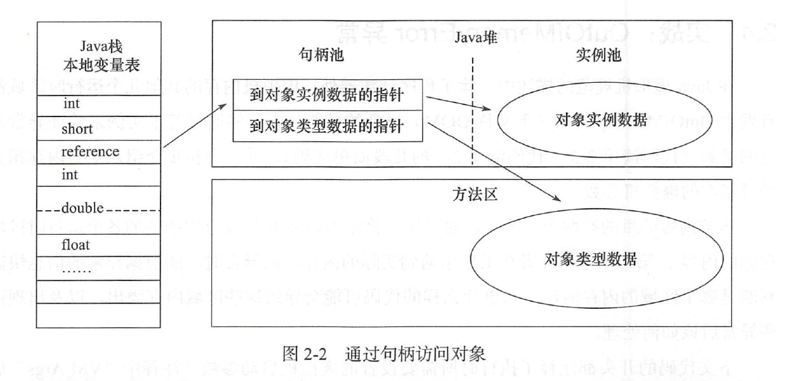

- 直接指针

  ​		如果使用直接指针访问，那么Java堆对象的布局中就必须考虑如何防止访问类型数据的相关信息，而reference中存储的直接就是对象地址。

  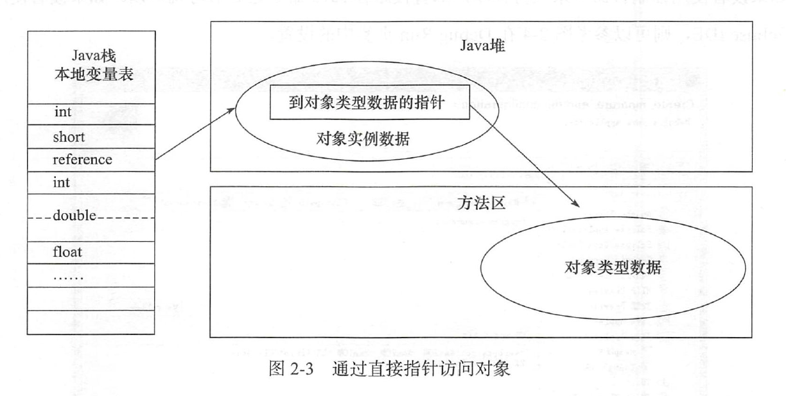

> 这两种对象访问方式**各有优势**

- 使用句柄来访问的最大好处就是**reference** 中**存储**的是**稳定的句柄地址**，在对象被移动（垃圾收集时移动对象是非常普遍的行为）时只会改变句柄中的实例数据指针，而reference 本身不需要修改。

- 使用直接指针访问方式的最大好处就是**速度更快**，它节省了一次指针定位的时间开销，由于对象的访问在Java 中非常频繁，因此这类开销积少成多后也是一项非常可观的执行成本。

​		就本书讨论的主要**虚拟机Sun Hotspot** 而言，它是使用**第二种方式**进行对象访问的，但从整个软件开发的范围来看，各种语言和框架使用句柄来访问的情况也十分常见。


# 类文件结构

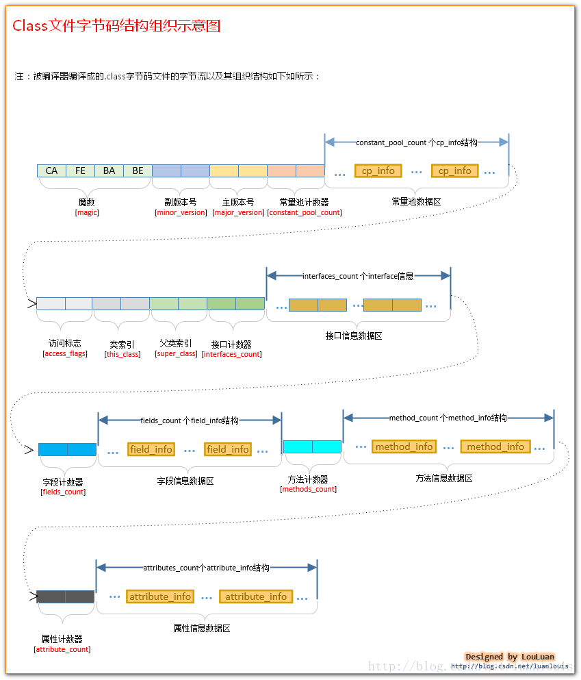

## 魔数与Class文件的版本

## 常量池

​		常量池可以理解为Class文件之中的资源仓库，它是Class文件系统中与其他项目关联最多的数据类型，也是占用Class文件空间最大的数据项目之一，同时它还是在Class文件中第一个出现的表类型数据项目。

​		常量池中的常量数量不固定，所有在常量池的入口处会放一个u2类型的数据表示常量池容量计数器（constant_pool_count）（u2类型是16位长度，所有常量池的长度不能超过2的16次方），编号从1开始（0保留为了后续表达不引用任何一个常量池中项目），可以通过`javap -verbose Test.class`看到。

​		常量池中主要存放两大类常量：（**具体见下表格**）

- **字面量（Literal）**

  字面量很好理解就是我们java语言层面的常量概念，如文本字符串、声明为final的常量值等。

- **符号引用（Symbolic References）**

  属于编译原理方面的概念。**以一组符号来描述所引用的目标，符号可以是任何形式的字面量，只要使用时能够无歧义的定位到目标即可**。如java/lang/StringBuilder

  - 类和接口的全限定名（Fully Qualified Name）
  - 字段的名称和描述符（Descriptor）
  - 方法的名称和描述符

> 引申对比：**==直接引用（ Direct References ）==** （与虚拟机的内存布局相关，**必然已加载如内存中了**）内存地址
>
> - **直接指向目标的指针**	如指向类型【Class对象】、类变量、类方法的直接引用可能是指向方法区的指针
> - **相对偏移量**	如指向实例变量、实例方法的直接引用都是偏移量
> - **一个能间接定位到目标的句柄**

​		在Class文件中不会保存各个方法和字段的最终内存布局信息，而是在将类加载到JVM后进行动态链接的，需要将字段、方法的符号引用经过运行期转换才能正常使用，即在类创建时或运行时**解析**、翻译到具体的内存地址之中。

​		常量池中每一项常量都是一个表，JDK1.7之前中有11种表结构，JDK1.7新增3种（CONSTANT_MethodHandle_info、COSNTANT_MethodType_info、CONSTANT_InvokeDynamic_info）。

​		这14种表共同特点是表开始的第一位是一个u1类型的标志位（tag），代表当前这个常量属于哪种常量类型，具体如下表：

| 类型                             | 标志 tag | 描述                     |
| :------------------------------- | :------: | :----------------------- |
| CONSTANT_Utf8_info               |    1     | UTF-8 编码的字符串       |
| CONSTANT_Integer_info            |    3     | 整形字面量               |
| CONSTANT_Float_info              |    4     | 浮点型字面量             |
| CONSTANT_Long_info               |    5     | 长整型字面量             |
| CONSTANT_Double_info             |    6     | 双精度浮点型字面盘       |
| CONSTANT_Class_info              |    7     | 类或接口的符号引用       |
| CONSTANT_String_info             |    8     | 字符串类型字面量         |
| CONSTANT_Fieldref_info           |    9     | 字段的符号引用           |
| CONSTANT_Methodref_info          |    10    | 类中方法的符号引用       |
| CONSTANT_InterfaceMethodref_info |    11    | 接口中方法的符号引用     |
| CONSTANT_NameAndType_info        |    12    | 字段或方法的部分符号引用 |
| CONSTANT_MethodHandle_info       |    15    | 表示方法句柄             |
| CONSTANT_MethodType_info         |    16    | 标识方法类型             |
| CONSTANT_InvokeDynamic_info      |    18    | 表示一个动态方法调用点   |

​		常量池的数据最繁琐，就是因为不同的常量类型都有自己的数据结构，下面介绍几种常用的数据结构：

CONSTANT_Class_info:

| 类型 |    名称    | 数量 |
| :--: | :--------: | :--: |
|  u1  |    tag     |  1   |
|  u2  | name_index |  1   |

​		tag表示标记，用于区分常量类型；name_index是一个索引值执行CONSTANT_Utf8_info类型常量，此常量代表此类或接口的全限定名。

CONSTANT_Utf8_info:

| 类型 |  名称  |  数量  |
| :--: | :----: | :----: |
|  u1  |  tag   |   1    |
|  u2  | length |   1    |
|  u1  | bytes  | length |

​		u2的长度是16位，这里也就说明字符串的长度不能超过2的16次方，length说明了字符串占用多少字节，bytes是字符串的值，使用的是utf8缩略方式进行编码。


## 访问标志

## 类索引、父类索引与接口索引集合

## 字段表集合

## 方法表集合

## 属性表集合


# 类加载机制

​		虚拟机把描述类的数据从Class 文件加载到内存，并对数据进行校验、转换解析和初始化，最终形成可以被虚拟机直接使用的Java 类型，这就是虚拟机的类加载机制。

## 过程/生命周期

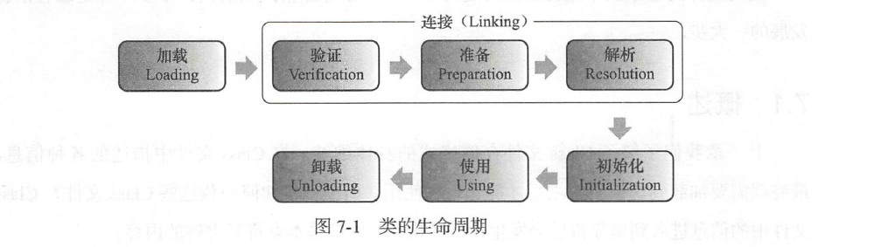


​		类从被加载到虚拟机内存中开始，到卸载出内存为止，它的整个生命周期包括：加载（ Loading ）、验证（ Verification ）、准备（ Preparation ）、解析（ Resolution ）、初始化（Initialization ）、使用（ Using ）和卸载（ Unloading）7个阶段。其中验证、准备、解析3个部分统称为连接（ Linking ）。

​		加载、验证、准备、初始化和卸载这5 个阶段的顺序是确定的，类的加载过程必须按照这种顺序按部就班地开始，而解析阶段则不一定：它在某些情况下可以在初始化阶段之后再开始，这是为了**支持Java 语言的运行时绑定（也称为动态绑定或晚期绑定）** 。注意，这里笔者写的是按部就班地“开始”，而不是按部就班地“进行”或“完成”，强调这点是因为这些阶段通常都是互相交叉地混合式进行的，通常会在一个阶段执行的过程中调用、激活另外一个阶段。

​		什么情况下需要开始类加载过程的第一个阶段：加载？ Java 虚拟机规范中并没有进行强制约束，这点可以交给虚拟机的具体实现来自由把握。但是对于==**初始化阶段，虚拟机规范则是严格规定了有且只有5 种情况必须立即对类进行“初始化”**==（而加载、验证、准备自然需要在此之前开始） ：

1. 遇到new、getstatic、putstatic或者invokestatic这4条字节码指令时，如果类没有进行过初始化，则需要先触发其初始化。对应的java代码场景为：使用new关键字实例化对象时、读取或设置一个静态字段时(被final修饰、已在编译期把结果放入常量池的静态字段除外)、调用一个类的静态方法时。
2. 使用java.lang.reflect包的方法对类进行反射调用的时候，如果类没进行初始化，则需要先触发其初始化。
3. 当初始化一个类时，如果发现其父类还未进行过初始化，则需要先触发其父类的初始化。
4. 当虚拟机启动时，用户需要指定一个要执行的主类(包含main()方法的那个类)，虚拟机会先初始化这个主类。
5. 当使用JDK 1.7的动态语言支持时，如果一个java.lang.invoke.MethodHandle实例最后的解析结果是REF_getStatic、REF_putStatic、REF_invokeStatic的方法句柄，并且这个方法句柄所对应的类没有进行过初始化，则需要先触发其初始化。

​		对于这5 种会触发类进行初始化的场景，虚拟机规范中使用了一个很强烈的限定语：“有且只有”，这5 种场景中的行为称为对一个类进行**主动引用**。除此之外，所有引用类的方式都不会触发初始化，称为**被动引用**。

​		接口与类真正有所区别的是前面讲述的5 种“有且仅有”需要开始初始化场景中的第3 种：当一个类在初始化时，要求其父类全部都已经初始化过了，但是**一个接口在初始化时**，并不要求其父接口全部都完成了初始化，**只有在真正使用到父接口的时候（如引用接口中定义的常量〉才会初始化**。


### 加载 Loading 

- 通过一个类的全限定名来获取定义此类的二进制字节流。
- 将这个字节流所代表的静态存储结构转化为方法区的运行时数据结构。
- 在内存中生成一个代表这个类的java.lang.Class 对象，作为方法区这个类的各种数据的访问入口。

​		虚拟机规范中并没有准确说明二进制字节流应该从哪里获取以及怎样获取,这里既可以使用系统提供的引导类加载器来完成，也可以通过定义自己的类加载器去控制字节流的获取方式。

### 验证 Verification

- 文件格式验证
- 元数据验证
- 字节码验证
- 符号引用验证

### 准备 Preparation

​		==**正式为类变量分配内存并设置其初始值**==，内存都将在==**方法区**==中进行分配。**类变量==初始值设为零值==，常量直接赋值。**

​		这时候进行内存分配的仅包括**类变量（被static 修饰的变量〉**，而**不包括实例变量**，实例变量将会在对象实例化时随着对象一起分配在Java 堆中。其次，这里所说的**初始值“通常情况”下是数据类型的零值**，假设一个类变量的定义为：`public static int value = 123;`那变量value 在准备阶段过后的**初始值为0** 而不是123 ，因为这时候尚未开始执行任何Java方法，而把value 赋值为123 的putstatic 指令是程序被编译后，存放于类构造器＜clinit>()方法之中，所以把value 赋值为123 的动作将在初始化阶段才会执行。下表列出了Java 中所有基本数据类型的零值。

| 数据类型  |   零值   |
| :-------: | :------: |
|    int    |    0     |
|   long    |    0L    |
|   short   | (short)0 |
|   char    | '\u0000' |
|   byte    | (byte)0  |
|  boolean  |  false   |
|   float   |   0.0f   |
|  double   |   0.0d   |
| reference |   null   |

​		**特殊情况**：如果类字段的字段属性表中存在ConstantValue属性，那在准备阶段变量value就会被初始化为ConstantValue属性所指定的值，如`public statci final int value = 123;`编译时Javac将会为value生成ConstantValue属性，**在准备阶段虚拟机就会根据ConstantValue的设置将value赋值为123。**


### 解析 Resolution

​		==**虚拟机将常量池内的符号引用替换为直接引用的过程**。==具体见 [类文件结构->常量池](#常量池)。

​		虚拟机规范之中并未规定解析阶段发生的具体时间，只要求了在执行anewarray、checkcast 、getfield 、getstatic 、instanceof、invokedynamic 、invokeinterface 、invokespecial 、invokestatic、invokevirtual、ldc、ldc_w、multianewarray、new、putfield和putstatic这16个用于操作符号引用的字节码指令之前，先对它们所使用的的符号引用进行解析。

​		解析动作主要针对类或接口、字段、类方法、接口方法、方法类型、方法句柄和调用点限定符等7类符号引用进行，分别对应与常量池的CONSTANT_Class_info、CONSTANT_Fieldref_info、CONSTANT_Methodref_info、CONSTANT_InterfaceMethodref_info、CONSTANT_MethodType_info、CONSTANT_MethodHandle_info 和CONSTANT_InvokeDynamic _info 7 种常量类型。


### 初始化 Initialization

​		到了初始化阶段，才真正开始执行类中定义的Java程序代码（或者说是字节码）。==**初始化阶段是执行类构造器`<clinit>()`方法的过程，初始化类变量、静态代码块等资源。**==

- <clinit>()方法是由编译期自动收集类中的所有类变量的赋值动作和静态语句块（static{}块）中的语句合并产生的，编译期收集的顺序是由语句在源文件中出现的顺序所决定的，静态语句块中只能访问到定义在其之前的变量，定义在它之后的变量，在前面的静态语句块可以赋值，但是不能访问。

  ```java
  	//定义在静态语句块之后的变量可以赋值，但不能访问
  	public class Test{
          static {
              i = 0;					//给变量赋值可以正常编译通过
              System.out.print(i);	//这句编译期会提示“非法向前引用”
          }
          static int i = 1;
      }	
  ```

- <clinit>()方法与类的构造函数（或者说实例构造器<init>()方法）不同，它不需要显式地调用父类构造器，虚拟机会保证在子类的<clinit>()方法执行之前，父类的<clinit>()方法已经执行完毕。因此在虚拟机中第一个被执行的<clinit>()方法的类肯定是java.lang.Object。

- 由于父类的<clinit>()方法先执行，也就意味着父类中定义的静态语句块要优先于子类的变量赋值操作。

  ```java
      static class Parent {
      	public static int A = l;
      	static {
      		A = 2;
          }
      }
      static class Sub extends Parent {
      	public static int B = A;
      }
      public static void main(String[] args) {
      	System.out.println(Sub.B);		//字段B的值将输出2而不是1
      }
  ```

- <clinit>()方法对于类或接口来说并不是必需的，如果一个类中没有静态语句块，也没有对变量的赋值操作，那么编译期可以不为这个类生成<clinit>()方法。

- 接口中不能使用静态语句块，但仍然有变量初始化赋值操作，因此接口与类一样都会生成<clinit>()方法。但接口与类不同的是，执行接口<clinit>()方法不需要先执行父接口的<clinit>()方法。只有当父接口中定义的变量使用时，父接口才会初始化。另外，接口的实现类在初始化时也一样不会执行接口的<clinit>()方法。

- 虚拟机会保证一个类的<clinit>()方法在多线程环境中被正确地加锁、同步，如果多个线程同时去初始化一个类，那么只会有一个线程去执行这个类的<clinit>()方法，其他线程都需要阻塞等待，直到活动线程执行<clinit>()方法完毕。如果在一个类的<clinit>()方法中有耗时很长的操作，就可能造成多个进程阻塞（需要注意的是，其他线程虽然会被阻塞，但如果执行<clinit>()方法的那条线程退出<clinit>()方法后，其他线程唤醒之后不会再次进入<clinit>()方法。同一个类加载器下，一个类型只会初始化一次。），在实际应用中这种阻塞往往是很隐蔽的。

  ```java
  	static class DeadLoopClass {
  		static {
  /*如果不加上这个if语句，编译器将提示”Initializer does not complete normally”并拒绝编译*/
              if(true){
                  System.out.println(Thread.currentThread() + ”init DeadLoopClass”);
  				while (true) {
                  }
              }
          }
      }
  
  	public static void main (String[] args) {
          Runnable script = new Runnable() {
              public void run(){
                  System.out.println(Thread.currentThread() + "start");
                  DeadLoopClass dlc = new DeadLoopClass();
                  System.out.println(Thread.currentThread() + "run over");
              }
          };
          Thread t1 = new Thread(script);
          Thread t2 = new Thread(script);
          t1.start;
          t2.start;
      }
  
  //运行结果如下，即即一条线程在死循环以模拟长时间操作，另外一条线程在阻塞等待。
  Thread[Thread-0,5,main)start
  Thread[Thread-1,5,main)start
  Thread[Thread-0,5,main)init DeadLoopClass
  ```

  

#### 初始化触发条件

​		初始化阶段，虚拟机规范则是严格规定了有且只有5 种情况必须立即对类进行“初始化”（而加载、验证、准备自然需要在此之前开始） ：

1. 遇到new、getstatic、putstatic或者invokestatic这4条字节码指令时，如果类没有进行过初始化，则需要先触发其初始化。对应的java代码场景为：**使用new关键字实例化对象时、读取或设置一个静态字段时(被final修饰、已在编译期把结果放入常量池的静态字段除外)、调用一个类的静态方法时。**
2. 使用java.lang.reflect包的方法**对类进行反射调用的时候**，如果类没进行初始化，则需要先触发其初始化。
3. 当初始化一个类时，如果发现**其父类还未进行过初始化，则需要先触发其父类的初始化。**
4. 当虚拟机启动时，用户需要**指定一个要执行的主类(包含main()方法的那个类)**，虚拟机会先初始化这个主类。
5. 当使用JDK 1.7的动态语言支持时，如果一个java.lang.invoke.MethodHandle实例最后的解析结果是REF_getStatic、REF_putStatic、REF_invokeStatic的方法句柄，并且这个方法句柄所对应的类没有进行过初始化，则需要先触发其初始化。

​		对于这5种会触发类进行初始化的场景，虚拟机规范中使用了一个很强烈的限定语：“有且只有”，这5种场景中的行为称为对一个类进行**主动引用**。除此之外，所有引用类的方式都不会触发初始化，称为**被动引用**。


## 类加载器

- **启动类加载器 Bootstrap ClassLoader**

  ​		这个类加载器使用C++语言实现（只限于HotSpot）是虚拟机自身的一部分，它负责将存放在＜ JAVA_HOME>\lib 目录中的，或者被-Xbootclasspath 参数所指定的路径中的，并且是虚拟机识别的（ 仅按照文件名识别，如rt.jar ，名字不符合的类库即使放在lib 目录中也不会被加载〉类库加载到虚拟机内存中。启动类加载器无法被Java程序直接引用，用户在编写自定义类加载器时，如果需要把加载请求委派给引导类加载器，那直接使用null 代替即可。

- **扩展类加载器 Extension ClassLoader**

  ​		这个加载器由sun.misc . Launcher$ExtClassLoader实现，它负责加载<JAVA_HOME>\lib\ext 目录中的，或者被java.ext.dirs 系统变量所指定的路径中的所有类库，开发者可以直接使用扩展类加载器。

- **应用程序加载器 Application ClassLoader**

  ​		这个类加载器由sun . misc.Launcher$AppClassLoader实现。由于这个类加载器是ClassLoader 中的getSystemClassLoader()方法的返回值，所以一般也称它为系统类加载器。它负责加载用户类路径（ ClassPath ）上所指定的类库，开发者可以直接使用这个类加载器，如果应用程序中没有自定义过自己的类加载器，一般情况下这个就是程序中默认的类加载器。

- **自定义类加载器 User ClassLoader**

​		

类加载器之间具有层级关系，称为类加载器的**双亲委派模型**（Parents Delegation Model）**。它要求除了顶层的启动类加载器外，其余的类加载器都应当有自己的父类加载器**。这里类加载器之间的父子关系一般不会以继承（ Inheritance ）的关系来实现，而是都使用组合（ Composition ）关系来复用父加载器的代码。

​		**双亲委派模型的工作过程**是：如果一个类加载器收到了类加载的请求，它首先不会自己去尝试加载这个类，而是把这个请求委派给父类加载器去完成，每一个层次的类加载器都是如此，因此所有的加载请求最终都应该传送到顶层的启动类加载器中，只有当父加载器反馈自己无法完成这个加载请求（它的搜索范围中没有找到所需的类〉时，子加载器才会尝试自己去加载。

​		使用双亲委派模型来组织类加载器之间的关系，有一个显而易见的好处就是Java 类随着它的类加载器一起具备了一种带有优先级的层次关系。

​		双亲委派模型对于保证Java 程序的稳定运作很重要，但它的实现却非常简单，实现双亲委派的代码都集中在java.lang. ClassLoader 的loadClass())方法之中，如代码清单7-10 所示，逻辑清晰易懂：先检查是否已经被加载过，若没有加载则调用父加载器的loadClass()方法，若父加载器为空则默认使用启动类加载器作为父加载器。如果父类加载失败，抛出ClassNotFoundException 异常后，再调用自己的findClass()方法进行加载。

```java
	protected synchronized Class<?> loadClass (String name , boolean resolve) throws ClassNotFoundException
    {
	//首先， 检查请求的类是否已经被加载过了
	Class c = findLoadedClass(name);
	if (c == null) {
		try {
		if (parent != null ) {
            //递归找到顶层Bootstrap
			c =parent.loadClass(name, false);
		} else {
			c = findBootstrapClassOrNull(name);
		} catch (ClassNotFoundException e) {
		//如果父类加载器抛出ClassNotFoundException
		//说明父类加载器无法完成加载请求
        }
		if (c == null) {
            //在父类加载器无法加载的时候
            //再调用本身的findClass 方法来进行关加载
            c = findClass(name);
        }
     }
     if (resolve) {
     	resolveClass(c);
     }
	 return c;
}
```

## 类加载的三种方式

1. 由 new 关键字创建一个类的实例。静态加载
2. 调用 Class.forName() 方法，通过反射加载类。动态加载，将类的.class文件加载到jvm中之外，还会对类进行解释，执行类中的static块；
3. 调用某个ClassLoader实例的loadClass()方法。动态加载，将.class文件加载到jvm中，不会执行static中的内容，只有在newInstance才会去执行static块。

三者的区别汇总如下：

（1）方法1和2都是使用的当前类加载器（即：this.getClass.getClassLoader）。方法3是由用户指定的类加载器加载。如果需要在当前类路径以外寻找类，则只能采用第3种方式。第3种方式加载的类与当前类分属不同的命名空间。

（2）方法1是静态加载，2、3是动态加载。

（3）对于两种动态加载，如果程序需要类被初始化，就必须使用Class.forName(name)的方式。

```java
Class.forName(className);
//实际上是调用的是：
//第二个参数默认为true即默认类需要初始化，初始化会触发目标对象静态块的执行和静态变量的初始化；若为false则初始化时不执行静态块和静态变量。
Class.forName(className, true, this.getClass().getClassLoader());

ClassLoader.loadClass(className);
//实际上调用的是:
//第二个参数为fasle即默认得到的class还没有进行连接，意味着不进行初始化等系列操作，即静态代码块不会执行，只有在newInstance才会去执行静态代码块。
ClassLoader.loadClass(name, false);
```

# GC

GC 分代年龄15从Young进去Old：对象头里用4bit存储分代年龄最大为2^4^-1=15

## 判断对象已死

### 引用计数算法

​	简单效率高，但无法解决对象循环引用的问题

### 可达性分析算法

​	**==GC Roots==**	当一个对象到GC Roots没有引用链相连（不可达）时，证明此对象不可用

- 虚拟机栈（栈帧中的本地变量表）中引用的对象
- 方法区中静态属性和常量引用的对象
- 本地方法栈中JNI(Native方法)引用的对象

### 四种引用类型

- **强引用(FinalReference)**	new

- **软引用(SoftReference)**	堆空间不足，gc		用作缓存

- **弱引用(WeakReference)**	gc发现就回收	threadlocal

- **虚引用(PhantomReference)**	跟踪gc过程，收到系统通知


## 垃圾收集算法

1. **标记清除算法 Mark-Sweep**

2. **复制算法（新生代） Copying**

   **==Eden:Survivor:Survivor = 8:1:1==**

3. **标记整理算法（老年代） Mark-Compact**

4. **分代收集算法 Generational Collection**


## 垃圾回收器

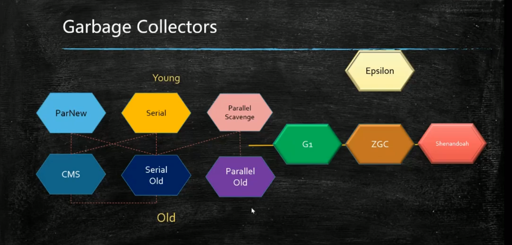

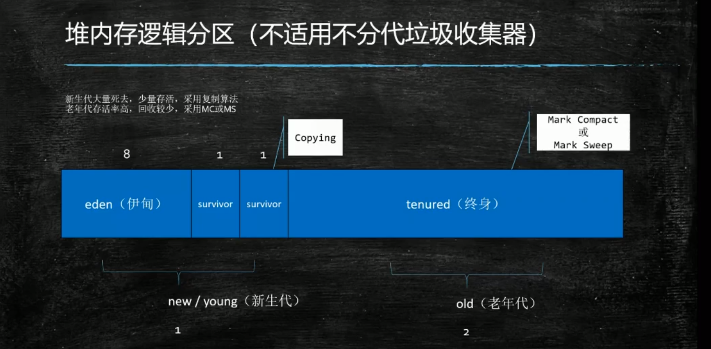

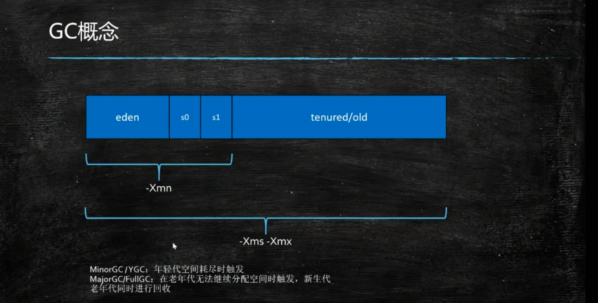

### 对象如何分配？（shopee）（美团）

1. **栈上分配：需要满足标量替换**以及**无逃逸**（在一个方法中使用）。比在堆中分配时间快一倍。且无需GC回收。方法执行结束自动出栈。
2. **堆中分配：**无法进行栈上分配：判断对象个头，大对象直接入老年代。否则在伊甸区分配。伊甸区分配前先判断是否符合线程本地分配（由于线程争先恐后的在内存中分配，会加锁，效率不高，所以JVM做了一级优化，直接将对象分配到线程的私有空间中，这一操作不需要锁）

TLAB:Thread Local Allocation Buffer

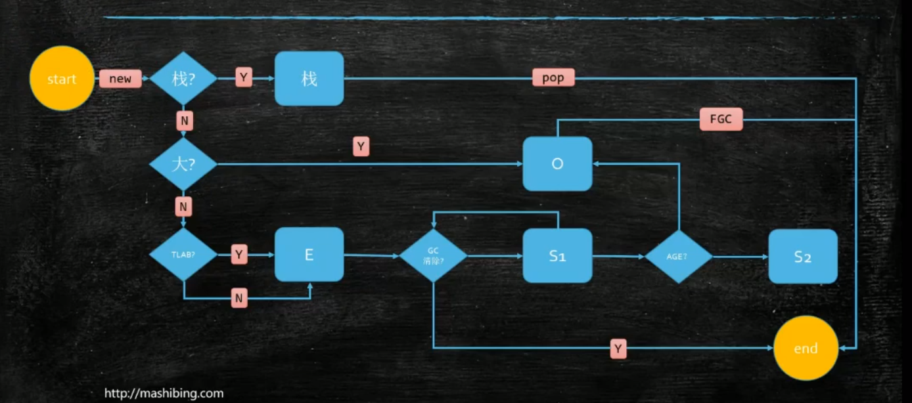


### CMS

- 初始标记。只是标记一下GC Roots能直接关联到的老年代对象，速度很快。这一阶段会STW
- 并发标记。就是进行GC Roots的Tracing，处理器可以与用户线程一起工作。
- 重新标记。为了修正并发标记期间因用户程序继续运作而导致标记产生变动的那一部分对象的标记记录，这个阶段也会触发STW，停顿时间会比初始标记阶段稍长，远比并发时间短。
- 并发清除，处理器可以与用户线程一起工作。


三色标记:黑灰白

CMS方案: Incrumental Update隐蔽问题

​	并发标记，产生漏标

所以，CMS的Remark阶段必须从头扫描一遍。

# JVM调优

- 预分配
- 卡顿
- OOM

```bash
#显示所有可调参数
java -XX:+PrintFlagsFinal | more
java -XX:+PrintFlagsFinal | wc -l

#显示默认jvm参数
java -XX:+PrintCommandLineFlags -version
```

## **==OutOfMemoryError排查与解决==**

### **出现问题：**

- java.lang.OutOfMemoryError: heap space
- java.lang.OutOfMemoryError: metaspace
- java.lang.OutOfMemoryError: Perm Gen
- ...

### **碰到OOM之后想办法拿到Heap Dump分析：**

- ==**-XX:+HeapDumpOnOutOfMemoryError				（启动添加）**==

-XX:HeapDumpPath=/usr/local/logs/java/

- **jmap -dump:live,format=b,file=<filepath> <pid>		（线程运行中添加）**

先使用**jps**查看jvm运行中的线程pid如94532，然后添加：

jmap -dump:live,format=b,file=/94532.hprof 94532

### **OOM的可能原因：**

- **50%是代码问题**
- **40%是配置问题**
- **10%是内存真的不够**
- **这意味着，绝大多数OOM不能通过加内存解决**

### **Heap Dump 分析**

- **Metaspace/PermGen**
  - **瞄准Class对象**
- **Heap space**
  - **瞄准占用空间最大的对象**
- **Path to GCRoots**
- **顺藤摸瓜去看代码**

### **工具**

- **MAT	MemoryAnalyzerTool**
- **VisualVM**
- **JProfiler**
- ==**arthas**==


```bash
jps
jstack
jmap -histo 进程号 | head -20	#生产环境不一定能用
top -Hp

#arthas
thread
```


## GC常用参数

| -Xmn -Xms -Xmx -Xss                                          | 年轻代 堆最小值 堆最大值 栈空间    |
| ------------------------------------------------------------ | ---------------------------------- |
| -XX:+UseTLAB                                                 | 使用TLAB，默认打开                 |
| -XX:+PrintTLAB                                               | 打印TLAB的使用情况                 |
| -XX:+TLABSize                                                | 设置TLAB大小                       |
| -XX:+DisableExplictGC                                        | 禁用显式System.gc()，FGC           |
| -XX:+PrintGC                                                 |                                    |
| -XX:+PrintGCDetails                                          |                                    |
| -XX:+PrintHeapAtGC                                           |                                    |
| -XX:+PrintGCTimeStamps                                       |                                    |
| -XX:+PrintGCApplicationConcurrentTime(低)                    | 打印应用程序时间                   |
| -XX:+PrintGcApplicationStoppedTime(低)                       | 打印暂停时间                       |
| -XX:+PrintReferenceGC(重要性低)                              | 记录回收了多少种不同引用类型的引用 |
| -verbose:class                                               | 类加载详细过程                     |
| -XX:+PrintVMOptions                                          |                                    |
| `-XX:+PrintFlagsFinal` <br />`-XX:+PrintFlagsInitial`        | 必须会用                           |
| -Xloggc:opt/log/gc.log                                       |                                    |
| -XX:+MaxTenuringThreshold                                    | 升代年龄，最大值15                 |
| 锁自旋次数 -XX:PreBlockSpin <br>热点代码检测参数 -XX:CompileThreshold <br> 逃逸分析 标量替换... | 不建议设置                         |

>  生产环境中**设置-Xms和-Xmx相同大小**，以让JVM在启动时就直接向OS申请xmx的commited内存，好处：

- 避免JVM在运行过程中向OS申请内存
- 延后启动后首次GC的发生时机
- 减少启动初期的GC次数
- 尽可能避免使用swap space


## Parallel常用参数

| -XX:SurvivorRatio          |                                                          |
| -------------------------- | -------------------------------------------------------- |
| -XX:PreTenureSizeThreshold | 大对象到底多大                                           |
| -XX:MaxTenuringThreshold   |                                                          |
| -XX:+ParallelGCThreads     | 并行收集器的线程数，同样适用于CMS，一般设为和CPU核数相同 |
| -XX:+UseAdaptiveSizePolicy | 自动选择各区大小比例                                     |


## CMS常用参数

| -XX:+UseConcMarkSweepGC                |                                                              |
| -------------------------------------- | ------------------------------------------------------------ |
| -XX:ParallelCMSThreads                 | CMS线程数量                                                  |
| -XX:CMSInitiatingOccupancyFraction     | 使用多少比例的老年代后开始CMS收集，默认是68%(近似值)，如果频繁发生SerialOld卡顿，应该调小，（频繁CMS回收） |
| -XX:+UseCMSCompactAtFullCollection     | 在FGC时进行压缩                                              |
| -XX:CMSFullGCsBeforeCompaction         | 多少次FGC之后进行压缩                                        |
| -XX:+CMSClassUnloadingEnabled          |                                                              |
| -XX:CMSInitiatingPermOccupancyFraction | 达到什么比例时进行Perm回收                                   |
| GCTimeRatio                            | 设置GC时间占用程序运行时间的百分比                           |
| -XX:MaxGCPauseMillis                   | 停顿时间，是一个建议时间，GC会尝试用各种手段达到这个时间，比如减小年轻代 |


## G1常用参数

| -XX:+UseG1GC                   |                                                              |
| ------------------------------ | ------------------------------------------------------------ |
| -XX:MaxGCPauseMillis           | 建议值，G1会尝试调整Young区的块数来达到这个值                |
| -XX:GCPauseIntervalMillis      | ？GC的间隔时间                                               |
| -XX:+G1HeapRegionSize          | 分区大小，建议逐渐增大该值，1 2 4 8 16 32。  随着size增加，垃圾的存活时间更长，GC间隔更长，但每次GC的时间也会更长  ZGC做了改进（动态区块大小） |
| G1NewSizePercent               | 新生代最小比例，默认为5%                                     |
| G1MaxNewSizePercent            | 新生代最大比例，默认为60%                                    |
| GCTimeRatio                    | GC时间建议比例，G1会根据这个值调整堆空间                     |
| ConcGCThreads                  | 线程数量                                                     |
| InitiatingHeapOccupancyPercent | 启动G1的堆空间占用比例                                       |


# Java常量池详解

- Class常量池
- 运行时常量池
- 基本类型包装常量池
- 字符串常量池

## Class常量池 Class Constant Pool

​		详见 [类文件结构 - 常量池](#常量池) 。

​		在Java中，Java类被编译后就会形成一份class文件；class文件中除了包含类的版本、字段、方法、接口等描述信息外，还有一项信息就是常量池，用于存放编译期生成的各种字面量和符号引用，每个class文件都有一个class常量池。

字面量包括：

- 文本字符串 
- 声明为final的常量值等；

符号引用包括：

- 类和接口的全限定名
- 字段的名称和描述符
- 方法的名称和描述符

## 运行时常量池

​		详见 [运行时数据区域 - 运行时常量池](#运行时常量池 Runtime Constant Pool) 。

​		运行时常量池存在于内存中，也就是class常量池被加载到内存之后的版本，是方法区的一部分（JDK1.8 运行时常量池在元空间，元空间也是方法区的一种实现）。

与Class常量池不同之处是：

- 除了保存Class 文件中描述的符号引用外，还会把翻译出来的直接引用也存储在运行时常量池中；
- 具备动态性，Java不要求常量一定只有编译期才能产生，即并非预置人Class文件中常量池的内容才能进入方法区运行时常量池，运行期间也可能将新的常量放入池中(如String类的intern()方法)。

​		JVM在执行某个类的时候，必须经过加载、连接、初始化，而连接又包括验证、准备、解析三个阶段。而当类加载到内存中后，jvm就会将Class常量池中的内容存放到运行时常量池中，这里所说的常量包括：基本类型包装类（包装类不管理浮点型，整形只会管理-128到127）和字符串类型（即通过String.intern()方法可以强制将String放入常量池），运行时常量池是每个类私有的。在**解析**阶段，会把符号引用替换为直接引用。

## 基本类型包装常量池

​		Java 基本类型的包装类的大部分都实现了常量池技术。**Byte,Short,Integer,Long**这 4 种包装类默认创建了数值 **[-128,127]** 的相应类型的缓存数据，**`Character`创建了数值在[0,127]**范围的缓存数据，`Boolean`直接返回`True`或`False`，如果超出对应范围就会去创建新的对象。两种浮点数类型的包装类Float,Double并没有实现常量池技术。

**Integer 缓存源码：**

```java
/**
*此方法将始终缓存-128 到 127（包括端点）范围内的值，并可以缓存此范围之外的其他值。
*/
public static Integer valueOf(int i) {
    if (i >= IntegerCache.low && i <= IntegerCache.high)
      return IntegerCache.cache[i + (-IntegerCache.low)];
    return new Integer(i);
}
private static class IntegerCache {
    static final int low = -128;
    static final int high;
    static final Integer cache[];
    
    static {
        // high值可以通过属性配置
        int h = 127;
        ...
        high = h;
    }
}
```

示例：

```java
  Integer i1 = 40;
  Integer i2 = 40;
  Integer i3 = 0;
  Integer i4 = new Integer(40);
  Integer i5 = new Integer(40);
  Integer i6 = new Integer(0);
  System.out.println("i1=i2   " + (i1 == i2));
  System.out.println("i1=i2+i3   " + (i1 == i2 + i3));
  System.out.println("i1=i4   " + (i1 == i4));
  System.out.println("i4=i5   " + (i4 == i5));
  System.out.println("i4=i5+i6   " + (i4 == i5 + i6));   
  System.out.println("40=i5+i6   " + (40 == i5 + i6));

//结果：
i1=i2      true
i1=i2+i3   true
i1=i4      false
i4=i5      false
i4=i5+i6   true
40=i5+i6   true
```

> 结果解释：
>
> ​		1-4语句结果应该很显然，因为Integer i1=40 这一行代码会发生装箱，也就是说这行代码等价于 Integer i1=Integer.valueOf(40)，Integer.valueOf()方法基于减少对象创建次数和节省内存的考虑，缓存了[-128,127]之间的数字，如果在此数字范围内直接返回缓存中的对象。在此之外，直接new出来，显然40在常量池的缓存[-128,127]范围内；因此，i1 直接使用的是常量池中的对象。而Integer i1 = new Integer(40) 会直接创建新的对象；
>
> ​		语句 i4 == i5 + i6，因为+这个操作符不适用于 Integer 对象，首先 i5 和 i6 进行自动拆箱操作，进行数值相加，即 i4 == 40。然后 Integer 对象无法与数值进行直接比较，所以 i4 自动拆箱转为 int 值 40，最终这条语句转为 40 == 40 进行数值比较，所以结果为true。第六条语句同理。
>
> 额外说明：**所有整型包装类对象之间值的比较，全部使用 equals 方法比较。**
>
> 对于Integer var = ?在-128至127之间的赋值，Integer对象是在 IntegerCache.cache产生，会复用已有对象，这个区间内的Integer值可以直接使用==进行判断，但是这个区间之外的所有数据，都会在堆上产生，并不会复用已有对象，推荐使用equals方法进行判断。

## 字符串常量池 String Constant Pool

​		可参考 [Java 字符串常量池介绍](https://javadoop.com/post/string) 。

​		Java中所有的类共享一个字符串常量池。

​		为了提高匹配速度，即更快的查找某个字符串是否存在于常量池，Java在设计字符串常量池时使用了一张**StringTable**表保存字符串的引用，它本质上就是个HashSet底层就是**HashMap（key:根据字符串的名称和长度计算出的hashcode, value:对象地址引用）**，我们可以根据hashcode找到对应的entry链表进行遍历，存在则返回引用；不存在则把字符串（JDK1.6/1.7+ String.intern()方法作用特例见下一节）复制到常量池中，并把引用保存到stringtable里。这个StringTable在每个HotSpot VM的实例只有一份，被所有的类共享。

- JDK1.6及之前，

  - 字符串常量池存放在方法区/永久代中的。
  - 常量池里放的都是字符串常量。
  - StringTable的长度是固定为1009，若放入常量池的String非常多，易造成hash冲突，链表过长，从而导致性能大幅度下降。

- JDK1.7及以后，

  - 字符串常量池被移到了堆中了。

  - 由于String.intern()发生了改变，因此常量池中除了字符串常量外也可以存放位于堆内的字符串对象的地址引用。

  - StringTable的长度默认为60013，可以通过参数指定：`-XX:StringTableSize=66666` 

    `-XX:+PrintStringTableStatistics`


只有**执行了ldc指令**的字符串才会**进入字符串常量池**。

- **字面量直接创建字符串对象**：凡是有双引号括起来字符串的地方就会用到ldc指令，如String str1 = "abc"。

  在**编译时**就是确定的，如果该字符串不在常量池中会将该字符串放入常量池中并返回字符串对象的引用，如果在常量池中直接返回字符串对象的引用。

- **new一个String对象再调用intern()方法**，如String str2 = new String("abc")

  String对象是在**运行时**才加载到内存的堆中的，属于运行时创建。

  - intern()方法的作用是把new出来的字符串的引用添加到stringtable中，java会先计算string的hashcode，查找stringtable中是否已经有string对应的引用了，如果有返回引用（地址）；如果没有则复制字符串(jdk1.6) /堆地址引用(jdk1.7+) 到常量池，并把字符串的地址放到stringtable中，并返回字符串的引用（地址）。

​		

**举个栗子：**

- 比较下列两种创建字符串的方法：

  String str1 = "abc";

  String str2 = new String("abc");

  答：第一种是先在栈中创建一个对String类的对象引用变量str1，然后通过符号引用去字符串常量池里找有没有”abc”,如果没有，则将”abc”存放进字符串常量池，并令str1指向”abc”，如果已经有”abc” 则直接令str1指向“abc”。“abc”存于常量池在编译期间完成 。

  第二种是用new()来新建对象的，它会在存放于堆中。每调用一次就会创建一个新的对象。 运行时期创建 。

- String s = new String("abc")这条语句创建了几个对象?

  **答案**：共2个。第一个对象是”abc”字符串存储在常量池中，第二个对象在Java Heap中的 String 对象。这里不要混淆了s是放在栈里面的指向了Heap堆中的String对象。

  使用JClasslib插件查看字节码文件：

  ```assembly
  0 new #2 <java/lang/String>
  3 dup
  4 ldc #3 <abc>
  6 invokespecial #4 <java/lang/String.<init>>
  9 astore_1
  10 return
  ```

  1 、在堆空间中new出来的String对象;
  2 、字符串常量池中的“abc”;

- String str = new String("a") + new String("b");创建了几个对象？

  共创建了6个对象：

  ```assembly
  0 new #2 <java/lang/StringBuilder>
  3 dup
  4 invokespecial #3 <java/lang/StringBuilder.<init>>
  7 new #4 <java/lang/String>
  10 dup
  11 ldc #5 <a>
  13 invodespecial #6 <java/lang/String.<init>>
  16 invodespecial #6 <java/lang/StringBuilder.append>
  19 new #4 <java/lang/String>
  22 dup
  23 ldc #8 <b>
  25 invokespecial #6 <java/lang/String.<init>>
  28 invokespecial #7 <java/lang/StringBuilder.append>
  31 invokespecial #9 <java/lang/StringBuilder.toString>
  34 astore_1
  35 return
  ```

  1 、new StringBuilder(); 因为是字符串的拼接操作
  2 、new String(“a”);
  3 、字符串常量池中的“a”;
  4 、new String(“b”);
  5 、字符串常量池中的“b”;
  6 、StringBuilder中的toString方法里的 new String(char[]);		？即str指向堆内"ab"对象

  ```java
  @Override
  public String toString(){
      return new String(value, 0, count);
  }
  ```

  再查看toString()方法的字节码文件发现:

  ==**注意：整个字节码文件都没有显示"ab"，即字符串常量池中不存在"ab"！**==

- String s1 = new String("s1") ;

  String s1 = new String("s1") ;

  上面一共创建了几个对象？

  答案：3个 ,编译期常量池中创建1个,运行期堆中创建2个.（用new创建的每new一次就在堆上创建一个对象，用引号创建的如果在常量池中已有就直接指向，不用创建）

### String.intern()

​		String .intern() 是一个Native 方法，它的作用：如果字符串常量池中已经包含一个等于此String对象的字符串，则返回代表常量池中这个字符串的String对象；否则，将此String对象包含的字符串添加到常量池中，并且返回此String对象的引用。

#### String字符串操作规则

1. **new** String都是在**堆上**创建字符串对象。

2. 通过**字面量**赋值创建字符串（如String str = "abc"）时，会先在**常量池**中查找是否存在相同的字符串

   - 存在，则将栈中的引用直接指向该字符串；
   - 不存在，则在常量池中生成一个字符串，再将栈中的引用指向该字符串。

3. **常量字符串的“+”操作，编译阶段会直接合成一个字符串**。如String str = “JA” + "VA"，在编译阶段会直接合并成语句String str = "JAVA"，于是会去常量池中查找是否存在“JAVA”从而进行创建或引用（见第2步）。

4. **对于final字段，编译期会直接进行常量替换**（而非final字段则是在运行期进行赋值处理）。

   ```java
   final String str1 = "ja";
   final String str2 = "va";
   String str3 = str1 + str2;
   ```

   在编译时，直接替换成String str3 = "ja"+"va"，根据第3步再次替换成String str3 = "java"。

5. **字符串变量拼接**时，运行时会调用new **StringBuilder**.append().toString()**在堆上创建新的对象**。（如String str3 = baseStr + "01"    String e = new String("jo") + new String("hn")）   (见上方示例)

6. 当调用 intern() 方法时，编译器会去查询常量池中的StringTable表，根据字符串的名称和长度计算出的hashcode查询表中值（地址引用）是否存在，

   - 存在，**则返回常量池中指向该常量的引用**；
   - 不存在，
     - **JDK1.6及以前，会==复制一个字符串副本==放到常量池，并把==指向常量池该副本的引用==保存到StringTable里，然后返回该引用。**
     - **JDK1.7及以后，不再复制字符串到常量池，而是==复制堆上的地址引用==到常量池并保存到StringTable里，然后返回该引用。（如堆地址：ef0010，引用依然指向堆上的原字符串对象）**


举例：

```java
String str2 = new String("str")+new String("01");
str2.intern();
String str1 = "str01";
System.out.println(str2==str1);	//true
```

​		在JDK 1.7下，当执行str2.intern();时，因为常量池中没有“str01”这个字符串，所以会在常量池中生成一个对堆中的“str01”的**引用(注意这里是引用 ，就是这个区别于JDK 1.6的地方。在JDK1.6下是生成原字符串的拷贝)**，而在进行String str1 = “str01”;字面量赋值的时候，常量池中已经存在一个引用，所以直接返回了该引用，因此str1和str2都指向堆中的同一个字符串，返回true。

```java
String str2 = new String("str")+new String("01");
String str1 = "str01";
str2.intern();
System.out.println(str2==str1);	//false
```

​		将中间两行调换位置以后，因为在进行字面量赋值（String str1 = “str01″）的时候，常量池中不存在，所以str1指向的常量池中的位置，而str2指向的是堆中的对象，再进行intern方法时，对str1和str2已经没有影响了，所以返回false。

```java
//Q：下列程序的输出结果：
String s1 = “abc”;
String s2 = “abc”;
System.out.println(s1 == s2);
//A：true，均指向常量池中对象。

//Q：下列程序的输出结果：
String s1 = new String(“abc”);
String s2 = new String(“abc”);
System.out.println(s1 == s2);
//A：false，两个引用指向堆中的不同对象。

//Q：下列程序的输出结果：
String s1 = “abc”;
String s2 = “a”;
String s3 = “bc”;
String s4 = s2 + s3;
System.out.println(s1 == s4);
//A：false，因为s2+s3实际上是使用StringBuilder.append来完成，会生成不同的对象。

//Q：下列程序的输出结果：
String s1 = “abc”;
final String s2 = “a”;
final String s3 = “bc”;
String s4 = s2 + s3;
System.out.println(s1 == s4);
//A：true，因为final变量在编译后会直接替换成对应的值，所以实际上等于s4=”a”+”bc”，而这种情况下，编译器会直接合并为s4=”abc”，所以最终s1==s4。

//Q：下列程序的输出结果：
String s = new String(“abc”);
String s1 = “abc”;
String s2 = new String(“abc”);
System.out.println(s == s1.intern());
System.out.println(s == s2.intern());
System.out.println(s1 == s2.intern());
//A：false，false，true。
//s堆对象 s1.inetern()常量池对象 s2.intern()常量池对象	

//Q:						//右侧为jdk1.7下注释
String s = new String("1");	//生成了常量池中的“1” 和堆空间中的字符串对象s。
s.intern();		//这一行的作用是s对象去常量池中寻找后发现"1"已经存在于常量池中了s.intern()指向常量池对象。
String s2 = "1";	//这行代码是生成一个s2的引用指向常量池中的“1”对象。
System.out.println(s == s2);	//s 和 s2 的引用地址明显不同。因此返回了false。s.intern()==s2为true
String s3 = new String("1") + new String("1");	//这行代码在字符串常量池中生成“1” ，并在堆空间中生成s3引用指向的对象（内容为"11"）。注意此时常量池中是没有 “11”对象的。
s3.intern();	//这一行代码，是将 s3中的“11”字符串放入 String 常量池中，此时常量池中不存在“11”字符串，JDK1.6的做法是直接在常量池中生成一个 "11" 的对象。但是在JDK1.7中，常量池中不需要再存储一份对象了，可以直接存储堆中的引用。这份引用直接指向 s3 引用的对象，也就是说s3.intern() ==s3会返回true。
String s4 = "11";	//这一行代码会直接去常量池中创建，但是发现已经有这个对象了，此时也就是指向 s3 引用对象的一个引用。因此s3 == s4返回了true。
System.out.println(s3 == s4);
//A:JDK1.6以及以下：false false
//  JDK1.7以及以上：false true

//Q:
String s = new String("1");	//生成了常量池中的“1” 和堆空间中的字符串对象s。
String s2 = "1";	//这行代码是生成一个s2的引用指向常量池中的“1”对象，但是发现已经存在了，那么就直接指向了它。
s.intern();	//这一行在这里就没什么实际作用了。因为"1"已经存在了。
System.out.println(s == s2);	//结果就是 s 和 s2 的引用地址明显不同。因此返回了false。
String s3 = new String("1") + new String("1");	//这行代码在字符串常量池中生成“1” ，并在堆空间中生成s3引用指向的对象（内容为"11"）。注意此时常量池中是没有 “11”对象的。
String s4 = "11";	//这一行代码会直接去生成常量池中的"11"。
s3.intern();	//这一行在这里就没什么实际作用了。因为"11"已经存在了。
System.out.println(s3 == s4);	//结果就是 s3 和 s4 的引用地址明显不同。因此返回了false。
//A:JDK1.6以及以下：false false
//  JDK1.7以及以上：false false
```


