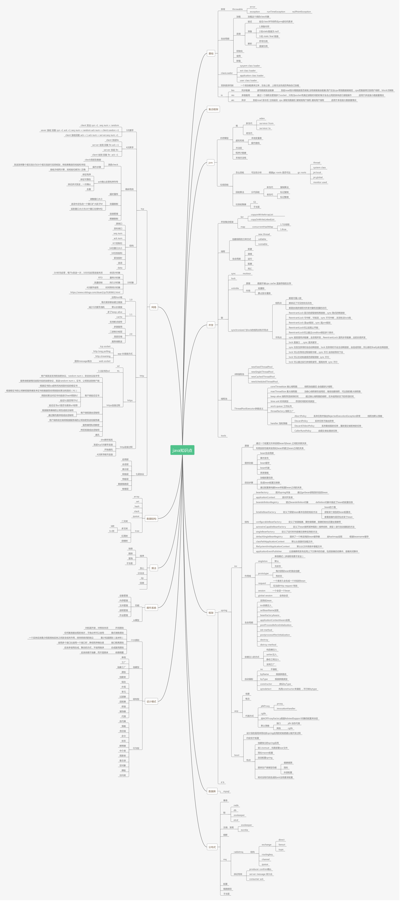
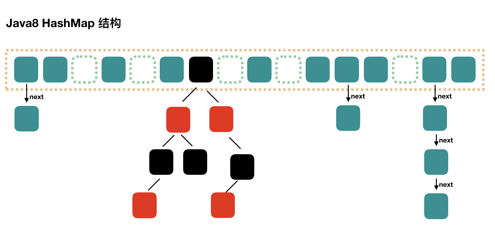

# Java知识点



**==先对知识点有一个宏观的认识，再着手从细节处深入研究知识点的原理。==**


- 基础
- 集合框架
- jvm
  - 内存模型
  - 垃圾回收
- 并发
  - 开发集合框架
  - 线程
  - 锁
  - 线程池
  - tools
- 框架
  - Spring
    - ioc
    - aop
    - SpringBoot
    - SpringMVC
    - SpringCloud
- 数据库
  - mysql
  - redis
- 分布式
  - 事务
  - 锁
  - 注册发现
  - 熔断
  - mq
  - 配置
  - 链路追踪
- 网络
- 数据结构
- 算法
- 操作系统
- 设计模式


- JVM	
- 多线程	
- 设计模式	
- Redis	
- ZK	
- Mysql调优

- 算法 

- 网络Netty  


**==简历==**

English


# 基础

## 二进制

1101 = 1 × 2^3^ + 1 × 2^2^ + 0 × 2^1^ +1 × 2^0^ = 13

最低位为2的0次方。

## 对数logN  O(logN)

​		对数运算是幂运算的逆运算。如10*10=100即log~10~100=2。**==讨论运行时间时log都是指log~2~==**

​		简单查找法时间复杂度O(N)，二分查找法为O(logN)。如8个数字在最糟情况下简单查找法需要查8次，而二分查找法时需查log8=3次。

> 计算机中只有log(以10为底和ln(以e为底)，可根据公式替换。
>
> 如求以2为底8的对数，可替换为log8 / log2 = log~2~8 = 3

## 编码方式

- ASCII

  总共有 128 个，用一个字节的低 7 位表示，最前面的1位统一规定为0。0~31 是控制字符如换行回车删除等；32~126 是打印字符，能够经过键盘输入而且可以显示出来。

- ISO-8859-1
  128 个字符显然是不够用的，因而 ISO 组织在 ASCII 码基础上又制定了一些列标准用来扩展 ASCII 编码，它们是 ISO-8859-1~ISO-8859-15，其中 ISO-8859-1 涵盖了大多数西欧语言字符，全部应用的最普遍。ISO-8859-1 仍然是单字节编码，它总共能表示 256 个字符。

- GB2312

  它的全称是《信息交换用汉字编码字符集 基本集》，它是双字节编码，总的编码范围是 A1-F7，其中从 A1-A9 是符号区，总共包含 682 个符号，从 B0-F7 是汉字区，包含 6763 个汉字。这个是中国1981年搞出来的。**这种编码是一个汉字两个字节。**

- GBK

  全称叫《汉字内码扩展规范》，它的编码范围是 8140~FEFE（去掉 XX7F）总共有 23940 个码位，它能表示 21003 个汉字。这个是中国在1995年搞出来的，主要是用于GB2312编码的补充。**这种编码依然是一个汉字两个字节。**

- GB18030

  全称是《信息交换用汉字编码字符集》，是我国的强制标准，它多是单字节、双字节或者四字节编码，它的编码与 GB2312 编码兼容，这个虽然是国家标准，可是实际应用系统中使用的并不普遍。 

- Unicode

  - UTF-16

    具体定义了 Unicode 字符在计算机中存取方法。UTF-16 用两个字节来表示 Unicode 转化格式，这个是定长的表示方法，不论什么字符均可以用两个字节表示，两个字节是 16 个 bit，因此叫 UTF-16。UTF-16 表示字符很是方便，每两个字节表示一个字符，这个在字符串操做时就大大简化了操做**，这也是 Java 以 UTF-16 做为内存的字符存储格式**的一个很重要的缘由。

  - UTF-8	(8-bit Unicode Transformation Format)

    UTF-16 统一采用两个字节表示一个字符，虽然在表示上很是简单方便，可是也有其缺点，有很大一部分字符用一个字节就能够表示的如今要两个字节表示，存储空间放大了一倍，在如今的网络带宽还很是有限的今天，这样会增大网络传输的流量，并且也不必。

    UTF-8是一种针对Unicode的可变长度字符编码，又称万国码。由Ken Thompson于1992年创建。现在已经标准化为RFC 3629。UTF-8用1到4个字节编码Unicode字符。用在网页上可以统一页面显示中文简体繁体及其它语言（如英文、日文、韩文）。

    UTF-8最大的一个特点，就是它是一种**变长的编码方式**。它可以使用**1~4个字节**表示一个符号，根据不同的符号而变化字节长度。

    UTF-8 有如下编码规则：

     1）对于单字节的符号，字节的第一位设为0，后面7位为这个符号的unicode码。因此对于英语字母，UTF-8编码和ASCII码是相同的。

    2）对于n字节的符号（n>1），第一个字节的前n位都设为1，第n+1位设为0，后面字节的前两位一律设为10。剩下的没有提及的二进制位，全部为这个符号的unicode码。

    下表总结了编码规则，字母x表示可用编码的位。

    > Unicode符号范围 | UTF-8编码方式
    > UTF字节数         (十六进制) | （二进制）
    > --------------------+---------------------------------------------
    >
    > 一个字节 0000 0000-0000 007F | 0xxxxxxx
    > 两个字节 0000 0080-0000 07FF | 110xxxxx 10xxxxxx
    > 三个字节 0000 0800-0000 FFFF | 1110xxxx 10xxxxxx 10xxxxxx
    > 四个字节 0001 0000-0010 FFFF | 11110xxx 10xxxxxx 10xxxxxx 10xxxxxx

    演示：已知“严”的unicode是4E25（100111000100101），根据上表，可以发现4E25处在第三行的范围内（0000 0800-0000 FFFF），因此“严”的UTF-8编码需要三个字节，即格式是“1110xxxx 10xxxxxx 10xxxxxx”。然后，从“严”的最后一个二进制位开始，依次从后向前填入格式中的x，多出的位补0。这样就得到了，“严”的UTF-8编码是“11100100 10111000 10100101”，转换成十六进制就是E4B8A5。


## 数据类型

- 基本数据类型（primitive type）
  | 基本类型 | 大小            | 最小值            | 最大值              | 包装器类型 |
  | -------- | --------------- | ----------------- | ------------------- | ---------- |
  | boolean  |                 |                   |                     | Boolean    |
  | char     | 2字节（16bits） | Unicode 0         | Unicode 2^16^-1     | Character  |
  | byte     | 1字节（8bits）  | -2^7^ (即-128)    | +2^7^-1 (即+127)    | Byte       |
  | short    | 2字节（16bits） | -2^15^ (即-32768) | +2^15^-1 (即-32767) | Short      |
  | int      | 4字节（32bits） | -2^31^            | +2^31^-1            | Integer    |
  | long     | 8字节（64bits） | -2^63^            | +2^63^-1            | Long       |
  | float    | 4字节（32bits） | IEEE754           | IEEE754             | Float      |
  | double   | 8字节（64bits） | IEEE754           | IEEE754             | Double     |

- 引用数据类型（reference type）（除了基本数据类型都是引用数据类型）
  - 类 class
  - 接口 interface
  - 数组 array
  - 字符串 string
  - 包装类

缓存具体见 [**基本类型包装常量池**](#基本类型包装常量池)

### 取值范围详解

​		Java 中，byte 占一个字节，取值范围为何是 -128\~127？（-2^7^~2^7^-1）

​		计算机是用二进制来表示数据的，一个字节也就是 8 个比特位，其中最高位表示符号位（0 正 1 负）。

​		故 byte 的取值范围为 1000 0000 到 0111 1111。

​		在 Java 中，是采用补码来表示数据的。

​		正数的补码和原码相同，负数的补码是在原码的基础上各位取反然后加 1。

​		1000 000 是补码，减一然后按位取反得到其原码 1000 0000。（减一得 0111 1111，再按位取反得 1000 0000）

​		因为是负数，所以最小的 byte 值为 -2^7^=-128。

​		0111 1111 的十进制为 2^7^-1=127（等比序列求和）。

​		byte 是一个字节，共有 2^8^=256 种可能性，也就是 -128~127。

其他基本数据类型同理：

​		char 没有负值，占两个字节，所以取值范围是 0~2^16^-1（65535）。

## 内部类

### 成员内部类 

member inner class

类比实例变量，**可以访问外部类的所有成员变量和方法**。编译产生两个文件：Outer.class和Outer$Inner.class。

可用所有访问修饰符修饰成员内部类，外部类只能是public/default。

```java
//在外部类之外创建内部类的实例：
Outer.Inner in = new Outer().new Inner();
//在外部类里面创建成员内部类的实例：
this.new Inner();
//在内部类里访问外部类的同名成员变量或方法：
Outer.this.member
```

```java
//成员内部类使用测试
public class Outer {
    private int a = 1;
    private int b = 2;
    
    public static void main(String[] args){
        // 创建成员内部类的对象 需要先创建外部类的实例
        Outer.Inner inner = new Outer().new Inner();
        inner.doSomething();
    }

    // 定义一个成员内部类
    class Inner {
        private int a = 8;

        public void doSomething() {            
            System.out.println(b);// 直接访问外部类对象
            System.out.println(a);// 直接访问a，则访问的是内部类里的a

            System.out.println(Outer.this.a);// 如何访问到外部类里的同名a呢？
        }
    }
}
```


### 静态内部类/嵌套类 

static inner class / nested class

使用static修饰，类比静态变量，静态内部类不需要外部类对象产生就能使用，**仅能访问外部类的静态成员和方法**，包括私有的静态成员和方法。编译产生一个文件：Outer.class$Inner.class

```java
//生成静态内部类对象的方式为：
Outer.Inner inner = new Outer.Inner();
```

### 局部内部类/方法内部类

local inner class 

定义在方法中，只能在方法中实例化局部内部类与调用其方法。类比局部变量。

不能被访问修饰符public、protected、private和static修饰。它只能访问方法中定义的`final`类型的局部变量。

### 匿名内部类 

annonymous inner class

**必须继承一个抽象类或实现一个接口；**

不使用关键字class、extends、implements，**没有构造方法**。**通常作为一个方法参数**。**只能访问`final`局部变量**。

编译产生一个文件：OuterClass$1.class （数字根据是第几个匿名类而类推）

## 常量 成员变量 静态变量

- **成员变量**：作用范围是整个类，定义在类的声明之下;成员变量包括：
  - **实例变量**：不用static修饰的成员变量，随对象的创建而创建，每个对象都有自己的独有的实例变量，属于对象私有;
  - **静态变量（类变量）**：用static修饰的成员变量，又叫类变量，一个类里只有一份，属于对象共有；
  - **常量**：用static final修饰的成员变量叫常量，在类中只有一份且不可修改。
- **局部变量**：作用范围在它定义的方法体或者语句块内部
- **字段**：通常是在类中定义的成员变量，所以也和成员变量的概念差不多是一个意思。
- **属性**：属性是只局限于类中方法的声明，不与其他的类成员相关。只与类中的get()/set()方法有关。 

```java
class Aa{
    private String a;//实例变量
    private static String b;//静态变量或类变量
    private static final String XX_XX = "";//常量
    public String getXxx(){ //属性
    	return null;
    }
}
```


## 访问修饰符

|  修饰符   | 当前类 | 同包 | 子类 | 其他包 |
| :-------: | :----: | :--: | :--: | :----: |
|  public   |   √    |  √   |  √   |   √    |
| protected |   √    |  √   |  √   |   ×    |
|  default  |   √    |  √   |  ×   |   ×    |
|  private  |   √    |  ×   |  ×   |   ×    |

类的成员不写访问修饰时默认为default。默认对于同一个包中的其他类相当于公开（public），对于不是同一个包中的其他类相当于私有（private）。受保护（protected）对子类相当于公开，对不是同一包中的没有父子关系的类相当于私有。Java中，外部类的修饰符只能是public或默认，类的成员（包括内部类）的修饰符可以是以上四种。

## 关键字

### final

编译期常量，可以在编译时执行计算减轻运行负担。定义时必须进行赋值。

- 基本类型	

  final使数值恒定不变

- 对象引用	

  final使引用恒定不变。一旦引用被初始化指向一个对象，就无法再把它指向另一个对象。**但对象自身却是可以被修改的。**

> static	强调只有一份
>
> final 	常量
>
> `publc static final int VALUE_ONE = 1;`

### transient

​		序列化的对象包含被 transient 修饰的实例变量时，java 虚拟机(JVM)跳过该特定的变量。

​		该修饰符包含在定义变量的语句中，用来预处理类和变量的数据类型。

### volatile

- **线程可见性** 
- **禁止指令重排**

> 详见 并发->volatile

### synchronized


## 值传递 引用传递

- **值传递**（Pass By Value/Call By Value）是指在调用方法(或者函数)时，将实际参数复制一份传递到方法(或者函数)中，这样在函数中如果对形式参数进行修改，将不会影响到实参。
- **引用传递**（Pass By Reference/Call By Reference）在调用方法(函数)时，将实参的地址直接传递到函数中，那么在函数中对形参进行修改，将影响到实参。


​		==**Java中只有值传递，没有引用传递**。==不论是基本数据类型还是引用数据类型，基本数据类型传递的是基本数据类型的“值”，而引用数据类型传递的是“地址值”，两种数据类型传递的都是值，只是值的数据类型不同而已。


## ==和equals()

- **==运算符**：因为Java只有值传递，所以对于==来说，不管是比较基本数据类型，还是引用数据类型的变量，其本质比较的都是值，只是引用类型变量存的值是对象的地址。
  - 比较**基本数据类型**，则**比较数值是否相等**。（可以是不同类型相比较，Java运算符会存在自动类型提升）
  - 比较**引用数据类型**，则**比较对象的堆内存地址是否相等**。

- **equals()方法**：只能适用于引用数据类型。

  equals()方法存在于Object类中，而Object类是所有类的直接或间接父类。

  ```java
  //Object类中equals()方法
  public boolean equals(Object obj) {
          return (this == obj);
      }
  ```

  - **类没有重写equals()方法**

    **等价于通过==比较两个对象的堆内存地址是否相等。**使用的默认是Object.equals()方法

  - **类重写了equals()方法** （如String、Date、**包装类**、File等都重写了equals()方法）(也需重写hashCode())

    **一般我们都重写equals()方法来比较两个对象中的内容是否相等**

  示例：

  ```java
  public class EqualsDemo {
      public static void main(String[] args) {
          String a = new String("ab");
          String b = new String("ab");
   
          String aa = "ab";
          String bb = "ab";
          
          System.out.println("aa==bb: " + (aa == bb));		//true
          System.out.println("a==b: " + (a == b));			//false
          System.out.println("a.equals(b): " + (a.equals(b)));//true
          System.out.println("42 == 42.0 : " + (42 == 42.0));	//true
      }
  }
  ```

  > 说明：
  >
  > - String中的 equals方法是被重写过的，因为 Object的 equals方法是比较的对象的内存地址，而 String的 equals方法是比较对象堆内存地址或者字符串内容，相同则它们相等。
  > - 当创建 String类型的对象时，虚拟机会在常量池中查找是否存在相同的字符串对象，如果有就把它赋给当前引用。如果没有就在常量池中重新创建一个 String对象，再将栈中的引用指向该字符串。

  ```java
  //String类中的equals方法
      public boolean equals(Object anObject) {
          if (this == anObject) {
              return true;
          }
          if (anObject instanceof String) {
              String anotherString = (String)anObject;
              int n = value.length;
              if (n == anotherString.value.length) {
                  char v1[] = value;
                  char v2[] = anotherString.value;
                  int i = 0;
                  while (n-- != 0) {
                      if (v1[i] != v2[i])
                          return false;
                      i++;
                  }
                  return true;
              }
          }
          return false;
      }
  ```

> - 特殊的引用数据类型String：
>   - == 比较的是他们在内存中的存放地址；
>   - equals比较的是值 
>
> - 基本类型包装类如Integer、Character等都重写了equals()方法，都是比较值
>
>   - 注意整型字面量**-128到127之间**不会new对象，而是直接引用常量池中的Integer缓存对象。
>
>     具体见 [**基本类型包装常量池**](#基本类型包装常量池)


## equals()与hashCode()

- **相等（相同）的对象必须具有相等的哈希码（或者散列码）**
- **如果两个对象的hashCode相同，它们并不一定相同**


​		在Java中也一样，hashCode方法的主要作用是为了配合基于散列的集合一起正常运行，这样的散列集合包括HashSet、HashMap以及HashTable。若对象用于这些集合，则重写equals()就必须重写hashCode()。


## 对象的初始化调用顺序

> **优先级：==静态代码块/静态变量 > 构造代码块 > 构造器> 普通代码块==**

- **静态代码块/静态变量**：**在类加载时执行且只执行一次，多个则按声明顺序依次执行且只执行一次。**优先级最高。
- **构造代码块**：**==任何一个构造器被调用的时候，都会先执行构造代码块==**，优先级低于静态代码块。可用于统计创建对象的次数等功能。
- **构造器**：优先级低于构造代码块
- **普通代码块**：构造代码块是在类中定义的，而普通代码块是在方法体中定义的。且普通代码块的执行顺序和书写顺序一致。


> 有继承的情况下执行顺序：==**父类静态代码块 > 子类静态代码块 > 父类构造代码块 > 父类构造器 > 子类构造代码块 > 子类构造器**==
>
> 即 静态内容先执行，再执行父类构造代码块和构造器，然后执行子类构造代码块和构造器。

```java
public class Father {
    static {
        System.out.println("父类的静态代码块，程序启动后执行，只会执行一次");
    }

    //父类无参构造方法
    public Father(){
        System.out.println("父类的默认构造方法");
    }

    //重载，自定义父类带参构造方法
    public Father(String str){
         System.out.println("父类的带参构造方法，参数为："+str);
    }
    
    {
        System.out.println("父类构造代码块，每次调用构造方法都会执行的");
    }
}
```

```java
	//实例化Father
    public static void main(String[] args) {
        System.out.println("---------------------------------------");
        Father father1 = new Father();
        System.out.println("---------------------------------------");
        Father father2 = new Father("阿马");
    }

//console输出结果：
父类的静态代码块，程序启动后执行，只会执行一次
---------------------------------------
父类构造代码块，每次调用构造方法都会执行的
父类的默认构造方法
---------------------------------------
父类构造代码块，每次调用构造方法都会执行的
父类的带参构造方法，参数为：阿马
```

```java
//子类继承
public class Son extends Father{
    static {
        System.out.println("子类的静态代码块，程序启动后执行，只会执行一次，先执行父类的，再执行子类的");
    }
    {
        System.out.println("子类构造代码块，每次调用构造方法都会执行的");
    }

    //无参构造器
    public Son(){
        //这里没有指定调用父类的哪个构造方法，会默认调用super(),调用父类的无参构造器public Father()
    }

    //重载构造器，多传两个参数
    public Son(String str1,String str2){
        //必须写在构造器第一行，调用父类的带参构造器public Father(str)
        super(str1);
        System.out.println("子类带参构造器："+str2);
    }
}
```

```java
	//实例化Son
	public static void main(String[] args) {
        System.out.println("-----------------------------------");
        Son son1 = new Son();
        System.out.println("-----------------------------------");
        Son son2 = new Son("子类第一个参数","子类第二个参数");
    }

//console输出结果：
父类的静态代码块，程序启动后执行，只会执行一次
子类的静态代码块，程序启动后执行，只会执行一次，先执行父类的，再执行子类的
-----------------------------------
父类构造代码块，每次调用构造方法都会执行的
父类的默认构造方法
子类构造代码块，每次调用构造方法都会执行的
-----------------------------------
父类构造代码块，每次调用构造方法都会执行的
父类的带参构造方法，参数为：子类第一个参数
子类构造代码块，每次调用构造方法都会执行的
子类带参构造器：子类第二个参数

```

## 对象创建过程

```java
//  1.在堆中给对象分配内存并设置实例变量默认零值。	m=0				(≈类加载准备阶段)
//  2.调用对象<init>方法初始化实例变量。	m=8				(≈类加载初始化阶段)
//  3.把对象引用指向堆内对象实例。
class T {
    int m = 8;
}
T t = new T();
```

​		跑一下后idea->View->Show Bytecode with Jclasslib

```assembly
#汇编码	0 4 8 对应创建3步
0 new #2 <T>
3 dup
4 invokespecial #3 <T.<init>>
7 astore_1
8 return
```


## 初始化和实例化（Java、Spring）

Java对象的创建过程往往包括类初始化和类实例化两个阶段。类的初始化在前、类的实例化在后。

> 注意：这与spring的bean正好相反，spring的bean的生命周期，主要是先进行实例化java对象，然后再进行操作属性、最后进行初始化，这里初始化并不是java对象的初始化，而是spring的参数的初始化（initMethod、afterPropertiesSet）等。（@PostConstruct是前置拦截初始化方法）

具体见：[类加载过程](#过程/生命周期)

- 加载：在硬盘上查找并通过IO读入字节码文件，使用到类时才会加载，例如调用类的main()方法，new对象等等
- 验证：校验字节码文件的正确性
- 准备：为类变量（静态变量）分配内存并设置其初始值。**类变量==初始值设为零值==，常量直接赋值。**
- 解析：将常量池内的符号引用替换为直接引用的过程，该阶段会把一些静态方法(符号引用，比如main()方法)替换为指向数据所存内存的指针或句柄等(直接引用)，这是所谓的静态链接过程(类加载期间完成)，动态链接是在程序运行期间完成的将符号引用替换为直接引用（运行时常量池）。
- 初始化：执行类构造器`<clinit>()`方法的过程，初始化类变量（静态变量）、静态代码块等资源为指定值。
- 使用
- 卸载


## init和clinit的区别

- 执行时机不同
  - <init>是**对象构造器方法**，也就是说在程序执行new一个对象调用该对象类的constructor方法时（**实例化**）才会执行init方法。
  - <clinit>是**类构造器方法**，也就是在JVM进行**类加载过程中的初始化阶段**才会调用该方法。

- 执行目的不同

  init is the (or one of the) constructor(s) for the instance, and non-static field initialization.

  clinit are the static initialization blocks for the class, and static field initialization.——by StackOverflow

  - <init>是instance实例构造器，对非静态变量初始化。（**实例变量**）
  - <clinit>是类构造器对静态代码块和静态变量进行初始化。（**类变量和静态代码块**）

**clinit一定优先于init执行**


## length、length()和size()

- java 中的 `length`属性是针对**数组**说的，比如说你声明了一个数组，想知道这个数组的长度则用到了 length 这个属性。
- java 中的 `length()` 方法是针对**字符串**说的，如果想看这个字符串的长度则用到 length() 这个方法。
- java 中的 `size()` 方法是针对**泛型集合**说的，如果想看这个泛型有多少个元素，就调用此方法来查看！


## 同步 异步 阻塞 非阻塞

同步和异步是针对应用程序和内核交互而言的，也可理解为被**被调用者（操作系统）**的角度来说。

- 同步是用户进程触发IO操作并等待或轮询的去查看是否就绪
- 异步是指用户进程触发IO操作以后便开始做自己的事情，而当IO操作已经完成的时候会得到IO完成的通知，需要CPU支持。

> **同步** ： 自己亲自出马持银行卡到银行取钱（使用同步 IO 时，Java 自己处理IO 读写）；
>
> **异步** ： 委托一小弟拿银行卡到银行取钱，然后给你（使用异步IO 时，Java 将 IO 读写委托给OS 处理，需要将数据缓冲区地址和大小传给OS(银行卡和密码)，OS 需要支持异步IO操作API）；

阻塞和非阻塞是针对于进程/线程在访问数据时候的状态，也可理解为**调用者（程序）**角度来说。根据IO操作的就绪状态来采取的不同的方式，即一种读取或写入操作方法的实现方式。

- 阻塞方式下读取或写入方法将一直等待，
- 非阻塞方式下读取或写入方法会立即返回一个状态值。

> **阻塞** ： ATM排队取款，你只能等待（使用阻塞IO时，Java调用会一直阻塞到读写完成才返回）；
>
> **非阻塞** ： 柜台取款，取个号，然后坐在椅子上做其它事，等号广播会通知你办理，没到号你就不能去，你可以不断问大堂经理排到了没有，大堂经理如果说还没到你就不能去（使用非阻塞IO时，如果不能读写Java调用会马上返回，当IO事件分发器通知可读写时再继续进行读写，不断循环直到读写完成）


## 深拷贝 浅拷贝

- Class实现 Cloneable 接口后调用object.clone()是浅拷贝，对象内属性引用的对象只会拷贝引用地址，而不会将引用的对象重新分配内存，相对应的深拷贝则会连引用的对象也重新创建。
- 实现Serializable接口，通过对象的序列化和反序列化实现克隆，可以实现真正的深拷贝


## 运算符

### << <<< >> >>>

> 加法运算可能导致整数越界。如二分查找计算中间位置应用low+(high-low)/2 或low+(high-low)>>1或low+(high-low)>>>1

- `<<` :左移运算符，向左移若干位，高位丢弃，低位补零。`x << 1`,相当于 x 乘以 2(不溢出的情况下)。
- `>>` :带符号右移，向右移若干位，高位补符号位，低位丢弃。正数高位补 0,负数高位补 1。`x >> 1`,相当于 x 除以 2。
- `>>>` :无符号右移，忽略符号位，空位都以 0 补齐。

> 由于 `double`，`float` 在二进制中的表现比较特殊，因此不能来进行移位操作。
>
> 移位操作符实际上支持的类型只有`int`和`long`，编译器在对`short`、`byte`、`char`类型进行移位前，都会将其转换为`int`类型再操作。

### ^异或 exclusive OR(xor)

**就是找不同为1！（或理解为不进位的加法）**如果相对应位值相同，则结果为0，否则为1。

0^0=0	0^1=1	1^0=1	1^1=0

> 不用中间变量交换ab的值：a⊕b⊕a=b

### 三目运算

a ? b: c ? d : e	即为 **a ? b : (c ? d : e)**

## Comparable Comparator

- Comparable 是排序接口。内部比较器。耦合性高，若要修改比较算法，要修改Comparable接口的实现类。

  ```java
  public interface Comparable<T> {
      public int compareTo(T o); //this与o比较 正数表示大于 0相等 负数小于
  }
  ```

- Comparator 是比较器接口。外部比较器。不需对实现类进行任何修改。

  ```java
  public interface Comparator<T> {
      int compare(T o1, T o2); //o1与o2比较 正数表示大于 0相等 负数小于
      boolean equals(Object obj);
  }
  ```


## ==String需好好研究==

**==字面量！==**

[==具体见 Java-JVM.md 的String字符串操作规则==](Java-JVM.md)

> 编译时**字面量**(或它的“+”连接)会存放到常量池中；若是**引用**/concat/其他方式则会到运行时运算且常量池新开辟空间来存储该字面量结果并引用！

```java
String a = "a";
String b = "b";
String c = a + b;
//相当于如下。字符串的加运算，编译为class文件时会自动编译为StringBuffer进行连接操作。
String c = new StringBuffer().append(a).append(b).toString();

//对于字符串常量池：当一个字符串是字面量时会放到常量池中等待复用。
String a = "saff";
String b = "saff";
String c = new String("saff");
System.out.println(a.equal(b));  // true	比较值
System.out.println(a.equal(c));  // true
```

```java
String s1 = "abc";            // 编译期生成了字面量和符号引用，字面常量"abc"存储在运行时常量池	
String s2 = new String("abc");     // 堆内存中
System.out.println(s1==s2);        // false两个对象的地址值不一样。
System.out.println(s1.equals(s2)); // true
```

```java
String s1="a"+"b"+"c";
String s2="abc";
System.out.println(s1==s2);	//true 地址相同
System.out.println(s1.equals(s2));	//true 值相同
//java 中常量优化机制，编译时s1已经成为abc在常量池中查找创建，s2不需要再创建。
```

```java
String s1="ab";
String s2="abc";
String s3=s1+"c";
System.out.println(s3==s2);         // false
System.out.println(s3.equals(s2));  // true
//先在常量池中创建ab，地址指向s1, 再创建abc，指向s2。对于s3，先创建StringBuilder（或 StringBuffer）对象，通过 append 连接得到 abc ,再调用 toString() 转换得到的地址指向s3。故 (s3==s2) 为 false。
```


# 集合


- Collection
  - List	有序的、可重复的
    - ArrayList
    - LinkedList
      - 单向链表	包含2个值（当前节点的值、指向下一个节点的链接）
      - 双向链表	包含3个值（数值、向后的节点链接、向前的节点链接）
    - Vector
    - Stack
  - Set	无序的、不可重复的
    - HashSet
    - LinkedHashSet
    - TreeSet
  - Queue	按特定的排队规则来确定先后顺序，有序的、可重复的
    - 
- Map	使用键值对（key-value）存储，key是无序的、不可重复的；value是无序的、可重复的。每个键最多映射到一个值。
  - HashMap
    - LinkedHashMap
  - TreeMap
  - ConcurrentHashMap
  - HashTable

|    名称    |                         底层                          |  线程安全性  |        优点        |        扩容机制         |
| :--------: | :---------------------------------------------------: | :----------: | :----------------: | :---------------------: |
| ArrayList  |                         数组                          |  线程不安全  | 随机查找快，增删慢 | 首创长度为10，扩容1.5倍 |
|   Vector   |                         数组                          | 线程同步安全 | 随机查找快，增删慢 |  首创长度为10，扩容2倍  |
| LinkedLIst | 双向链表<br />（JDK1.6循环链表，<br />1.7取消了循环） |  线程不安全  | 增删快，随机查找慢 |       不主动扩容        |

|     名称      |           底层            | 线程安全性 |              备注               |
| :-----------: | :-----------------------: | :--------: | :-----------------------------: |
|    HashSet    | HashMap(so允许一个null值) | 线程不安全 |     注意hashCode和equals()      |
| LinkedHashSet |       链表和哈希表        | 线程不安全 | HashSet的子类，元素顺序满足FIFO |
|    TreeSet    |          红黑树           | 线程不安全 |    支持对元素自定义排序规则     |

- queue:单向队列
- deque:双向队列，接口实现ArrayDeque
- PriorityQueue 是非线程安全的，默认小顶堆，但可以接收一个 Comparator 作为构造参数，从而来自定义元素优先级的先后。

|       名称        |                    底层                     |    线程安全性    |                 备注                  |                           扩容机制                           |
| :---------------: | :-----------------------------------------: | :--------------: | :-----------------------------------: | :----------------------------------------------------------: |
|      HashMap      | 数组+链表（jdk7） 数组+链表+红黑树 （jdk8） |    线程不安全    |        能存储null的key和value         | 首创长度16，扩容2倍，<br />jdk8中当数组的某一个索引位置上的元素以链表形式存在的数据个数>8且当前的数组长度>64时，此索引位置上的所有数据改为使用红黑树存储 |
|   LinkedHashMap   |                  同HashMap                  |    线程不安全    | 比HashMap多了指向前驱和后继的两个指针 |                                                              |
| ConcurrentHashMap |                  同HashMap                  |     线程安全     |   使用16个锁来控制segments，分段锁    |                                                              |
|     HashTable     |                  数组+链表                  | 线程安全，全表锁 |     **不能**存储null的key和value      |                  首创长度为11，后来变为2n+1                  |
|      TreeMap      |                   红黑树                    |    线程不安全    |               定制排序                |                                                              |


## Collections工具类

**Collections是Java集合框架为了方便我们进行集合开发，为我们提供的一个操作Set、List和Map等集合的**工具类，**位于java.util包中**。该类提供了一系列的静态方法，可以实现对集合进行**排序、查找、替换、复制、线程安全化等**操作。

- **创建空白集合：** emptyList()、emptyMap()、emptySet()：返回对应的不可变的空集合，无法向其中添加或删除元素；
- **创建单个元素的集合**：singletonList(T o)、singletonMap(K key, V value)、singleton(T o)：返回的是不可变的单元素集合，无法向其中添加或删除元素；
- **排序方法**：sort 升序、reverse 降序、shuffle 洗牌、swap、rotate；
- **查找方法**：binarySearch；
- **替换方法**：replaceAll、fill；
- **复制方法**：copy；
- **同步方法**：synchronizedCollection、synchronizedList、synchronizedMap等；
- **不可修改方法**：unmodifiableCollection、unmodifiableList、unmodifiableMap等；
- **其他方法**：frequency、max、min、disjoint、frequency 频次、indexOfSubList、lastIndexOfSubList等。

> - **Arrays中的sort()方法主要是针对各种数据类型（基本数据类型和引用对象类型）的数组元素排序。**
>
> - **Collections中的静态方法的Collection.sort()主要是针对集合框架中的动态数组，链表，树，哈希表等（ ArrayList、LinkedList、HashSet、LinkedHashSet、HashMap、LinkedHashMap ）进行排序。**


## HashMap

> - JDK7
>   - **==数组+单向链表==**
>   - 初始数组大小保持 2^n^，默认`16`，扩容`2倍`；负载因子默认 `0.75`；扩容的阈值，等于 capacity * loadFactor（即初始为16*0.75=`12`）
>   - 数组为什么必须为2的幂：为了快速取hash值的低n位作为数组下标，如16-1(0000 1111)通过按位与`hash & (length-1)`取低4位为数组下标；如何保证？int capacity = roundUpToPowerOf2(toSize); // Find a power of 2 >= toSize 保证数组大小一定是 2 的 n 次方。 如这样初始化：new HashMap(20)，那么处理成初始数组大小是 32。
>   - 可存储null key，放在table[0]，只有一个，新值将覆盖。
>   - 扩容时机：存储元素大于等于阈值，并且将要插入到的数组位置不为空时，先扩容再插值。
>   - 扩容后元素位置：新容量为2倍即（如length-1=...0000 1111变为...0001 1111），与hash &运算后原值要么存储在新数组原下标处，要么原下标+原数组长度（如table[0]分配到newTable[0]和newTable[16]中）
>   -  插入数据到链表上使用==头插==；扩容后链表依然使用头插，所以扩容后原链表顺序反转
> - JDK8
>   - **==数组+单向链表+红黑树==**
>   - **当链表中的元素达到了 8 个且当前数组长度大于64时，会将链表转换为==红黑树==**，否则是进行扩容。在红黑树位置进行查找的时候可以降低时间复杂度为 **O(logN)**
>     - treeify_threshold为什么等于8：服从泊松分布，超过8个元素的概率非常小了。
>   - null key存放在tab[0]处，只有一个，新值将覆盖。
>   - 扩容时机：存储元素大于阈值，先插值再扩容。
>   - 扩容后元素位置：单个元素直接原i处或移动；链表拆成2个链表放到新数组中并保留原来顺序。位置都为 i 与  i+oldCap(原数组长度)；红黑树待定研究？
>   - 插入数据到链表上使用==尾插==。
>
> resize()效率很低，若有一个需要频繁插入的HashMap，扩容很耗时，推荐创建的时候就给定一个合适的初始容量，用空间换时间，避免未来频繁扩容带来的性能问题。

### JDK7 HashMap


HashMap 里面是一个==**数组**==，然后数组中每个元素是一个==**单向链表**==。

每个绿色的实体是嵌套类 Entry 的实例，**Entry** 包含四个属性：key, value, hash 值和用于单向链表的 next。

**capacity**：当前数组容量，始终保持 2^n，（初始默认`16`）可以扩容，扩容后数组大小为当前的 `2 倍`。

**loadFactor**：负载因子，默认为 `0.75`。

**threshold**：扩容的阈值，等于 capacity * loadFactor（即初始为16*0.75=12）


#### put 过程分析

```java
public V put(K key, V value) {
    // 默认为空数组，插入第一个元素时，先初始化数组大小
    if (table == EMPTY_TABLE) {
        inflateTable(threshold);
    }
    // 处理null key 见下方
    if (key == null)
        return putForNullKey(value);
    // 1. 取得key的hash
    int hash = hash(key);
	// 2. 取得hash对应数组下标 （解释数组为什么必须为2的幂）
    int i = indexFor(hash, table.length);
    // 3. 遍历对应下标处的链表，查看是否有该key存在，存在则新值覆盖并返回旧值
    for (Entry<K,V> e = table[i]; e != null; e = e.next) {
        Object k;
        if (e.hash == hash && ((k = e.key) == key || key.equals(k))) {
            V oldValue = e.value;
            e.value = value;
            e.recordAccess(this);
            return oldValue;
        }
    }

    modCount++;
    // 4. 不存在该key,添加entry到链表中
    addEntry(hash, key, value, i);
    return null;
}
```

```java
private void inflateTable(int toSize) {
    // Find a power of 2 >= toSize 保证数组大小一定是 2 的 n 次方。
    // 比如这样初始化：new HashMap(20)，那么处理成初始数组大小是 32
    int capacity = roundUpToPowerOf2(toSize);
	// 计算扩容阈值：capacity * loadFactor
    threshold = (int) Math.min(capacity * loadFactor, MAXIMUM_CAPACITY + 1);
    table = new Entry[capacity];
    initHashSeedAsNeeded(capacity);
}
private static int roundUpToPowerOf2(int number) {
    // assert number >= 0 : "number must be non-negative";
    return number >= MAXIMUM_CAPACITY
        ? MAXIMUM_CAPACITY
        : (number > 1) ? Integer.highestOneBit((number - 1) << 1) : 1;
}
```

>  **处理null key**

```java
// 处理null key，数组【0】下有null key则直接覆盖并返回原v值，无null key则添加对应(null,value)
// 数组【0】下可能有其他元素存储
private V putForNullKey(V value) {
    for (Entry<K,V> e = table[0]; e != null; e = e.next) {
        if (e.key == null) {
            V oldValue = e.value;
            e.value = value;
            e.recordAccess(this);
            return oldValue;
        }
    }
    modCount++;
    addEntry(0, null, value, 0);
    return null;
}
```


```java
// 取得key的hash
final int hash(Object k){
    int h = hashSeed;
    if (0!=h && k instanceof String){
        return sun.misc.Hashing.stringHash32((String) k);
    }
    
    h ^= k.hashCode();
    // 防止哈希冲突，让高位参与进来
    h ^= (h >>> 20) ^ (h >>> 12);
    return h ^  (h >>> 7) ^  (h >>> 4); 
}

// 取得hash对应数组下标
// 解释数组为什么必须为2的幂，取hash值的低n位作为数组下标，如16-1(0000 1111)取低4位为数组下标
static int indexFor(int h, int length){
	return h & (length - 1);
}

```

> **扩容**

```java
void addEntry(int hash, K key, V value, int bucketIndex) {
    // 判断存储元素大于阈值,并且将要插入到的数组位置不为空时
    // 扩容 *2
    if ((size >= threshold) && (null != table[bucketIndex])) {
        resize(2 * table.length);
        // 扩容后重新计算hash值
        hash = (null != key) ? hash(key) : 0;
        // 扩容后重新计算新下标
        bucketIndex = indexFor(hash, table.length);
    }

    createEntry(hash, key, value, bucketIndex);
}

// 将新值放到链表的表头，然后 size++
void createEntry(int hash, K key, V value, int bucketIndex) {
    Entry<K,V> e = table[bucketIndex];
    table[bucketIndex] = new Entry<>(hash, key, value, e);
    size++;
}

// 具体扩容方法
void resize(int newCapacity) {
    Entry[] oldTable = table;
    int oldCapacity = oldTable.length;
    if (oldCapacity == MAXIMUM_CAPACITY) {
        threshold = Integer.MAX_VALUE;
        return;
    }
	// 新的数组
    Entry[] newTable = new Entry[newCapacity];
    // 将原来数组中的值迁移到新的更大的数组中
    transfer(newTable, initHashSeedAsNeeded(newCapacity));
    table = newTable;
    threshold = (int)Math.min(newCapacity * loadFactor, MAXIMUM_CAPACITY + 1);
}
/**
 * Transfers all entries from current table to newTable.
 */
void transfer(Entry[] newTable, boolean rehash) {
    int newCapacity = newTable.length;
    for (Entry<K,V> e : table) {
        while(null != e) {
            Entry<K,V> next = e.next;
            if (rehash) {
                e.hash = null == e.key ? 0 : hash(e.key);
            }
            // 新容量为2倍即（length-1=...0000 1111变为...0001 1111），与hash &运算后
            // 原值要么存储在新数组原下标处，要么原下标+16(原数组长度)
            // ===链表使用头插===，所以扩容后原链表顺序反转
            int i = indexFor(e.hash, newCapacity);
            e.next = newTable[i];
            newTable[i] = e;
            e = next;
        }
    }
}

```

#### get 过程分析

```java
public V get(Object key) {
    // key 为 null会被放到 table[0]，所以只要遍历下table[0]处的链表就可以了
    if (key == null)
        return getForNullKey();
    Entry<K,V> entry = getEntry(key);

    return null == entry ? null : entry.getValue();
}
private V getForNullKey() {
    if (size == 0) {
        return null;
    }
    for (Entry<K,V> e = table[0]; e != null; e = e.next) {
        if (e.key == null)
            return e.value;
    }
    return null;
}
```

```java
final Entry<K,V> getEntry(Object key) {
    if (size == 0) {
        return null;
    }

    int hash = (key == null) ? 0 : hash(key);
    // 确定数组下标，然后从头开始遍历链表，直到找到为止
    for (Entry<K,V> e = table[indexFor(hash, table.length)];
         e != null;
         e = e.next) {
        Object k;
        if (e.hash == hash &&
            ((k = e.key) == key || (key != null && key.equals(k))))
            return e;
    }
    return null;
}
```


### JDK7 ConcurrentHahMap

ConcurrentHashMap 是一个 Segment 数组，Segment 通过继承 ReentrantLock 来进行加锁，所以每次需要加锁的操作锁住的是一个 segment，这样只要保证每个 Segment 是线程安全的，也就实现了全局的线程安全。


**concurrencyLevel**：并行级别、并发数、Segment 数，怎么翻译不重要，理解它。默认是 `16`，也就是说 ConcurrentHashMap 有 16 个 Segments，所以理论上，这个时候，最多可以同时支持 16 个线程并发写，只要它们的操作分别分布在不同的 Segment 上。这个值可以在初始化的时候设置为其他值，但是一旦初始化以后，它是不可以扩容的。

再具体到每个 Segment 内部，其实每个 Segment 很像之前介绍的 HashMap，不过它要保证线程安全，所以处理起来要麻烦些。


#### 初始化

initialCapacity：初始容量，这个值指的是整个 ConcurrentHashMap 的初始容量，实际操作的时候需要平均分给每个 Segment。

loadFactor：负载因子，之前我们说了，Segment 数组不可以扩容，所以这个负载因子是给每个 Segment 内部使用的。

```java
public ConcurrentHashMap(int initialCapacity,
                         float loadFactor, int concurrencyLevel) {
    if (!(loadFactor > 0) || initialCapacity < 0 || concurrencyLevel <= 0)
        throw new IllegalArgumentException();
    if (concurrencyLevel > MAX_SEGMENTS)
        concurrencyLevel = MAX_SEGMENTS;
    // Find power-of-two sizes best matching arguments
    int sshift = 0;
    int ssize = 1;
    // 计算并行级别ssize，保证是2的n次方
    while (ssize < concurrencyLevel) {
        ++sshift;
        ssize <<= 1;
    }
    // 我们这里先不要那么烧脑，用默认值，concurrencyLevel 为 16，sshift 为 4
    // 那么计算出 segmentShift 为 28，segmentMask 为 15，后面会用到这两个值
    this.segmentShift = 32 - sshift;
    this.segmentMask = ssize - 1;
    if (initialCapacity > MAXIMUM_CAPACITY)
        initialCapacity = MAXIMUM_CAPACITY;
    // initialCapacity 是设置整个 map 初始的大小，
    // 这里根据 initialCapacity 计算 Segment 数组中每个位置可以分到的大小
    // 如 initialCapacity 为 64，那么每个 Segment 或称之为"槽"可以分到 4 个
    int c = initialCapacity / ssize;
    if (c * ssize < initialCapacity)
        ++c;
    // 默认 MIN_SEGMENT_TABLE_CAPACITY 是 2，这个值也是有讲究的，因为这样的话，对于具体的槽上，
    // 插入一个元素不至于扩容，插入第二个的时候才会扩容    
    int cap = MIN_SEGMENT_TABLE_CAPACITY;
    while (cap < c)
        cap <<= 1;
    // create segments and segments[0]
    Segment<K,V> s0 =
        new Segment<K,V>(loadFactor, (int)(cap * loadFactor),
                         (HashEntry<K,V>[])new HashEntry[cap]);
    Segment<K,V>[] ss = (Segment<K,V>[])new Segment[ssize];
    // ordered write of segments[0]
    UNSAFE.putOrderedObject(ss, SBASE, s0); 
    this.segments = ss;
}
```

初始化完成，我们得到了一个 Segment 数组。

我们就当是用 new ConcurrentHashMap() 无参构造函数进行初始化的，那么初始化完成后：

- Segment 数组长度为 16，不可以扩容
- Segment[i] 的默认大小为 2，负载因子是 0.75，得出初始阈值为 1.5，也就是以后插入第一个元素不会触发扩容，插入第二个会进行第一次扩容
- 这里初始化了 segment[0]，其他位置还是 null，至于为什么要初始化 segment[0]，后面的代码会介绍
- 当前 segmentShift 的值为 32 - 4 = 28，segmentMask 为 16 - 1 = 15，姑且把它们简单翻译为**移位数**和**掩码**，这两个值马上就会用到

#### put 过程分析

```java
public V put(K key, V value) {
    Segment<K,V> s;
    if (value == null)
        throw new NullPointerException();
    // 1. 计算key的hash值
    int hash = hash(key);
    // 2. 根据hash值找到Segment数组中的位置j
    //  hash 是 32 位，无符号右移 segmentShift(28) 位，剩下高 4 位，
    //  然后和 segmentMask(15) 做一次与操作，也就是说 j 是 hash 值的高 4 位，也就是槽的数组下标
    int j = (hash >>> segmentShift) & segmentMask;
    // 刚刚说了，初始化的时候初始化了 segment[0]，但是其他位置还是 null，
    // ensureSegment(j) 对 segment[j] 进行初始化
    if ((s = (Segment<K,V>)UNSAFE.getObject          // nonvolatile; recheck
         (segments, (j << SSHIFT) + SBASE)) == null) //  in ensureSegment
        s = ensureSegment(j);
    // 3. 插入新值到槽 s 中
    return s.put(key, hash, value, false);
}
```

第一层皮很简单，根据 hash 值很快就能找到相应的 Segment，之后就是 Segment 内部的 put 操作了。

Segment 内部是由 **==数组+链表==** 组成的。

```java
final V put(K key, int hash, V value, boolean onlyIfAbsent) {
    // 在往该 segment 写入前，需要先获取该 segment 的独占锁
    HashEntry<K,V> node = tryLock() ? null :
    scanAndLockForPut(key, hash, value);
    V oldValue;
    try {
        // 这个是 segment 内部的数组
        HashEntry<K,V>[] tab = table;
        // 再利用 hash 值，求应该放置的数组下标
        int index = (tab.length - 1) & hash;
        // first 是数组该位置处的链表的表头
        HashEntry<K,V> first = entryAt(tab, index);
        // 下面这串for循环虽然很长，不过也很好理解，想想该位置没有任何元素和已经存在一个链表这两种情况
        for (HashEntry<K,V> e = first;;) {
            if (e != null) {
                K k;
                if ((k = e.key) == key ||
                    (e.hash == hash && key.equals(k))) {
                    oldValue = e.value;
                    if (!onlyIfAbsent) {
                        // 覆盖旧值
                        e.value = value;
                        ++modCount;
                    }
                    break;
                }
                // 继续顺着链表走
                e = e.next;
            }
            else {
                // node 到底是不是 null，这个要看获取锁的过程，不过和这里都没有关系。
                // 如果不为 null，那就直接将它设置为链表表头；如果是null，初始化并设置为链表表头。
                if (node != null)
                    node.setNext(first);
                else
                    node = new HashEntry<K,V>(hash, key, value, first);
                int c = count + 1;
                // 如果超过了该 segment 的阈值，这个 segment 需要扩容
                if (c > threshold && tab.length < MAXIMUM_CAPACITY)
                    rehash(node);
                else
                    // 没有达到阈值，将 node 放到数组 tab 的 index 位置，
                    // 其实就是将新的节点设置成原链表的表头
                    setEntryAt(tab, index, node);
                ++modCount;
                count = c;
                oldValue = null;
                break;
            }
        }
    } finally {
        unlock();
    }
    return oldValue;
}
```

**初始化槽: ensureSegment**

ConcurrentHashMap 初始化的时候会初始化第一个槽 segment[0]，对于其他槽来说，在插入第一个值的时候进行初始化。

这里需要考虑并发，因为很可能会有多个线程同时进来初始化同一个槽 segment[k]，不过只要有一个成功了就可以。

```java
private Segment<K,V> ensureSegment(int k) {
    final Segment<K,V>[] ss = this.segments;
    long u = (k << SSHIFT) + SBASE; // raw offset
    Segment<K,V> seg;
    if ((seg = (Segment<K,V>)UNSAFE.getObjectVolatile(ss, u)) == null) {
        // 这里看到为什么之前要初始化 segment[0] 了，
        // 使用当前 segment[0] 处的数组长度和负载因子来初始化 segment[k]
        // 为什么要用“当前”，因为 segment[0] 可能早就扩容过了
        Segment<K,V> proto = ss[0]; // use segment 0 as prototype
        int cap = proto.table.length;
        float lf = proto.loadFactor;
        int threshold = (int)(cap * lf);
        // 初始化 segment[k] 内部的数组
        HashEntry<K,V>[] tab = (HashEntry<K,V>[])new HashEntry[cap];
        if ((seg = (Segment<K,V>)UNSAFE.getObjectVolatile(ss, u))
            == null) { // recheck该槽是否被其他线程初始化了。
            Segment<K,V> s = new Segment<K,V>(lf, threshold, tab);
            // 使用 while 循环，内部用 CAS，当前线程成功设值或其他线程成功设值后，退出
            while ((seg = (Segment<K,V>)UNSAFE.getObjectVolatile(ss, u))
                   == null) {
                if (UNSAFE.compareAndSwapObject(ss, u, null, seg = s))
                    break;
            }
        }
    }
    return seg;
}
```

总的来说，ensureSegment(int k) 比较简单，对于并发操作使用 CAS 进行控制。

如果当前线程 CAS 失败，这里的 while 循环是为了将 seg 赋值返回。

**获取写入锁: scanAndLockForPut**

​		前面我们看到，在往某个 segment 中 put 的时候，首先会调用  node = tryLock() ? null : scanAndLockForPut(key, hash, value)，也就是说先进行一次 tryLock() 快速获取该 segment 的独占锁，如果失败，那么进入到 scanAndLockForPut 这个方法来获取锁。

```java
private HashEntry<K,V> scanAndLockForPut(K key, int hash, V value) {
    HashEntry<K,V> first = entryForHash(this, hash);
    HashEntry<K,V> e = first;
    HashEntry<K,V> node = null;
    int retries = -1; // negative while locating node
    
    // 循环获取锁
    while (!tryLock()) {
        HashEntry<K,V> f; // to recheck first below
        if (retries < 0) {
            if (e == null) {
                if (node == null) // speculatively create node 推测性地创建节点
                    // 进到这里说明数组该位置的链表是空的，没有任何元素
                    // 当然，进到这里的另一个原因是 tryLock() 失败，所以该槽存在并发，不一定是该位置
                    node = new HashEntry<K,V>(hash, key, value, null);
                retries = 0;
            }
            else if (key.equals(e.key))
                retries = 0;
            else
                // 顺着链表往下走
                e = e.next;
        }
        // 重试次数如果超过 MAX_SCAN_RETRIES（单核1多核64），那么不抢了，进入到阻塞队列等待锁
        // lock() 是阻塞方法，直到获取锁后返回
        else if (++retries > MAX_SCAN_RETRIES) {
            lock();
            break;
        }
        // 这个时候是有大问题了，那就是有新的元素进到了链表，成为了新的表头
  		// 所以这边的策略是，相当于重新走一遍这个 scanAndLockForPut 方法
        else if ((retries & 1) == 0 &&
                 (f = entryForHash(this, hash)) != first) {
            e = first = f; // re-traverse if entry changed
            retries = -1;
        }
    }
    return node;
}
```

这个方法有两个出口，一个是 tryLock() 成功了，循环终止，另一个就是重试次数超过了 MAX_SCAN_RETRIES，进到 lock() 方法，此方法会阻塞等待，直到成功拿到独占锁。

这个方法就是看似复杂，但是其实就是做了一件事，那就是**获取该 segment 的独占锁**，如果需要的话顺便实例化了一下 node。

**扩容：rehash**

​		重复一下，segment 数组不能扩容，扩容是 segment 数组某个位置内部的数组 HashEntry\<K,V>[] 进行扩容，扩容后，容量为原来的 2 倍。

​		首先，我们要回顾一下触发扩容的地方，put 的时候，如果判断该值的插入会导致该 segment 的元素个数超过阈值，那么先进行扩容，再插值，读者这个时候可以回去 put 方法看一眼。

​		该方法不需要考虑并发，因为到这里的时候，是持有该 segment 的独占锁的。

```java
// 方法参数上的 node 是这次扩容后，需要添加到新的数组中的数据。
private void rehash(HashEntry<K,V> node) {
    HashEntry<K,V>[] oldTable = table;
    int oldCapacity = oldTable.length;
    // 2 倍
    int newCapacity = oldCapacity << 1;
    threshold = (int)(newCapacity * loadFactor);
    // 创建新数组
    HashEntry<K,V>[] newTable =
        (HashEntry<K,V>[]) new HashEntry[newCapacity];
    // 新的掩码，如从16扩容到32，那么sizeMask为 31，对应二进制 ‘000...0001 1111’
    int sizeMask = newCapacity - 1;
    // 遍历原数组，老套路，将原数组位置 i处的链表拆分到 新数组位置 i 和 i+oldCap 两个位置
    for (int i = 0; i < oldCapacity ; i++) {
        // e 是链表的第一个元素
        HashEntry<K,V> e = oldTable[i];
        if (e != null) {
            HashEntry<K,V> next = e.next;
            // 计算应该放置在新数组中的位置，
            // 假设原数组长度为 16，e 在 oldTable[3] 处，那么 idx 只可能是3或者是3 + 16 = 19
            int idx = e.hash & sizeMask;
            if (next == null)   //  Single node on list
                newTable[idx] = e;
            else { // Reuse consecutive sequence at same slot
                // e 是链表表头
                HashEntry<K,V> lastRun = e;
                // idx 是当前链表的头结点 e 的新位置
                int lastIdx = idx;
                // 下面这个 for 循环会找到一个 lastRun 节点，这个节点之后的所有元素是将要放到一起的
                for (HashEntry<K,V> last = next;
                     last != null;
                     last = last.next) {
                    int k = last.hash & sizeMask;
                    if (k != lastIdx) {
                        lastIdx = k;
                        lastRun = last;
                    }
                }
                // 将 lastRun 及其之后的所有节点组成的这个链表放到 lastIdx 这个位置
                newTable[lastIdx] = lastRun;
                // Clone remaining nodes
                // 下面的操作是处理 lastRun 之前的节点，
                // 这些节点可能分配在另一个链表中，也可能分配到上面的那个链表中
                for (HashEntry<K,V> p = e; p != lastRun; p = p.next) {
                    V v = p.value;
                    int h = p.hash;
                    int k = h & sizeMask;
                    HashEntry<K,V> n = newTable[k];
                    newTable[k] = new HashEntry<K,V>(h, p.key, v, n);
                }
            }
        }
    }
    // 将新来的 node 放到新数组中刚刚的 两个链表之一 的 头部
    int nodeIndex = node.hash & sizeMask; // add the new node
    node.setNext(newTable[nodeIndex]);
    newTable[nodeIndex] = node;
    table = newTable;
}
```

​		这里的扩容比之前的 HashMap 要复杂一些，代码难懂一点。上面有两个挨着的 for 循环，第一个 for 有什么用呢？

​		仔细一看发现，如果没有第一个 for 循环，也是可以工作的，但是，这个 for 循环下来，如果 lastRun 的后面还有比较多的节点，那么这次就是值得的。因为我们只需要克隆 lastRun 前面的节点，后面的一串节点跟着 lastRun 走就是了，不需要做任何操作。

​		我觉得 Doug Lea 的这个想法也是挺有意思的，不过比较坏的情况就是每次 lastRun 都是链表的最后一个元素或者很靠后的元素，那么这次遍历就有点浪费了。**不过 Doug Lea 也说了，根据统计，如果使用默认的阈值，大约只有 1/6 的节点需要克隆**。


#### get 过程分析

相对于 put 来说，get 真的不要太简单。

1. 计算 hash 值，找到 segment 数组中的具体位置，或我们前面用的“槽”
2. 槽中也是一个数组，根据 hash 找到数组中具体的位置
3. 到这里是链表了，顺着链表进行查找即可

```java
public V get(Object key) {
    Segment<K,V> s; // manually integrate access methods to reduce overhead
    HashEntry<K,V>[] tab;
    // 1. hash 值
    int h = hash(key);
    long u = (((h >>> segmentShift) & segmentMask) << SSHIFT) + SBASE;
    // 2. 根据 hash 找到对应的 segment
    if ((s = (Segment<K,V>)UNSAFE.getObjectVolatile(segments, u)) != null &&
        (tab = s.table) != null) {
        // 3. 找到segment 内部数组相应位置的链表，遍历
        for (HashEntry<K,V> e = (HashEntry<K,V>) UNSAFE.getObjectVolatile
                 (tab, ((long)(((tab.length - 1) & h)) << TSHIFT) + TBASE);
             e != null; e = e.next) {
            K k;
            if ((k = e.key) == key || (e.hash == h && key.equals(k)))
                return e.value;
        }
    }
    return null;
}
```


#### 并发问题分析

现在我们已经说完了 put 过程和 get 过程，我们可以看到 get 过程中是没有加锁的，那自然我们就需要去考虑并发问题。

添加节点的操作 put 和删除节点的操作 remove 都是要加 segment 上的独占锁的，所以它们之间自然不会有问题，我们需要考虑的问题就是 get 的时候在同一个 segment 中发生了 put 或 remove 操作。

- put 操作的线程安全性。
  - 初始化槽，这个我们之前就说过了，使用了 CAS 来初始化 Segment 中的数组。
  - 添加节点到链表的操作是插入到表头的，所以，如果这个时候 get 操作在链表遍历的过程已经到了中间，是不会影响的。当然，另一个并发问题就是 get 操作在 put 之后，需要保证刚刚插入表头的节点被读取，这个依赖于 setEntryAt 方法中使用的 UNSAFE.putOrderedObject。
  - 扩容。扩容是新创建了数组，然后进行迁移数据，最后面将 newTable 设置给属性 table。所以，如果 get 操作此时也在进行，那么也没关系，如果 get 先行，那么就是在旧的 table 上做查询操作；而 put 先行，那么 put 操作的可见性保证就是 table 使用了 volatile 关键字。

- remove 操作的线程安全性。

  remove 操作我们没有分析源码，所以这里说的读者感兴趣的话还是需要到源码中去求实一下的。

  get 操作需要遍历链表，但是 remove 操作会"破坏"链表。

  如果 remove 破坏的节点 get 操作已经过去了，那么这里不存在任何问题。

  如果 remove 先破坏了一个节点，分两种情况考虑。  1、如果此节点是头结点，那么需要将头结点的 next 设置为数组该位置的元素，table 虽然使用了 volatile 修饰，但是 volatile 并不能提供数组内部操作的可见性保证，所以源码中使用了 UNSAFE 来操作数组，请看方法 setEntryAt。2、如果要删除的节点不是头结点，它会将要删除节点的后继节点接到前驱节点中，这里的并发保证就是 next 属性是 volatile 的。


### JDK8 HashMap



​		Java8 对 HashMap 进行了一些修改，最大的不同就是利用了红黑树，所以其由 ==**数组+链表+红黑树**== 组成。

​		根据 Java7 HashMap 的介绍，我们知道，查找的时候，根据 hash 值我们能够快速定位到数组的具体下标，但是之后的话，需要顺着链表一个个比较下去才能找到我们需要的，时间复杂度取决于链表的长度，为 **O(n)**。

​		为了降低这部分的开销，在 Java8 中，**当链表中的元素达到了 8 个且当前数组长度大于64时，会将链表转换为红黑树**，在这些位置进行查找的时候可以降低时间复杂度为 **O(logN)**。

​		Java7 中使用 Entry 来代表每个 HashMap 中的数据节点，Java8 中使用 **Node**，基本没有区别，都是 key，value，hash 和 next 这四个属性，不过，Node 只能用于链表的情况，红黑树的情况需要使用 **TreeNode**。

​		我们根据数组元素中，第一个节点数据类型是 Node 还是 TreeNode 来判断该位置下是链表还是红黑树的。

#### put 过程分析

put操作主要如下：

1. 哈希桶数组 table 为空时，通过 resize() 方法进行初始化
2. 待插入的 key 已存在，直接覆盖 value
3. 若不存在，将键值对插入到对应的链表或红黑树中
4. 插入链表时判断是否转红黑树
5. 判断是否需要扩容

```java
public V put(K key, V value) {
    return putVal(hash(key), key, value, false, true);
}

// 第四个参数 onlyIfAbsent 如果是 true，那么只有在不存在该 key 时才会进行 put 操作
// 第五个参数 evict 我们这里不关心
final V putVal(int hash, K key, V value, boolean onlyIfAbsent,
               boolean evict) {
    Node<K,V>[] tab; Node<K,V> p; int n, i;
    // 第一次 put 值的时候，会触发下面的 resize()，类似 java7 的第一次 put 也要初始化数组长度
    // 第一次 resize 和后续的扩容有些不一样，因为这次是数组从 null 初始化到默认的 16 或自定义的初始容量
    if ((tab = table) == null || (n = tab.length) == 0)
        n = (tab = resize()).length;
    // 找到具体的数组下标，如果此位置没有值，那么直接初始化一下 Node 并放置在这个位置就可以了
    if ((p = tab[i = (n - 1) & hash]) == null)
        tab[i] = newNode(hash, key, value, null);

    else {// 数组该位置有数据
        Node<K,V> e; K k;
        // 首先，判断该位置的第一个数据和我们要插入的数据，key 是不是"相等"，如果是，取出这个节点
        if (p.hash == hash &&
            ((k = p.key) == key || (key != null && key.equals(k))))
            e = p;
        // 如果该节点是代表红黑树的节点，调用红黑树的插值方法，本文不展开说红黑树
        else if (p instanceof TreeNode)
            e = ((TreeNode<K,V>)p).putTreeVal(this, tab, hash, key, value);
        else {
            // 到这里，说明数组该位置上是一个链表
            for (int binCount = 0; ; ++binCount) {
                // 插入到链表的最后面(Java7 是插入到链表的最前面)
                if ((e = p.next) == null) {
                    p.next = newNode(hash, key, value, null);
                    // TREEIFY_THRESHOLD 为 8，所以，如果新插入的值是链表中的第 8 个
                    // 会触发下面的 treeifyBin，也就是将链表转换为红黑树
                    if (binCount >= TREEIFY_THRESHOLD - 1) // -1 for 1st
                        treeifyBin(tab, hash);
                    break;
                }
                // 如果在该链表中找到了"相等"的 key(== 或 equals)
                if (e.hash == hash &&
                    ((k = e.key) == key || (key != null && key.equals(k))))
                    // 此时 break，那么 e 为链表中[与要插入的新值的 key "相等"]的 node
                    break;
                p = e;
            }
        }
        // e!=null 说明存在旧值的key与要插入的key"相等"
        // 对于我们分析的put操作，下面这个 if 其实就是进行 "值覆盖"，然后返回旧值
        if (e != null) {	// existing mapping for key
            V oldValue = e.value;
            if (!onlyIfAbsent || oldValue == null)
                e.value = value;
            afterNodeAccess(e);
            return oldValue;
        }
    }
    ++modCount;
    // 如果 HashMap 由于新插入这个值导致 size 已经超过了阈值，需要进行扩容
    if (++size > threshold)
        resize();
    afterNodeInsertion(evict);
    return null;
}
```

```java
static final int hash(Object key) {
    int h;
    // null key存放在tab[0]处
    return (key == null) ? 0 : (h = key.hashCode()) ^ (h >>> 16);
}

// Returns a power of two size for the given target capacity.
// 指定容量，返回2的幂
static final int tableSizeFor(int cap) {
    int n = cap - 1;
    n |= n >>> 1;
    n |= n >>> 2;
    n |= n >>> 4;
    n |= n >>> 8;
    n |= n >>> 16;
    return (n < 0) ? 1 : (n >= MAXIMUM_CAPACITY) ? MAXIMUM_CAPACITY : n + 1;
}

final void treeifyBin(Node<K,V>[] tab, int hash) {
    int n, index; Node<K,V> e; 
    // 数组为空或数组大小小于64时会先扩容；否则才会转红黑树
    if (tab == null || (n = tab.length) < MIN_TREEIFY_CAPACITY)
        resize();
    else if ((e = tab[index = (n - 1) & hash]) != null) {
        TreeNode<K,V> hd = null, tl = null;
        do {
            TreeNode<K,V> p = replacementTreeNode(e, null);
            if (tl == null)
                hd = p;
            else {
                p.prev = tl;
                tl.next = p;
            }
            tl = p;
        } while ((e = e.next) != null);
        if ((tab[index] = hd) != null)
            hd.treeify(tab);
    }
}
```

​		和 Java7 稍微有点不一样的地方就是，Java7 是先扩容后插入新值的，Java8 先插值再扩容，不过这个不重要。

> **数组扩容**

resize() 方法用于**初始化数组**或**数组扩容**，每次扩容后，容量为原来的` 2 `倍，并进行数据迁移。

```java
final Node<K,V>[] resize() {
    Node<K,V>[] oldTab = table;
    int oldCap = (oldTab == null) ? 0 : oldTab.length;
    int oldThr = threshold;
    int newCap, newThr = 0;
    if (oldCap > 0) { // 对应数组扩容
        if (oldCap >= MAXIMUM_CAPACITY) {
            threshold = Integer.MAX_VALUE;
            return oldTab;
        }
        // 将数组大小扩大一倍
        else if ((newCap = oldCap << 1) < MAXIMUM_CAPACITY &&
                 oldCap >= DEFAULT_INITIAL_CAPACITY)
            // 将阈值扩大一倍
            newThr = oldThr << 1; // double threshold
    }
    else if (oldThr > 0) // 对应使用 new HashMap(int initialCapacity) 初始化后，第一次 put 的时候
        newCap = oldThr;
    else {// 对应使用 new HashMap() 初始化后，第一次 put 的时候
        newCap = DEFAULT_INITIAL_CAPACITY;
        newThr = (int)(DEFAULT_LOAD_FACTOR * DEFAULT_INITIAL_CAPACITY);
    }

    if (newThr == 0) {
        float ft = (float)newCap * loadFactor;
        newThr = (newCap < MAXIMUM_CAPACITY && ft < (float)MAXIMUM_CAPACITY ?
                  (int)ft : Integer.MAX_VALUE);
    }
    threshold = newThr;

    // 用新的数组大小初始化新的数组
    Node<K,V>[] newTab = (Node<K,V>[])new Node[newCap];
    table = newTab; // 如果是初始化数组，到这里就结束了，返回 newTab 即可

    if (oldTab != null) {
        // 开始遍历原数组，进行数据迁移。
        for (int j = 0; j < oldCap; ++j) {
            Node<K,V> e;
            if ((e = oldTab[j]) != null) {
                oldTab[j] = null;
                // 如果该数组位置上只有单个元素，那就简单了，简单迁移这个元素就可以了
                if (e.next == null)
                    newTab[e.hash & (newCap - 1)] = e;
                // 如果是红黑树，具体我们就不展开了
                else if (e instanceof TreeNode)
                    ((TreeNode<K,V>)e).split(this, newTab, j, oldCap);
                else { 
                    // 这块是处理链表的情况，preserve order
                    // 需要将此链表拆成两个链表，放到新的数组中，并且保留原来的先后顺序
                    // loHead、loTail 对应一条链表，hiHead、hiTail 对应另一条链表
                    Node<K,V> loHead = null, loTail = null;
                    Node<K,V> hiHead = null, hiTail = null;
                    Node<K,V> next;
                    do {
                        next = e.next;
                        // 原位置不变的子链表
                        if ((e.hash & oldCap) == 0) {                           
                            if (loTail == null)
                                loHead = e;	// 第一次进来时给链头赋值
                            else
                                loTail.next = e;	 // 给链尾赋值
                            loTail = e;	 // 重置该变量
                        }
                        // 原位置偏移 oldCap 的子链表
                        else {
                            if (hiTail == null)
                                hiHead = e;
                            else
                                hiTail.next = e;
                            hiTail = e;
                        }
                    } while ((e = next) != null);
                    if (loTail != null) {
                        loTail.next = null;
                        // 第一条链表
                        newTab[j] = loHead;
                    }
                    if (hiTail != null) {
                        hiTail.next = null;
                        // 第二条链表的新的位置是 j + oldCap，这个很好理解
                        newTab[j + oldCap] = hiHead;
                    }
                }
            }
        }
    }
    return newTab;
}
```


#### get 过程分析

相对于 put 来说，get 真的太简单了。

1. 计算 key 的 hash 值，根据 hash 值找到对应数组下标: hash & (length-1)
2. 判断数组该位置处的元素是否刚好就是我们要找的，如果不是，走第三步
3. 判断该元素类型是否是 TreeNode，如果是，用红黑树的方法取数据，如果不是，走第四步
4. 遍历链表，直到找到相等(==或equals)的 key

```java
public V get(Object key) {
    Node<K,V> e;
    return (e = getNode(hash(key), key)) == null ? null : e.value;
}
```

```java
final Node<K,V> getNode(int hash, Object key) {
    Node<K,V>[] tab; Node<K,V> first, e; int n; K k;
    if ((tab = table) != null && (n = tab.length) > 0 &&
        (first = tab[(n - 1) & hash]) != null) {
        // 判断第一个节点是不是就是需要的
        if (first.hash == hash && // always check first node
            ((k = first.key) == key || (key != null && key.equals(k))))
            return first;
        if ((e = first.next) != null) {
            // 判断是否是红黑树
            if (first instanceof TreeNode)
                return ((TreeNode<K,V>)first).getTreeNode(hash, key);

            // 链表遍历
            do {
                if (e.hash == hash &&
                    ((k = e.key) == key || (key != null && key.equals(k))))
                    return e;
            } while ((e = e.next) != null);
        }
    }
    return null;
}
```


### JDK8 ConcurrentHahMap


**Java8 ConcurrentHashMap 源码真心不简单，最难的在于扩容，数据迁移操作不容易看懂。**

#### 初始化

```java
// 这构造函数里，什么都不干
public ConcurrentHashMap() {
}
```

```java
public ConcurrentHashMap(int initialCapacity) {
    if (initialCapacity < 0)
        throw new IllegalArgumentException();
    int cap = ((initialCapacity >= (MAXIMUM_CAPACITY >>> 1)) ?
               MAXIMUM_CAPACITY :
               tableSizeFor(initialCapacity + (initialCapacity >>> 1) + 1));
    this.sizeCtl = cap;
}
```

​		这个初始化方法有点意思，通过提供初始容量，计算了 sizeCtl，sizeCtl = 【 (1.5 * initialCapacity + 1)，然后向上取最近的 2 的 n 次方】。如 initialCapacity 为 10，那么得到 sizeCtl 为 16，如果 initialCapacity 为 11，得到 sizeCtl 为 32。

#### put 过程分析

```java
public V put(K key, V value) {
    return putVal(key, value, false);
}
```

```java
final V putVal(K key, V value, boolean onlyIfAbsent) {
    if (key == null || value == null) throw new NullPointerException();
    // 得到 hash 值
    int hash = spread(key.hashCode());
    // 用于记录相应链表的长度
    int binCount = 0;
    for (Node<K,V>[] tab = table;;) {
        Node<K,V> f; int n, i, fh;
        // 如果数组"空"，进行数组初始化
        if (tab == null || (n = tab.length) == 0)
            // 初始化数组，后面会详细介绍
            tab = initTable();

        // 找该 hash 值对应的数组下标，得到第一个节点 f
        else if ((f = tabAt(tab, i = (n - 1) & hash)) == null) {
            // 如果数组该位置为空，
            //    用一次 CAS 操作将这个新值放入其中即可，这个 put 操作差不多就结束了，可以拉到最后面了
            //          如果 CAS 失败，那就是有并发操作，进到下一个循环就好了
            if (casTabAt(tab, i, null,
                         new Node<K,V>(hash, key, value, null)))
                break;                   // no lock when adding to empty bin
        }
        // hash 居然可以等于 MOVED，这个需要到后面才能看明白，不过从名字上也能猜到，肯定是因为在扩容
        else if ((fh = f.hash) == MOVED)
            // 帮助数据迁移，这个等到看完数据迁移部分的介绍后，再理解这个就很简单了
            tab = helpTransfer(tab, f);

        else { // 到这里就是说，f 是该位置的头结点，而且不为空

            V oldVal = null;
            // 获取数组该位置的头结点的监视器锁
            synchronized (f) {
                if (tabAt(tab, i) == f) {
                    if (fh >= 0) { // 头结点的 hash 值大于 0，说明是链表
                        // 用于累加，记录链表的长度
                        binCount = 1;
                        // 遍历链表
                        for (Node<K,V> e = f;; ++binCount) {
                            K ek;
                            // 如果发现了"相等"的 key，判断是否要进行值覆盖，然后也就可以 break 了
                            if (e.hash == hash &&
                                ((ek = e.key) == key ||
                                 (ek != null && key.equals(ek)))) {
                                oldVal = e.val;
                                if (!onlyIfAbsent)
                                    e.val = value;
                                break;
                            }
                            // 到了链表的最末端，将这个新值放到链表的最后面
                            Node<K,V> pred = e;
                            if ((e = e.next) == null) {
                                pred.next = new Node<K,V>(hash, key,
                                                          value, null);
                                break;
                            }
                        }
                    }
                    else if (f instanceof TreeBin) { // 红黑树
                        Node<K,V> p;
                        binCount = 2;
                        // 调用红黑树的插值方法插入新节点
                        if ((p = ((TreeBin<K,V>)f).putTreeVal(hash, key,
                                                       value)) != null) {
                            oldVal = p.val;
                            if (!onlyIfAbsent)
                                p.val = value;
                        }
                    }
                }
            }

            if (binCount != 0) {
                // 判断是否要将链表转换为红黑树，临界值和 HashMap 一样，也是 8
                if (binCount >= TREEIFY_THRESHOLD)
                    // 这个方法和 HashMap 中稍微有一点点不同，那就是它不是一定会进行红黑树转换，
                    // 如果当前数组的长度小于 64，那么会选择进行数组扩容，而不是转换为红黑树
                    //    具体源码我们就不看了，扩容部分后面说
                    treeifyBin(tab, i);
                if (oldVal != null)
                    return oldVal;
                break;
            }
        }
    }
    // 
    addCount(1L, binCount);
    return null;
}
```

put 的主流程看完了，但是至少留下了几个问题，第一个是初始化，第二个是扩容，第三个是帮助数据迁移

> 初始化数组：initTable

​		这个比较简单，主要就是初始化一个**合适大小**的数组，然后会设置 sizeCtl。

​		初始化方法中的并发问题是通过对 sizeCtl 进行一个 CAS 操作来控制的。

```java
private final Node<K,V>[] initTable() {
    Node<K,V>[] tab; int sc;
    while ((tab = table) == null || tab.length == 0) {
        // 初始化的"功劳"被其他线程"抢去"了
        if ((sc = sizeCtl) < 0)
            Thread.yield(); // lost initialization race; just spin
        // CAS 一下，将 sizeCtl 设置为 -1，代表抢到了锁
        else if (U.compareAndSwapInt(this, SIZECTL, sc, -1)) {
            try {
                if ((tab = table) == null || tab.length == 0) {
                    // DEFAULT_CAPACITY 默认初始容量是 16
                    int n = (sc > 0) ? sc : DEFAULT_CAPACITY;
                    // 初始化数组，长度为 16 或初始化时提供的长度
                    Node<K,V>[] nt = (Node<K,V>[])new Node<?,?>[n];
                    // 将这个数组赋值给 table，table 是 volatile 的
                    table = tab = nt;
                    // 如果 n 为 16 的话，那么这里 sc = 12
                    // 其实就是 0.75 * n
                    sc = n - (n >>> 2);
                }
            } finally {
                // 设置 sizeCtl 为 sc，我们就当是 12 吧
                sizeCtl = sc;
            }
            break;
        }
    }
    return tab;
}
```

> 链表转红黑树: treeifyBin

前面我们在 put 源码分析也说过，treeifyBin 不一定就会进行红黑树转换，也可能是仅仅做数组扩容。

```java
private final void treeifyBin(Node<K,V>[] tab, int index) {
    Node<K,V> b; int n, sc;
    if (tab != null) {
        // MIN_TREEIFY_CAPACITY 为 64
        // 所以，如果数组长度小于 64 的时候，其实也就是 32 或者 16 或者更小的时候，会进行数组扩容
        if ((n = tab.length) < MIN_TREEIFY_CAPACITY)
            // 后面我们再详细分析这个方法
            tryPresize(n << 1);
        // b 是头结点
        else if ((b = tabAt(tab, index)) != null && b.hash >= 0) {
            // 加锁
            synchronized (b) {

                if (tabAt(tab, index) == b) {
                    // 下面就是遍历链表，建立一颗红黑树
                    TreeNode<K,V> hd = null, tl = null;
                    for (Node<K,V> e = b; e != null; e = e.next) {
                        TreeNode<K,V> p =
                            new TreeNode<K,V>(e.hash, e.key, e.val,
                                              null, null);
                        if ((p.prev = tl) == null)
                            hd = p;
                        else
                            tl.next = p;
                        tl = p;
                    }
                    // 将红黑树设置到数组相应位置中
                    setTabAt(tab, index, new TreeBin<K,V>(hd));
                }
            }
        }
    }
}
```

> 扩容：tryPresize

​		如果说 Java8 ConcurrentHashMap 的源码不简单，那么说的就是扩容操作和迁移操作。

​		这个方法要完完全全看懂还需要看之后的 transfer 方法，读者应该提前知道这点。

​		这里的扩容也是做翻倍扩容的，扩容后数组容量为原来的 2 倍。

```java
// 首先要说明的是，方法参数 size 传进来的时候就已经翻了倍了
private final void tryPresize(int size) {
    // c：size 的 1.5 倍，再加 1，再往上取最近的 2 的 n 次方。
    int c = (size >= (MAXIMUM_CAPACITY >>> 1)) ? MAXIMUM_CAPACITY :
        tableSizeFor(size + (size >>> 1) + 1);
    int sc;
    while ((sc = sizeCtl) >= 0) {
        Node<K,V>[] tab = table; int n;

        // 这个 if 分支和之前说的初始化数组的代码基本上是一样的，在这里，我们可以不用管这块代码
        if (tab == null || (n = tab.length) == 0) {
            n = (sc > c) ? sc : c;
            if (U.compareAndSwapInt(this, SIZECTL, sc, -1)) {
                try {
                    if (table == tab) {
                        @SuppressWarnings("unchecked")
                        Node<K,V>[] nt = (Node<K,V>[])new Node<?,?>[n];
                        table = nt;
                        sc = n - (n >>> 2); // 0.75 * n
                    }
                } finally {
                    sizeCtl = sc;
                }
            }
        }
        else if (c <= sc || n >= MAXIMUM_CAPACITY)
            break;
        else if (tab == table) {
            // 我没看懂 rs 的真正含义是什么，不过也关系不大
            int rs = resizeStamp(n);

            if (sc < 0) {
                Node<K,V>[] nt;
                if ((sc >>> RESIZE_STAMP_SHIFT) != rs || sc == rs + 1 ||
                    sc == rs + MAX_RESIZERS || (nt = nextTable) == null ||
                    transferIndex <= 0)
                    break;
                // 2. 用 CAS 将 sizeCtl 加 1，然后执行 transfer 方法
                //    此时 nextTab 不为 null
                if (U.compareAndSwapInt(this, SIZECTL, sc, sc + 1))
                    transfer(tab, nt);
            }
            // 1. 将 sizeCtl 设置为 (rs << RESIZE_STAMP_SHIFT) + 2)
            //     我是没看懂这个值真正的意义是什么？不过可以计算出来的是，结果是一个比较大的负数
            //  调用 transfer 方法，此时 nextTab 参数为 null
            else if (U.compareAndSwapInt(this, SIZECTL, sc,
                                         (rs << RESIZE_STAMP_SHIFT) + 2))
                transfer(tab, null);
        }
    }
}
```

​		这个方法的核心在于 sizeCtl 值的操作，首先将其设置为一个负数，然后执行 transfer(tab, null)，再下一个循环将 sizeCtl 加 1，并执行 transfer(tab, nt)，之后可能是继续 sizeCtl 加 1，并执行 transfer(tab, nt)。

​		所以，可能的操作就是执行 **1 次 transfer(tab, null) + 多次 transfer(tab, nt)**，这里怎么结束循环的需要看完 transfer 源码才清楚。

> 数据迁移：transfer

下面这个方法有点长，将原来的 tab 数组的元素迁移到新的 nextTab 数组中。

虽然我们之前说的 tryPresize 方法中多次调用 transfer 不涉及多线程，但是这个 transfer 方法可以在其他地方被调用，典型地，我们之前在说 put 方法的时候就说过了，请往上看 put 方法，是不是有个地方调用了 helpTransfer 方法，helpTransfer 方法会调用 transfer 方法的。

此方法支持多线程执行，外围调用此方法的时候，会保证第一个发起数据迁移的线程，nextTab 参数为 null，之后再调用此方法的时候，nextTab 不会为 null。

阅读源码之前，先要理解并发操作的机制。原数组长度为 n，所以我们有 n 个迁移任务，让每个线程每次负责一个小任务是最简单的，每做完一个任务再检测是否有其他没做完的任务，帮助迁移就可以了，而 Doug Lea 使用了一个 stride，简单理解就是**步长**，每个线程每次负责迁移其中的一部分，如每次迁移 16 个小任务。所以，我们就需要一个全局的调度者来安排哪个线程执行哪几个任务，这个就是属性 transferIndex 的作用。

第一个发起数据迁移的线程会将 transferIndex 指向原数组最后的位置，然后**从后往前**的 stride 个任务属于第一个线程，然后将 transferIndex 指向新的位置，再往前的 stride 个任务属于第二个线程，依此类推。当然，这里说的第二个线程不是真的一定指代了第二个线程，也可以是同一个线程，这个读者应该能理解吧。其实就是将一个大的迁移任务分为了一个个任务包。

```java
private final void transfer(Node<K,V>[] tab, Node<K,V>[] nextTab) {
    int n = tab.length, stride;

    // stride 在单核下直接等于 n，多核模式下为 (n>>>3)/NCPU，最小值是 16
    // stride 可以理解为”步长“，有 n 个位置是需要进行迁移的，
    //   将这 n 个任务分为多个任务包，每个任务包有 stride 个任务
    if ((stride = (NCPU > 1) ? (n >>> 3) / NCPU : n) < MIN_TRANSFER_STRIDE)
        stride = MIN_TRANSFER_STRIDE; // subdivide range

    // 如果 nextTab 为 null，先进行一次初始化
    //    前面我们说了，外围会保证第一个发起迁移的线程调用此方法时，参数 nextTab 为 null
    //       之后参与迁移的线程调用此方法时，nextTab 不会为 null
    if (nextTab == null) {
        try {
            // 容量翻倍
            Node<K,V>[] nt = (Node<K,V>[])new Node<?,?>[n << 1];
            nextTab = nt;
        } catch (Throwable ex) {      // try to cope with OOME
            sizeCtl = Integer.MAX_VALUE;
            return;
        }
        // nextTable 是 ConcurrentHashMap 中的属性
        nextTable = nextTab;
        // transferIndex 也是 ConcurrentHashMap 的属性，用于控制迁移的位置
        transferIndex = n;
    }

    int nextn = nextTab.length;

    // ForwardingNode 翻译过来就是正在被迁移的 Node
    // 这个构造方法会生成一个Node，key、value 和 next 都为 null，关键是 hash 为 MOVED
    // 后面我们会看到，原数组中位置 i 处的节点完成迁移工作后，
    //    就会将位置 i 处设置为这个 ForwardingNode，用来告诉其他线程该位置已经处理过了
    //    所以它其实相当于是一个标志。
    ForwardingNode<K,V> fwd = new ForwardingNode<K,V>(nextTab);


    // advance 指的是做完了一个位置的迁移工作，可以准备做下一个位置的了
    boolean advance = true;
    boolean finishing = false; // to ensure sweep before committing nextTab

    /*
     * 下面这个 for 循环，最难理解的在前面，而要看懂它们，应该先看懂后面的，然后再倒回来看
     * 
     */

    // i 是位置索引，bound 是边界，注意是从后往前
    for (int i = 0, bound = 0;;) {
        Node<K,V> f; int fh;

        // 下面这个 while 真的是不好理解
        // advance 为 true 表示可以进行下一个位置的迁移了
        //   简单理解结局：i 指向了 transferIndex，bound 指向了 transferIndex-stride
        while (advance) {
            int nextIndex, nextBound;
            if (--i >= bound || finishing)
                advance = false;

            // 将 transferIndex 值赋给 nextIndex
            // 这里 transferIndex 一旦小于等于 0，说明原数组的所有位置都有相应的线程去处理了
            else if ((nextIndex = transferIndex) <= 0) {
                i = -1;
                advance = false;
            }
            else if (U.compareAndSwapInt
                     (this, TRANSFERINDEX, nextIndex,
                      nextBound = (nextIndex > stride ?
                                   nextIndex - stride : 0))) {
                // 看括号中的代码，nextBound 是这次迁移任务的边界，注意，是从后往前
                bound = nextBound;
                i = nextIndex - 1;
                advance = false;
            }
        }
        if (i < 0 || i >= n || i + n >= nextn) {
            int sc;
            if (finishing) {
                // 所有的迁移操作已经完成
                nextTable = null;
                // 将新的 nextTab 赋值给 table 属性，完成迁移
                table = nextTab;
                // 重新计算 sizeCtl：n 是原数组长度，所以 sizeCtl 得出的值将是新数组长度的 0.75 倍
                sizeCtl = (n << 1) - (n >>> 1);
                return;
            }

            // 之前我们说过，sizeCtl 在迁移前会设置为 (rs << RESIZE_STAMP_SHIFT) + 2
            // 然后，每有一个线程参与迁移就会将 sizeCtl 加 1，
            // 这里使用 CAS 操作对 sizeCtl 进行减 1，代表做完了属于自己的任务
            if (U.compareAndSwapInt(this, SIZECTL, sc = sizeCtl, sc - 1)) {
                // 任务结束，方法退出
                if ((sc - 2) != resizeStamp(n) << RESIZE_STAMP_SHIFT)
                    return;

                // 到这里，说明 (sc - 2) == resizeStamp(n) << RESIZE_STAMP_SHIFT，
                // 也就是说，所有的迁移任务都做完了，也就会进入到上面的 if(finishing){} 分支了
                finishing = advance = true;
                i = n; // recheck before commit
            }
        }
        // 如果位置 i 处是空的，没有任何节点，那么放入刚刚初始化的 ForwardingNode ”空节点“
        else if ((f = tabAt(tab, i)) == null)
            advance = casTabAt(tab, i, null, fwd);
        // 该位置处是一个 ForwardingNode，代表该位置已经迁移过了
        else if ((fh = f.hash) == MOVED)
            advance = true; // already processed
        else {
            // 对数组该位置处的结点加锁，开始处理数组该位置处的迁移工作
            synchronized (f) {
                if (tabAt(tab, i) == f) {
                    Node<K,V> ln, hn;
                    // 头结点的 hash 大于 0，说明是链表的 Node 节点
                    if (fh >= 0) {
                        // 下面这一块和 Java7 中的 ConcurrentHashMap 迁移是差不多的，
                        // 需要将链表一分为二，
                        //   找到原链表中的 lastRun，然后 lastRun 及其之后的节点是一起进行迁移的
                        //   lastRun 之前的节点需要进行克隆，然后分到两个链表中
                        int runBit = fh & n;
                        Node<K,V> lastRun = f;
                        for (Node<K,V> p = f.next; p != null; p = p.next) {
                            int b = p.hash & n;
                            if (b != runBit) {
                                runBit = b;
                                lastRun = p;
                            }
                        }
                        if (runBit == 0) {
                            ln = lastRun;
                            hn = null;
                        }
                        else {
                            hn = lastRun;
                            ln = null;
                        }
                        for (Node<K,V> p = f; p != lastRun; p = p.next) {
                            int ph = p.hash; K pk = p.key; V pv = p.val;
                            if ((ph & n) == 0)
                                ln = new Node<K,V>(ph, pk, pv, ln);
                            else
                                hn = new Node<K,V>(ph, pk, pv, hn);
                        }
                        // 其中的一个链表放在新数组的位置 i
                        setTabAt(nextTab, i, ln);
                        // 另一个链表放在新数组的位置 i+n
                        setTabAt(nextTab, i + n, hn);
                        // 将原数组该位置处设置为 fwd，代表该位置已经处理完毕，
                        //    其他线程一旦看到该位置的 hash 值为 MOVED，就不会进行迁移了
                        setTabAt(tab, i, fwd);
                        // advance 设置为 true，代表该位置已经迁移完毕
                        advance = true;
                    }
                    else if (f instanceof TreeBin) {
                        // 红黑树的迁移
                        TreeBin<K,V> t = (TreeBin<K,V>)f;
                        TreeNode<K,V> lo = null, loTail = null;
                        TreeNode<K,V> hi = null, hiTail = null;
                        int lc = 0, hc = 0;
                        for (Node<K,V> e = t.first; e != null; e = e.next) {
                            int h = e.hash;
                            TreeNode<K,V> p = new TreeNode<K,V>
                                (h, e.key, e.val, null, null);
                            if ((h & n) == 0) {
                                if ((p.prev = loTail) == null)
                                    lo = p;
                                else
                                    loTail.next = p;
                                loTail = p;
                                ++lc;
                            }
                            else {
                                if ((p.prev = hiTail) == null)
                                    hi = p;
                                else
                                    hiTail.next = p;
                                hiTail = p;
                                ++hc;
                            }
                        }
                        // 如果一分为二后，节点数少于 8，那么将红黑树转换回链表
                        ln = (lc <= UNTREEIFY_THRESHOLD) ? untreeify(lo) :
                            (hc != 0) ? new TreeBin<K,V>(lo) : t;
                        hn = (hc <= UNTREEIFY_THRESHOLD) ? untreeify(hi) :
                            (lc != 0) ? new TreeBin<K,V>(hi) : t;

                        // 将 ln 放置在新数组的位置 i
                        setTabAt(nextTab, i, ln);
                        // 将 hn 放置在新数组的位置 i+n
                        setTabAt(nextTab, i + n, hn);
                        // 将原数组该位置处设置为 fwd，代表该位置已经处理完毕，
                        //    其他线程一旦看到该位置的 hash 值为 MOVED，就不会进行迁移了
                        setTabAt(tab, i, fwd);
                        // advance 设置为 true，代表该位置已经迁移完毕
                        advance = true;
                    }
                }
            }
        }
    }
}
```

说到底，transfer 这个方法并没有实现所有的迁移任务，每次调用这个方法只实现了 transferIndex 往前 stride 个位置的迁移工作，其他的需要由外围来控制。

这个时候，再回去仔细看 tryPresize 方法可能就会更加清晰一些了。


#### get 过程分析

get 方法从来都是最简单的，这里也不例外：

1. 计算 hash 值
2. 根据 hash 值找到数组对应位置: (n - 1) & h
3. 根据该位置处结点性质进行相应查找
   - 如果该位置为 null，那么直接返回 null 就可以了
   - 如果该位置处的节点刚好就是我们需要的，返回该节点的值即可
   - 如果该位置节点的 hash 值小于 0，说明正在扩容，或者是红黑树，后面我们再介绍 find 方法
   - 如果以上 3 条都不满足，那就是链表，进行遍历比对即可

```java
public V get(Object key) {
    Node<K,V>[] tab; Node<K,V> e, p; int n, eh; K ek;
    int h = spread(key.hashCode());
    if ((tab = table) != null && (n = tab.length) > 0 &&
        (e = tabAt(tab, (n - 1) & h)) != null) {
        // 判断头结点是否就是我们需要的节点
        if ((eh = e.hash) == h) {
            if ((ek = e.key) == key || (ek != null && key.equals(ek)))
                return e.val;
        }
        // 如果头结点的 hash 小于 0，说明 正在扩容，或者该位置是红黑树
        else if (eh < 0)
            // 参考 ForwardingNode.find(int h, Object k) 和 TreeBin.find(int h, Object k)
            return (p = e.find(h, key)) != null ? p.val : null;

        // 遍历链表
        while ((e = e.next) != null) {
            if (e.hash == h &&
                ((ek = e.key) == key || (ek != null && key.equals(ek))))
                return e.val;
        }
    }
    return null;
}
```

​		简单说一句，此方法的大部分内容都很简单，只有正好碰到扩容的情况，ForwardingNode.find(int h, Object k) 稍微复杂一些，不过在了解了数据迁移的过程后，这个也就不难了，所以限于篇幅这里也不展开说了。


## 红黑树分析 ==/todo==

[具体见数据结构-树-红黑树](数据结构DataStructure.md)

==**自平衡二叉查找树**==

​		时间复杂度 **O(log n)**


==性质：==

1. **每个节点要么是黑色，要么是红色。**
2. **根节点是黑色。**
3. **每个叶子节点（NIL）是黑色。 [注意：这里叶子节点，是指为空(NIL或NULL)的叶子节点！]**
4. **每个红色节点的两个子节点都是黑色。（从每个叶子到根的所有路径上不能有两个连续的红色节点）**
5. **从任一节点到其每个叶子的所有路径都包含相同数目的黑色节点。**
   1. 如果一个结点存在黑子结点，那么该结点肯定有两个子结点

==三种操作：左旋、右旋和变色。==

- **左旋**：以某个结点作为支点(旋转结点)，其右子结点变为旋转结点的父结点，右子结点的左子结点变为旋转结点的右子结点，旋转结点的左子结点保持不变。如图3。
- **右旋**：以某个结点作为支点(旋转结点)，其左子结点变为旋转结点的父结点，左子结点的右子结点变为旋转结点的左子结点，旋转结点的右子结点保持不变。如图4。
- **变色**：结点的颜色由红变黑或由黑变红。


# [Java-Concurrent](Java-Conrurrent.md)

# [Java-JVM](Java-JVM.md)

# [Java-IO](Java-IO.md)

# 计算机基础

## 网络

[网络通信.md](网络通信.md) 


## 数据结构


## 算法


## 操作系统


## 设计模式 Design patterns

[详见Design patterns.md](DesignPatterns.md)


### singleton

> 注意：
>
> ①将构造器私有，不允许外界通过构造器创建对象；
>
> ②通过公开的静态方法向外界返回类的唯一实例。

#### 饿汉模式

```java
package com.ly.designpattern.singleton;

/**
 * @Description 单例模式-饿汉模式
 * @Created by Administrator
 * @Date 2020/10/15 22:25
 */
public class SingletonHungry {
    private static SingletonHungry instance = new SingletonHungry();

    private SingletonHungry() {
    }

    public static SingletonHungry getInstance() {
        return instance;
    }
}
```

#### 懒汉模式

```java
package com.ly.designpattern.singleton;

/**
 * @Description 单例模式-懒汉模式
 *  双重校验锁实现对象单例（线程安全）(DCL, double checked locking)
 * @Created by Administrator
 * @Date 2020/10/12 23:29
 */
public class SingletonLazy {
    //volatile 1、线程可见性 2、禁止指令重排
    //必须加volatile，否则并发thread1发生指令重排（2 3步）半初始化singleton,此时thread2判断singleton不为空直接使用半初始化状态的对象，默认参数为（0，0.0，空）
    private volatile static SingletonLazy singleton;

    private SingletonLazy() {
    }

    public static SingletonLazy getInstance() {
        //多个线程到这直接判断不用进行锁竞争提升效率性能
        if (singleton == null) {    //DCL 双重检查锁double check lock
            synchronized (SingletonLazy.class) {
                //第二层是为了在null的情况下创建实例，否则可能多个等待线程创建多个实例
                if (singleton == null) {
                    //  1.在堆中给对象分配内存并设置实例变量默认零值。	m=0	(≈类加载准备阶段)
					//  2.调用对象<init>方法初始化实例变量。	m=8			(≈类加载初始化阶段)
					//  3.把对象引用指向堆内对象实例。
                    singleton = new SingletonLazy();
                }
            }
        }
        return singleton;
    }
}
```


#### 静态内部类

```java
package com.ly.designpattern.singleton;

import sun.security.jca.GetInstance;

/**
 * @Description 单例模式-静态内部类
 * 静态内部类就属于被动引用的行列，可保证线程安全，也能保证单例的唯一性，同时也延迟了单例的实例化。
 * 外部类加载时并不需要立即加载内部类，内部类不被加载则不去初始化INSTANCE，故而不占内存。
 * 即当SingleTon第一次被加载时，并不需要去加载SingleTonHolder，只有当getInstance()方法第一次被调用时，才会去初始化INSTANCE,第一次调用getInstance()方法会导致虚拟机加载SingleTonHolder类，
 *
 *
 * 类加载时机：JAVA虚拟机在有且仅有的5种场景下会对类进行初始化。（主动引用）
 * 1.遇到new、getstatic、putstatic或者invokestatic这4个字节码指令时，对应的java代码场景为：
 * 使用new关键字实例化对象时、读取或设置一个静态字段时(final修饰、已在编译期把结果放入常量池的除外)、调用一个类的静态方法时。
 * 2.使用java.lang.reflect包的方法对类进行反射调用的时候，如果类没进行过初始化，需要先触发其初始化。
 * 3.当初始化一个类时，如果其父类还未进行初始化，会首先触发其父类的初始化。
 * 4.当虚拟机启动时，用户需要指定一个要执行的主类(包含main()方法的类)，虚拟机会先初始化这个类。
 * 5.当使用JDK 1.7等动态语言支持时，如果一个java.lang.invoke.MethodHandle实例最后的解析结果是
 * REF_getStatic、REF_putStatic、REF_invokeStatic的方法句柄，并且这个方法句柄所对应的类没有进行过初始化，则需要先触发其初始化。
 * @Created by Administrator
 * @Date 2020/10/15 22:33
 */
public class SingletonStaticInnerClass {

    private SingletonStaticInnerClass() {
    }

    // 主要是使用了 嵌套类可以访问外部类的静态属性和静态方法 的特性
    private static class SingletonHolder {
        private static SingletonStaticInnerClass INSTANCE = new SingletonStaticInnerClass();
    }

    public static SingletonStaticInnerClass GetInstance() {
        return SingletonHolder.INSTANCE;
    }
}
```

#### 枚举类型

```java
package com.ly.designpattern.singleton;

/**
 * @Description 单例模式-枚举类型
 * 线程安全的
 * @Created by Administrator
 * @Date 2020/10/15 23:34
 */
public enum SingletonEnum {
    INSTANCE;

    public void method(){
        //todo
    }

    public static void main(String[] args) {
        System.out.println(SingletonEnum.INSTANCE);
    }

}
```


### proxy

[代理模式](###代理模式)


## [Linux](Linux.md)


# [数据库](Database.md)

- [MySql](Database-MySql.md)
- [Redis](Database-Redis.md)


# 框架

## 常用

- [Spring](Spring.md)
- [SpringMVC](SpringMVC.md)
- [SpringBoot](SpringBoot.md)
- MyBatis
- [Netty](Netty.md)
- [MQ](MQ.md)
- [Nginx](Nginx.md)
- 

## 认证授权

- Cookie、Session
- JWT
- SSO
- OAuth2

## 微服务

[SpringCloud](SpringCloud.md)


# 分布式

[系统架构](系统架构.md) 介绍集群、分布式、微服务等系统设计以及架构

[ElasticSearch](ElasticSearch.md)

- 事务
- 锁
- 注册发现
- 熔断
- mq
- 配置
- 链路追踪
- RPC
- API网关
- 数据库扩展：分库分表、读写分离


# Reflect

## Class反射 

### 获取Class类三种方式：

- ==**通过类的路径获取**==

  `Class class = Class.forName("com.lang.String");`

- ==**通过类.class获取**==

  `Class class = String.class;`

- ==**通过对象.getClass()获取**==

  `Class class = "hello".getClass();`


### 通过反射创建对象：

- **通过类对象调用newInstance()方法**，例如：

  `String.class.newInstance()`

- **通过类对象的getConstructor()或getDeclaredConstructor()方法获得构造器（Constructor）对象并调用其newInstance()方法创建对象**，例如：

  `String.class.getConstructor(String.class).newInstance("Hello");`

### 通过反射获取和设置对象私有字段的值

1. 通过类对象clazz的getDeclaredField()方法获取字段对象Field
2. field.setAccessible(true)设置为可以访问
3. get() set()

### 通过反射调用对象的方法

```java
	String str = "hello";
	Method m = str.getClass().getMethod("toUpperCase");
	System.out.println(m.invoke(str));	//HELLO
```


### 示例：使用反射自己实现注解自动注入

编写AutoWired注解

```java
package com.ly.reflect;

import java.lang.annotation.*;

/**
 * @Description 使用反射自己实现注解自动注入
 */
@Retention(RetentionPolicy.RUNTIME)
@Target(ElementType.FIELD)
@Inherited
@Documented
public @interface AutoWired {
}
```

UserService和UserController

```java
public class UserService {

}

public class UserController {
    @AutoWired
    private UserService userService;

    public UserService getUserService() {
        return userService;
    }
}
```

Test

```java
package com.ly.reflect;

import java.util.stream.Stream;

public class Test {
    public static void main(String[] args) {
        UserController userController = new UserController();
        Class<? extends UserController> clazz = userController.getClass();

        // 获取所有属性
        Stream.of(clazz.getDeclaredFields()).forEach(field -> {
            // 判断每个属性是否有注解AutoWired
            AutoWired annotation = field.getAnnotation(AutoWired.class);
            if (annotation != null) {
                field.setAccessible(true);
                Class<?> type = field.getType();
                // 实例化对象
                Object o =null;
                try {
                    o = type.newInstance();
                    field.set(userController, o);
                } catch (InstantiationException | IllegalAccessException e) {
                    e.printStackTrace();
                }
            }
        });

        System.out.println(userController.getUserService());
    }
}
```


## 代理模式 

- 静态代理 
- 动态代理
  - JDK  (必须实现接口) 执行效率高
  - CGLIB （继承目标类，类和方法不能声明为final）
    	  		

jdk动态代理必须实现接口，否则只能用cglibProxy  enhancer字节码增强。

jdk生成的代理类父类是Proxy类,通过jdk代理生成的类都继承Proxy类：

因为Java是单继承的,而代理类又必须继承自Proxy类,所以通过jdk代理的类必须实现接口。


短消息发送接口及实现

```java
public interface SmsService {
    String send(String msg);
}
```

````java
public class SmsServiceImpl implements SmsService {
    @Override
    public String send(String msg) {
        System.out.println("send message:" + msg);
        return msg;
    }
}
````

### 静态代理

````java
/**
 * @Description 静态代理，创建代理类并同样实现发送短信的接口
 * @Created by Administrator
 * @Date 2020/10/8 22:51
 */
public class StaticProxy implements SmsService {
    private SmsService smsService;

    public StaticProxy(SmsService smsService){
        this.smsService = smsService;
    }

    @Override
    public String send(String msg) {
        System.out.println("staticProxy调用send()方法前，添加自己的操作");
        smsService.send(msg);
        System.out.println("staticProxy调用send()方法后，添加自己的操作");
        return null;
    }
}
````

### JDK动态代理

````java
public class JdkDynamicProxy implements InvocationHandler {
    //被代理对象
    private Object target;

    public JdkDynamicProxy(Object target) {
        this.target = target;
    }

    @Override
    public Object invoke(Object proxy, Method method, Object[] args) throws Throwable {
        System.out.println("jdkProxy调用【" + method.getName() + "】方法前，添加自己的操作");
        Object result = method.invoke(target, args);
        System.out.println("jdkProxy调用【" + method.getName() + "】方法后，添加自己的操作");
        return result;
    }
}
````

### Cglib动态代理

pom文件添加

```xml
<dependency>
    <groupId>cglib</groupId>
    <artifactId>cglib</artifactId>
    <version>3.3.0</version>
</dependency>
```

```java
/**
 * @Description Cglib动态代理 需要导入jar包cglib asm   类和方法不能声明为final
 * @Created by Administrator
 * @Date 2020/10/8 23:07
 */
public class CglibDynamicProxy implements MethodInterceptor {

    /**
     * @param object 被代理的对象（需要增强的对象）
     * @param method    被拦截的方法（需要增强的方法）
     * @param args   方法参数
     * @param methodProxy   用于调用原始方法
     * @return
     * @throws Throwable
     */
    @Override
    public Object intercept(Object object, Method method, Object[] args, MethodProxy methodProxy) throws Throwable {

        System.out.println("cglibProxy调用【"+method.getName()+"】方法前，添加自己的操作");
        Object result = methodProxy.invokeSuper(object, args);
        System.out.println("cglibProxy调用【"+method.getName()+"】方法后，添加自己的操作");
        return result;
    }
}
```

```java
public class CglibFilter implements CallbackFilter {

    @Override
    public int accept(Method method) {
        //对应callback[]数组顺序
        //即send方法使用CglibDynamicProxy拦截，非send方法使用NoOp.INSTANCE拦截
        // 可以过滤动态代理的方法
        if ("send".equalsIgnoreCase(method.getName())) {
            return 0;
        }
        return 1;
    }
}
```

### 测试类

```java
public class ProxyTest {
    public static void main(String[] args) {
        SmsService smsService = new SmsServiceImpl();

        /**
         *  静态代理测试
         */
        StaticProxy staticProxy = new StaticProxy(smsService);
        staticProxy.send("静态代理。。。");


        /**
         *  JDK动态代理 被代理对象必须实现接口
         */
        SmsService jdkProxy = (SmsService) Proxy.newProxyInstance(
                smsService.getClass().getClassLoader(), //被代理类的类加载器
                smsService.getClass().getInterfaces(),  //被代理类需要实现的接口(可多个)
                new JdkDynamicProxy(smsService));//代理类具体实现

        jdkProxy.send("JDK动态代理。。。");


        /**
         *  Cglib动态代理 不需要实现接口  需要导入jar包cglib和asm,类和方法不能声明为final
         */

        SmsServiceImpl cglibProxy = (SmsServiceImpl) Enhancer.create(
                SmsServiceImpl.class,
                null,
                new CglibFilter(),
                new Callback[]{new CglibDynamicProxy(), NoOp.INSTANCE});    //NoOp.INSTANCE是CGlib所提供的实际是一个没有任何操作的拦截器
        cglibProxy.send("Cglib动态代理。。。");
    }
}
```


# JAVA新特性

- try-with-resources	JDK1.7后 须实现autoClose() (许多外部资源类都间接实现了此接口故可用)

  - 可以声明多个资源，方法是使用分号 **;** 分隔。（资源自动关闭顺序遵循先开后关）
  - finally永远都会在catch的return前被执行！
    - catch 块中有终止JVM的语句 System.exit(-1)，finally就不会被执行！
    - 程序所在的线程死亡。finally就不会被执行！
    - 关闭 CPU。finally就不会被执行！

- java7钻石语法	编译器推断出右侧的类型信息

  ```java
  Map<Integer, Map<String, String>> usersLists =
      new HashMap<Integer, Map<String, String>>(); 
  //简写为：
  Map<Integer, Map<String, String>> usersLists = new HashMap<>();
  ```


## JAVA8

### Lambda 表达式

Lambda 允许把函数作为一个方法的参数（函数作为参数传递到方法中）。 闭包？

咱们首先来说说 **Lambda** 这个名字，**Lambda** 并不是一个什么的缩写，它是希腊第十一个字母 **λ** 的读音，同时它也是微积分函数中的一个概念，所表达的意思是一个函数入参和出参定义，在编程语言中其实是借用了数学中的 **λ**，并且多了一点含义，在编程语言中功能代表它具体功能的叫法是**匿名函数（Anonymous Function）**，根据百科的解释：

> **匿名函数**（英语：Anonymous Function）在计算机编程中是指一类无需定义标识符（函数名）的函数或子程序。

Lambda 在编程语言中往往是一个**匿名函数**，也就是说Lambda 是一个抽象概念，而编程语言提供了配套支持，比如在 Java 中其实为Lambda 进行配套的就是函数式接口，通过函数式接口生成匿名类和方法进行Lambda 式的处理。<br />那么，既然是这一套规则我们明白了，那么Lambda 所提供的好处在Java中就是函数式接口所提供的能力了，函数式接口往往则是提供了一些通用能力，这些函数式接口在JDK中也有一套完整的实践，那就是 **Stream**。

```java
//2种语法
(parameters) -> expression
(parameters) -> {statements;}
```

重要特征:

- **可选类型声明：**不需要声明参数类型，编译器可以统一识别参数值。
- **可选的参数圆括号：**一个参数无需定义圆括号，但多个参数需要定义圆括号。
- **可选的大括号：**如果主体包含了一个语句，就不需要使用大括号。
- **可选的返回关键字：**如果主体只有一个表达式返回值则编译器会自动返回值，大括号需要指定表达式返回了一个数值。

lambda 表达式只能引用标记了 **final** 的外层局部变量，这就是说不能在 lambda 内部修改定义在域外的局部变量，否则会编译错误。

lambda 表达式的局部变量可以不用声明为 final，但是必须不可被后面的代码修改（即隐性的具有 final 的语义）

在 Lambda 表达式当中不允许声明一个与局部变量同名的参数或者局部变量。

```java
// 使用匿名内部类  
new Thread(new Runnable() {  
    @Override  
    public void run() {  
        System.out.println("Hello world !");  
    }  
}).start();  
  
// 使用 lambda expression  
new Thread(() -> System.out.println("Hello world !")).start(); 
```


### 方法引用

- 构造器引用  Class::new

```java
Supplier<List<String>> s = [ () -> new ArrayList<>(); <=> ArrayList::new; ]
```

- 静态方法引用  Class::static_method

```java
Consumer<String> c = [ (s) -> System.out.println(s);  <=>  System.out::println; ]
```

- 特定类的任意对象的方法引用 Class::method
- 特定对象的方法引用  instance::method

```java
List<String> list = Lists.newArrayList();
Consumer<String> c = [ (e) => list.add(e);  <=>  list::add; ]
```


```java
package com.ly.lambda;

/**
 * @Description
 * @Created by Administrator
 * @Date 2020/10/9 17:37
 */
public class Person {
    public static final int INT = 46;
    int age;
    String name;
    String gender;

    public Person() {
    }

    public Person(String name) {
        this.name = name;
    }

    public Person(int age, String name, String gender) {
        this.age = age;
        this.name = name;
        this.gender = gender;
    }

    public Person(String name, String gender) {
        this.name = name;
        this.gender = gender;
    }


    public String getName() {
        return this.name;
    }

    public Person toOpposite() {
        if (gender.charAt(0) == 'M')
            gender = "F";
        else
            gender = "M";
        return this;
    }

    public static boolean isTest() {
        return true;
    }

    public boolean isUnder(Person person) {
        return person.age > this.age;
    }

    public boolean isMale() {
        return gender.equals("M");
    }
}
```


```java
package com.ly.lambda;

import java.util.ArrayList;
import java.util.Arrays;
import java.util.LinkedList;
import java.util.List;
import java.util.function.BiFunction;
import java.util.function.Consumer;
import java.util.function.Function;
import java.util.function.Supplier;
import java.util.stream.Collectors;

/**
 * @Description 双冒号使用测试
 * 类名::实例方法
 * 对象::实例方法
 * @Created by Administrator
 * @Date 2020/10/9 17:30
 */
public class DoubleColonsTest {


    // 实例对象引用实例方法
    Supplier<String> supplier1 = "lowerCase"::toUpperCase;
    Supplier<String> supplier1_1 = () -> "lowerCase".toUpperCase();

    // 类引用(无参)构造函数
    Supplier<String> supplier2 = String::new;
    Supplier<String> supplier2_1 = () -> new String();

    // 类引用(有参）构造函数
    Function<String, String> function1 = String::new;
    Function<String, String> function1_1 = (String str) -> new String(str);

    // 类引用实例方法，入参为传入实例对象，入参、出参同类型
    Function<String, String> function2 = String::toUpperCase;
    Function<String, String> function2_1 = (String str) -> str.toUpperCase();

    // Predicate<T>可理解为特殊的Function<T, Boolean>

    Person person = new Person();
    // 须为无参静态方法
    Supplier<Boolean> supplierBln = Person::isTest;
    Supplier<Boolean> supplierBln_1 = () -> Person.isTest();

    // 实例对象调用实例方法
    Supplier<String> supplierStr = person::getName;
    Supplier<String> supplierStr_1 = () -> person.getName();

    // 无参构造函数
    Supplier<Person> supplierPerson = Person::new;
    Supplier<Person> supplierPerson_1 = () -> new Person();
    // 有参构造函数
    BiFunction<String, String, Person> biFunction = Person::new;
    BiFunction<String, String, Person> biFunction_1 = (name, gender) -> new Person(name, gender);

    // 类名调用实例方法，入参为传入实例对象
    Function<Person, Person> functionP = Person::toOpposite;
    Function<Person, Person> functionP_1 = Person -> person.toOpposite();

    Consumer<String> consumer = System.out::println;
    Consumer<String> consumer_1 = (String str) -> System.out.println(str);

    public static void main(String[] args) {
        List<String> list = Arrays.asList("1", "2", "3");
        boolean bl = list.stream().anyMatch("1"::equals);
        List<String> retval = list.stream().collect(Collectors.toCollection(LinkedList::new));

        List<Person> persons = Arrays.asList(new Person(10, "Jack", "M"));
        Person person = new Person(20, "Lily", "F");
        persons.stream().filter(Person::isMale).filter(person::isUnder).collect(Collectors.toCollection(ArrayList::new));
    }

}
```


### 原生函数式接口

#### @FunctionalInterface注解

有且只有一个抽象方法的接口被称为函数式接口，函数式接口适用于函数式编程的场景，Lambda就是Java中函数式编程的体现，可以使用Lambda表达式创建一个函数式接口的对象，一定要确保接口中有且只有一个抽象方法，这样Lambda才能顺利的进行推导。
与@Override 注解的作用类似，Java 8中专门为函数式接口引入了一个新的注解：@FunctionalInterface 。该注解可用于一个接口的定义上,一旦使用该注解来定义接口，编译器将会强制检查该接口是否确实有且仅有一个抽象方法（equal和hashcode方法不算），否则将会报错。但是这个注解不是必须的，只要符合函数式接口的定义，那么这个接口就是函数式接口。


#### Consumer: 消费性接口

一个消费函数式接口，主要针对的是**消费（1..n 入参， 无返回）**这个场景。

```java
@FunctionalInterface
public interface Consumer<T> {
    void accept(T t);
}
```

通过泛型 T 定义了一个入参，但是没有返回值，它代表你可以针对这个入参做一些自定义逻辑，比较典型的例子是 **==forEach==** 方法。

```java
List<String> list = Lists.newArrayList("1", "2", "3", "4", "5", "6");
list.foreach(System.out::println); //打印数组
```


#### Supplier: 供给型接口

一个供给函数式接口，它主要针对的是说**获取（无入参，有返回）**这个场景。

```java
@FunctionalInterface
public interface Supplier<T> {
    T get();
}
```

通过泛型 T 定义了一个返回值类型，但是没有入参，它代表你可以针对调用方获取某个值，比较典型的例子是 Stream 中的 **==collect==** 方法，通过自定义传入我们想要取得的某种对象进行对象收集。

```java
List<String> list = Lists.newArrayList("1", "2", "3", "4", "5", "6");
List<String> newList = list.stream().filter(x -> x >= 2).collect(Collectors.toList()); 
// 将大于等于2的数重新收集成一个集合，其中Collectors.toList()的函数原型为 
// new CollectorImpl<>((Supplier<List<T>>) ArrayList::new, List::add,(left, right) -> { left.addAll(right); return left; },CH_ID)
// 原型中的ArrayList::new即为Supplier类型
```


#### Function<T,R>: 函数型接口

接口的名字不太能轻易看出来它的场景，它主要针对的则是 **转换（有入参，有返回，其中T是入参，R是返回）**这个场景，其实说转换可能也不太正确，它是一个覆盖范围比较广的场景，你也可以理解为扩展版的Consumer。

```java
@FunctionalInterface
public interface Function<T, R> {
    R apply(T t);
}
```

通过一个入参 T 进行自定义逻辑处理，最终得到一个出参 R，比较典型的例子是 Stream 中的 **==map==** 系列方法和 **==reduce==** 系列方法。

```java
List<String> list = Lists.newArrayList("1", "2", "3", "4", "5", "6");
List<Integet> newList = list.stream().map(Integer::parseInt).collect(Collectors.toList());
// map将list中所有的元素的类型由 String 通过 Integer.parseInt的方式转换为Intger。简单来说就是A => B;
```


#### Predicate: 断言型接口

主要针对的是**判断**（有入参，有返回固定为Boolean。可以说Function 是包含Predicate的 ）这个场景。

```java
@FunctionalInterface
public interface Predicate<T> {
    boolean test(T t);
}
```

通过泛型 T 定义了一个入参，返回了一个布尔值，它代表你可以传入一段判断逻辑的函数，比较典型的例子是 Stream 中的 **==filter==**方法。

```java
List<String> list = Lists.newArrayList("1", "2", "3", "4", "5", "6");
List<String> newList = list.stream().filter(x -> x >= 2).collect(Collectors.toList()); 
// 将大于等于2的数重新收集成一个集合，filter中的 x -> x >= 2就是Predicate接口
```


### Stream API

（java.util.stream） 把真正的函数式编程风格引入到Java中。

Stream，就是JDK8又依托于函数式编程特性为集合类库做的一个类库，它其实就是jdk提供的函数式接口的最佳实践。它能让我们通过lambda表达式更简明扼要的以流水线的方式去处理集合内的数据，可以很轻松的完成诸如：过滤、分组、收集、归约这类操作。
其中Stream的操作大致分为两类：

- **中间型操作**	**返回值依旧是stream类型**
  - 有状态  本次的结果需要依赖于前面的处理结果  不能调换位置
  - 无状态  不依赖前面的处理结果  **可以互相调换位置**
- **终结型操作**	**返回值是非stream类型** **内部迭代**

在 Java 8 中, 集合接口有两个方法来生成流：

- **stream()** − 为集合创建串行流。
- **parallelStream()** − 为集合创建并行流。


#### 中间型操作

中间型操作就是**返回值依旧是stream类型**的方法。api如下：

| API         | 功能说明                                                     | 无状态操作 |
| ----------- | ------------------------------------------------------------ | ---------- |
| filter()    | 按照条件过滤符合要求的元素， 返回新的stream流。              | 是         |
| map()       | 将已有元素转换为另一个对象类型，一对一逻辑，返回新的stream流 | 是         |
| peek()      | 对stream流中的每个元素进行逐个遍历处理，返回处理后的stream流 | 是         |
| flatMap()   | 将已有元素转换为另一个对象类型，一对多逻辑，即原来一个元素对象可能会转换为1个或者多个新类型的元素，返回新的stream流 | 是         |
| limit()     | 仅保留集合前面指定个数的元素，返回新的stream流               | 否         |
| skip()      | 跳过集合前面指定个数的元素，返回新的stream流                 | 否         |
| concat()    | 将两个流的数据合并起来为1个新的流，返回新的stream流          | 否         |
| distinct()  | 对Stream中所有元素进行去重，返回新的stream流                 | 否         |
| sorted()    | 对stream中所有的元素按照指定规则进行排序，返回新的stream流   | 否         |
| takeWhile() | JDK9新增，传入一个断言参数当第一次断言为false时停止，返回前面断言为true的元素。 | 否         |
| dropWhile() | JDK9新增，传入一个断言参数当第一次断言为false时停止，删除前面断言为true的元素。 | 否         |

#### 终结型操作

终结型操作与中间型相反，**返回值是非Stream类型**的。api如下：

| API            | 功能说明                                                     |
| -------------- | ------------------------------------------------------------ |
| count()        | 返回stream处理后最终的元素个数                               |
| max()          | 返回stream处理后的元素最大值                                 |
| min()          | 返回stream处理后的元素最小值                                 |
| findFirst()    | 找到第一个符合条件的元素时则终止流处理                       |
| findAny()      | 找到任何一个符合条件的元素时则退出流处理，这个对于串行流时与findFirst相同，对于并行流时比较高效，任何分片中找到都会终止后续计算逻辑 |
| anyMatch()     | 返回一个boolean值，类似于isContains(),用于判断是否有符合条件的元素 |
| allMatch()     | 返回一个boolean值，用于判断是否所有元素都符合条件            |
| noneMatch()    | 返回一个boolean值， 用于判断是否所有元素都不符合条件         |
| ***collect**() | 将流转换为指定的类型，通过Collectors进行指定                 |
| ***reduce**()  | 将一个Stream中的所有元素反复结合起来，得到一个结果           |
| toArray()      | 将流转换为数组                                               |
| iterator()     | 将流转换为Iterator对象                                       |
| foreach()      | 无返回值，对元素进行逐个遍历，然后执行给定的处理逻辑         |


多线程并行计算

```java
public static void main(String[] args) {
    Stream.of(1, 2, 3, 4, 5, 6, 7, 8, 9)
        .reduce((a, b) -> {
            System.out.println(String.format("%s: %d + %d = %d", Thread.currentThread().getName(), a, b, a + b));
            return a + b;
        })
        .ifPresent(System.out::println);


    System.out.println("多线程并行计算...");
    Stream.of(1, 2, 3, 4, 5, 6, 7, 8, 9)
        .parallel()
        .reduce((a, b) -> {
            System.out.println(String.format("%s: %d + %d = %d", Thread.currentThread().getName(), a, b, a + b));
            return a + b;
        })
        .ifPresent(System.out::println);
}
```

```java
package com.ly.stream;

import java.util.ArrayList;
import java.util.List;
import java.util.Random;

/**
 * @Description
 * @Created by Administrator
 * @Date 2020/10/12 16:28
 */
public class StreamParallelDemo {
    public static void main(String[] args) {
        System.out.println(String.format("本计算机的核数：%d", Runtime.getRuntime().availableProcessors()));

        // 产生100w个随机数(1 ~ 100)，组成列表
        Random random = new Random();
        List<Integer> list = new ArrayList<>(1000_0000);

        for (int i = 0; i < 1000_0000; i++) {
            list.add(random.nextInt(100));
        }

        long prevTime = getCurrentTime();
        list.stream().reduce((a, b) -> a + b).ifPresent(System.out::println);
        System.out.println(String.format("单线程计算耗时：%d", getCurrentTime() - prevTime));

        prevTime = getCurrentTime();
        list.stream().parallel().reduce((a, b) -> a + b).ifPresent(System.out::println);
        System.out.println(String.format("多线程计算耗时：%d", getCurrentTime() - prevTime));

    }

    private static long getCurrentTime() {
        return System.currentTimeMillis();
    }
}
```


### 接口默认方法

- 新增默认方法（接口可以有实现方法，而且不需要实现类去实现其方法。**default** 关键字）

- 可以有静态方法和方法体

  ```java
  public interface Vehicle {
     	//默认方法 
      default void print(){
          System.out.println("我是一辆车!");
      }
      // 静态方法
      static void blowHorn(){
          System.out.println("按喇叭!!!");
      }
  }
  ```

> 一个接口有默认方法，若一个类实现了多个接口，且这些接口有相同的默认方法
>
> - 创建自己的默认方法，来覆盖重写接口的默认方法
> - 使用 super 来调用指定接口的默认方法：如 `Vehicle.super.print();`

> ==**JAVA9**==允许将接口方法定义为 private（私有方法、私有静态方法）


### Optional 类

Optional 类是一个可以为null的容器对象。如果值存在则isPresent()方法会返回true，调用get()方法会返回该对象。

Optional 是个容器：它可以保存类型T的值，或者仅仅保存null。Optional提供很多有用的方法，这样我们就不用显式进行空值检测。

Optional 类的引入很好的解决空指针异常。


### 新的日期时间 API

Java 8 在 **java.time** 包下提供了很多新的 API。以下为两个比较重要的 API：

- **Local(本地)** − 简化了日期时间的处理，没有时区的问题。
- **Zoned(时区)** − 通过制定的时区处理日期时间。

新的java.time包涵盖了所有处理日期，时间，日期/时间，时区，时刻（instants），过程（during）与时钟（clock）的操作。

### Base64

在Java 8中，Base64编码已经成为Java类库的标准。

Java 8 内置了 Base64 编码的编码器和解码器。

Base64工具类提供了一套静态方法获取下面三种BASE64编解码器：

- **基本：**输出被映射到一组字符A-Za-z0-9+/，编码不添加任何行标，输出的解码仅支持A-Za-z0-9+/。
- **URL：**输出映射到一组字符A-Za-z0-9+_，输出是URL和文件。
- **MIME：**输出隐射到MIME友好格式。输出每行不超过76字符，并且使用'\r'并跟随'\n'作为分割。编码输出最后没有行分割。

```java
	// 使用Base64基本编码
	String string = Base64.getEncoder().encodeToString("runoob?java8".getBytes("utf-8"));
	// 解码
	byte[] base64decodedBytes = Base64.getDecoder().decode(string);
	// URL编码
	string = Base64.getUrlEncoder().encodeToString("runoob?java8".getBytes("utf-8"));
	// MIME编码
	 String string = Base64.getMimeEncoder().encodeToString(new Byte[]);
```


# [Git](Git.md)

# [Docker](Docker.md)

# others

## idea

| 光标移到下一新增行   | shift + Enter                                                |
| -------------------- | ------------------------------------------------------------ |
| 补全声明if while try | ctrl + shift + Enter                                         |
| 转换大小写           | ctrl + shift + U                                             |
| 预览                 | ctrl + shift + I                                             |
| 找到使用的地方       | ctrl + G                                                     |
| 声明/用法            | F3                                                           |
| 文件结构             | ctrl + F3 /ctrl + O                                          |
| 层级结构             | F4                                                           |
| Recent File          | ctrl + E                                                     |
| 接口                 | ctrl + T                                                     |
| 扩展选择块           | Alt+Shift+向上箭头                                           |
| 选择重写或实现方法   | 菜单项Code->Override Methods 或 Alt+Insert->Override Methods |
| 生成...              | Alt+Insert                                                   |
| surround with补全    | Alt+Shift+Z                                                  |
| format               | ctrl+alt+L                                                   |
| 跳转行               | ctrl+L                                                       |
| 复制行               | ctrl+alt+下箭头                                              |
| 删除行               | ctrl+D                                                       |
|                      | alt + Enter                                                  |


### 插件

google-java-format

lombok

jclasslib		编译后View->Show Bytecode With Jclasslib

protocol buffer editor

SequenceDiagram


## windows 10


myeclipse---

maven nexus？？？

gradle

git		ssh .gitconfig

svn visualSVN

mysql	navicat

mat

xshell/putty


adobe pr2018


## 快捷键

- 硬回车(Enter)  换行换段  `<p>...</p>`
- 软回车(Shift+Enter)  换行不换段 `<br>`

