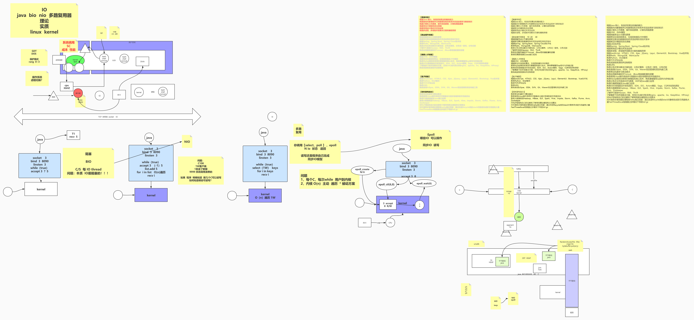
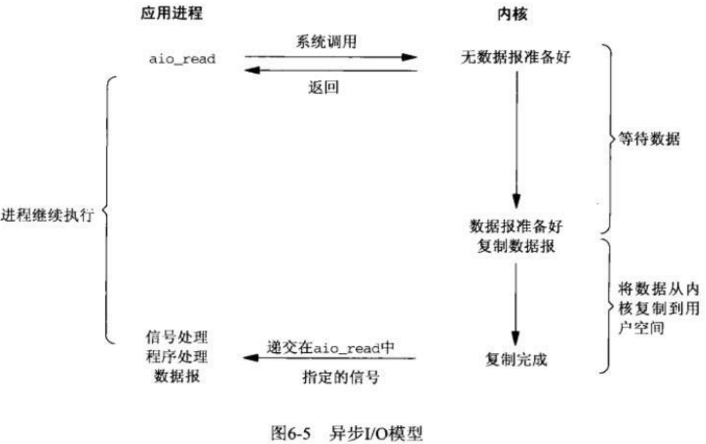
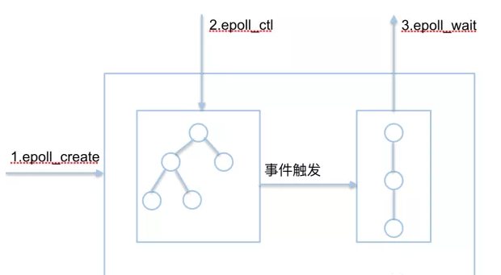

# [第3章 管道符、重定向与环境变量](https://www.linuxprobe.com/basic-learning-03.html)

# Linux 系统 

## 系统启动过程


1. 内核的引导。

2. 运行 init。

  init程序的类型：

  - **SysV:** init, CentOS 5之前, 配置文件： /etc/inittab。
  - **Upstart:** init,CentOS 6, 配置文件： /etc/inittab, /etc/init/*.conf。
  - **Systemd：** systemd, CentOS 7,配置文件： /usr/lib/systemd/system、 /etc/systemd/system。

| System V init 运行级别 | systemd 目标名称                    | 作用                                                        |
| ---------------------- | ----------------------------------- | ----------------------------------------------------------- |
| 0                      | runlevel0.target, poweroff.target   | 系统停机状态，系统默认运行级别不能设为0，否则不能正常启动   |
| 1                      | runlevel1.target, rescue.target     | 单用户模式，root权限，用于系统维护，禁止远程登陆            |
| 2                      | runlevel2.target, multi-user.target | 多用户状态（没有NFS，进入无网络服务）                       |
| 3                      | runlevel3.target, multi-user.target | 完全的多用户状态（有NFS），登陆后进入控制台命令行模式       |
| 4                      | runlevel4.target, multi-user.target | 系统未使用，保留                                            |
| 5                      | runlevel5.target, graphical.target  | X11控制台，登陆后进入图形GUI模式                            |
| 6                      | runlevel6.target, reboot.target     | 系统正常关闭并重启，默认运行级别不能设为6，否则不能正常启动 |
| emergency              | emergency.target                    | 紧急 Shell                                                  |

  

3. 系统初始化。

4. 建立终端 。

5. 用户登录系统。


## **系统目录结构**

| 目录        | 说明                                                         |
| ----------- | ------------------------------------------------------------ |
| `/bin`      | Binaries 存放二进制可执行文件(ls,cat,mkdir等)，**常用命令**一般都在这里。 |
| /boot       | 存放用于系统引导时使用的各种文件，包括一些连接文件以及镜像文件。 |
| /dev        | Device 用于存放设备文件。                                    |
| `/etc`      | Etcetera 存放**系统管理和配置**文件                          |
| `/home`     | **存放所有用户文件的根目录**，是用户主目录的基点，比如用户user的主目录就是/home/user，可以用~user表示 |
| /lib        | Library 存放跟文件系统中的程序运行所需要的共享库及内核模块。共享库又叫动态链接共享库，作用类似windows里的.dll文件，存放了根文件系统程序运行所需的共享文件。 |
| /lost+found | 这个目录平时是空的，系统非正常关机而留下“无家可归”的文件（windows下叫什么.chk）就在这里 |
| /media      | linux 系统会自动识别一些设备，例如U盘、光驱等等，当识别后，Linux 会把识别的设备挂载到这个目录下。 |
| /mnt        | Mount 系统管理员通常用作临时挂载点的空目录，系统提供这个目录是让用户临时挂载其他的文件系统。 |
| `/opt`      | **Optional 额外安装的可选应用程序包所放置的位置。**一般情况下，我们可以把tomcat等都安装到这里。 |
| /proc       | Processes 以文件形式显示进程信息的**虚拟文件系统**，是系统内存的映射，可直接访问这个目录来获取系统信息。 |
| `/root`     | **超级用户（系统管理员）的主目录（特权阶级^o^）**            |
| /sbin       | system (or superuser) binaries 存放二进制可执行文件，只有root才能访问。这里存放的是系统管理员使用的系统级别的管理命令和程序。如ifconfig等。 |
| /srv        | 该目录存放一些服务启动之后需要提取的数据。                   |
| /sys        | 这是 Linux2.6 内核的一个很大的变化。该目录下安装了 2.6 内核中新出现的一个文件系统 sysfs 。<br/>sysfs 文件系统集成了下面3种文件系统的信息：针对进程信息的 proc 文件系统、针对设备的 devfs 文件系统以及针对伪终端的 devpts 文件系统。<br/>该文件系统是内核设备树的一个直观反映。当一个内核对象被创建的时候，对应的文件和目录也在内核对象子系统中被创建。 |
| /tmp        | temporary 用于存放各种临时文件，是公用的临时文件存储点。     |
| `/usr`      | Unix System Resource用于存放系统应用程序，这是最庞大的目录，要用到的应用程序和文件几乎都在这个目录，类似于 windows 下的 program files 目录。<br/>比较重要的目录/usr/local **本地系统管理员软件安装目录（安装系统级的应用）**。<br />/usr/x11r6 存放x window的目录<br />/usr/bin 众多的应用程序<br /> /usr/sbin 超级用户的一些管理程序<br /> /usr/doc linux文档<br /> /usr/include linux下开发和编译应用程序所需要的头文件<br/> /usr/lib 常用的动态链接库和软件包的配置文件<br /> /usr/man 帮助文档<br /> /usr/src 源代码，linux内核的源代码就放在这里 <br />/usr/local/bin 本地增加的命令 <br />/usr/local/lib 本地增加的库 |
| `/var`      | variable 用于存放运行时需要改变数据的文件，也是某些大文件的溢出区，比方说各种**服务的日志文件（系统启动日志等。）**等。 |


## 文件基本属性


第一个字符：

- **[** **d** **]** 目录
- **[** **-** **]** 文件
- **[** **l** **]** 链接文档(link file)
- **[** **b** **]** 可供储存的接口设备(可随机存取装置)
- **[** **c** **]** 串行端口设备，例如键盘、鼠标(一次性读取装置)

**三种基本权限**

R          读          数值表示为4

W         写          数值表示为2

X          可执行   数值表示为1

> **更改权限**

在 Linux 中我们通常使用以下两个命令来修改文件或目录的所属用户与权限：

- chown (change ownerp) ： 修改所属用户与组。
- chmod (change mode) ： 修改用户的权限。

```bash
chgrp [-R] 属组名 文件名	#更改文件属组 -R：递归更改文件属组
chown [-R] 属主名[：属组名] 文件名	#可以同时更改文件属组
```


```bash
chmod [-R] xyz 文件或目录	#数字格式
chmod [-R] u=rwx,g=rwx,o-rwx 文件名	#
```

sudo chmod [u所属用户  g所属组  o其他用户  a所有用户]  [+增加权限  -减少权限 =设定]  [r  w  x]   文件或目录

例如：有一个文件filename，权限为“-rw-r----x” ,将权限值改为”-rwxrw-r-x”，用数值表示为765

`sudo chmod u+x g+w o+r  filename`

上面的例子可以用数值表示

`sudo chmod 765 filename`

> 隐藏权限

- chattr
- lsattr

| 参数 | 作用                                                         |
| ---- | ------------------------------------------------------------ |
| i    | 无法对文件进行修改；若对目录设置了该参数，则仅能修改其中的子文件内容而不能新建或删除文件 |
| a    | 仅允许补充（追加）内容，无法覆盖/删除内容（Append Only）     |
| S    | 文件内容在变更后立即同步到硬盘（sync）                       |
| s    | 彻底从硬盘中删除，不可恢复（用0填充原文件所在硬盘区域）      |
| A    | 不再修改这个文件或目录的最后访问时间（atime）                |
| b    | 不再修改文件或目录的存取时间                                 |
| D    | 检查压缩文件中的错误                                         |
| d    | 使用dump命令备份时忽略本文件/目录                            |
| c    | 默认将文件或目录进行压缩                                     |
| u    | 当删除该文件后依然保留其在硬盘中的数据，方便日后恢复         |
| t    | 让文件系统支持尾部合并（tail-merging）                       |
| x    | 可以直接访问压缩文件中的内容                                 |


## 命令

- **绝对路径：**路径的写法，由根目录 **/** 写起，例如： /usr/share/doc 这个目录。
- **相对路径：**路径的写法，不是由 **/** 写起，例如由 /usr/share/doc 要到 /usr/share/man 底下时，可以写成： **cd ../man** 这就是相对路径的写法。

### 目录命令

- `ls` (list files)：列出目录及文件名
  - -l：列出文件详细信息l(list)
  - -a：列出当前目录下所有文件及目录，包括隐藏的a(all)  (ls内定将文件名或目录名称开头为"."的视为隐藏档，不会列出)
  - -Z	用于查看文件的安全上下文值
  - -d	代表对象是个文件夹
- `cd` (change directory)：切换目录
  - cd -：返回到上一次所处的目录
  - cd ..：进入上级目录
  - cd ~：切换到当前用户的家目录
  - cd ~xxx：
- `pwd` (print work directory)： 命令用于显示工作目录。
  - -P ：显示出确实的路径，而非使用连结 (link) 路径。
- `mkdir` (make directory)：创建目录
  - -p：创建目录，若无父目录，则创建p(parent)	mkdir -p runoob2/test
  - -m：配置文件的权限喔！直接配置，不需要看默认权限 (umask) 的脸色～
- rmdir (remove directory)：删除一个空的目录
- `cp` (copy file)： 复制文件或目录
  - -p	保留原始文件的属性
  - -d	若对象为“链接文件”，则保留该“链接文件”的属性
  - -r	递归持续复制（用于目录）
  - -i	若目标文件存在则询问是否覆盖
  - -a	相当于-pdr（p、d、r为上述参数）
- `mv` (move file)：重命名或移动文件或目录
- `rm` (remove)：删除文件或者目录
  - -r：递归删除，可删除子目录及文件
  - -f：强制删除
  - -i	删除前询问
  - -v	显示过程


### 文件命令

- cat (concatenate)：由第一行开始显示文件内容，适用于较少内容文件
  - -n	显示行号
- tac：从最后一行开始显示，可以看出 tac 是 cat 的倒着写！
- nl：显示的时候，顺道输出行号！
- more：分页显示文本文件内容
  - 空白键 (space)：代表向下翻一页；
  - Enter：代表向下翻『一行』；
  - /字串：代表在这个显示的内容当中，向下搜寻『字串』这个关键字；
  - :f      ：立刻显示出档名以及目前显示的行数；
  - q       ：代表立刻离开 more ，不再显示该文件内容。
  - b 或 [ctrl]-b ：代表往回翻页，不过这动作只对文件有用，对管线无用。
- less：分页显示文本文件内容，可往前翻页
  - 空白键  ：向下翻动一页；
  - [pagedown]：向下翻动一页；
  - [pageup] ：向上翻动一页；
  - /字串   ：向下搜寻『字串』的功能；
  - ?字串   ：向上搜寻『字串』的功能；
  - n     ：重复前一个搜寻 (与 / 或 ? 有关！)
  - N     ：反向的重复前一个搜寻 (与 / 或 ? 有关！)
  - q     ：离开 less 这个程序；
- head、tail：显示文件头、尾内容
  - -n [number]：显示几行，默认10行
- tr：transform替换文本内容中的字符；tr [原始字符] [目标字符]

```bash
把某个文本内容中的英文全部替换为大写
#cat anaconda-ks.cfg | tr [a-z] [A-Z]
```

- wc：word counts默认统计文本中行数、字数、字节数；wc -l /etc/passwd 统计系统用户
  - -l --lines
  - -w --words
  - -c --bytes
  - -m --chars

- `stat`：显示指定文件的详细信息（具体存储细节和时间等信息），比ls更详细

- `grep`：按行提取文本内容	查找当前系统中不允许登录系统的所有用户的信息：grep /sbin/nologin /etc/passwd

  - **-n**	显示搜索到的信息的行号；
  - **-v**	反选信息（即没有包含关键词的所有信息行）。
  - -b	将可执行文件(binary)当作文本文件（text）来搜索
  - -c	仅显示找到的行数
  - -i	忽略大小写

- cut：按“列”提取文本内容

  ```bash
  提取出passwd文件中的用户名信息，即提取以冒号（：）为间隔符号的第一列内容：(-d 间隔符，-f 查看列数)
  # cut -d : -f 1 /etc/passwd
  ```

- diff：比较多个文件之间内容的差异

  - --brief	确认两个文件是否相同
  - -c	详细比较出多个文件的差异之处

- uniq：去除文本中连续的重复行，中间不能夹杂其他文本行（非相邻的默认不会去重）

- `sort`：对文本内容进行再排序，默认会按照字母顺序进行排序

  - -f	忽略大小写
  - -b	忽略缩进与空格
  - -n	以数值型排序
  - -r	反向排序
  - -u	去除重复行
  - -t	指定间隔符
  - -k	设置字段范围

  ```bash
  # cat user.txt 
  tss:x:59:59:Account used by the trousers package to sandbox the tcsd daemon
  polkitd:x:998:996:User for polkitd
  geoclue:x:997:995:User for geoclue
  rtkit:x:172:172:RealtimeKit
  pulse:x:171:171:PulseAudio System Daemon
  
  可以用-t参数指定间隔符，用-k参数指定第几列，用-n参数进行数字排序来搞定：
  #sort -t : -k 3 -n user.txt 
  ```

- `find`：按照指定条件来查找文件所对应的位置	find [查找范围] 寻找条件（如文件名、大小、修改时间、权限等信息）

  - -name	匹配名称
  - -perm	匹配权限（mode为完全匹配，-mode为包含即可）
  - -user	匹配所有者
  - -group	匹配所有组
  - -mtime -n +n	匹配修改内容的时间（-n指n天以内，+n指n天以前）
  - -atime -n +n	匹配访问文件的时间（-n指n天以内，+n指n天以前）
  - -ctime -n +n	匹配修改文件权限的时间（-n指n天以内，+n指n天以前）
  - -nouser	匹配无所有者的文件
  - -nogroup	匹配无所有组的文件
  - -newer f1 !f2	匹配比文件f1新但比f2旧的文件
  - -type b/d/c/p/l/f	匹配文件类型（后面的字母依次表示块设备、目录、字符设备、管道、链接文件、文本文件）
  - -size	匹配文件的大小（+50KB为查找超过50KB的文件，而-50KB为查找小于50KB的文件）
  - -prune	忽略某个目录
  - -exec …… {}\;	exec后面可跟用于进一步处理搜索结果的命令，{}表示find命令搜索出的每一个文件，并且命令的结尾必须是“\;”。如：find / -user linuxprobe -exec cp -a {} /root/findresults/ \;

- locate：按照名称快速搜索文件所对应的位置。

  ```bash
  第一次使用locate命令之前，记得先执行updatedb命令来生成索引数据库，然后再进行查找：
  #updatedb
  #ls -l /var/lib/mlocate/mlocate.db
  使用locate命令搜索出所有包含“whereis”名称的文件所在的位置：
  #lcoate whereis
  ```

- whereis：按照名称快速搜索二进制程序（命令）、源代码以及帮助文件所对应的位置

- which：照指定名称快速搜索二进制程序（命令）所对应的位置

- `touch`：创建空白文件或设置文件的时间

  - -a	仅修改“读取时间”（atime）

  - -m	仅修改“修改时间”（mtime）
  - -d	同时修改atime与mtime

  ```bash
  # ls -l anaconda-ks.cfg
  -rw-------. 1 root root 1213 May  4 15:44 anaconda-ks.cfg
  # echo "Visit the LinuxProbe.com to learn linux skills" >> anaconda-ks.cfg
  # ls -l anaconda-ks.cfg
  -rw-------. 1 root root 1260 Aug  2 01:26 anaconda-ks.cfg
  如果不想让别人知道我们修改了它，那么这时就可以用touch命令把修改后的文件时间设置成修改之前的时间（很多黑客就是这样做的呢）：
  # touch -d "2020-05-04 15:44" anaconda-ks.cfg 
  # ls -l anaconda-ks.cfg 
  -rw-------. 1 root root 1260 May  4 15:44 anaconda-ks.cfg
  ```

- `dd`：按照指定大小和个数的数据块来复制文件或转换文件，语法格式为“dd if=参数值of=参数值count=参数值bs=参数值”。**Linux系统中有一个名为/dev/zero的设备文件，不会占用系统存储空间，但却可以提供无穷无尽的数据。**

  - if	输入的文件名称
  - of	输出的文件名称
  - count	设置要复制“块”的个数
  - bs	设置每个“块”的大小

  ```bash
  用dd命令从/dev/zero设备文件中取出一个大小为560MB的数据块，然后保存成名为560_file的文件。能随意创建任意大小的文件了：
  #dd if=/dev/zero of=560_file count=1 bs=560M
  ```

- file：查看文件的类型

  ```bash
  # file anaconda-ks.cfg 
  anaconda-ks.cfg: ASCII text
  # file /dev/sda
  /dev/sda: block special
  ```

- `tar`：对文件进行打包压缩或解压（,tar、tar.gz、.tar.bz2格式）

  - -c	创建打包文件
  - -x	提取打包文件
  - -z	用gzip压缩或解压
  - -j	用bzip2压缩或解压
  - -v	显示压缩或解压缩过程
  - -f	目标文件名
  - -p	保留原始的权限与属性   
  - -P	使用绝对路径来压缩
  - -C	指定解压到的目录

  ```bash
  #tar -cvf /home/abc.tar /home/abc           只打包，不压缩
  #tar -czvf /home/abc.tar.gz /home/abc       打包，并用gzip压缩
  #tar -cjvf /home/abc.tar.bz2 /home/abc      打包，并用bzip2压缩
  
  如果想解压缩，就直接替换上面的命令中的“c” 换成“x” 就可以了。
  #tar -xvf /home/abc.tar 
  #tar -xzvf /home/abc.tar.gz
  #tar -xjvf /home/abc.tar.bz2 
  ```

  


### 其他命令

- tree：树形结构显示目录下的所有文件，包括子目录里的文件。需要安装tree包

- ln (link files)：命令是一个非常重要命令，它的功能是为某一个文件在另外一个位置建立一个同步的链接。创建链接文件
  - 硬链接（Hard Link）
  - -s：符号链接（Symbolic Link），类似快捷方式：不带该参数默认为硬链接
  - -f：强制创建文件或目录的链接
  - -i：覆盖前先询问
  - -v：显示创建链接的过程
  
- ctrl+alt+F1：命令行全屏模式

- nc：所做的就是在两台电脑之间建立链接并返回两个数据流，能建立一个服务器，传输文件，与朋友聊天，传输流媒体或者用它作为其它协议的独立客户端。

- at：一次性计划任务

  - -f	指定包含命令的任务文件
  - -q	 指定新任务名称
  - -l	 显示待执行任务列表
  - -d	删除指定待执行任务
  - -m	任务执行后给用户发邮件

  ```bash
  将系统设置为在今晚23:30自动重启网站服务。
  # at 23:30
  warning: commands will be executed using /bin/sh
  at> systemctl restart httpd
  at> 此处请同时按下<Ctrl>+<d>键来结束编写计划任务
  job 1 at Wed Oct 14 23:30:00 2020
  # at -l
  1 Wed Oct 14 23:30:00 2020 a root
  
  或直接用
  # echo "systemctl restart httpd" | at 23:00
  删除指定任务
  #atrm 2
  用户激活该脚本后再开始倒计时执行
  # at now +2 MINUTE
  warning: commands will be executed using /bin/sh
  at> systemctl restart httpd
  at> 此处请同时按下<Ctrl>+<d>键来结束编写计划任务
  job 3 at Wed Oct 14 22:50:00 2020
  ```

- crontab：周期性地、有规律地执行某些具体的任务。

  - -e	编辑计划任务
  - -u	指定用户名称
  - -l	列出任务列表
  - -r	删除计划任务

   “分、时、日、月、星期 命令”

  逗号（,）来分别表示多个时间段；用减号（-）来表示一段连续的时间周期；用除号（/）表示执行任务的间隔时间。计划任务中的“分”字段必须有数值，绝对不能为空或是*号，而“日”和“星期”字段不能同时使用，否则就会发生冲突。

  所有命令一定要用**绝对路径**，可用whereis xxx 查询。

  ```bash
  # crontab -e
  no crontab for root - using an empty one
  crontab: installing new crontab
  # crontab -l
  25 3 * * 1,3,5 /usr/bin/tar -czvf backup.tar.gz /home/wwwroot
  
  # whereis rm
  rm: /usr/bin/rm /usr/share/man/man1/rm.1.gz /usr/share/man/man1p/rm.1p.gz
  # crontab -e
  crontab: installing new crontab
  # crontab -l
  25 3 * * 1,3,5 /usr/bin/tar -czvf backup.tar.gz /home/wwwroot
  0  1 * * 1-5   /usr/bin/rm -rf /tmp/*
  ```

  


### 系统管理命令

- who：显示在线登陆用户
  - -r  显示runlevel
- whoami：显示当前操作用户
- hostname：显示主机名
- last：调取主机的被访记录，每次的登录信息都记录到日志文件中
- uname：显示系统简要信息
  - **-a**：显示系统完整信息		查看系统**内核版本**与系统架构等信息
- cat /etc/centos-release：查看当前**系统版本**的详细信息
- uptime：查看系统的负载信息
- lscpu：显示cpu体系结构信息
- lsmem：列出可用内存的范围及其联机状态
- `free`：显示当前系统中可用和已用内存的使用量信息   free [-h]
- `echo`：在终端设备上输出字符串或变量提取后的值，语法格式为“echo [字符串] [$变量]”。echo $SHELL
- date "+%Y-%m-%d %H:%M:%S"   ：按照默认格式查看当前系统时间
- timedatectl：设置系统的时间
- `wget`：在终端命令行中下载网络文件	wget [参数] 网址
  - -b	后台下载模式
  - -P	下载到指定目录
  - -t	最大尝试次数
  - -c	断点续传
  - -p	下载页面内所有资源，包括图片、视频等
  - -r	递归下载
- `top`：动态显示当前耗费资源最多进程信息
- `ps`：显示瞬间进程状态 
  - **-aux** 		a显示所有进程（包括其他用户的进程）；u用户以及其他详细信息；x显示没有控制终端的进程
  - **-ef**         显示系统常驻进程
- pstree：以树状图的形式展示进程之间的关系
- nice：用于调整进程的优先值（用户层面）	nice -n -20 bash
- pidof：查询某个指定服务进程的PID号码值	pidof sshd
- kill： 终止某个指定PID值的服务进程。先用 ps 或 top 查看进程的id，再用kill命令杀死进程。kill 2156          		  参数-9最高级别强制杀死进程。   kill -9 2156
- killall：终止某个指定名称的服务所对应的全部进程  killall httpd
- `ifconfig`：获取网卡配置与网络状态等信息
- ping：测试网络连通
  - -c	总发送次数
  - -l	指定网卡名称
  - -i	每次间隔时间（秒）
  - -W	最长等待时间（秒）
- tracepath：显示数据包到达目的主机时途中经过的所有路由信息
- `netstat` ：显示如网络连接、路由表、接口状态等的网络相关信息	-natp
  - -a	显示所有连接中的Socket
  - -p	显示正在使用的Socket信息
  - -t	显示TCP协议的连接状态
  - -u	显示UDP协议的连接状态
  - -n	使用IP地址，不使用域名
  - -l	仅列出正在监听的服务状态
  - -i	显示网卡列表信息
  - -r	显示路由表信息
- blkid：显示设备的属性信息，英文全称为“block id“，使用blkid命令来查询设备UUID挂载变化名字的网络存储设备。
- `history`：显示执行过的命令历史，可自定义/etc/profile文件中的HISTSIZE变量值（默认1000），可用“!编码数字”的方式来重复执行某一次的命令。保存在用户家目录中的.bash_history。
  - -c	清空所有的命令历史记录
- sosreport：用于收集系统配置及架构信息并输出诊断文档
- `man` ：显示命令手册 manual（如系统调用 man 2 socket）
  -  `yum -y install man-pages`
- clear：清屏 ctrl+L
- alias：对命令重命名 如：alias showmeit=”ps aux” ，另外解除使用unalias showmeit
- chkconfig --list


### 服务管理命令

#### systemctl

| System V init 命令 （RHEL 6） | systemctl 命令 （RHEL 7）                | 作用                               |
| ----------------------------- | ---------------------------------------- | ---------------------------------- |
| service foo start             | systemctl start foo.service              | 启动服务                           |
| service foo restart           | systemctl restart foo.service            | 重启服务                           |
| service foo stop              | systemctl stop foo.service               | 停止服务                           |
| service foo reload            | systemctl reload foo.service             | 重新加载配置文件（不终止服务）     |
| service foo status            | systemctl status foo.service             | 查看服务状态                       |
|                               |                                          |                                    |
| chkconfig foo on              | systemctl enable foo.service             | 开机自动启动                       |
| chkconfig foo off             | systemctl disable foo.service            | 开机不自动启动                     |
| chkconfig foo                 | systemctl is-enable foo.service          | 查看特定服务是否为开机自动启动     |
| chkconfig --list              | systemctl list-unit-files --type=service | 查看各个级别下服务的启动与禁用情况 |


#### firewall

```bash
# 开启防火墙
systemctl start firewalld.service

# 防火墙开机启动
systemctl enable firewalld.service

# 关闭防火墙
systemctl stop firewalld.service

# 查看防火墙状态
firewall-cmd --state

# 查看现有的规则
iptables -nL
firewall-cmd --zone=public --list-ports

# 重载防火墙配置
firewall-cmd --reload

# 添加单个单端口
firewall-cmd --permanent --zone=public --add-port=81/tcp

# 添加多个端口
firewall-cmd --permanent --zone=public --add-port=8080-8083/tcp

# 删除某个端口
firewall-cmd --permanent --zone=public --remove-port=81/tcp

# 针对某个 IP开放端口
firewall-cmd --permanent --add-rich-rule="rule family="ipv4" source address="192.168.142.166" port protocol="tcp" port="6379" accept"
firewall-cmd --permanent --add-rich-rule="rule family="ipv4" source address="192.168.0.233" accept"

# 删除某个IP
firewall-cmd --permanent --remove-rich-rule="rule family="ipv4" source address="192.168.1.51" accept"

# 针对一个ip段访问
firewall-cmd --permanent --add-rich-rule="rule family="ipv4" source address="192.168.0.0/16" accept"
firewall-cmd --permanent --add-rich-rule="rule family="ipv4" source address="192.168.1.0/24" port protocol="tcp" port="9200" accept"

# 添加操作后别忘了执行重载
firewall-cmd --reload
```


### 磁盘命令

- **df**（disk free）：**列出文件系统的整体磁盘使用量**。通过文件系统来快速获取空间大小的信息，当我们删除一个文件的时候，这个文件不是马上就在文件系统当中消失了，而是暂时消失了，当所有程序都不用时，才会根据OS的规则释放掉已经删除的文件， df记录的是通过文件系统获取到的文件的大小，他比du强的地方就是能够看到已经删除的文件，而且计算大小的时候，把这一部分的空间也加上了，更精确了。当文件系统也确定删除了该文件后，这时候du与df就一致了。
  - -a ：列出所有的文件系统，包括系统特有的 /proc 等文件系统；
  - -k ：以 KBytes 的容量显示各文件系统；
  - -m ：以 MBytes 的容量显示各文件系统；
  - -**h** ：以人们较易阅读的 GBytes, MBytes, KBytes 等格式自行显示；
  - -H ：以 M=1000K 取代 M=1024K 的进位方式；
  - -T ：显示文件系统类型, 连同该 partition 的 filesystem 名称 (例如 ext3) 也列出；
  - -i ：不用硬盘容量，而以 inode 的数量来显示
  
- **du**（disk usage）：**检查文件和目录占用的磁盘空间使用量**，会直接到文件系统内去搜寻所有的文件数据。是通过搜索文件来计算每个文件的大小然后累加，du能看到的文件只是一些当前存在的，没有被删除的。他计算的大小就是当前他认为存在的所有文件大小的累加和。
  
  - -a ：列出所有的文件与目录容量，因为默认仅统计目录底下的文件量而已。
  - -**h** ：以人们较易读的容量格式 (G/M) 显示；
  - -s ：列出总量而已，而不列出每个目录下子目录的占用容量；
  - -S ：不包括子目录下的总计，与 -s 有点差别。（每个子目录单独列出）
  - -k ：以 KBytes 列出容量显示；
  - -m ：以 MBytes 列出容量显示；
  - 检查根目录底下每个目录所占用的容量：**du -sm /***
  
- lsblk：查看已挂载的磁盘的空间使用情况-树状图的形式

- **fdisk** (format disk)：**磁盘分区**表操作工具
  
  - -l：输出后面接的装置所有的分区内容。若仅有 fdisk -l 时， 则系统将会把整个系统内能够搜寻到的装置的分区均列出来。
  - -m	查看全部可用的参数
  - -n	添加新的分区
  - -d	删除某个分区信息
  - -t	改变某个分区的类型
  - -p	查看分区表信息
  - -w	保存并退出
  - -q	不保存直接退出
  
- mkfs：**磁盘格式化** `mkfs [-t 文件系统格式] 装置文件名`
  
  - -t：可以接文件系统格式，例如 ext3, ext2, vfat 等(系统有支持才会生效)，mkfs\[tab][tab]查看 mkfs 支持的文件格式
  
- fsck：（file system check）**磁盘检验**。用来检查和维护不一致的文件系统。若系统掉电或磁盘发生问题，可利用fsck命令对文件系统进行检查。 `fsck [-t 文件系统] [-ACay] 装置名称`
  - -t : 给定档案系统的型式，若在 /etc/fstab 中已有定义或 kernel 本身已支援的则不需加上此参数
  - -s : 依序一个一个地执行 fsck 的指令来检查
  - -A : 对/etc/fstab 中所有列出来的 分区（partition）做检查
  - -C : 显示完整的检查进度
  - -d : 打印出 e2fsck 的 debug 结果
  - -p : 同时有 -A 条件时，同时有多个 fsck 的检查一起执行
  - -R : 同时有 -A 条件时，省略 / 不检查
  - -V : 详细显示模式
  - -a : 如果检查有错则自动修复
  - -r : 如果检查有错则由使用者回答是否修复
  - -y : 选项指定检测每个文件是自动输入yes，在不确定那些是不正常的时候，可以执行 # fsck -y 全部检查修复。
  
- mount：磁盘挂载。 `mount [-t 文件系统] [-L Label名] [-o 额外选项] [-n]  设备文件  挂载目录`

  - -a	挂载所有在/etc/fstab中定义的文件系统
  - -t	 指定文件系统的类型
  - mount UUID=478fRb-1pOc-oPXv-fJOS-tTvH-KyBz-VaKwZG /backup	blkid查询UUID

  查看系统mount信息

  - 第一：查看/etc/fstab文件	命令: cat /etc/fstab
  - 第二：[df](https://www.baidu.com/s?wd=df&tn=SE_PcZhidaonwhc_ngpagmjz&rsv_dl=gh_pc_zhidao) -Th可以看到挂载的信息
  - 第三：mount可以看到你所要的信息

  | /etc/fstab 字段 | 意义                                                         |
  | :-------------- | :----------------------------------------------------------- |
  | 设备文件        | 一般为设备的路径+设备名称，也可以写唯一识别码（UUID，Universally Unique Identifier） |
  | 挂载目录        | 指定要挂载到的目录，需在挂载前创建好                         |
  | 格式类型        | 指定文件系统的格式，比如Ext3、Ext4、XFS、SWAP、iso9660（此为光盘设备）等 |
  | 权限选项        | 若设置为defaults，则默认权限为：rw, suid, dev, exec, auto, nouser, async |
  | 是否备份        | 若为1则开机后使用dump进行磁盘备份，为0则不备份               |
  | 是否自检        | 若为1则开机后自动进行磁盘自检，为0则不自检                   |

- umount：磁盘卸除。 `umount [-fn] 设备文件或挂载目录`
  - -f ：强制卸除！可用在类似网络文件系统 (NFS) 无法读取到的情况下；
  - -n ：不升级 /etc/mtab 情况下卸除。
  


### 关机/重启机器命令

- shutdown	会给系统计划一个时间关机。它可以被用于停止、关机、重启机器。<br>`shutdown [OPTIONS...] [TIME] [WALL...]`<br>		你可以指定一个时间字符串（通常是 **now**（+0） 、**+m**分钟（如果未指定时间参数，则暗指“+1”）、 **hh:mm** 指定小时/分钟）作为第一个参数TIME。另外你也可以设置一个广播信息在系统关闭前发送给所有已登录的用户。

  ​		重要：如果使用了时间参数，系统关机前 5 分钟，会创建 `/run/nologin` 文件。以确保没有人可以再登录。

  - -H, --halt：停机
  - -P, --poweroff：关机
  - -r, --reboot：重启
  - -h：等同于--poweroff，除非指定了--halt。
  - -k : 并不会真的关机，只是将警告讯息传送给所有使用者。
  - -c : 取消目前已经进行中的关机动作。


- halt                 通知硬件来**停止**所有的 CPU 功能，但是仍然保持通电。你可以用它使系统处于低层维护状态。
- poweroff	   会发送一个 ACPI（高级配置和管理电源接口） 信号来通知系统**关机**。
- reboot           **重启**。

```bash
halt, poweroff, reboot三条命令共同参数，不管调用哪条命令都以以下参数为主
--halt			### 停止机器
-p, --poweroff	### 关闭机器
--reboot		### 重启机器
-f, --force
-w, --wtmp-only
-d, --no-wtmp
--no-wall
```


## 用户及用户组管理

### 用户账号管理

```bash
useradd 选项 用户名
# useradd –d  /home/sam -m sam
# useradd -s /bin/sh -g group –G adm,root gem
```

- -c	comment 指定一段注释性描述。
- -d	指定用户的家目录（默认为/home/username），如果此目录不存在，则同时使用-m选项，可以创建主目录。
- -g	用户组，指定用户所属的用户组。
- -G	用户组，指定用户所属的附加组。
- -s	Shell文件 指定用户的登录Shell。
- -u	用户号，指定用户的用户号，如果同时有-o选项，则可以重复使用其他用户的标识号。

```bash
userdel 选项 用户名
# userdel -r sam	把用户的主目录一起删除。
```

```
usermod 选项 用户名
```

​		常用选项同useradd，有些系统可以使用选项：-l 新用户名，这个选项指定一个新的账号，即将原来的用户名改为新的用户名。

> 用户口令管理

​		账号必须为其指定口令后才可以使用，即使是指定空口令。

```bash
#如果默认用户名，则修改当前用户的口令。
#如果是超级用户，则可以指定任何用户的口令。不需要知道原口令。
passwd 选项 用户名
```

- -l	锁定口令，即禁用账号。
- -u	口令解锁。
- -d	使账号无口令。
- -f	强迫用户下次登录时修改口令。
- -S	显示用户的密码是否被锁定，以及密码所采用的加密算法名称


#### 与用户账号有关的系统文件

- **/etc/passwd** 中一行记录对应着一个用户的一些基本属性，每行记录又被冒号(:)分隔为7个字段，其格式和具体含义如下：

```bash
#用户名:口令:用户标识号:组标识号:注释性描述:主目录:登录Shell
#shell常用的有sh(Bourne Shell), csh(C Shell), ksh(Korn Shell), tcsh(TENEX/TOPS-20 type C Shell), bash(Bourne Again Shell)等。
root:x:0:0:root:/root:/bin/bash
...
```

伪用户（pseudo users）：

```bash
伪 用 户 含 义 
bin 拥有可执行的用户命令文件 
sys 拥有系统文件 
adm 拥有帐户文件 
uucp UUCP使用 
lp lp或lpd子系统使用 
nobody NFS使用

audit、cron、mail、usenet...
```

- **/etc/shadow** 中的记录行与/etc/passwd中的一一对应，它由pwconv命令根据/etc/passwd中的数据自动产生的加密口令。

```bash
#登录名:加密口令:最后一次修改时间:最小时间间隔:最大时间间隔:警告时间:不活动时间:失效时间:标志
root:$6$yW9tCV96E6.Hc9y/$mMLsdRF9Y0l9HsJtP9xjAzEhO7UcmNpXfQuxLGBZOyCsuCD41B4uRcBo2ZROX10qKM8/gG5dz2t4bqZDGN0H71:18582:0:99999:7:::
```

- **/etc/group** 用户组信息，访问附加组需先使用**newgrp**切换组

```bash
#组名:口令:组标识号:组内用户列表
root::0:root
bin::2:root,bin
```

- **/etc/gshadow**  存储用户组口令

#### 批量添加用户

```bash
1、先编辑一个文本用户文件内容如下。
user001::600:100:user:/home/user001:/bin/bash
user002::601:100:user:/home/user002:/bin/bash
...

2、以root身份执行命令 /usr/sbin/newusers，从刚创建的用户文件user.txt中导入数据，创建用户：
# newusers < user.txt
3、执行命令/usr/sbin/pwunconv。将 /etc/shadow 产生的 shadow 密码解码，然后回写到 /etc/passwd 中，并将/etc/shadow的shadow密码栏删掉。这是为了方便下一步的密码转换工作，即先取消 shadow password 功能。
# pwunconv
4、编辑每个用户的密码对照文件。实例文件 passwd.txt 内容如下：
user001:123456
user002:123456
...
5、以 root 身份执行命令 /usr/sbin/chpasswd。
创建用户密码，chpasswd 会将经过 /usr/bin/passwd 命令编码过的密码写入 /etc/passwd 的密码栏。
# chpasswd < passwd.txt
6、确定密码经编码写入/etc/passwd的密码栏后。执行命令 /usr/sbin/pwconv 将密码编码为 shadow password，并将结果写入 /etc/shadow。
# pwconv
```


### 用户组的管理

```bash
#-g GID 指定新用户组的组标识号（GID）。
#-o 一般与-g选项同时使用，表示新用户组的GID可以与系统已有用户组的GID相同。
groupadd 选项 用户组

groupdel 用户组

#-g GID 为用户组指定新的组标识号。
#-o 与-g选项同时使用，用户组的新GID可以与系统已有用户组的GID相同。
#-n 新用户组 将用户组的名字改为新名字
groupmod 选项 用户组

#切换到其他用户组如root组
newgrp root
```


### su sudo

```bash
减号（-）表示完全切换到新的用户，即把环境变量信息也变更为新用户的相应信息，而不是保留原始的信息。
# su - linuxprobe
```

sudo 集中管理用户与权限（/etc/sudoers），如果担心直接修改配置文件会出现问题，则可以使用sudo命令提供的visudo命令来配置用户权限。

| 参数             | 作用                                                   |
| ---------------- | ------------------------------------------------------ |
| -h               | 列出帮助信息                                           |
| -l               | 列出当前用户可执行的命令                               |
| -u 用户名或UID值 | 以指定的用户身份执行命令                               |
| -k               | 清空密码的有效时间，下次执行sudo时需要再次进行密码验证 |
| -b               | 在后台执行指定的命令                                   |
| -p               | 更改询问密码的提示语                                   |


？？？

su root             临时提权到root用户

su – root           切换到root用户

/etc/profile        系统环境变量

bash_profile      用户环境变量

.bashrc             用户环境变量

su user             切换用户，加载配置文件.bashrc

su – user           切换用户，加载配置文件/etc/profile ，加载bash_profile

更改文件的用户及用户组

sudo chown [-R递归] owner[:group] {File|Directory}

要想切换文件所属的用户及组。可以使用命令。

sudo chown root:root rarlinux-x64-5.1.b3.tar.gz

？？？


## 输入输出重定向

​		输入重定向是指把文件导入到命令中，而输出重定向则是指把原本要输出到屏幕的数据信息写入到指定文件中。

| 名称                     | 文件描述符fd (File Descriptor) | 操作符           | Java中表示 | Linux 下文件描述符（Debian 为例)             |
| ------------------------ | ------------------------------ | ---------------- | ---------- | -------------------------------------------- |
| 标准输入(**stdin**)      | 0                              | < 或 <<          | System.in  | /dev/stdin -> /proc/self/fd/0 -> /dev/pts/0  |
| 标准输出(**stdout**)     | 1                              | >, >>, 1> 或 1>> | System.out | /dev/stdout -> /proc/self/fd/1 -> /dev/pts/0 |
| 标准错误输出(**stderr**) | 2                              | 2> 或 2>>        | System.err | /dev/stderr -> /proc/self/fd/2 -> /dev/pts/0 |

 输入重定向中用到的符号及其作用

| 符号                    | 作用                                            |
| ----------------------- | ----------------------------------------------- |
| 命令 < 文件             | 将文件作为命令的标准输入                        |
| 命令 << 分界符delimiter | 从标准输入中读入，直到遇见分界符delimiter才停止 |
| 命令 < 文件1 > 文件2    | 将文件1作为命令的标准输入并将标准输出到文件2    |

输出重定向中用到的符号及其作用

| 符号                                         | 作用                                                         |
| -------------------------------------------- | ------------------------------------------------------------ |
| 命令 > 文件                                  | 将标准输出重定向到一个文件中（清空原有文件的数据）           |
| 命令 2> 文件                                 | 将错误输出重定向到一个文件中（清空原有文件的数据）           |
| 命令 >> 文件                                 | 将标准输出重定向到一个文件中（追加到原有内容的后面）         |
| 命令 2>> 文件                                | 将错误输出重定向到一个文件中（追加到原有内容的后面）         |
| 命令 > 文件 2>&1 <br>或&> 文件<br/>或>& 文件 | 将标准输出与错误输出共同写入到文件中（清空原有文件的数据）   |
| 命令 >> 文件 2>&1 <br/>或 命令 &>> 文件      | 将标准输出与错误输出共同写入到文件中（追加到原有内容的后面） |


## Linux符号

​		将一个命令的标准输出作为另一个命令的标准输入。也就是把几个命令组合起来使用，后一个命令处理前一个命令的输出结果。
例：grep -r “close” /home/* | more       在home目录下所有文件中查找，包括close的文件，并分页输出。

| `&`  | 表示任务在后台执行，如要在后台运行redis-server,则有 `redis-server &` |
| :--: | ------------------------------------------------------------ |
| `&&` | 表示前一条命令执行成功时，才执行后一条命令 ，如 `echo '1‘ && echo '2'` |
| `|`  | 表示管道，上一条命令的输出，作为下一条命令参数，如 `echo 'yes' | wc -l` |
| `||` | 表示上一条命令执行失败后，才执行下一条命令，如 `cat nofile || echo "fail"` |
| `;`  | 表示顺序执行，命令之间没有任何逻辑联系。如`command1;command2;command3` |

> 转义字符

| **反斜杠（\）**   | 使反斜杠后面的一个变量变为单纯的字符。 |
| ----------------- | -------------------------------------- |
| **单引号（' '）** | 转义其中所有的变量为单纯的字符串。     |
| **双引号（" "）** | 保留其中的变量属性，不进行转义处理。   |
| **反引号（\``）** | 把其中的命令执行后返回结果。           |

**==如果参数中出现了空格，就加双引号；如果参数中没有空格，那就不用加双引号。==**


## 快捷键

| Tab               | 接在一串指令的第一个字的后面，则为『命令补全』;<br/>接在一串指令的第二个字以后时，则为『文件补齐』 |
| ----------------- | ------------------------------------------------------------ |
| Ctrl + C          | **停止程序**                                                 |
| Ctrl + D          | **键盘输入结束(End Of File, EOF 或 End Of Input)；<br>替代exit退出** |
| Ctrl + L          | **clear清屏**                                                |
| Shift + Page Up   | **往前翻页**                                                 |
| Shift + Page Down | **往后翻页**                                                 |


## vi/vim


vim三种模式：**命令模式（Command mode）**，**输入模式（Insert mode）**和**底线命令模式（Last line mode）**。使用 `Esc 或 i a o 或 : `来切换模式。

命令模式下：

|  dd  | 删除（剪切）光标所在整行                           |
| :--: | -------------------------------------------------- |
| 5dd  | 删除（剪切）从光标处开始的5行                      |
|  yy  | 复制光标所在整行                                   |
| 5yy  | 复制从光标处开始的5行                              |
|  n   | 显示搜索命令定位到的下一个字符串                   |
|  N   | 显示搜索命令定位到的上一个字符串                   |
|  u   | 撤销上一步的操作                                   |
|  p   | 将之前删除（dd）或复制（yy）过的数据粘贴到光标后面 |

底线命令模式下：

|     `:q`      | 退出                                                     |
| :-----------: | -------------------------------------------------------- |
|     `:q!`     | 强制退出不保存                                           |
|     `:wq`     | 保存并退出                                               |
|   `:set nu`   | 显示行号                                                 |
|  `:set nonu`  | 隐藏行号                                                 |
|    `:整数`    | 跳转到该行                                               |
|  :s/one/two   | 将当前光标所在行的第一个one替换成two                     |
| :s/one/two/g  | 将当前光标所在行的所有one替换成two                       |
| :%s/one/two/g | 将全文中的所有one替换成two                               |
|   `/apache`   | 向光标之下查找字符串apache，按n跳到下一个，shift+n上一个 |
|   `?apache`   | 向光标之上寻找字符串apache。                             |
|     `yyp`     | 复制光标所在行，并粘贴                                   |

h(左移一个字符←)、j(下一行↓)、k(上一行↑)、l(右移一个字符→)

## yum/dnf

yum（ Yellow dog Updater, Modified）是一个在 Fedora 和 RedHat 以及 SUSE 中的 Shell 前端软件包管理器。

基于 RPM 包管理，能够从指定的服务器自动下载 RPM 包并且安装，可以自动处理依赖性关系，并且一次安装所有依赖的软件包，无须繁琐地一次次下载、安装。

yum 提供了查找、安装、删除某一个、一组甚至全部软件包的命令，而且命令简洁而又好记。

```bash
#-h（帮助），-y（当安装过程提示选择全部为"yes"），-q（不显示安装的过程）
yum [options] [command] [package ...]
```

> 常用命令

- 1. 列出所有可更新的软件清单命令：**yum check-update**

- 2. 更新所有软件命令：**yum update**

- 3. 仅安装指定的软件命令：**yum install <package_name>**

- 4. 仅更新指定的软件命令：**yum update <package_name>**

- 5. 列出所有可安裝的软件清单命令：**yum list**

- 6. 删除软件包命令：**yum remove <package_name>**

- 7. 查找软件包命令：**yum search <keyword>**

- 8. 清除缓存命令:

  - **yum clean packages**: 清除缓存目录下的软件包
  - **yum clean headers**: 清除缓存目录下的 headers
  - **yum clean oldheaders**: 清除缓存目录下旧的 headers
  - **yum clean, yum clean all (= yum clean packages; yum clean oldheaders)** :清除缓存目录下的软件包及旧的 headers

## apt

apt（Advanced Packaging Tool）是一个在 Debian 和 Ubuntu 中的 Shell 前端软件包管理器。

apt 命令提供了查找、安装、升级、删除某一个、一组甚至全部软件包的命令，而且命令简洁而又好记。

apt 命令执行需要超级管理员权限(root)。

```bash
#-h（帮助），-y（当安装过程提示选择全部为"yes"），-q（不显示安装的过程）
apt [options] [command] [package ...]
```

> 常用命令

- 列出所有可更新的软件清单命令：**sudo apt update**

- 升级软件包：**sudo apt upgrade**

  列出可更新的软件包及版本信息：**apt list --upgradeable**

  升级软件包，升级前先删除需要更新软件包：**sudo apt full-upgrade**

- 安装指定的软件命令：**sudo apt install <package_name>**

  安装多个软件包：**sudo apt install <package_1> <package_2> <package_3>**

- 更新指定的软件命令：**sudo apt update <package_name>**

- 显示软件包具体信息,例如：版本号，安装大小，依赖关系等等：**sudo apt show <package_name>**

- 删除软件包命令：**sudo apt remove <package_name>**

- 清理不再使用的依赖和库文件: **sudo apt autoremove**

- 移除软件包及配置文件: **sudo apt purge <package_name>**

- 查找软件包命令： **sudo apt search <keyword>**

- 列出所有已安装的包：**apt list --installed**

- 列出所有已安装的包的版本信息：**apt list --all-versions**


> Linux软件包管理

dpkg (Debian Package)管理工具，软件包名以.deb后缀。这种方法适合系统不能联网的情况下。

比如安装tree命令的安装包，先将tree.deb传到Linux系统中。再使用如下命令安装。

sudo dpkg -i tree_1.5.3-1_i386.deb         安装软件

sudo dpkg -r tree                                     卸载软件

注：将tree.deb传到Linux系统中，有多种方式。VMwareTool，使用挂载方式；使用winSCP工具等；

APT（Advanced Packaging Tool）高级软件工具。这种方法适合系统能够连接互联网的情况。

依然以tree为例
sudo apt-get install tree                  安装tree
sudo apt-get remove tree              卸载tree
sudo apt-get update                      更新软件
sudo apt-get upgrade        

将.rpm文件转为.deb文件

.rpm为RedHat使用的软件格式。在Ubuntu下不能直接使用，所以需要转换一下。

sudo alien filename.rpm


# 3 环境安装

​	安装软件一般有三种方式：

- **==rpm==**（jdk）
- **==解压缩==** （tomcat）
- **==yum在线安装==**（docker）

## 3.1 rpm

**JDK安装**

1、下载JDK rpm

​	官网：https://www.oracle.com/java/technologies/javase/javase-jdk8-downloads.html

​	华为镜像：https://mirrors.huaweicloud.com/java/jdk/

2、安装java环境

```bash
# 检测当前系统是否存在Java环境
java -version
# 如果存在需要先卸载
rpm -qa|grep jdk	# 检测JDK版本信息
rpm -e --nodeps xxx	# xxx代表上一步检测结果

#卸载完毕后安装
rpm -ivh rpm包

#配置环境变量
```

==rpm安装不需要配置环境变量，解压方式需要！==

配置环境变量`/etc/profile`，在文件末尾添加

```bash
export JAVA_HOME=/usr/java/jdk1.8.0_202-amd64
export PATH=$PATH:$JAVA_HOME/bin:$JAVA_HOME/jre/bin
export CLASSPATH=.:$JAVA_HOME/lib/dt.jar:$JAVA_HOME/lib/tools.jar
```

让配置文件生效！`source /etc/profile`

3、确保Linux的防火墙端口是开启的。如果是阿里云需要保证安全组策略端口开放。

```bash
# 查看firewall服务状态
systemctl status firewalld

# 开始、重启、关闭 firewalld.service服务
service firewalld start
service firewalld restart
service firewalld stop

# 查看防火墙规则
firewall-cmd --list-all		#查看全部信息
firewall-cmd --list-ports 	#查看端口信息

# 开放端口
# --zone 作用域
# --add-port 格式：端口/通讯协议
# --permanent永久生效，不添加则重启失效
firewall-cmd --zone=public --add-port=80/tcp --permanent
systemctl restart firewalld.service
```


## 3.2 解压缩

**Tomcat安装**

1、下载tomcat。官网下载apache-tomcat-9.0.39.tar.gz

2、解压文件

```bash
tar -zxvf apache-tomcat-9.0.39.tar.gz
```

3、启动tomcat测试。

```bash
./startup.sh	# 执行
./shutdown.sh	# 停止
```

上传项目购买域名，备案解析。

域名解析后，如果端口是80-http或者443-https可以直接访问，如果是其他端口就需要Apache或者Nginx做一下反向代理，配置文件即可。

## 3.2 yum在线安装

**docker安装**具体详见[Docker](Docker.md)

## 3.3 实用工具

```bash
yum -y install man-pages	#帮助手册
yum -y install nc
```


# 4 五种I/O模型

- **阻塞IO模型（bloking IO）**
- **非阻塞IO模型（non-blocking IO）**
- **IO多路复用模型（multiplexing IO）**
- **信号驱动IO模型（signal-driven IO）**
- **异步IO模型（asynchronous IO）**



## 4.1 基本概念

### 4.1.1 系统调用函数

**recvfrom**
Linux系统提供给用户用于接收网络IO的系统接口。**从套接字上接收一个消息**，可同时应用于面向连接和无连接的套接字。

如果此系统调用返回值<0，并且 errno为EWOULDBLOCK或EAGAIN（套接字已标记为非阻塞，而接收操作被阻塞或者接收超时 ）时，连接正常，**阻塞**接收数据（这很关键，前4种IO模型都设计此系统调用）。

**select**
select系统调用允许程序同时在多个底层文件描述符上，等待输入的到达或输出的完成。以**数组**形式存储文件描述符，64位机器默认**2048**个。当有数据准备好时，无法感知具体是哪个流OK了，所以需要一个一个的遍历，函数的时间复杂度为**O(n)**。

**poll**
以**链表**形式存储文件描述符，没有长度限制。本质与select相同，函数的时间复杂度也为**O(n)**。

**epoll**
是基于事件驱动的，如果某个流准备好了，会以事件通知，知道具体是哪个流，因此不需要遍历，函数的时间复杂度为**O(1)**。

**sigaction**
用于设置对信号的处理方式，也可检验对某信号的预设处理方式。Linux使用**SIGIO信号**来实现IO异步通知机制。

### **4.1.2 同步&异步**

同步和异步是针对应用程序和内核交互而言的，也可理解为被**被调用者（操作系统）**的角度来说。

- 同步是用户进程触发IO操作并等待或轮询的去查看是否就绪
- 异步是指用户进程触发IO操作以后便开始做自己的事情，而当IO操作已经完成的时候会得到IO完成的通知，需要CPU支持。

### **4.1.3 阻塞&非阻塞**

阻塞和非阻塞是针对于进程在访问数据的时候，也可理解为**调用者（程序）**角度来说。根据IO操作的就绪状态来采取的不同的方式。
阻塞方式下读取或写入方法将一直等待，而非阻塞方式下读取或写入方法会立即返回一个状态值。


## 4.2 阻塞I/O模型

 **bloking IO**

学习过操作系统的知识后，可以知道：不管是网络IO还是磁盘IO，对于读操作而言，都是等到网络的某个数据分组到达后/数据**准备好**后，将数据**拷贝到内核空间的缓冲区中**，再从内核空间**拷贝到用户空间的缓冲区**。

阻塞IO的执行过程是进程进行**系统调用**，**等待内核**将数据准备好并复制到用户态缓冲区后，进程**放弃使用CPU**并**一直阻塞**在此，直到数据准备好。


## 4.3 非阻塞IO模型 

**non-blocking IO**

每次应用程序**询问内核**是否有数据准备好。如果就绪，就进行**拷贝**操作；如果未就绪，就**不阻塞程序**，内核直接返回未就绪的返回值，等待用户程序下一个轮询。

大致经历两个阶段：

- **等待数据阶段**：==未阻塞==， 用户进程需要盲等，不停的去轮询内核。
- **数据复制阶段**：==阻塞==，此时进行数据复制。

在这两个阶段中，用户进程只有在数据复制阶段被阻塞了，而等待数据阶段没有阻塞，但是用户进程需要盲等，不停地轮询内核，看数据是否准备好。


## 4.4 IO多路复用模型

**multiplexing IO**

多路复用一般都是用于网络IO，服务端与多个客户端的建立连接。

相比于阻塞IO模型，多路复用只是多了一个**select/poll/epoll函数**。select函数会不断地轮询自己所负责的文件描述符/套接字的到达状态，当某个套接字就绪时，就通知用户进程。

**当用户进程调用了select，那么整个进程会被block**，而同时，kernel会“监视”所有select负责的socket，**当任何一个socket中的数据准备好了，select就会返回**。这个时候用户进程再调用read操作，将数据从kernel拷贝到用户进程。

> 多路复用的特点是**通过一种机制一个进程能同时等待IO文件描述符**，内核监视这些文件描述符（套接字描述符），其中的任意一个进入读就绪状态，select， poll，epoll函数就可以返回。对于监视的方式，又可以分为 select， poll， epoll三种方式。

下面的图和blocking IO的图其实并没有太大的不同，事实上，还更差一些。**因为这里需要使用两个system call (select 和 recvfrom)，而blocking IO只调用了一个system call (recvfrom)**。但是，**用select的优势在于它可以同时处理多个connection**。


select负责**轮询等待**，recvfrom负责**拷贝**。当用户进程调用该select，select会监听所有注册好的IO，如果所有IO都没注册好，调用进程就阻塞。

对于客户端来说，一般**感受不到阻塞**，因为请求来了，可以用放到线程池里执行；但对于执行select的操作系统而言，是阻塞的，需要阻塞地**等待某个套接字变为可读**。


==**IO多路复用其实是阻塞在select、poll、epoll这样的系统调用之上，而没有阻塞在真正的I/O系统调用如recvfrom之上。复用的是执行select，poll，epoll的线程。**==


## 4.5 信号驱动IO模型

**signal-driven IO**

信号驱动式I/O：首先我们允许Socket进行信号驱动IO,并安装一个信号处理函数，进程继续运行并不阻塞。当数据准备好时，进程会收到一个SIGIO信号，可以在信号处理函数中调用I/O操作函数处理数据。


## 4.6 异步IO模型

**asynchronous IO**

相对于同步IO，异步IO不是顺序执行。用户进程进行aio_read系统调用之后，无论内核数据是否准备好，都会直接返回给用户进程，然后用户态进程可以去做别的事情。等到socket数据准备好了，内核直接复制数据给进程，然后从内核向进程发送通知。**IO两个阶段，进程都是非阻塞的。**





## 4.7 买票举例

故事情节为：老李去买火车票，三天后买到一张退票。参演人员（老李，黄牛，售票员，快递员），往返车站耗费1小时。

**1.阻塞I/O模型**

老李去火车站买票，排队三天买到一张退票。

耗费：在车站吃喝拉撒睡 3天，其他事一件没干。

**2.非阻塞I/O模型**

老李去火车站买票，隔12小时去火车站问有没有退票，三天后买到一张票。

耗费：往返车站6次，路上6小时，其他时间做了好多事。

**3.I/O复用模型**

- **select/poll**

老李去火车站买票，委托黄牛，然后每隔6小时电话黄牛询问，黄牛三天内买到票，然后老李去火车站交钱领票。 

耗费：往返车站2次，路上2小时，黄牛手续费100元，打电话17次

- **epoll**

老李去火车站买票，委托黄牛，黄牛买到后即通知老李去领，然后老李去火车站交钱领票。 

耗费：往返车站2次，路上2小时，黄牛手续费100元，无需打电话

**4.信号驱动I/O模型**

老李去火车站买票，给售票员留下电话，有票后，售票员电话通知老李，然后老李去火车站交钱领票。 

耗费：往返车站2次，路上2小时，免黄牛费100元，无需打电话

**5.异步I/O模型**

老李去火车站买票，给售票员留下电话，有票后，售票员电话通知老李并快递送票上门。 

耗费：往返车站1次，路上1小时，免黄牛费100元，无需打电话


1同2的区别是：自己轮询

2同3的区别是：委托黄牛

3同4的区别是：电话代替黄牛

4同5的区别是：电话通知是自取还是送票上门

## 4.8 总结


# 5 epoll

## 概念

epoll是一种I/O事件通知机制，是linux 内核实现==**IO多路复用的一个实现**==。
IO多路复用是指，在一个操作里同时监听多个输入输出源，在其中一个或多个输入输出源可用的时候返回，然后对其的进行读写操作。

## I/O

输入输出(input/output)的对象可以是文件(file)， 网络(socket)，进程之间的管道(pipe)。在linux系统中，都用文件描述符(fd)来表示。

## 事件

- 可读事件，当文件描述符关联的内核读缓冲区可读，则触发可读事件。(可读：内核缓冲区非空，有数据可以读取)
- 可写事件，当文件描述符关联的内核写缓冲区可写，则触发可写事件。(可写：内核缓冲区不满，有空闲空间可以写入）

## 通知机制

通知机制，就是当事件发生的时候，则主动通知。通知机制的反面，就是轮询机制。

## epoll的通俗解释

结合以上三条，epoll的通俗解释是一种当文件描述符的内核读缓冲区非空的时候，发出可读信号进行通知，当写缓冲区不满的时候，发出可写信号通知的机制。

## API详解

epoll的核心是3个API，核心数据结构是：1个红黑树和1个链表



### int epoll_create(int size)

​		==内核会产生一个epoll 实例数据结构并返回一个文件描述符，这个特殊的描述符就是epoll实例的句柄，后面的两个接口都以它为中心（即epfd形参）。==

​		size参数表示所要监视文件描述符的最大值，不过在后来的Linux版本中已经被弃用（同时，size不要传0，会报invalid argument错误）

### int epoll_ctl(int epfd， int op， int fd， struct epoll_event *event)

​		==将被监听的描述符添加到红黑树或从红黑树中删除或者对监听事件进行修改==

```c
typedef union epoll_data {
    void *ptr; /* 指向用户自定义数据 */
    int fd; /* 注册的文件描述符 */
    uint32_t u32; /* 32-bit integer */
    uint64_t u64; /* 64-bit integer */
} epoll_data_t;

struct epoll_event {
    uint32_t events; /* 描述epoll事件 */
    epoll_data_t data; /* 见上面的结构体 */
};
```

对于需要监视的文件描述符集合，epoll_ctl对红黑树进行管理，红黑树中每个成员由描述符值和所要监控的文件描述符指向的文件表项的引用等组成。

op参数说明操作类型：

- EPOLL_CTL_ADD：向interest list添加一个需要监视的描述符
- EPOLL_CTL_DEL：从interest list中删除一个描述符
- EPOLL_CTL_MOD：修改interest list中一个描述符

struct epoll_event结构描述一个文件描述符的epoll行为。在使用epoll_wait函数返回处于ready状态的描述符列表时，

- data域是唯一能给出描述符信息的字段，所以在调用epoll_ctl加入一个需要监测的描述符时，一定要在此域写入描述符相关信息
- events域是bit mask，描述一组epoll事件，在epoll_ctl调用中解释为：描述符所期望的epoll事件，可多选。

常用的epoll事件描述如下：

- EPOLLIN：描述符处于可读状态
- EPOLLOUT：描述符处于可写状态
- EPOLLET：将epoll event通知模式设置成edge triggered
- EPOLLONESHOT：第一次进行通知，之后不再监测
- EPOLLHUP：本端描述符产生一个挂断事件，默认监测事件
- EPOLLRDHUP：对端描述符产生一个挂断事件
- EPOLLPRI：由带外数据触发
- EPOLLERR：描述符产生错误时触发，默认检测事件

### int epoll_wait(int epfd， struct epoll_event *events， int maxevents， int timeout)

​		==等待epoll事件从epoll实例中发生， 并返回事件以及对应文件描述符==

- 阻塞等待注册的事件发生，返回事件的数目，并将触发的事件写入events数组中。
- events: 用来记录被触发的events，其大小应该和maxevents一致
- maxevents: 返回的events的最大个数

处于ready状态的那些文件描述符会被复制进ready list中，epoll_wait用于向用户进程返回ready list。events和maxevents两个参数描述一个由用户分配的struct epoll event数组，调用返回时，内核将ready list复制到这个数组中，并将实际复制的个数作为返回值。注意，如果ready list比maxevents长，则只能复制前maxevents个成员；反之，则能够完全复制ready list。
另外，struct epoll event结构中的events域在这里的解释是：在被监测的文件描述符上实际发生的事件。
参数timeout描述在函数调用中阻塞时间上限，单位是ms：

- timeout = -1表示调用将一直阻塞，直到有文件描述符进入ready状态或者捕获到信号才返回；
- timeout = 0用于非阻塞检测是否有描述符处于ready状态，不管结果怎么样，调用都立即返回；
- timeout > 0表示调用将最多持续timeout时间，如果期间有检测对象变为ready状态或者捕获到信号则返回，否则直到超时。

## 两种触发方式

epoll监控多个文件描述符的I/O事件。epoll支持边缘触发(edge trigger，ET)或水平触发（level trigger，LT)，通过epoll_wait等待I/O事件，如果当前没有可用的事件则阻塞调用线程。

> select和poll只支持LT工作模式，epoll的默认的工作模式是LT模式。

### 水平触发

1. 对于读操作，只要缓冲内容不为空，LT模式返回读就绪。
2. 对于写操作，只要缓冲区还不满，LT模式会返回写就绪。

当被监控的文件描述符上有可读写事件发生时，epoll_wait()会通知处理程序去读写。如果这次没有把数据一次性全部读写完(如读写缓冲区太小)，那么下次调用 epoll_wait()时，它还会通知你在上次没读写完的文件描述符上继续读写，当然如果你一直不去读写，它会一直通知你。如果系统中有大量你不需要读写的就绪文件描述符，而它们每次都会返回，这样会大大降低处理程序检索自己关心的就绪文件描述符的效率。

### 边缘触发

- 对于读操作

1. 当缓冲区由不可读变为可读的时候，即缓冲区由空变为不空的时候。
2. 当有新数据到达时，即缓冲区中的待读数据变多的时候。
3. 当缓冲区有数据可读，且应用进程对相应的描述符进行EPOLL_CTL_MOD 修改EPOLLIN事件时。

- 对于写操作

1. 当缓冲区由不可写变为可写时。
2. 当有旧数据被发送走，即缓冲区中的内容变少的时候。
3. 当缓冲区有空间可写，且应用进程对相应的描述符进行EPOLL_CTL_MOD 修改EPOLLOUT事件时。

当被监控的文件描述符上有可读写事件发生时，epoll_wait()会通知处理程序去读写。如果这次没有把数据全部读写完(如读写缓冲区太小)，那么下次调用epoll_wait()时，它不会通知你，也就是它只会通知你一次，直到该文件描述符上出现第二次可读写事件才会通知你。这种模式比水平触发效率高，系统不会充斥大量你不关心的就绪文件描述符。

> 在ET模式下， 缓冲区从不可读变成可读，会唤醒应用进程，缓冲区数据变少的情况，则不会再唤醒应用进程。

举例1：

1. 读缓冲区刚开始是空的
2. 读缓冲区写入2KB数据
3. 水平触发和边缘触发模式此时都会发出可读信号
4. 收到信号通知后，读取了1KB的数据，读缓冲区还剩余1KB数据
5. 水平触发会再次进行通知，而边缘触发不会再进行通知

举例2：（以脉冲的高低电平为例）

- 水平触发：0为无数据，1为有数据。缓冲区有数据则一直为1，则一直触发。
- 边缘触发发：0为无数据，1为有数据，只要在0变到1的上升沿才触发。

> JDK并没有实现边缘触发，Netty重新实现了epoll机制，采用边缘触发方式；另外像Nginx也采用边缘触发。

JDK在Linux已经默认使用epoll方式，但是JDK的epoll采用的是水平触发，而Netty重新实现了epoll机制，采用边缘触发方式，netty epoll transport 暴露了更多的nio没有的配置参数，如 TCP_CORK, SO_REUSEADDR等等；另外像Nginx也采用边缘触发。

## epoll与select、poll的对比

### 1 用户态将文件描述符传入内核的方式

- select：创建3个文件描述符集并拷贝到内核中，分别监听读、写、异常动作。这里受到单个进程可以打开的fd数量限制，默认是1024。
- poll：将传入的struct pollfd结构体数组拷贝到内核中进行监听。
- epoll：执行epoll_create会在内核的高速cache区中建立一颗红黑树以及就绪链表(该链表存储已经就绪的文件描述符)。接着用户执行的epoll_ctl函数添加文件描述符会在红黑树上增加相应的结点。

### 2 内核态检测文件描述符读写状态的方式

- select：采用轮询方式，遍历所有fd，最后返回一个描述符读写操作是否就绪的mask掩码，根据这个掩码给fd_set赋值。
- poll：同样采用轮询方式，查询每个fd的状态，如果就绪则在等待队列中加入一项并继续遍历。
- epoll：采用回调机制。在执行epoll_ctl的add操作时，不仅将文件描述符放到红黑树上，而且也注册了回调函数，内核在检测到某文件描述符可读/可写时会调用回调函数，该回调函数将文件描述符放在就绪链表中。

### 3 找到就绪的文件描述符并传递给用户态的方式

- select：将之前传入的fd_set拷贝传出到用户态并返回就绪的文件描述符总数。用户态并不知道是哪些文件描述符处于就绪态，需要遍历来判断。
- poll：将之前传入的fd数组拷贝传出用户态并返回就绪的文件描述符总数。用户态并不知道是哪些文件描述符处于就绪态，需要遍历来判断。
- epoll：epoll_wait只用观察就绪链表中有无数据即可，最后将链表的数据返回给数组并返回就绪的数量。内核将就绪的文件描述符放在传入的数组中，所以只用遍历依次处理即可。这里返回的文件描述符是通过mmap让内核和用户空间共享同一块内存实现传递的，减少了不必要的拷贝。

### 4 重复监听的处理方式

- select：将新的监听文件描述符集合拷贝传入内核中，继续以上步骤。
- poll：将新的struct pollfd结构体数组拷贝传入内核中，继续以上步骤。
- epoll：无需重新构建红黑树，直接沿用已存在的即可。

## epoll高效原理

1. select和poll的动作基本一致，只是poll采用链表来进行文件描述符的存储，而select采用fd标注位来存放，所以select会受到最大连接数的限制，而poll不会。
2. select、poll、epoll虽然都会返回就绪的文件描述符数量。但是select和poll并不会明确指出是哪些文件描述符就绪，而epoll会。造成的区别就是，系统调用返回后，调用select和poll的程序需要遍历监听的整个文件描述符找到是谁处于就绪，而epoll则直接处理即可。
3. select、poll都需要将有关文件描述符的数据结构拷贝进内核，最后再拷贝出来。而epoll创建的有关文件描述符的数据结构本身就存于内核态中，系统调用返回时利用mmap()文件映射内存加速与内核空间的消息传递：即**epoll使用mmap减少复制开销。**
4. select、poll采用轮询的方式来检查文件描述符是否处于就绪态，而epoll采用回调机制。造成的结果就是，随着fd的增加，select和poll的效率会线性降低，而epoll不会受到太大影响，除非活跃的socket很多。
5. epoll的边缘触发模式效率高，系统不会充斥大量不关心的就绪文件描述符

> 虽然epoll的性能最好，但是在连接数少并且连接都十分活跃的情况下，select和poll的性能可能比epoll好，毕竟epoll的通知机制需要很多函数回调。

## epoll高效的本质在于：???与上一个高效原理相似

- 减少了用户态和内核态的文件句柄拷贝
- 减少了对可读可写文件句柄的遍历
- mmap 加速了内核与用户空间的信息传递，epoll是通过内核与用户mmap同一块内存，避免了无谓的内存拷贝
- IO性能不会随着监听的文件描述的数量增长而下降
- 使用红黑树存储fd，以及对应的回调函数，其插入，查找，删除的性能不错，相比于hash，不必预先分配很多的空间


