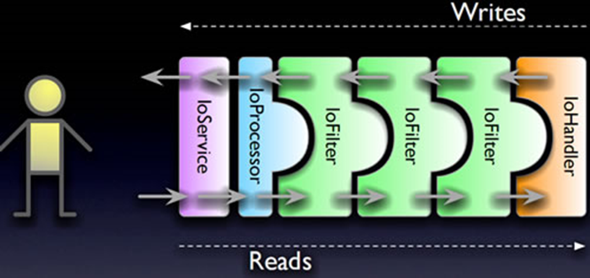

# 简介

​		Netty是由JBOSS提供的一个java开源框架，现为 Github上的独立项目。Netty提供**异步的**、**事件驱动**的网络应用程序框架和工具，用以快速开发高性能、高可靠性的网络服务器和客户端程序。

​		也就是说，Netty 是一个**基于NIO**的客户、服务器端的编程框架，使用Netty 可以确保你快速和简单的开发出一个网络应用，例如实现了某种协议的客户、服务端应用。Netty相当于简化和流线化了网络应用的编程开发过程，例如：基于TCP和UDP的socket服务开发。

​		“快速”和“简单”并不用产生维护性或性能上的问题。Netty 是一个吸收了**多种协议**（包括FTP、SMTP、HTTP等各种二进制文本协议）的实现经验，并经过相当精心设计的项目。最终，Netty 成功的找到了一种方式，在保证易于开发的同时还保证了其应用的性能，稳定性和伸缩性。


# 工作流程

netty 推荐使用`主从Reactor模型`，Netty 主线程组`BossGroup`用于客户端的监听，并将监听到的客户端`Channel`注册到从线程组`WorkGroup`上的一个`NIOEventLoop`的`Selector`上，这个`NIOEventLoop`主要用于和客户端数据的 `Read / Write`，客户端和服务端会在数据传输的管道`ChannelPipeline`中调用`InboundHandler`/`OutboundHandler`对数据进行处理。


# 核心组件


数据传输流

- Channel，表示一个连接，可以理解为每一个请求，就是一个Channel。
- **ChannelHandler**，核心处理业务就在这里，用于处理业务请求。
- ChannelHandlerContext，用于传输业务数据。
- ChannelPipeline，用于保存处理过程需要用到的ChannelHandler和ChannelHandlerContext。

## Channel

Channel 接口是 Netty 对网络操作抽象类，它除了包括基本的 I/O 操作，如 bind() 、 connect() 、 read() 、 write() 等。

比较常用的 Channel 接口实现类是 NioServerSocketChannel （服务端）和 NioSocketChannel （客户端），这两个 Channel 可以和 BIO 编程模型中的 ServerSocket 以 及 Socket 两个概念对应上。Netty 的 Channel 接口所提供的 API，⼤⼤地降低了直接使用 Socket 类的复杂性。

## EventLoop

EventLoop （事件循环）接⼝可以说是 Netty 中最核心的概念了！

> EventLoop 定义了 Netty 的核心抽象，⽤于处理连接的⽣命周期中所发⽣的事件。

**EventLoop 的主要作用实际就是负责监听网络事件并调用事件处理器进行相关 I/O 操作的 处理。** 那 Channel 和 EventLoop 直接有啥联系呢？ Channel 为 Netty ⽹络操作(读写等操作)抽象类， EventLoop 负责处理注册到其上的 Channel 处理 I/O 操作，两者配合参与 I/O 操作。

## ChannelFuture

Netty 是异步非阻塞的，所有的 I/O 操作都为异步的。 因此，我们不能⽴刻得到操作是否执行成功，但是，你可以通过 ChannelFuture 接口的 addListener() ⽅法注册⼀个 ChannelFutureListener ，当操作执⾏成功或者失败时，监听就 会⾃动触发返回结果。 并且，你还可以通过 ChannelFuture 的 channel() ⽅法获取关联的 Channel。

```java
public interface ChannelFuture extends Future<Void> {
 Channel channel();
 ChannelFuture addListener(GenericFutureListener<? extends Future<?
super Voidjk var1);
 ......
 ChannelFuture sync() throws InterruptedException;
}
```

另外，我们还可以通过 ChannelFuture 接口的 sync() ⽅法让异步的操作变成同步的。

## CHannelHandler和ChannelPipeline

下⾯这段代码使⽤过 Netty 的⼩伙伴应该不会陌生，我们指定了序列化编解码器以及⾃定义的 ChannelHandler 处理消息。

```java
    b.group(eventLoopGroup)
     	.handler(new ChannelInitializer<SocketChannel>() {
     		@Override
     		protected void initChannel(SocketChannel ch) {
     			ch.pipeline().addLast(new
    			NettyKryoDecoder(kryoSerializer, RpcResponse.class));
         		ch.pipeline().addLast(new
    			NettyKryoEncoder(kryoSerializer, RpcRequest.class));
     			ch.pipeline().addLast(new KryoClientHandler());
     		}
     	});
```

ChannelHandler 是消息的具体处理器。他负责处理读写操作、客户端连接等事情。 ChannelPipeline 为 ChannelHandler 的链，提供了⼀个容器并定义了用于沿着链传播⼊站和出站事件流的 API 。当 Channel 被创建时，它会被⾃动地分配到它专属的 ChannelPipeline 。 我们可以在 ChannelPipeline 上通过 addLast() ⽅法添加⼀个或者多个 ChannelHandler ， 因为⼀个数据或者事件可能会被多个 Handler 处理。当⼀个 ChannelHandler 处理完之后就将数据 交给下⼀个 ChannelHandler 。


## ByteBuf

ByteBuf是一个存储字节的容器，最大特点就是**使用方便**，它既有自己的读索引和写索引，方便你对整段字节缓存进行读写，也支持get/set，方便你对其中每一个字节进行读写，他的数据结构如下图所示：


- Heap Buffer 堆缓冲区
  堆缓冲区是ByteBuf最常用的模式，他将数据存储在堆空间。

- Direct Buffer 直接缓冲区

  直接缓冲区是ByteBuf的另外一种常用模式，他的内存分配都不发生在堆，jdk1.4引入的nio的ByteBuffer类允许jvm通过本地方法调用分配内存，这样做有两个好处

  - 通过免去中间交换的内存拷贝, 提升IO处理速度; 直接缓冲区的内容可以驻留在垃圾回收扫描的堆区以外。
  - DirectBuffer 在 -XX:MaxDirectMemorySize=xxM大小限制下, 使用 Heap 之外的内存, GC对此”无能为力”,也就意味着规避了在高负载下频繁的GC过程对应用线程的中断影响.

- Composite Buffer 复合缓冲区
  复合缓冲区相当于多个不同ByteBuf的视图，这是netty提供的，jdk不提供这样的功能。


## Codec

ReplayingDecoder<Void>


# NioEventLoopGroup默认构造函数会起多少线程

采用无参构造函数，默认地 nThreads 会被设置为 ==**CPU 核心数 \*2**==

```java
public NioEventLoopGroup() {
    this(0);
}
public NioEventLoopGroup(int nThreads) {
    this(nThreads, (Executor) null);
}

...

// 参数最全的构造方法
public NioEventLoopGroup(int nThreads, Executor executor, EventExecutorChooserFactory chooserFactory,
                         final SelectorProvider selectorProvider,
                         final SelectStrategyFactory selectStrategyFactory,
                         final RejectedExecutionHandler rejectedExecutionHandler) {
    // 调用父类的构造方法
    super(nThreads, executor, chooserFactory, selectorProvider, selectStrategyFactory, rejectedExecutionHandler);
}
```

跟着源码走，我们会来到父类 MultithreadEventLoopGroup 的构造方法中：

```java
// 从1，系统属性，CPU核⼼数*2 这三个值中取出⼀个最⼤的
//可以得出 DEFAULT_EVENT_LOOP_THREADS 的值为CPU核⼼数*2
private static final int DEFAULT_EVENT_LOOP_THREADS = Math.max(1,
SystemPropertyUtil.getInt("io.netty.eventLoopThreads",
NettyRuntime.availableProcessors() * 2));

protected MultithreadEventLoopGroup(int nThreads, ThreadFactory threadFactory, Object... args) {
    super(nThreads == 0 ? DEFAULT_EVENT_LOOP_THREADS : nThreads, threadFactory, args);
}
```

# 服务端客户端启动过程

## 服务端

```java
	// 1.bossGroup ⽤于接收连接，workerGroup ⽤于具体的处理
 	EventLoopGroup bossGroup = new NioEventLoopGroup(1);
 	EventLoopGroup workerGroup = new NioEventLoopGroup();
 	try {
 		//2.创建服务端启动引导辅助类：ServerBootstrap
 		ServerBootstrap b = new ServerBootstrap();
 		//3.给引导类配置两⼤线程组,确定了线程模型
 		b.group(bossGroup, workerGroup)
 			// (⾮必备)打印⽇志
 			.handler(new LoggingHandler(LogLevel.INFO))
 			// 4.指定 IO 模型
 			.channel(NioServerSocketChannel.class)
 			.childHandler(new ChannelInitializer<SocketChannel>() {
 				@Override
				public void initChannel(SocketChannel ch) {
 					ChannelPipeline p = ch.pipeline();
 					//5.可以⾃定义客户端消息的业务处理逻辑
    				p.addLast(new HelloServerHandler());
 				}
 			});
 		// 6.绑定端⼝,调⽤ sync ⽅法阻塞知道绑定完成
 		ChannelFuture f = b.bind(port).sync();
 		// 7.阻塞等待直到服务器Channel关闭(closeFuture()⽅法获取
		Channel 的CloseFuture对象,然后调⽤sync()⽅法)
 		f.channel().closeFuture().sync();
 	} finally {
        //8.优雅关闭相关线程组资源
        bossGroup.shutdownGracefully();
        workerGroup.shutdownGracefully();
 	}
```


## 客户端

```java
     //1.创建⼀个 NioEventLoopGroup 对象实例
     EventLoopGroup group = new NioEventLoopGroup();
     try {
         //2.创建客户端启动引导/ᬀ助类：Bootstrap
         Bootstrap b = new Bootstrap();
         //3.指定线程组
         b.group(group)
             //4.指定 IO 模型
             .channel(NioSocketChannel.class)
             .handler(new ChannelInitializer<SocketChannel>() {
				@Override
            	public void initChannel(SocketChannel ch) throws Exception {
             		ChannelPipeline p = ch.pipeline();
                    // 5.这⾥可以⾃定义消息的业务处理逻辑
                    p.addLast(new HelloClientHandler(message));
 				}
 			});
         // 6.尝试建⽴连接
         ChannelFuture f = b.connect(host, port).sync();
         // 7.等待连接关闭（阻塞，直到Channel关闭）
         f.channel().closeFuture().sync();
     } finally {
     	group.shutdownGracefully();
     }
```


# TCP粘包拆包

在进行Java NIO学习时，发现，如果客户端连续不断的向服务端发送数据包时，服务端接收的数据会出现两个数据包粘在一起的情况，这就是TCP协议中经常会遇到的粘包以及拆包的问题。

我们都知道TCP属于传输层的协议，传输层除了有TCP协议外还有UDP协议。那么UDP是否会发生粘包或拆包的现象呢？答案是不会。

- UDP是基于报文发送的，从UDP的帧结构可以看出，在UDP首部采用了16bit来指示UDP数据报文的长度，因此在应用层能很好的将不同的数据报文区分开，从而避免粘包和拆包的问题。
- 而TCP是基于字节流的，虽然应用层和TCP传输层之间的数据交互是大小不等的数据块，但是TCP把这些数据块仅仅看成一连串无结构的字节流，没有边界；另外从TCP的帧结构也可以看出，在TCP的首部没有表示数据长度的字段，基于上面两点，在使用TCP传输数据时，才有粘包或者拆包现象发生的可能。


TCP是**面向连接的**，面向流的，**提供可靠性服务**。收发两端都要有一一成对的socket，因此发送端为了将多个发给接收端的包，更有效的发送而使用了优化方法（Nagle算法），将多次间隔较小且数据量小的数据，合并成一个大的数据块，然后进行封包。这样做法虽然提高了效率，但是接收端就难于分辨出完整的数据包了，因为==面向流的通信是无消息保护边界的==。

## 问题说明

假设客户端分别发送数据包D1和D2给服务端，由于服务端一次性读取到的字节数是不确定的，所以可能存在以下4种情况。

- 服务端分2次读取到了两个独立的包，分别是D1,D2,没有粘包和拆包；
- 服务端一次性接收了两个包，D1和D2粘在一起了，被成为TCP粘包;
- 服务端分2次读取到了两个数据包，第一次读取到了完整的D1和D2包的部分内容,第二次读取到了D2包的剩余内容，这被称为拆包；
- 服务端分2次读取到了两个数据包，第一次读取到了部分D1，第二次读取D1剩余的部分和完整的D2包；
- 如果此时服务端TCP接收滑动窗非常小,而数据包D1和D2都很大，很有可能发送第五种可能，即服务端多次才能把D1和D2接收完全，期间多次发生拆包情况。（TCP接收滑动窗：是接收端的大小，随着流量大小而变化）

## 发生原因

1、要发送的数据大于TCP发送缓冲区剩余空间大小，将会发生拆包。

2、待发送数据大于MSS（最大报文长度），TCP在传输前将进行拆包。

3、要发送的数据小于TCP发送缓冲区的大小，TCP将多次写入缓冲区的数据一次发送出去，将会发生粘包。

4、接收数据端的应用层没有及时读取接收缓冲区中的数据，将发生粘包。

等等。

## 解决办法

由于底层的TCP无法理解上层的业务逻辑，所以在底层是无法确保数据包不被拆分和重组的，这个问题只能通过上层的应用协议栈设计来解决，根据业界的主流协议的解决方案，归纳如下：

- **消息定长**，例如每个报文的大小为固定长度200字节,如果不够，空位补空格；
- **设置边界**，在包尾增加回车换行符进行分割，例如FTP协议；
- **将消息分为消息头和消息体**，消息头中包含表示消息总长度（或者消息体长度）的字段，通常设计思路是消息头的第一个字段用int来表示消息的总长度；（我之前linux C开发，就用的这种）。
- 更复杂的应用层协议等等；

> Netty方案

1. 使用Netty自带的解码器

   - `LineBasedFrameDecoder`：发送端发送数据包的时候，每个数据包之间以换行符作为分隔，它的工作原理是依次遍历`ByteBuf`中的可读字节，判断是否有换行符然后进行相应的截取。
   - `DelimiterBasedFrameDecoder`：可以自定义分隔符解码器，`LineBasedFrameDecoder`实际上是一种特殊的此解码器。
   - `FixedLengthFrameDecoder`：固定长度解码器
   - `LengthFieldBasedFrameDecoder`：基于消息头指定消息长度

2. 自定义序列化编解码器

   Java自带的实现`Serializable`接口来序列化，但由于性能、安全等原因一般不用。

   通常使用Protostuff、Hessian2、json序列方式比较多，此外选择

   - 针对Java语言：Kryo、FST等等
   - 跨语言的：Protostuff（基于protobuf发展而来），ProtoBuf、Thrift、Avro、MsgPack等等


# Netty长连接、心跳机制

## TCP长连接和短连接

我们知道 TCP 在进行读写之前，server 与 client 之间必须提前建立⼀个连接。建立连接的过程，需要我们常说的三次握⼿，释放/关闭连接的话需要四次挥⼿。这个过程是比较消耗网络资源并且有时间延迟的。 

所谓，短连接说的就是 server 端 与 client 端建立连接之后，读写完成之后就关闭掉连接，如果下一次再要互相发送消息，就要重新连接。短连接的有点很明显，就是管理和实现都比较简单，缺点也很明显，每一次的读写都要建立连接必然会带来大量网络资源的消耗，并且连接的建立也需要耗费时间。 

长连接说的就是 client 向 server 双⽅建立连接之后，即使 client 与 server 完成一次读写，它们之间的连接并不会主动关闭，后续的读写操作会继续使用这个连接。长连接的可以省去较多的 TCP 建立和关闭的操作，降低对网络资源的依赖，节约时间。对于频繁请求资源的客户来说，非常适用长连接。

## 为什么需要心跳机制？Netty中心跳机制

在 TCP 保持长连接的过程中，可能会出现断网等网络异常出现，异常发生的时候， client 与 server 之间如果没有交互的话，它们是⽆法发现对方已经掉线的。为了解决这个问题，我们就需要引入心跳机制。

心跳机制的工作原理是：在 client 与 server 之间在⼀定时间内没有数据交互时, 即处于 idle 状态 时，客户端或服务器就会发送⼀个特殊的数据包给对方，当接收方收到这个数据报文后，也立即发送⼀ 个特殊的数据报文，回应发送方，此即⼀个 PING-PONG 交互。所以，当某⼀端收到心跳消息后，就知道了对方仍然在线，这就确保 TCP 连接的有效性。

TCP 实际上自带的就有长连接选项，本身是也有心跳包机制，也就是 TCP 的选项： SO_KEEPALIVE 。 但是，TCP 协议层面的长连接灵活性不够。所以，⼀般情况下我们都是在应用层协议上实现自定义心跳机制的，也就是在 Netty 层面通过编码实现。通过 Netty 实现心跳机制的话，核心类是 IdleStateHandler 。

# Netty的零拷贝

> 零复制（英语：Zero-copy；也译零拷贝）技术是指计算机执行操作时，CPU 不需要先将数据从某处 内存复制到另⼀个特定区域。这种技术通常用于通过网络传输文件时节省 CPU 周期和内存带宽。

在OS层面的Zero-copy 通常指避免在 用户态(User-space) 与 内核态(Kernel-space) 之间来回拷贝数据。而在Netty层面，零拷贝主要提现在对于数据操作的优化。

Netty中的零拷贝提现在以下几个方面：

1. 使用Netty提供的CompositeByteBuf类，可以将多个ByteBuf合并为一个逻辑上的ByteBuf，避免了各个ByteBuf之间的拷贝。
2. ByteBuf支持slice操作，因此可以将ByteBuf分解为多个共享同一个存储区域的ByteBuf，避免了内存的拷贝。
3. 通过FileRegion包装的FileChannle.tranferTo实现文件传输，可以直接将文件缓冲区的数据发送到目标Channel，避免了传统通过循环write方法导致的内存拷贝问题。


# WebSocket

服务端WebSocketServer：

```java
package com.ly.io.netty.websocket;

import io.netty.bootstrap.ServerBootstrap;
import io.netty.channel.ChannelFuture;
import io.netty.channel.ChannelInitializer;
import io.netty.channel.ChannelPipeline;
import io.netty.channel.EventLoopGroup;
import io.netty.channel.nio.NioEventLoopGroup;
import io.netty.channel.socket.SocketChannel;
import io.netty.channel.socket.nio.NioServerSocketChannel;
import io.netty.handler.codec.http.HttpObjectAggregator;
import io.netty.handler.codec.http.HttpServerCodec;
import io.netty.handler.codec.http.websocketx.WebSocketServerProtocolHandler;
import io.netty.handler.logging.LogLevel;
import io.netty.handler.logging.LoggingHandler;
import io.netty.handler.stream.ChunkedWriteHandler;

import java.net.InetSocketAddress;

/**
 * @Description netty对webSocket的支持
 * @Created by fun4ai
 * @Date 2020/12/28 0:48
 */
public class WebSocketServer {
    public static void main(String args[]) throws Exception {
        EventLoopGroup boosGroup = new NioEventLoopGroup();
        EventLoopGroup workerGroup = new NioEventLoopGroup();
        ServerBootstrap serverBootstrap = new ServerBootstrap();
        try {
            serverBootstrap.group(boosGroup, workerGroup)
                    .channel(NioServerSocketChannel.class)
                    .handler(new LoggingHandler(LogLevel.INFO))
                    .childHandler(new ChannelInitializer<SocketChannel>() {
                        @Override
                        protected void initChannel(SocketChannel sc) throws Exception {
                                ChannelPipeline pipeline = sc.pipeline();
                                //HttpServerCodec: 针对http协议进行编解码
                                pipeline.addLast(new HttpServerCodec());
                                //ChunkedWriteHandler分块写处理，文件过大会将内存撑爆
                                pipeline.addLast(new ChunkedWriteHandler());
                                /**
                                 * 聚合多段
                                 * 作用是将一个Http的消息组装成一个完成的HttpRequest或者HttpResponse，那么具体的是什么
                                 * 取决于是请求还是响应, 该Handler必须放在HttpServerCodec后的后面
                                 */
                                pipeline.addLast(new HttpObjectAggregator(8192));
                                /**
                                 * websocket的数据以帧[frame]的形式传输
                                 * WebSocketFrame 下6个子类
                                 * 浏览器请求如 ws://localhost:8899/hello   /hello为访问websocket时的uri
                                 * 核心功能为将Http协议升级为ws协议，保持长连接(通过状态码101)
                                 */
                                pipeline.addLast(new WebSocketServerProtocolHandler("/ws"));

                                //自定义的处理器
                                pipeline.addLast(new TextWebSocketFrameHandler());
                        }
                    });

            //使用了不同的端口绑定方式
            ChannelFuture channelFuture = serverBootstrap.bind(new InetSocketAddress(8899)).sync();
            //关闭连接
            channelFuture.channel().closeFuture().sync();
        } finally {
            //优雅关闭
            boosGroup.shutdownGracefully();
            workerGroup.shutdownGracefully();
        }
    }
}
```

自定义的处理器TextWebSocketFrameHandler：

```java
package com.ly.io.netty.websocket;

import io.netty.channel.ChannelHandler;
import io.netty.channel.ChannelHandlerContext;
import io.netty.channel.SimpleChannelInboundHandler;
import io.netty.handler.codec.http.websocketx.TextWebSocketFrame;
import io.netty.util.concurrent.EventExecutorGroup;

import java.time.LocalDateTime;

/**
 * @Description 针对websocket的自定义处理器
 * @Created by fun4ai
 * @Date 2020/12/28 0:56
 */
public class TextWebSocketFrameHandler extends SimpleChannelInboundHandler<TextWebSocketFrame> {

    @Override
    protected void channelRead0(ChannelHandlerContext ctx, TextWebSocketFrame msg) throws Exception {
        System.out.println("收到消息: " + msg.text());

        //读取收到的信息写回到客户端
        ctx.channel().writeAndFlush(new TextWebSocketFrame("服务器时间: " + LocalDateTime.now()));
    }

    /**
     * 连接建立时
     *
     * @param ctx
     * @throws Exception
     */
    @Override
    public void handlerAdded(ChannelHandlerContext ctx) throws Exception {
        System.out.println("handlerAdded " + ctx.channel().id().asLongText());
    }

    /**
     * 连接关闭时
     *
     * @param ctx
     * @throws Exception
     */
    @Override
    public void handlerRemoved(ChannelHandlerContext ctx) throws Exception {
        System.out.println("handlerRemoved " + ctx.channel().id().asLongText());
    }

    /**
     * 异常发生时
     *
     * @param ctx
     * @param cause
     * @throws Exception
     */
    @Override
    public void exceptionCaught(ChannelHandlerContext ctx, Throwable cause) throws Exception {
        System.out.println("异常发生");
        ctx.close();
    }
}

```

客户端：

```html
<!DOCTYPE html>
<html lang="en">
<head>
    <meta charset="UTF-8">
    <title>webSocket</title>
</head>
<body>
<script type="text/javascript">
    var socket;

    if (window.WebSocket) {
        socket = new WebSocket("ws://localhost:8899/ws");

        //收到消息
        socket.onmessage = function (event) {
            var ta = document.getElementById("responseText");
            ta.value = ta.value + "\n" + event.data;
        }

        //连接打开
        socket.onopen = function (event) {
            var ta = document.getElementById("responseText");
            ta.value = "连接开启";
        }

        //连接断开
        socket.onclose = function (event) {
            var ta = document.getElementById("responseText");
            ta.value = ta.value + "\n" + "连接关闭";
        }
    } else {
        alert("浏览器不支持WebSocket");
    }

    //发送消息到服务端
    function send(message) {
        if (!window.WebSocket) {
            return;
        }
        if (socket.readyState == WebSocket.OPEN) {
            socket.send(message);
        } else {
            alert("连接尚未开启");
        }
    }
</script>


<!--客户端的输入-->
<form onsubmit="return false;">

    <textarea name="message" style="width: 400px;height: 200px;"></textarea>
    <input type="button" value="发送数据" onclick="send(this.form.message.value)">

    <h3>服务端输出</h3>
    <textarea id="responseText" style="width: 400px;height: 300px;"></textarea>

    <input type="button" onclick="javasvript: document.getElementById('responseText').value=''" value="清空内容">

</form>

<!--服务器端向客户端数据的返回-->
</body>
</html>
```


# Protobuf

Protobuf即Protocol Buffers，是Google公司开发的一种跨语言和平台的序列化数据结构的方式，是一个灵活的、高效的用于序列化数据的协议。
与XML和JSON格式相比，protobuf更小、更快、更便捷。protobuf是跨语言的，并且自带一个编译器(protoc)，只需要用protoc进行编译，就可以编译成Java、Python、C++、C#、Go等多种语言代码，然后可以直接使用，不需要再写其它代码，自带有解析的代码。
只需要将要被序列化的结构化数据定义一次(在.proto文件定义)，便可以使用特别生成的源代码(使用protobuf提供的生成工具)轻松的使用不同的数据流完成对结构数据的读写操作。甚至可以更新.proto文件中对数据结构的定义而不会破坏依赖旧格式编译出来的程序。
GitHub地址：https://github.com/protocolbuffers/protobuf
不同语言源码版本下载地址：
https://github.com/protocolbuffers/protobuf/releases/latest


pom.xml

```xml
 <dependency>
     <groupId>com.google.protobuf</groupId>
     <artifactId>protobuf-java</artifactId>
     <version>3.6.1</version>
</dependency>
```

Student.proto

```protobuf
//指定protobuf语法版本
syntax = "proto3";

//包名
option java_package = "com.ly.io.netty.codec";
//源文件类名
option java_outer_classname = "StudentPOJO";

// class Student
message Student {
  //int32 对应java中的int 1代表属性序号不代表值
  int32 id = 1;
  string name = 2;
}

```


下载相应文件生成对应java类拷贝到项目里

```
protoc.exe -I=d:/tmp --java_out=d:/tmp d:/tmp/xxx.proto
```


客户端pipeline添加

```java
pipeline.addLast("encoder", new ProrobufEncoder());
```

客户端handler

```java
public void channelActive(ChannelHandlerContext ctx) throws Exception {
    StudentPOJO.Student student = StudentPOJO.student.newBuilder().setId(3).setName("林冲").build();
    ctx.writeAndFlush(student);
}
```


服务端pipeline添加

```java
pipeline.addLast("decoder", new ProrobufDecoder(StudentPOJO.Student.getDefaultInstance()));
```

服务端handler可以继承SimpleChannelInboundHandler<StudentPOJO.Student> 就不再需要转换类型


多个对象？？？ 略微繁琐。


# 线程模型

## 传统阻塞IO服务模型


**特点：**

- 1）采用阻塞式 I/O 模型获取输入数据；
- 2）每个连接都需要独立的线程完成数据输入，业务处理，数据返回的完整操作。

**存在问题：**

- 1）当并发数较大时，需要创建大量线程来处理连接，系统资源占用较大；
- 2）连接建立后，如果当前线程暂时没有数据可读，则线程就阻塞在 Read 操作上，造成线程资源浪费。

## Reactor模式

**针对传统阻塞 I/O 服务模型的 2 个缺点，比较常见的有如下解决方案：**

- 1）基于 I/O 复用模型：多个连接共用一个阻塞对象，应用程序只需要在一个阻塞对象上等待，无需阻塞等待所有连接。当某条连接有新的数据可以处理时，操作系统通知应用程序，线程从阻塞状态返回，开始进行业务处理；
- 2）基于线程池复用线程资源：不必再为每个连接创建线程，将连接完成后的业务处理任务分配给线程进行处理，一个线程可以处理多个连接的业务。

**==I/O 复用结合线程池，这就是 Reactor模式基本设计思想。==**


Reactor 模式，是指通过一个或多个输入同时传递给服务处理器的服务请求的**事件驱动**处理模式。

服务端程序处理传入多路请求，并将它们同步分派给请求对应的处理线程，Reactor 模式也叫 **Dispatcher** 模式。

即 I/O 多路复用统一监听事件，收到事件后分发(Dispatch 给某进程)，是编写高性能网络服务器的必备技术之一。

> **Reactor 模式中有 2 个关键组成：**

- Reactor：Reactor 在一个单独的线程中运行，负责监听和分发事件，分发给适当的处理程序来对 IO 事件做出反应。 它就像公司的电话接线员，它接听来自客户的电话并将线路转移到适当的联系人；
- Handlers：处理程序执行 I/O 事件要完成的实际事件，类似于客户想要与之交谈的公司中的实际官员。Reactor 通过调度适当的处理程序来响应 I/O 事件，处理程序执行非阻塞操作。

> **根据 Reactor 的数量和处理资源池线程的数量不同，有 3 种典型的实现：**

- 单 Reactor 单线程
- 单 Reactor 多线程
- 主从 Reactor 多线程

### 单Reactor单线程


其中，Select 是前面 I/O 复用模型介绍的标准网络编程 API，可以实现应用程序通过一个阻塞对象监听多路连接请求，其他方案示意图类似。

**方案说明：**

- 1）Reactor 对象通过 Select 监控客户端请求事件，收到事件后通过 Dispatch 进行分发；
- 2）如果是建立连接请求事件，则由 Acceptor 通过 Accept 处理连接请求，然后创建一个 Handler 对象处理连接完成后的后续业务处理；
- 3）如果不是建立连接事件，则 Reactor 会分发调用连接对应的 Handler 来响应；
- 4）Handler 会完成 Read→业务处理→Send 的完整业务流程。

**优点：**模型简单，没有多线程、进程通信、竞争的问题，全部都在一个线程中完成。
**缺点：**性能问题，只有一个线程，无法完全发挥多核 CPU 的性能。Handler 在处理某个连接上的业务时，整个进程无法处理其他连接事件，很容易导致性能瓶
颈。

可靠性问题，线程意外跑飞，或者进入死循环，会导致整个系统通信模块不可用，不能接收和处理外部消息，造成节点故障。

**使用场景：**客户端的数量有限，业务处理非常快速，比如 Redis，业务处理的时间复杂度 O(1)。


### 单Reactor多线程模型


**方案说明：**

- 1）Reactor 对象通过 Select 监控客户端请求事件，收到事件后通过 Dispatch 进行分发；
- 2）如果是建立连接请求事件，则由 Acceptor 通过 Accept 处理连接请求，然后创建一个 Handler 对象处理连接完成后续的各种事件；
- 3）如果不是建立连接事件，则 Reactor 会分发调用连接对应的 Handler 来响应；
- 4）Handler 只负责响应事件，不做具体业务处理，通过 Read 读取数据后，会分发给后面的 Worker 线程池进行业务处理；
- 5）Worker 线程池会分配独立的线程完成真正的业务处理，如何将响应结果发给 Handler 进行处理；
- 6）Handler 收到响应结果后通过 Send 将响应结果返回给 Client。

**优点：**可以充分利用多核 CPU 的处理能力。
**缺点：**多线程数据共享和访问比较复杂；Reactor 承担所有事件的监听和响应，在单线程中运行，高并发场景下容易成为性能瓶颈。


### 主从reactor多线程模型

​		


SubReactor可多个

针对单 Reactor 多线程模型中，Reactor 在单线程中运行，高并发场景下容易成为性能瓶颈，可以让 Reactor 在多线程中运行。

**方案说明：**

- 1）Reactor 主线程 MainReactor 对象通过 Select 监控建立连接事件，收到事件后通过 Acceptor 接收，处理建立连接事件；
- 2）Acceptor 处理建立连接事件后，MainReactor 将连接分配 Reactor 子线程给 SubReactor 进行处理；
- 3）SubReactor 将连接加入连接队列进行监听，并创建一个 Handler 用于处理各种连接事件；
- 4）当有新的事件发生时，SubReactor 会调用连接对应的 Handler 进行响应；
- 5）Handler 通过 Read 读取数据后，会分发给后面的 Worker 线程池进行业务处理；
- 6）Worker 线程池会分配独立的线程完成真正的业务处理，如何将响应结果发给 Handler 进行处理；
- 7）Handler 收到响应结果后通过 Send 将响应结果返回给 Client。


**优点：**父线程与子线程的数据交互简单职责明确，父线程只需要接收新连接，子线程完成后续的业务处理。

父线程与子线程的数据交互简单，Reactor 主线程只需要把新连接传给子线程，子线程无需返回数据。

这种模型在许多项目中广泛使用，包括 Nginx 主从 Reactor 多进程模型，Memcached 主从多线程，Netty 主从多线程模型的支持。


==**虽然 Netty 的线程模型基于主从 Reactor 多线程，借用了 MainReactor 和 SubReactor 的结构。但是实际实现上 SubReactor 和 Worker 线程在同一个线程池中。**==

### 小结

**3 种模式可以用个比喻来理解：**（餐厅常常雇佣接待员负责迎接顾客，当顾客入坐后，侍应生专门为这张桌子服务）

- 1）单 Reactor 单线程，接待员和侍应生是同一个人，全程为顾客服务；
- 2）单 Reactor 多线程，1 个接待员，多个侍应生，接待员只负责接待；
- 3）主从 Reactor 多线程，多个接待员，多个侍应生。

**Reactor 模式具有如下的优点：**

- 1）响应快，不必为单个同步时间所阻塞，虽然 Reactor 本身依然是同步的；
- 2）编程相对简单，可以最大程度的避免复杂的多线程及同步问题，并且避免了多线程/进程的切换开销；
- 3）可扩展性，可以方便的通过增加 Reactor 实例个数来充分利用 CPU 资源；
- 4）可复用性，Reactor 模型本身与具体事件处理逻辑无关，具有很高的复用性。


## Proactor 模型

在 Reactor 模式中，Reactor 等待某个事件或者可应用或者操作的状态发生（比如文件描述符可读写，或者是 Socket 可读写）。

然后把这个事件传给事先注册的 Handler（事件处理函数或者回调函数），由后者来做实际的读写操作。

其中的读写操作都需要应用程序同步操作，所以 Reactor 是非阻塞同步网络模型。

如果把 I/O 操作改为异步，即交给操作系统来完成就能进一步提升性能，这就是异步网络模型 Proactor。


**Proactor 是和异步 I/O 相关的，详细方案如下：**

- 1）Proactor Initiator 创建 Proactor 和 Handler 对象，并将 Proactor 和 Handler 都通过 AsyOptProcessor（Asynchronous Operation Processor）注册到内核；
- 2）AsyOptProcessor 处理注册请求，并处理 I/O 操作；
- 3）AsyOptProcessor 完成 I/O 操作后通知 Proactor；
- 4）Proactor 根据不同的事件类型回调不同的 Handler 进行业务处理；
- 5）Handler 完成业务处理。

**可以看出 Proactor 和 Reactor 的区别：**

- 1）Reactor 是在事件发生时就通知事先注册的事件（读写在应用程序线程中处理完成）；
- 2）Proactor 是在事件发生时基于异步 I/O 完成读写操作（由内核完成），待 I/O 操作完成后才回调应用程序的处理器来进行业务处理。

理论上 Proactor 比 Reactor 效率更高，异步 I/O 更加充分发挥 DMA(Direct Memory Access，直接内存存取)的优势。

**但是Proactor有如下缺点：**

- 1）编程复杂性，由于异步操作流程的事件的初始化和事件完成在时间和空间上都是相互分离的，因此开发异步应用程序更加复杂。应用程序还可能因为反向的流控而变得更加难以 Debug；
- 2）内存使用，缓冲区在读或写操作的时间段内必须保持住，可能造成持续的不确定性，并且每个并发操作都要求有独立的缓存，相比 Reactor 模式，在 Socket 已经准备好读或写前，是不要求开辟缓存的；
- 3）操作系统支持，Windows 下通过 IOCP 实现了真正的异步 I/O，而在 Linux 系统下，Linux 2.6 才引入，目前异步 I/O 还不完善。

**==因此在 Linux 下实现高并发网络编程都是以 Reactor 模型为主。==**


# RPC

**RPC(Remote Procedure Call)** ——远程过程调用，是一个计算机通信协议。该协议允许运行于一台计算机的程序调用另一台计算机的子程序，而程序员无需额外的为这个交互过程编程。


常见 RPC 技术和框架有：

- 应用级的服务框架：阿里的 Dubbo/Dubbox、Google gRPC、Spring Boot/Spring Cloud、Go语言的 rpcx、Apache的 thrift。
- 远程通信协议：RMI、Socket、SOAP(HTTP XML)、REST(HTTP JSON)。
- 通信框架：MINA 和 Netty。


---

# [源码](sources/Netty-source.md)

# Mina

Apache基金会下的一个Java NIO Socket通讯框架，对传统socket开发流程进行了再梳理。



- IoAcceptor的建议数量为 1(Server)

- IoConnector的建议数量为 1(Client)

- IoProcessor的建议数量为CPU Core + 1

- ExecutorFilter (IoFilter)的数量，请按硬件、性能要求、业务需要等要素综合考虑