# 简介

​		Netty是由JBOSS提供的一个java开源框架，现为 Github上的独立项目。Netty提供**异步的**、**事件驱动**的网络应用程序框架和工具，用以快速开发高性能、高可靠性的网络服务器和客户端程序。

​		也就是说，Netty 是一个**基于NIO**的客户、服务器端的编程框架，使用Netty 可以确保你快速和简单的开发出一个网络应用，例如实现了某种协议的客户、服务端应用。Netty相当于简化和流线化了网络应用的编程开发过程，例如：基于TCP和UDP的socket服务开发。

​		“快速”和“简单”并不用产生维护性或性能上的问题。Netty 是一个吸收了多种协议（包括FTP、SMTP、HTTP等各种二进制文本协议）的实现经验，并经过相当精心设计的项目。最终，Netty 成功的找到了一种方式，在保证易于开发的同时还保证了其应用的性能，稳定性和伸缩性。


# 工作流程

netty 推荐使用`主从Reactor模型`，Netty 主线程组`BossGroup`用于客户端的监听，并将监听到的客户端`Channel`注册到从线程组`WorkGroup`上的一个`NIOEventLoop`的`Selector`上，这个`NIOEventLoop`主要用于和客户端数据的 `Read / Write`，客户端和服务端会在数据传输的管道`ChannelPipeline`中调用`InboundHandler`/`OutboundHandler`对数据进行处理。

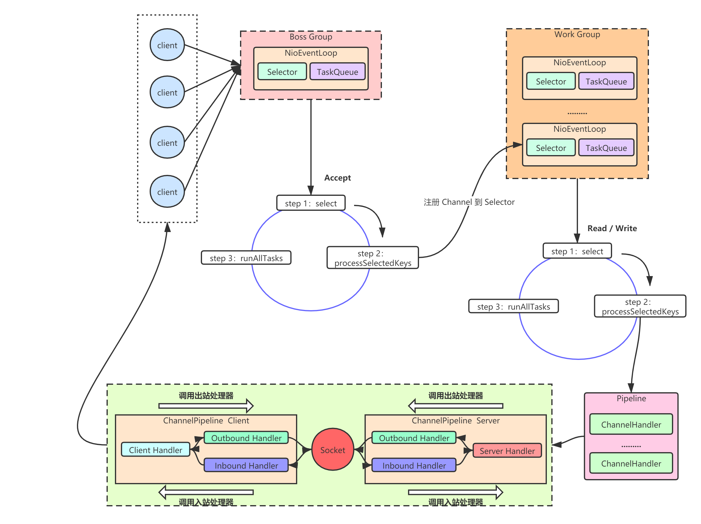


# 核心组件

## Channel

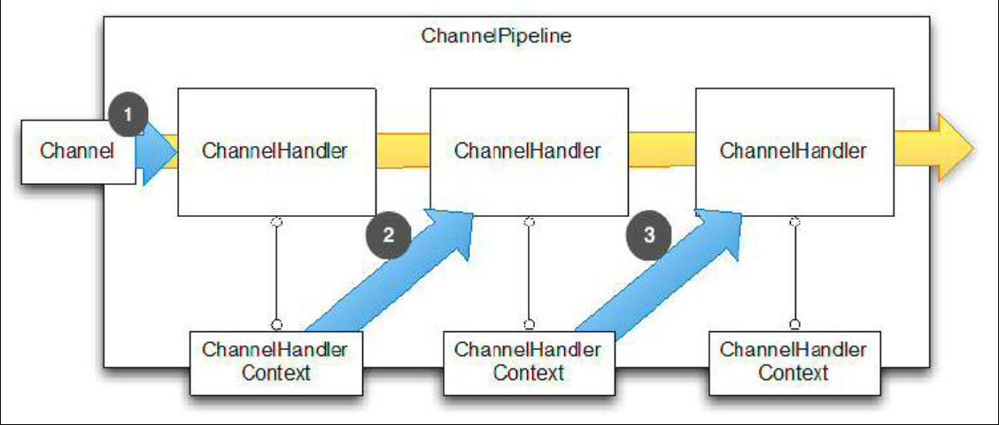

数据传输流

- Channel，表示一个连接，可以理解为每一个请求，就是一个Channel。
- **ChannelHandler**，核心处理业务就在这里，用于处理业务请求。
- ChannelHandlerContext，用于传输业务数据。
- ChannelPipeline，用于保存处理过程需要用到的ChannelHandler和ChannelHandlerContext。


### ChannelFuture

### CHannelHandler

### ChannelPipeline


## ByteBuf

ByteBuf是一个存储字节的容器，最大特点就是**使用方便**，它既有自己的读索引和写索引，方便你对整段字节缓存进行读写，也支持get/set，方便你对其中每一个字节进行读写，他的数据结构如下图所示：

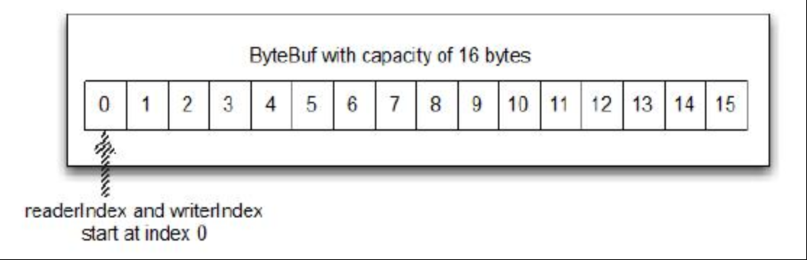

- Heap Buffer 堆缓冲区
  堆缓冲区是ByteBuf最常用的模式，他将数据存储在堆空间。

- Direct Buffer 直接缓冲区

  直接缓冲区是ByteBuf的另外一种常用模式，他的内存分配都不发生在堆，jdk1.4引入的nio的ByteBuffer类允许jvm通过本地方法调用分配内存，这样做有两个好处

  - 通过免去中间交换的内存拷贝, 提升IO处理速度; 直接缓冲区的内容可以驻留在垃圾回收扫描的堆区以外。
  - DirectBuffer 在 -XX:MaxDirectMemorySize=xxM大小限制下, 使用 Heap 之外的内存, GC对此”无能为力”,也就意味着规避了在高负载下频繁的GC过程对应用线程的中断影响.

- Composite Buffer 复合缓冲区
  复合缓冲区相当于多个不同ByteBuf的视图，这是netty提供的，jdk不提供这样的功能。


## Codec

ReplayingDecoder<Void>


## EventLoop


# TCP粘包拆包

在进行Java NIO学习时，发现，如果客户端连续不断的向服务端发送数据包时，服务端接收的数据会出现两个数据包粘在一起的情况，这就是TCP协议中经常会遇到的粘包以及拆包的问题。

我们都知道TCP属于传输层的协议，传输层除了有TCP协议外还有UDP协议。那么UDP是否会发生粘包或拆包的现象呢？答案是不会。

- UDP是基于报文发送的，从UDP的帧结构可以看出，在UDP首部采用了16bit来指示UDP数据报文的长度，因此在应用层能很好的将不同的数据报文区分开，从而避免粘包和拆包的问题。
- 而TCP是基于字节流的，虽然应用层和TCP传输层之间的数据交互是大小不等的数据块，但是TCP把这些数据块仅仅看成一连串无结构的字节流，没有边界；另外从TCP的帧结构也可以看出，在TCP的首部没有表示数据长度的字段，基于上面两点，在使用TCP传输数据时，才有粘包或者拆包现象发生的可能。


TCP是**面向连接的**，面向流的，**提供可靠性服务**。收发两端都要有一一成对的socket，因此发送端为了将多个发给接收端的包，更有效的发送而使用了优化方法（Nagle算法），将多次间隔较小且数据量小的数据，合并成一个大的数据块，然后进行封包。这样做法虽然提高了效率，但是接收端就难于分辨出完整的数据包了，因为==面向流的通信是无消息保护边界的==。

## 问题说明

假设客户端分别发送数据包D1和D2给服务端，由于服务端一次性读取到的字节数是不确定的，所以可能存在以下4种情况。

- 服务端分2次读取到了两个独立的包，分别是D1,D2,没有粘包和拆包；
- 服务端一次性接收了两个包，D1和D2粘在一起了，被成为TCP粘包;
- 服务端分2次读取到了两个数据包，第一次读取到了完整的D1和D2包的部分内容,第二次读取到了D2包的剩余内容，这被称为拆包；
- 服务端分2次读取到了两个数据包，第一次读取到了部分D1，第二次读取D1剩余的部分和完整的D2包；
- 如果此时服务端TCP接收滑动窗非常小,而数据包D1和D2都很大，很有可能发送第五种可能，即服务端多次才能把D1和D2接收完全，期间多次发生拆包情况。（TCP接收滑动窗：是接收端的大小，随着流量大小而变化）

## 发生原因

1、要发送的数据大于TCP发送缓冲区剩余空间大小，将会发生拆包。

2、待发送数据大于MSS（最大报文长度），TCP在传输前将进行拆包。

3、要发送的数据小于TCP发送缓冲区的大小，TCP将多次写入缓冲区的数据一次发送出去，将会发生粘包。

4、接收数据端的应用层没有及时读取接收缓冲区中的数据，将发生粘包。

等等。

## 解决办法

由于底层的TCP无法理解上层的业务逻辑，所以在底层是无法确保数据包不被拆分和重组的，这个问题只能通过上层的应用协议栈设计来解决，根据业界的主流协议的解决方案，归纳如下：

- **消息定长**，例如每个报文的大小为固定长度200字节,如果不够，空位补空格；
- **设置边界**，在包尾增加回车换行符进行分割，例如FTP协议；
- **将消息分为消息头和消息体**，消息头中包含表示消息总长度（或者消息体长度）的字段，通常设计思路是消息头的第一个字段用int来表示消息的总长度；（我之前linux C开发，就用的这种）。
- 更复杂的应用层协议等等；

> Netty方案

1. 使用Netty自带的解码器
   - `LineBasedFrameDecoder`：发送端发送数据包的时候，每个数据包之间以换行符作为分隔，它的工作原理是依次遍历`ByteBuf`中的可读字节，判断是否有换行符然后进行相应的截取。
   - `DelimiterBasedFrameDecoder`：可以自定义分隔符解码器，`LineBasedFrameDecoder`实际上是一种特殊的此解码器。
   - `FixedLengthFrameDecoder`：固定长度解码器
   - `LengthFieldBasedFrameDecoder`：基于消息头指定消息长度
   
2. 自定义序列化编解码器

   Java自带的实现`Serializable`接口来序列化，但由于性能、安全等原因一般不用。

   通常使用Protostuff、Hessian2、json序列方式比较多，此外选择

   - 针对Java语言：Kryo、FST等等
   - 跨语言的：Protostuff（基于protobuf发展而来），ProtoBuf、Thrift、Avro、MsgPack等等


# WebSocket

服务端WebSocketServer：

```java
package com.ly.io.netty.websocket;

import io.netty.bootstrap.ServerBootstrap;
import io.netty.channel.ChannelFuture;
import io.netty.channel.ChannelInitializer;
import io.netty.channel.ChannelPipeline;
import io.netty.channel.EventLoopGroup;
import io.netty.channel.nio.NioEventLoopGroup;
import io.netty.channel.socket.SocketChannel;
import io.netty.channel.socket.nio.NioServerSocketChannel;
import io.netty.handler.codec.http.HttpObjectAggregator;
import io.netty.handler.codec.http.HttpServerCodec;
import io.netty.handler.codec.http.websocketx.WebSocketServerProtocolHandler;
import io.netty.handler.logging.LogLevel;
import io.netty.handler.logging.LoggingHandler;
import io.netty.handler.stream.ChunkedWriteHandler;

import java.net.InetSocketAddress;

/**
 * @Description netty对webSocket的支持
 * @Created by fun4ai
 * @Date 2020/12/28 0:48
 */
public class WebSocketServer {
    public static void main(String args[]) throws Exception {
        EventLoopGroup boosGroup = new NioEventLoopGroup();
        EventLoopGroup workerGroup = new NioEventLoopGroup();
        ServerBootstrap serverBootstrap = new ServerBootstrap();
        try {
            serverBootstrap.group(boosGroup, workerGroup)
                    .channel(NioServerSocketChannel.class)
                    .handler(new LoggingHandler(LogLevel.INFO))
                    .childHandler(new ChannelInitializer<SocketChannel>() {
                        @Override
                        protected void initChannel(SocketChannel sc) throws Exception {
                                ChannelPipeline pipeline = sc.pipeline();
                                //HttpServerCodec: 针对http协议进行编解码
                                pipeline.addLast(new HttpServerCodec());
                                //ChunkedWriteHandler分块写处理，文件过大会将内存撑爆
                                pipeline.addLast(new ChunkedWriteHandler());
                                /**
                                 * 聚合多段
                                 * 作用是将一个Http的消息组装成一个完成的HttpRequest或者HttpResponse，那么具体的是什么
                                 * 取决于是请求还是响应, 该Handler必须放在HttpServerCodec后的后面
                                 */
                                pipeline.addLast(new HttpObjectAggregator(8192));
                                /**
                                 * websocket的数据以帧[frame]的形式传输
                                 * WebSocketFrame 下6个子类
                                 * 浏览器请求如 ws://localhost:8899/hello   /hello为访问websocket时的uri
                                 * 核心功能为将Http协议升级为ws协议，保持长连接(通过状态码101)
                                 */
                                pipeline.addLast(new WebSocketServerProtocolHandler("/ws"));

                                //自定义的处理器
                                pipeline.addLast(new TextWebSocketFrameHandler());
                        }
                    });

            //使用了不同的端口绑定方式
            ChannelFuture channelFuture = serverBootstrap.bind(new InetSocketAddress(8899)).sync();
            //关闭连接
            channelFuture.channel().closeFuture().sync();
        } finally {
            //优雅关闭
            boosGroup.shutdownGracefully();
            workerGroup.shutdownGracefully();
        }
    }
}
```

自定义的处理器TextWebSocketFrameHandler：

```java
package com.ly.io.netty.websocket;

import io.netty.channel.ChannelHandler;
import io.netty.channel.ChannelHandlerContext;
import io.netty.channel.SimpleChannelInboundHandler;
import io.netty.handler.codec.http.websocketx.TextWebSocketFrame;
import io.netty.util.concurrent.EventExecutorGroup;

import java.time.LocalDateTime;

/**
 * @Description 针对websocket的自定义处理器
 * @Created by fun4ai
 * @Date 2020/12/28 0:56
 */
public class TextWebSocketFrameHandler extends SimpleChannelInboundHandler<TextWebSocketFrame> {

    @Override
    protected void channelRead0(ChannelHandlerContext ctx, TextWebSocketFrame msg) throws Exception {
        System.out.println("收到消息: " + msg.text());

        //读取收到的信息写回到客户端
        ctx.channel().writeAndFlush(new TextWebSocketFrame("服务器时间: " + LocalDateTime.now()));
    }

    /**
     * 连接建立时
     *
     * @param ctx
     * @throws Exception
     */
    @Override
    public void handlerAdded(ChannelHandlerContext ctx) throws Exception {
        System.out.println("handlerAdded " + ctx.channel().id().asLongText());
    }

    /**
     * 连接关闭时
     *
     * @param ctx
     * @throws Exception
     */
    @Override
    public void handlerRemoved(ChannelHandlerContext ctx) throws Exception {
        System.out.println("handlerRemoved " + ctx.channel().id().asLongText());
    }

    /**
     * 异常发生时
     *
     * @param ctx
     * @param cause
     * @throws Exception
     */
    @Override
    public void exceptionCaught(ChannelHandlerContext ctx, Throwable cause) throws Exception {
        System.out.println("异常发生");
        ctx.close();
    }
}

```

客户端：

```html
<!DOCTYPE html>
<html lang="en">
<head>
    <meta charset="UTF-8">
    <title>webSocket</title>
</head>
<body>
<script type="text/javascript">
    var socket;

    if (window.WebSocket) {
        socket = new WebSocket("ws://localhost:8899/ws");

        //收到消息
        socket.onmessage = function (event) {
            var ta = document.getElementById("responseText");
            ta.value = ta.value + "\n" + event.data;
        }

        //连接打开
        socket.onopen = function (event) {
            var ta = document.getElementById("responseText");
            ta.value = "连接开启";
        }

        //连接断开
        socket.onclose = function (event) {
            var ta = document.getElementById("responseText");
            ta.value = ta.value + "\n" + "连接关闭";
        }
    } else {
        alert("浏览器不支持WebSocket");
    }

    //发送消息到服务端
    function send(message) {
        if (!window.WebSocket) {
            return;
        }
        if (socket.readyState == WebSocket.OPEN) {
            socket.send(message);
        } else {
            alert("连接尚未开启");
        }
    }
</script>


<!--客户端的输入-->
<form onsubmit="return false;">

    <textarea name="message" style="width: 400px;height: 200px;"></textarea>
    <input type="button" value="发送数据" onclick="send(this.form.message.value)">

    <h3>服务端输出</h3>
    <textarea id="responseText" style="width: 400px;height: 300px;"></textarea>

    <input type="button" onclick="javasvript: document.getElementById('responseText').value=''" value="清空内容">

</form>

<!--服务器端向客户端数据的返回-->
</body>
</html>
```


# Protobuf

Protobuf即Protocol Buffers，是Google公司开发的一种跨语言和平台的序列化数据结构的方式，是一个灵活的、高效的用于序列化数据的协议。
与XML和JSON格式相比，protobuf更小、更快、更便捷。protobuf是跨语言的，并且自带一个编译器(protoc)，只需要用protoc进行编译，就可以编译成Java、Python、C++、C#、Go等多种语言代码，然后可以直接使用，不需要再写其它代码，自带有解析的代码。
只需要将要被序列化的结构化数据定义一次(在.proto文件定义)，便可以使用特别生成的源代码(使用protobuf提供的生成工具)轻松的使用不同的数据流完成对结构数据的读写操作。甚至可以更新.proto文件中对数据结构的定义而不会破坏依赖旧格式编译出来的程序。
GitHub地址：https://github.com/protocolbuffers/protobuf
不同语言源码版本下载地址：
https://github.com/protocolbuffers/protobuf/releases/latest


pom.xml

```xml
 <dependency>
     <groupId>com.google.protobuf</groupId>
     <artifactId>protobuf-java</artifactId>
     <version>3.6.1</version>
</dependency>
```

Student.proto

```protobuf
//指定protobuf语法版本
syntax = "proto3";

//包名
option java_package = "com.ly.io.netty.codec";
//源文件类名
option java_outer_classname = "StudentPOJO";

// class Student
message Student {
  //int32 对应java中的int 1代表属性序号不代表值
  int32 id = 1;
  string name = 2;
}

```


下载相应文件生成对应java类拷贝到项目里

```
protoc.exe -I=d:/tmp --java_out=d:/tmp d:/tmp/xxx.proto
```


客户端pipeline添加

```java
pipeline.addLast("encoder", new ProrobufEncoder());
```

客户端handler

```java
public void channelActive(ChannelHandlerContext ctx) throws Exception {
    StudentPOJO.Student student = StudentPOJO.student.newBuilder().setId(3).setName("林冲").build();
    ctx.writeAndFlush(student);
}
```


服务端pipeline添加

```java
pipeline.addLast("decoder", new ProrobufDecoder(StudentPOJO.Student.getDefaultInstance()));
```

服务端handler可以继承SimpleChannelInboundHandler<StudentPOJO.Student> 就不再需要转换类型


多个对象？？？ 略微繁琐。


- 


# 线程模型

## 传统阻塞IO服务模型

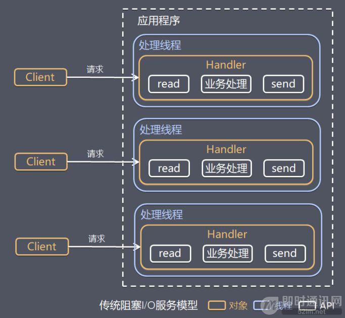


## Reactor模式

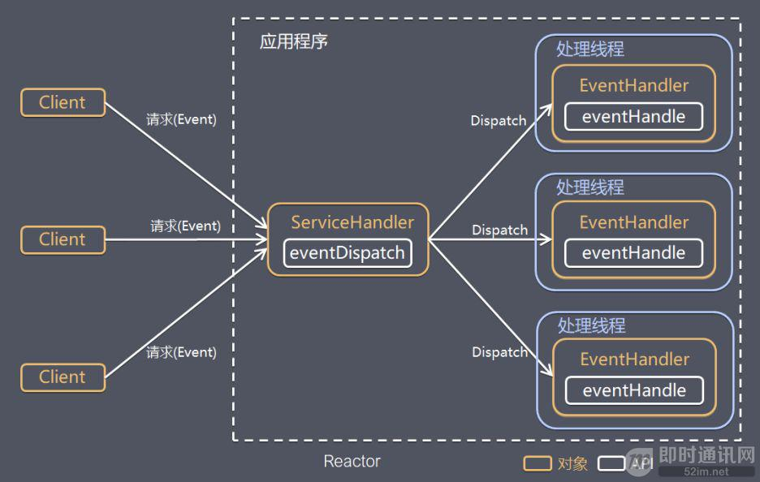

**I/O 复用结合线程池，这就是 Reactor 模式基本设计思想。**


Reactor 模式，是指通过一个或多个输入同时传递给服务处理器的服务请求的事件驱动处理模式。

服务端程序处理传入多路请求，并将它们同步分派给请求对应的处理线程，Reactor 模式也叫 Dispatcher 模式。

即 I/O 多了复用统一监听事件，收到事件后分发(Dispatch 给某进程)，是编写高性能网络服务器的必备技术之一。

> **Reactor 模式中有 2 个关键组成：**

- Reactor：Reactor 在一个单独的线程中运行，负责监听和分发事件，分发给适当的处理程序来对 IO 事件做出反应。 它就像公司的电话接线员，它接听来自客户的电话并将线路转移到适当的联系人；
- Handlers：处理程序执行 I/O 事件要完成的实际事件，类似于客户想要与之交谈的公司中的实际官员。Reactor 通过调度适当的处理程序来响应 I/O 事件，处理程序执行非阻塞操作。

> **根据 Reactor 的数量和处理资源池线程的数量不同，有 3 种典型的实现：**

- 单 Reactor 单线程
- 单 Reactor 多线程
- 主从 Reactor 多线程

### 单Reactor单线程

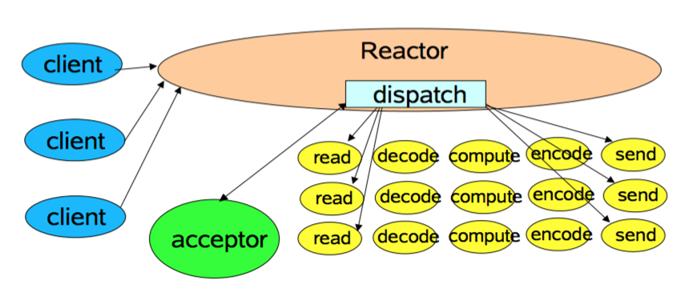

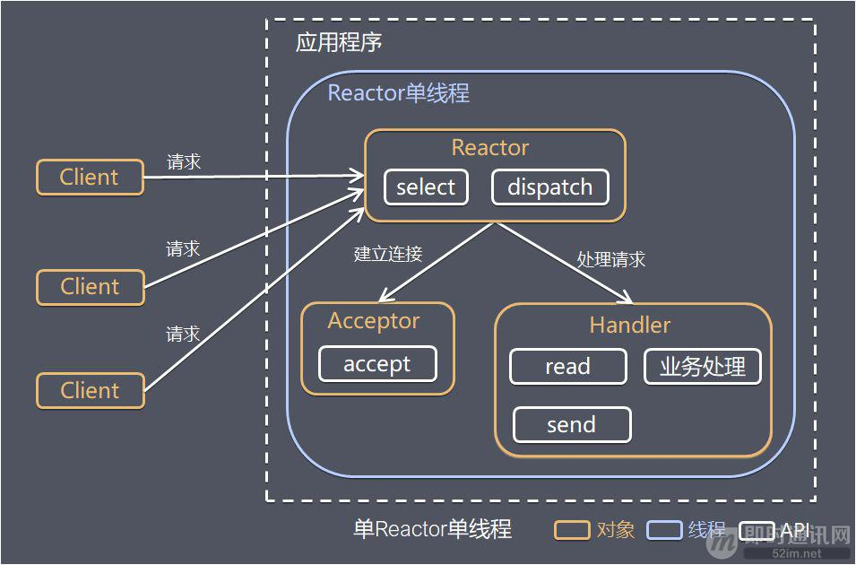


### 单Reactor多线程模型

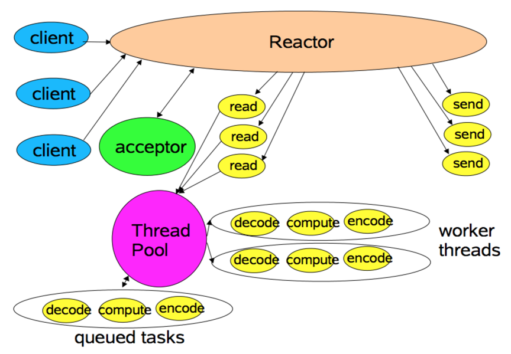

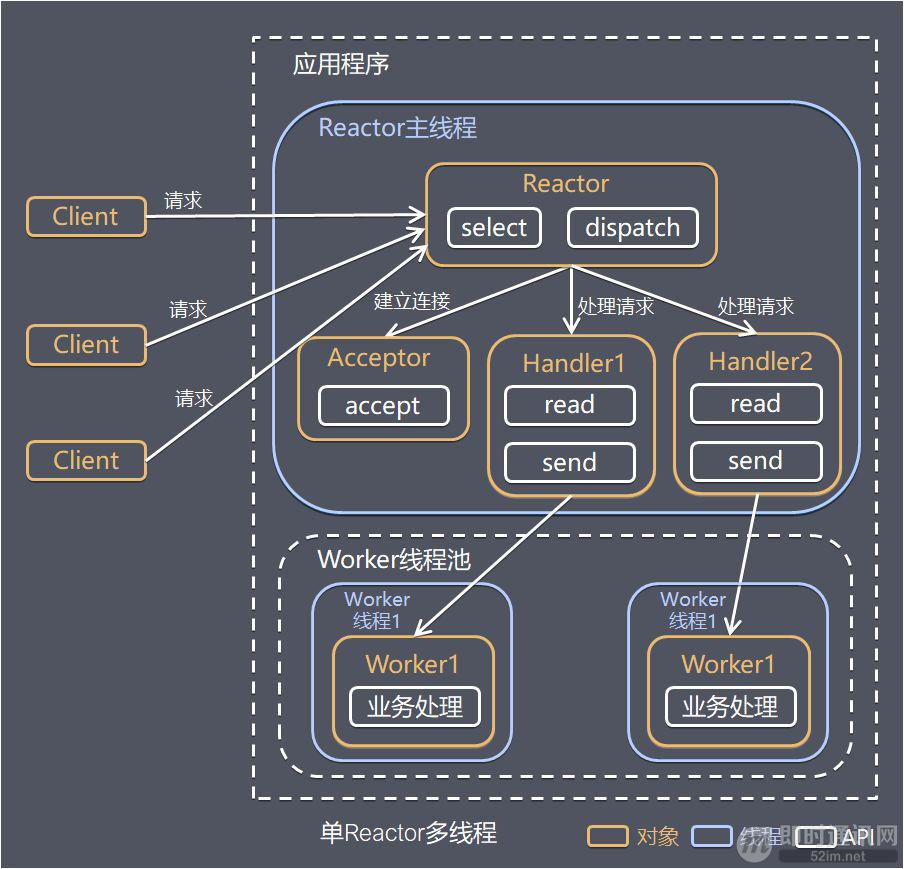


### 主从reactor多线程模型

​		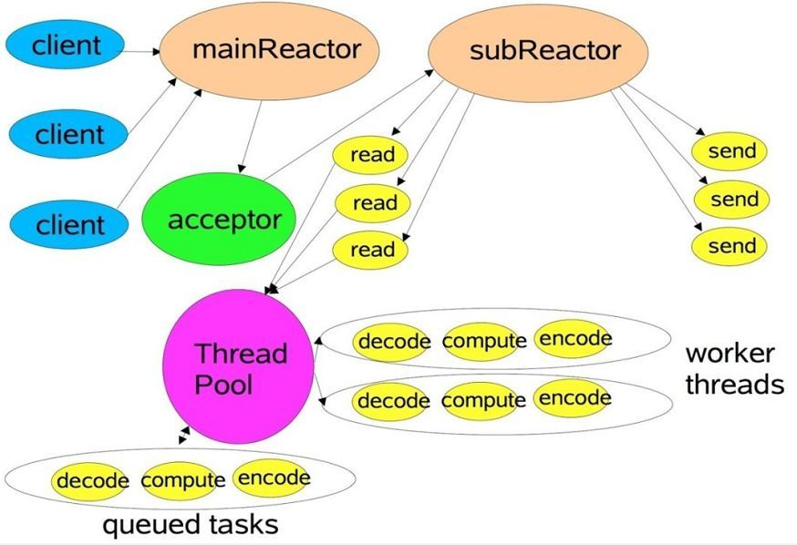

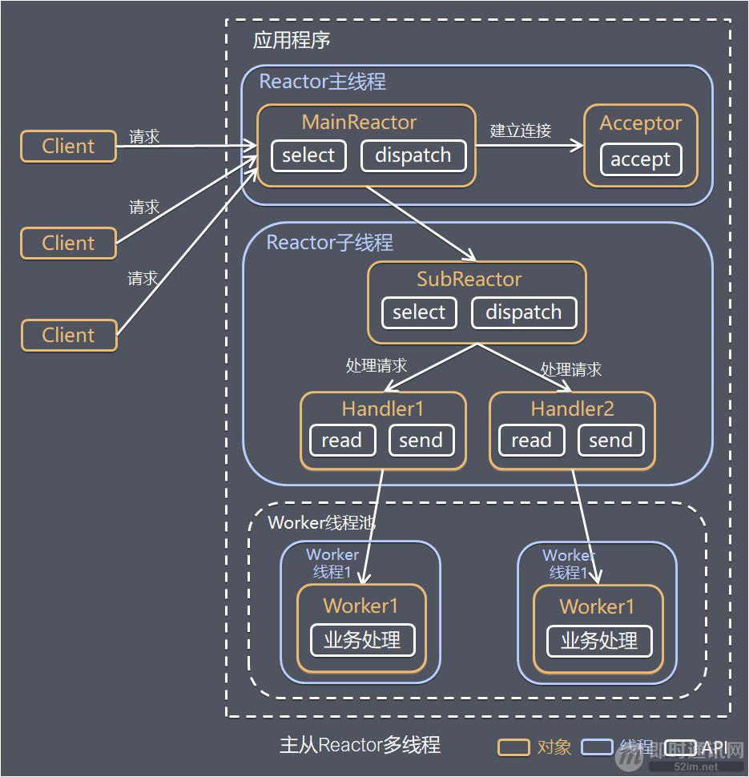

SubReactor可多个


==**虽然 Netty 的线程模型基于主从 Reactor 多线程，借用了 MainReactor 和 SubReactor 的结构。但是实际实现上 SubReactor 和 Worker 线程在同一个线程池中。**==


## Proactor 模型

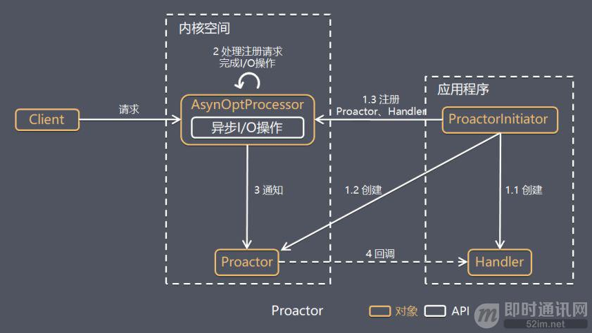


# RPC

**RPC(Remote Procedure Call)** ——远程过程调用，是一个计算机通信协议。该协议允许运行于一台计算机的程序调用另一台计算机的子程序，而程序员无需额外的为这个交互过程编程。


常见 RPC 技术和框架有：

- 应用级的服务框架：阿里的 Dubbo/Dubbox、Google gRPC、Spring Boot/Spring Cloud、Go语言的 rpcx、Apache的 thrift。
- 远程通信协议：RMI、Socket、SOAP(HTTP XML)、REST(HTTP JSON)。
- 通信框架：MINA 和 Netty。


---

# [源码](sources/Netty-source.md)


