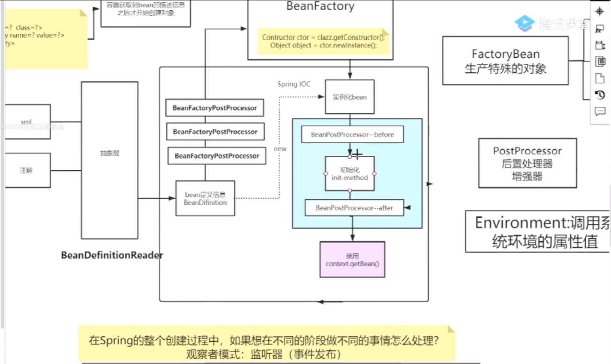

# ==TODO==

**Spring源码：**

1. IOC创建过程
2. bean实例化过程
3. 循环依赖
4. AOP
5. 事件发布监听


# **==Spring是一个框架，一个容器，一个生态。==**

好处：

- 轻量  2M
- 控制反转   松耦合，给出依赖而不是创建或查找依赖
- AOP面向切面编程  分开业务逻辑和系统服务
- 容器  包含并管理应用中对象的生命周期和配置
- MVC框架  替代Web框架
- 事务管理  提供持续的事务管理接口，可以扩展到上至本地事务下至全局事务（JTA）
- 异常处理  提供API把具体技术相关的异常（如JDBC、Hibernate、JDO抛出的）转换为一直的unchecked异常


# Spring模块

- Spring Core： 核心类库，主要提供 IoC 依赖 注⼊功能。 
- Spring Context：提供框架式的Bean访问方式以及企业级功能（JNDI、定时任务等）
- Spring AOP ：提供了⾯向切⾯的编程实现。
- Spring Aspects ： 该模块为与AspectJ的集成提供⽀持。 
- Spring JDBC : Java数据库连接。 
- Spring JMS ：Java消息服务。 
- Spring ORM : ⽤于⽀持Hibernate等ORM⼯具。 
- Spring Web : 为创建Web应⽤程序提供⽀持。 如多文件上传。
- Spring MVC：提供面向Web引用的Model-View-Controller实现。
- Spring Test : 提供了对 JUnit 和 TestNG 测试的⽀持。


# IOC

IOC（Inversion Of Control，控制反转）是一种设计思想，就是将原本在程序中⼿动创建对象的控制权，交由Spring框架来管理。IoC 容器是 Spring⽤来实现 IoC 的载体， IoC 容器实际上就是个Map（key，value）,Map 中存放的是各种对象。

DI（Dependency Injection，依赖注入）：DI是对IoC更准确的描述，容器动态的将某种依赖关系注入到组件之中。

- set方法注入

  > spring会通过默认的空参构造方法来实例化对象，所以如果在类中写了一个带有参数的构造方法，一定要把空参数的构造方法写上（必须要有空参构造方法），否则报错。

- 构造方法注入

- 基于注解的注入（接口注入）	成员变量+@Autowired 	？？？


# AOP

​		AOP（Aspect Oriented Programming，面向切面编程）能够将那些与业务无关，却为业务模块所共同调⽤的逻辑或责任（例如事务处理、⽇志管理、权限控制等）封装起来，便于减少系统的重复代码，降低模块间的耦合度，有利于未来的可拓展性和可维护性。

​		Spring AOP是基于动态代理(Proxying)的，如果要代理的对象实现了某个接口，那么Spring AOP会适用JDK Proxy去创建代理对象，而对于没有实现接口的对象会适用Cglib生成一个被代理对象的子类来作为代理。**运行时增强**。

​		当然也可以适用AspectJ。**编译时增强**。基于字节码操作(Bytecode Manipulation)。

## 定义

### 连接点（Joinpoint）

程序执行的某个特定位置（如：某个方法调用前、调用后，方法抛出异常后）。一个类或一段程序代码拥有一些具有边界性质的特定点，这些代码中的特定点就是连接点。Spring仅支持方法的连接点。

### 切点（Pointcut）

如果连接点相当于数据中的记录，那么切点相当于查询条件，一个切点可以匹配多个连接点。Spring AOP的规则解析引擎负责解析切点所设定的查询条件，找到对应的连接点。

`execution(* com.ly.dota..service.*Service.*(..))`

### 增强（Advice）

增强是织入到目标类连接点上的一段程序代码。Spring提供的增强接口都是带方位名的，如：BeforeAdvice、AfterReturningAdvice、ThrowsAdvice等。很多资料上将增强译为“通知”，这明显是个词不达意的翻译，让很多程序员困惑了许久。

> 说明： Advice在国内的很多书面资料中都被翻译成"通知"，但是很显然这个翻译无法表达其本质，有少量的读物上将这个词翻译为"增强"，这个翻译是对Advice较为准确的诠释，我们通过AOP将横切关注功能加到原有的业务逻辑上，这就是对原有业务逻辑的一种增强，这种增强可以是前置增强、后置增强、返回后增强、抛异常时增强和包围型增强。

#### 通知类型

- @Before - 在Joinpoint()之前执行。
- @AfterReturning - 在Joinpoint()正常执行后执行。
- @AfterThrowing - 在Joinpoint()通过抛出异常并退出时执行。
- @After -  (finally) 在Joinpoint()执行后执行。无论方法是正常退出还是异常返回。
- @Around - 在Joinpoint()之前和之后执行。


### 引介（Introduction）

引介是一种特殊的增强，它为类添加一些属性和方法。这样，即使一个业务类原本没有实现某个接口，通过引介功能，可以动态的为该业务类添加接口的实现逻辑，让业务类成为这个接口的实现类。

### 织入（Weaving）

织入是将增强添加到目标类具体连接点上的过程，AOP有三种织入方式：

- ①编译期织入：需要特殊的Java编译期（例如AspectJ的ajc）；
- ②装载期织入：要求使用特殊的类加载器，在装载类的时候对类进行增强；
- ③运行时织入：在运行时为目标类生成代理实现增强。Spring采用了动态代理的方式实现了运行时织入，而AspectJ采用了编译期织入和装载期织入的方式。

### 切面（Aspect）：

切面是由切点和增强（引介）组成的，它包括了对横切关注功能的定义，也包括了对连接点的定义。

> 补充：代理模式是GoF提出的23种设计模式中最为经典的模式之一，代理模式是对象的结构模式，它给某一个对象提供一个代理对象，并由代理对象控制对原对象的引用。简单的说，代理对象可以完成比原对象更多的职责，当需要为原对象添加横切关注功能时，就可以使用原对象的代理对象。我们在打开Office系列的Word文档时，如果文档中有插图，当文档刚加载时，文档中的插图都只是一个虚框占位符，等用户真正翻到某页要查看该图片时，才会真正加载这张图，这其实就是对代理模式的使用，代替真正图片的虚框就是一个虚拟代理；Hibernate的load方法也是返回一个虚拟代理对象，等用户真正需要访问对象的属性时，才向数据库发出SQL语句获得真实对象。


# Bean

## 生命周期


对象创建：

- 从xml配置的Bean、@Bean注解、Java代码BeanDefinitionBuilder中读取Bean的定义，Bean容器利用Java Reflection API实例化Bean对象；
- 使用set()方法设置Bean的属性；
- 使用setxxx()方法注入*Aware接口的依赖（BeanNameAware、BeanClassLoaderAware、BeanFactoryAware、ApplicationContextAware...）；
- 执行通用的方法前置处理，BeanPostProcessor.postProcessorBeforeInitialization()方法
- 执行InitalizingBean.afterPropertiesSet() 方法
- 执行Bean在配置文件中自定义的init-method初始化方法或者 @PostConstruct 标注的方法；
- 执行方法BeanPostProcessor.postProcessorAfterInitialization()方法

销毁对象：

- 执行 DisposableBean.destory() 方法；
- 执行Bean在配置文件中自定义的destory-method方法或者 @PreDestory 标注的方法；


> Spring 源码中bean生命周期

 Bean工厂实现应该尽可能支持标准的Bean生命周期接口。完整的初始化方法及其标准顺序是:

- BeanNameAware's {@code setBeanName}
* BeanClassLoaderAware's {@code setBeanClassLoader}
- BeanFactoryAware's {@code setBeanFactory}
- EnvironmentAware's {@code setEnvironment}
- EmbeddedValueResolverAware's {@code setEmbeddedValueResolver}
- ResourceLoaderAware's {@code setResourceLoader}   (only applicable when running in an application context)
- ApplicationEventPublisherAware's {@code setApplicationEventPublisher}   (only applicable when running in an application context)
- MessageSourceAware's {@code setMessageSource}   (only applicable when running in an application context)
- ApplicationContextAware's {@code setApplicationContext}   (only applicable when running in an application context)
- ServletContextAware's {@code setServletContext}   (only applicable when running in a web application context)
- {@code postProcessBeforeInitialization} methods of BeanPostProcessors
- InitializingBean's {@code afterPropertiesSet}
- a custom init-method definition
- {@code postProcessAfterInitialization} methods of BeanPostProcessors

在关闭bean工厂时，使用以下生命周期方法：

-  {@code postProcessBeforeDestruction} methods of DestructionAwareBeanPostProcessors
- DisposableBean's {@code destroy}
* a custom destroy-method definition


```java
/**
* <p>Bean factory implementations should support the standard bean lifecycle interfaces
* as far as possible. The full set of initialization methods and their standard order is:
* <ol>
* <li>BeanNameAware's {@code setBeanName}
* <li>BeanClassLoaderAware's {@code setBeanClassLoader}
* <li>BeanFactoryAware's {@code setBeanFactory}
* <li>EnvironmentAware's {@code setEnvironment}
* <li>EmbeddedValueResolverAware's {@code setEmbeddedValueResolver}
* <li>ResourceLoaderAware's {@code setResourceLoader}
* (only applicable when running in an application context)
* <li>ApplicationEventPublisherAware's {@code setApplicationEventPublisher}
* (only applicable when running in an application context)
* <li>MessageSourceAware's {@code setMessageSource}
* (only applicable when running in an application context)
* <li>ApplicationContextAware's {@code setApplicationContext}
* (only applicable when running in an application context)
* <li>ServletContextAware's {@code setServletContext}
* (only applicable when running in a web application context)
* <li>{@code postProcessBeforeInitialization} methods of BeanPostProcessors
* <li>InitializingBean's {@code afterPropertiesSet}
* <li>a custom init-method definition
* <li>{@code postProcessAfterInitialization} methods of BeanPostProcessors
* </ol>
*
* <p>On shutdown of a bean factory, the following lifecycle methods apply:
* <ol>
* <li>{@code postProcessBeforeDestruction} methods of DestructionAwareBeanPostProcessors
* <li>DisposableBean's {@code destroy}
* <li>a custom destroy-method definition
* </ol>
*/
```




BeanDefinitionReader


BeanFactory


PostProcessor


FactoryBean 生成特殊的对象

- isSingleton
- getObject
- getObjectType


Environment 调用系统环境的属性值

`System.getenv();`

`System.getProperties();`


## 作用域

| 作用域        | 说明                                                         |
| ------------- | ------------------------------------------------------------ |
| singleton     | 单例，适合无状态的bean                                       |
| prototype     | 每次返回一个新的对象，适合有状态的bean，需注意创建对象的开销 |
| request       | 每次HTTP请求都创建一个bean对象，适用WebApplicationContext环境 |
| session       | web容器中的对象，同一会话共享一个bean对象                    |
| globalSession | web容器全局的对象，所有会话共享一个bean对象                  |


## 自动装配的方式

- no：不进行自动装配，手动设置Bean的依赖关系。
- byName：根据Bean的名字进行自动装配。
- byType：根据Bean的类型进行自动装配。
- constructor：类似于byType，不过是应用于构造器的参数，如果正好有一个Bean与构造器的参数类型相同则可以自动装配，否则会导致错误。
- autodetect：如果有默认的构造器，则通过constructor的方式进行自动装配，否则使用byType的方式进行自动装配。

> 说明：自动装配没有自定义装配方式那么精确，而且不能自动装配简单属性（基本类型、字符串等），在使用时应注意。

## 类声明为Spring bean注解

一般使用`@Autowired` 注解自动装配bean，要想把类标识成可用于@Autowired注解自动装配的bean的类，可用以下注解：（标注需要由Spring IoC容器进行对象托管的类）

- `@Component` ：通用注解，可标注任意类为Spring组件。如果一个bean不知道属于哪一层，可使用该注解标注。
  - `@Controller` ：对应Spring MVC 控制层，主要用于接受用户请求并调用Service层返回数据给前端页面。
  - `@Service` ：对应业务层，主要涉及一些复杂的逻辑，需要用到Dao层。
  - `@Repository` ：对应持久层即Dao层，主要用于数据库相关操作。使未经检查的异常有资格转换为Spring DataAccessException

## Spring配置Bean的方式

- 基于XML文件进行配置
- 基于注解进行配置
- 基于Java程序进行配置（Spring 3+）


# 事务

## ACID

- 原子性(Atomic)：事务中各项操作，要么全做要么全不做，任何一项操作的失败都会导致整个事务的失败；
- 一致性(Consistent)：事务结束后系统状态是一致的；
- 隔离性(Isolated)：并发执行的事务彼此无法看到对方的中间状态；
- 持久性(Durable)：事务完成后所做的改动都会被持久化，即使发生灾难性的失败。通过日志和同步备份可以在故障发生后重建数据。

## 事务隔离级别

一个事务对数据的修改与另一个并行的事务的隔离程度，当多个事务同时访问相同数据时，若没有采取必要的隔离机制，就可能会发生以下问题：

- 3类数据读取问题：
  - 脏读（Dirty Read）：A事务读取B事务尚未提交的数据并在此基础上操作，而B事务执行回滚，那么A读取到的数据就是脏数据。
  - 幻读（Phantom Read）：事务A重新执行一个查询，返回一系列符合查询条件的行，发现其中插入了被事务B提交的行。
  - 不可重复读（Unrepeatable Read）：事务A重新读取前面读取过的数据，发现该数据已经被另一个已提交的事务B修改过了。
- 2类数据更新问题：
  - 第1类丢失更新：事务A撤销时，把已经提交的事务B的更新数据覆盖了。
  - 第2类丢失更新：事务A覆盖事务B已经提交的数据，造成事务B所做的操作丢失。

**Spring支持的隔离级别**

- READ_UNCOMMITED	读未提交（脏读）最低隔离级别，一切皆有可能。
- READ_COMMITED	读已提交，ORACLE默认隔离级别，有幻读和不可重复读风险。
- REPEATABLE_READ	可重复读，解决不可重复读，有幻读风险。
- SERIALIZABLE	串行化，最高隔离级别。挨个运行完解决所有问题。

| 隔离级别        | 脏读   | 幻读   | 不可重复读 | 第一类丢失更新 | 第二类丢失更新 |
| --------------- | ------ | ------ | ---------- | -------------- | -------------- |
| READ UNCOMMITED | 允许   | 允许   | 允许       | 不允许         | 允许           |
| READ COMMITTED  | 不允许 | 允许   | 允许       | 不允许         | 允许           |
| REPEATABLE READ | 不允许 | 允许   | 不允许     | 不允许         | 不允许         |
| SERIALIZABLE    | 不允许 | 不允许 | 不允许     | 不允许         | 不允许         |

事务隔离级别不是设置得越高越好（意味着要花手段去加锁保证正确性，效率会降低），实际开发中需要在效率和并发正确性之间做取舍，一般会设置READ_COMMITED避免脏读，再通过其他手段去解决幻读和不可重复读。

> 在MYSQL数据库中，支持上面四种隔离级别，默认的为Repeatable read(**可重复读**)；
>
> 在Oracle数据库中，只支持Serializeble(串行化)级别和Read committed(**读已提交**)这两种级别，其中默认的为Read committed级别。


## 事务传播行为

保证事务：**ACID（原子性Atomic、一致性Consistent、隔离性isolated和持久性Durable）**

事务的传播行为针对的是嵌套的关系。（如A中调用B，主要针对的是B的事务情况）

- Propagation.REQUIRED -- 支持当前事务，如果当前没有事务，就新建一个事务,最常见的选择。
- Propagation.SUPPORTS -- 支持当前事务，如果当前没有事务，就以非事务方式执行
- Propagation.MANDATORY -- 支持当前事务，如果当前没有事务，就抛出异常。
- Propagation.REQUIRES_NEW -- 新建事务，如果当前存在事务，把当前事务挂起, 两个事务之间没有关系，一个异常，一个提交，不会同时回滚。
- Propagation.NOT_SUPPORTED -- 以非事务方式执行操作，如果当前存在事务，就把当前事务挂起。
- Propagation.NEVER -- 以非事务方式执行，如果当前存在事务，则抛出异常
- Propagation.NESTED -- 如果当前存在事务则在嵌套事务内执行。如果当前没有事务，则执行与Propagation.REQUIRED类似的操作。

## 事务实现方式

- 编程式事务管理：很大的灵活性但很难维护。

- 声明式事务管理：事务管理和业务代码分离，只需通过注解或XML配置管理事务。

## 事务注解的本质

@Transactional这个注解仅仅是一些（和事务相关的）元数据，在运行时被事务基础设施读取消费，并使用这些元数据来配置bean的事务行为。

- 表明该方法要参与事务
- 配置相关属性来定制事务的参与方式和运行行为

声明式事务主要是得益于Spring AOP。使用一个事务拦截器，在方法调用的前后/周围进行事务性增强（advice），来驱动事务完成。

@Transactional注解既可以标注在类上，也可以标注在方法上。当在类上时，默认应用到类里的所有方法。若此时方法上也标注了，则方法上的优先级高。另外注意方法一定要是public的。


# 三级缓存 ==//todo==

## ==**Spring三级缓存是为了解决代理过程中的循环依赖问题。**==

**==提前暴露==**

```java
	private final Map<String, Object> singletonObjects = new ConcurrentHashMap<>(256);
	private final Map<String, Object> earlySingletonObjects = new HashMap<>(16);
	//Cache of singleton factories: bean name to ObjectFactory.
	private final Map<String, ObjectFactory<?>> singletonFactories = new HashMap<>(16);
```

- 一级缓存`singletonObjects`：成品对象，实例化和初始化都完成

- 二级缓存`earlySingletonObjects`：半成品对象，实例化完成但未初始化   **考虑性能**


- 三级缓存`singletonFactories`：单例对象工厂，lambda表达式（获取对象的一个匿名内部类）	回调机制   **考虑代理对象**


我们刚开始创建对象时有一个循环，正常先创建A再创建B；但是如果有循环依赖的话，在创建A的过程中就要把B的对象创建了。

1. 每次获取bean对象的时候先从一级缓存中获取值。
2. 创建B对象的目的是在给A填充属性的时候发现需要B对象，所以顺带创建了B对象。


**二级缓存也可以解决循环依赖问题，前提是没有使用aop不需要创建代理对象。**

==**三级缓存是为了解决代理过程中的循环依赖问题。**==

> 是否需要三级缓存?
>
> 如果创建的Bean有对应的代理，那其他对象注入时，注入的应该是对应的代理对象；但是Spring无法提前知道这个对象是不是有循环依赖的情况，而正常情况下（没有循环依赖情况），Spring都是在创建好完成品Bean之后才创建对应的代理。这时候Spring有两个选择：
>
> 1 不管有没有循环依赖，都提前创建好代理对象，并将代理对象放入缓存，出现循环依赖时，其他对象直接就可以取到代理对象并注入。
> 2 不提前创建好代理对象，在出现循环依赖被其他对象注入时，才实时生成代理对象。这样在没有循环依赖的情况下，Bean就可以按着Spring设计原则的步骤来创建。
> Spring选择了第二种方式，那怎么做到==**提前曝光对象**==而又不生成代理呢？
> Spring就是在对象外面包一层ObjectFactory，提前曝光的是ObjectFactory对象，在被注入时才在ObjectFactory.getObject方式内实时生成代理对象，并将生成好的代理对象放入到第二级缓存Map<String, Object> earlySingletonObjects。
> addSingletonFactory(beanName, () -> getEarlyBeanReference(beanName, mbd, bean));


总结：我们在获取对象时通过name获取，如果原始对象和代理对象同时存在的话，无法选择获取哪一个。使用lambda表达式代表了一种回调机制，当需要使用当前对象的时候，通过lambda表达式追踪返回一个确定的最终版本对象，而不需要判断有几个对象，因为是替换的过程，最终只会有一个对象。


## 源码及分析

### **（1）查看“获取Bean”的源码，注意getSingleton()方法。**

```java
public class DefaultSingletonBeanRegistry extends SimpleAliasRegistry implements SingletonBeanRegistry {
        //第1级缓存 用于存放 已经属性赋值、完成初始化的 单列BEAN
        private final Map<String, Object> singletonObjects = new ConcurrentHashMap<>(256);
        //第2级缓存 用于存在已经实例化，还未做代理属性赋值操作的 单例BEAN
        private final Map<String, Object> earlySingletonObjects = new HashMap<>(16);
        //第3级缓存 存储创建单例BEAN的工厂
        private final Map<String, ObjectFactory<?>> singletonFactories = new HashMap<>(16);
        //已经注册的单例池里的beanName
        private final Set<String> registeredSingletons = new LinkedHashSet<>(256);
        //正在创建中的beanName集合
        private final Set<String> singletonsCurrentlyInCreation =
                Collections.newSetFromMap(new ConcurrentHashMap<>(16));
        //缓存查找bean  如果第1级缓存没有，那么从第2级缓存获取。如果第2级缓存也没有，那么从第3级缓存创建，并放入第2级缓存。
        protected Object getSingleton(String beanName, boolean allowEarlyReference) {
            Object singletonObject = this.singletonObjects.get(beanName); //第1级
            if (singletonObject == null && isSingletonCurrentlyInCreation(beanName)) {
                synchronized (this.singletonObjects) {
                    singletonObject = this.earlySingletonObjects.get(beanName); //第2级
                    if (singletonObject == null && allowEarlyReference) {
                        //第3级缓存  在doCreateBean中创建了bean的实例后，封装ObjectFactory放入缓存的bean实例
                        ObjectFactory<?> singletonFactory = this.singletonFactories.get(beanName);
                        if (singletonFactory != null) {
                            //创建未赋值的bean
                            singletonObject = singletonFactory.getObject();
                            //放入到第2级缓存
                            this.earlySingletonObjects.put(beanName, singletonObject);
                            //从第3级缓存删除
                            this.singletonFactories.remove(beanName);
                        }
                    }
                }
            }
            return singletonObject;
        }   
	}
```

### **（2）“添加到第1级缓存”的源码：**

```java
protected void addSingleton(String beanName, Object singletonObject) {
            synchronized (this.singletonObjects) {
                // 放入第1级缓存
                this.singletonObjects.put(beanName, singletonObject);
                // 从第3级缓存删除
                this.singletonFactories.remove(beanName);
                // 从第2级缓存删除
                this.earlySingletonObjects.remove(beanName);
                // 放入已注册的单例池里
                this.registeredSingletons.add(beanName);
            }
        }

```

### **（3）“添加到第3级缓存”的源码：**

```java
protected void addSingletonFactory(String beanName, ObjectFactory<?> singletonFactory) {
            synchronized (this.singletonObjects) {
                // 若第1级缓存没有bean实例
                if (!this.singletonObjects.containsKey(beanName)) {
                    // 放入第3级缓存
                    this.singletonFactories.put(beanName, singletonFactory);
                    // 从第2级缓存删除，确保第2级缓存没有该bean
                    this.earlySingletonObjects.remove(beanName);
                    // 放入已注册的单例池里
                    this.registeredSingletons.add(beanName);
                }
            }
        }
```

### **（4）“创建Bean”的源码：**

```java
protected Object doCreateBean(final String beanName, final RootBeanDefinition mbd, Object[] args) throws BeanCreationException {
    BeanWrapper instanceWrapper = null;
    
    if (instanceWrapper == null) {
        //实例化对象
        instanceWrapper = this.createBeanInstance(beanName, mbd, args);
    }
 
    final Object bean = instanceWrapper != null ? instanceWrapper.getWrappedInstance() : null;
    Class<?> beanType = instanceWrapper != null ? instanceWrapper.getWrappedClass() : null;
   
    //判断是否允许提前暴露对象，如果允许，则直接添加一个 ObjectFactory 到第3级缓存
    boolean earlySingletonExposure = (mbd.isSingleton() && this.allowCircularReferences &&
                isSingletonCurrentlyInCreation(beanName));
    if (earlySingletonExposure) {
        //添加到第3级缓存
        addSingletonFactory(beanName, () -> getEarlyBeanReference(beanName, mbd, bean));
    }
 
    //填充属性
    this.populateBean(beanName, mbd, instanceWrapper);
    //执行初始化方法，并创建代理
    exposedObject = initializeBean(beanName, exposedObject, mbd);
    return exposedObject;
}
```

通过这段代码，我们可以知道：==Spring 在实例化对象之后，就会为其创建一个 Bean 工厂，并将此工厂加入到三级缓存中。==

**因此，Spring 一开始提前暴露的并不是实例化的 Bean，而是将 Bean 包装起来的ObjectFactory。为什么要这么做呢？**

这实际上涉及到 AOP。如果创建的 Bean 是有代理的，那么注入的就应该是代理 Bean，而不是原始的 Bean。但是，Spring一开始并不知道 Bean是否会有循环依赖，通常情况下（没有循环依赖的情况下），Spring 都会在“完成填充属性并且执行完初始化方法”之后再为其创建代理。但是，如果出现了循环依赖，Spring 就不得不为其提前创建"代理对象"；否则，注入的就是一个原始对象，而不是代理对象。因此，这里就涉及到"应该在哪里提前创建代理对象"？

Spring 的做法就是：==在 ObjectFactory 中去提前创建代理对象。==它会执行 getObject() 方法来获取到 Bean。实际上，它真正执行的方法如下：

```java
protected Object getEarlyBeanReference(String beanName, RootBeanDefinition mbd, Object bean) {
    Object exposedObject = bean;
    if (!mbd.isSynthetic() && hasInstantiationAwareBeanPostProcessors()) {
        for (BeanPostProcessor bp : getBeanPostProcessors()) {
            if (bp instanceof SmartInstantiationAwareBeanPostProcessor) {
                SmartInstantiationAwareBeanPostProcessor ibp = (SmartInstantiationAwareBeanPostProcessor) bp;
                // 如果需要代理，这里会返回代理对象；否则，返回原始对象。
                exposedObject = ibp.getEarlyBeanReference(exposedObject, beanName);
            }
        }
    }
    return exposedObject;
}
```

提前进行对象的代理工作，并在 `earlyProxyReferences` map中记录已被代理的对象，是为了避免在后面重复创建代理对象。

```java
public abstract class AbstractAutoProxyCreator extends ProxyProcessorSupport
        implements SmartInstantiationAwareBeanPostProcessor, BeanFactoryAware {
    @Override
    public Object getEarlyBeanReference(Object bean, String beanName) {
        Object cacheKey = getCacheKey(bean.getClass(), beanName);
        // 记录已被代理的对象
        this.earlyProxyReferences.put(cacheKey, bean);
        return wrapIfNecessary(bean, beanName, cacheKey);
    }
}
```

再次分析**获取bean的方法getSingleton()方法，可知：**

**提前暴露的对象**，虽然已实例化，但是没有进行属性填充，还没有完成初始化，是一个不完整的对象。 这个对象存放在二级缓存中，对于三级缓存机制十分重要，是解决循环依赖一个非常巧妙的设计。


## 特殊情景循环依赖 A依赖B B依赖A

> 让我们来分析一下“A的某个field或者setter依赖了B的实例对象，同时B的某个field或者setter依赖了A的实例对象”这种循环依赖的情景。

1. A 调用doCreateBean()创建Bean对象：由于还未创建，从**第1级缓存singletonObjects**查不到，此时只是一个半成品（**==提前暴露的对象==**），放入**第3级缓存singletonFactories**。
2. A在**属性填充**时发现自己需要B对象，但是在三级缓存中均未发现B，于是创建B的半成品，放入**第3级缓存singletonFactories**。
3. B在**属性填充**时发现自己需要A对象，从**第1级缓存**singletonObjects和**第2级缓存**earlySingletonObjects中未发现A，但是在**第3级缓存**singletonFactories中发现A，将A放入第2级缓存earlySingletonObjects，同时从**第3级缓存**singletonFactories删除。
4. 将A注入到对象B中。
5. B完成**属性填充**，执行**初始化方法**，将自己放入**第1级缓存singletonObjects**中（此时B是一个完整的对象），同时从**第3级缓存**singletonFactories和**第2级缓存earlySingletonObjects**中删除。
6. A得到“对象B的完整实例”，将B注入到A中。
7. A完成**属性填充**，执行初始化方法，并放入到**第1级缓存singletonObjects**中。

==在创建过程中，都是从第三级缓存(对象工厂创建不完整对象)，将提前暴露的对象放入到第二级缓存；从第二级缓存拿到后，完成初始化，并放入第一级缓存。==


# Spring 框架中⽤到了哪些设计模式？

## 单例模式

 Spring 中的 Bean 默认都是单例的。

## 原型模式

也叫克隆模式，prototype。有一个原型**实例**，基于这个原型实例产生新的实例，也就是“克隆”了。

> Object 类中有一个 clone() 方法，它用于生成一个新的对象。实现Cloneable 接口后调用。
>
> java 的克隆是浅克隆，碰到对象引用的时候，克隆出来的对象和原对象中的引用将指向同一个对象。通常实现深克隆的方法是将对象进行序列化，然后再进行反序列化。

## 模板模式

父类定义好流程，然后将流程中需要子类实现的方法就抽象化留给子类实现。如JdbcTemplate

- 加载驱动
- 获取连接通道
- 构建sql语句		不确定 需子类实现。
- 执行sql语句
- 关闭资源

## 观察者模式

定义的是对象间的一种一对多的依赖关系，当一个对象的状态发生改变时，所有依赖它的对象都得到通知并被自动更新。如Listener的实现ApplicationListener

## 工厂模式

### 简单工厂模式

通过工厂根据传递进来的参数决定生成哪个对象。如getBean()的时候根据id/name

## 工厂模式

在Spring中一般是将Bean的实例化直接交给容器去管理的，实现了使用和创建的分离，这时容器直接管理对象。若我们将Bean的创建过程交给一个工厂去实现，而Spring容器管理则工厂即是工厂模式。

## 适配器模式

有一个接口需要实现，但是我们现成的对象都不满足，需要加一层适配器来进行适配。

如AOP实现中的Advice和interceptor之间的转换。

## 装饰模式

动态地为一个对象增加新的功能。如类名中含有Wrapper/Decorator

如Spring Session中的SessionRepositoryRequestWrapper对原request增强，可以将session中的数据和分布式数据库进行同步，这样即使当前Tomcat崩溃session中的数据也不会丢失。

## 代理模式

AOP实现

## 策略模式

解决某一个问题的算法族，允许用户从该算法族中任选一个算法解决某一问题，同时可以方便地更换算法或新增算法。如Spring在实例化对象的时候用到strategy模式。XmlBeanDefinitionReader,PropertiesBeanDefinitionReader

## 责任链模式

AOP中的拦截器链

## 委托者模式

DelegatingFilterProxy,整合Shiro,SpringSecurity的时候都有用到。

# Autowired和Resource关键字的区别

都是做bean的注入时使用。但后者需要导入javax.annotation.Resource

相同点：都可写在字段和setter()方法上。字段上不需再写setter()方法。

不同点：

@Autowired需要导入org.springframework.beans.factory.annotation.Autowired；只按照byType注入。
默认情况下要求依赖对象必须存在，若允许null值可设置required为false。若想byName注入需结合
@Qualifier一起使用。

@Resource按照byName注入，J2EE提供。默认
name:Spring解析为bean名字
type:bean类型

## 注入bean的三个注解

- @Autowired是spring自带的，@Inject是JSR330规范实现的，@Resource是JSR250规范实现的，需要导入不同的包
- @Autowired、@Inject用法基本一样，不同的是@Autowired有一个request属性
- @Autowired、@Inject是默认按照类型匹配的，@Resource是按照名称匹配的
- @Autowired如果需要按照名称匹配需要和@Qualifier一起使用，@Inject和@Name一起使用

# 常用注解

@Controller @Service @RestController @RequestBody 

- @indexed(创建索引文件，提升@ComponentScan效率)  Spring5.0提供 (@Component包含该注解)
  系统启动时读取META-INFO/spring.components文件，不用再遍历所有目录。

- @Import是import标签的替换，在SpringBoot的自动装配中非常重要，也是EnableXXX的前置基础。


# Spring如何解决循环依赖

- 单例
  - 构造注入	无解，为避免栈溢出，需要检测有就抛异常(创建时用Set集合做记录，完成后移除。若getBean()时判断有该bean记录就判断为循环依赖并抛异常。)
  - 设值注入	三级缓存-提前暴露	(代理对象的场景)
- 原型
  - 构造注入	无解，为避免栈溢出，需要检测有就抛异常
  - 设值注入	不支持循环依赖

# Spring和SpringMVC的关系

2个容器：

- Spring中的IoC容器	**父容器**	维护Service和Dao中的实例
  - SpringMVC中的IoC容器	维护Controller中定义的实例

父子关系——Controller中的对象可以获取Service中对象


