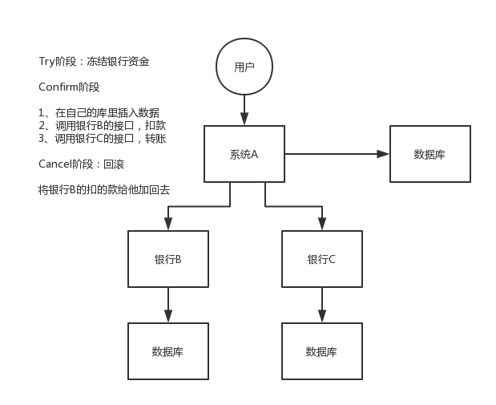

# 杂项

nginx + redis + mq + db


网络：云原生、容器、虚拟化，网络？

高并发负载均衡高可用

集群

通信

socket

IO:

- 磁盘
- 网络
  - NIO
  - epoll
  - netty
  - RPC  v.s 微服务的通信无状态http


redis	AKF canal	单机；多机2类集群:主从复制、分片集群

​	CAP	P容错？一定会发生网络不通的现象

zookeeper	**时点性一致性**


分布式	中间件 大数据生态 tcp socket reactor io+threads

微服务	通信无状态 restful http

​			rpc	有状态通信

​		？问题 50线程并发访问，请问io的数量是多少？

​		http 50	rpc 1个就可以


service mesh	


# 集群、分布式、微服务

## 集群

​		**同一个业务，部署在多个服务器上。**

​		通过提高单位时间内执行的任务数来提升效率。

​		一般配置Nginx的负载容器实现：静态资源缓存、Session共享可以附带实现，Nginx支持50000个并发量。

## 分布式

​		**将一个大的系统划分为多个业务模块，业务模块分别部署到不同的机器上，各个业务模块之间通过接口进行数据交互。区别分布式的方式是根据不同机器不同业务。**

​		通过缩短单个任务的执行时间来提升效率。

> 好的设计应该是分布式和集群的结合，先分布式再集群，具体实现就是业务拆分成很多子业务，然后针对每个子业务进行集群部署，这样每个子业务如果出了问题，整个系统完全不会受影响。

## 微服务

​		很小的服务，只对应一个单一的业务能力。这个服务可以**单独部署运行**，服务之间可以通过RPC来相互交互，各个微服务之间是松耦合的。每个微服务都是由独立的小团队开发，测试，部署，上线，负责它的整个生命周期。

​		微服务的设计是为了不因为某个模块的升级和BUG影响现有的系统业务。

​		微服务与分布式的细微差别是，微服务的应用不一定是分散在多个服务器上，也可以是同一个服务器。分布式和微服的架构很相似，只是部署的方式不一样而已。


# 高并发系统设计


## 系统拆分

​		将一个系统拆分为多个子系统，用 dubbo 来搞。然后每个系统连一个数据库，这样本来就一个库，现在多个数据库，不也可以扛高并发么。

## 缓存

​		缓存，必须得用缓存。大部分的高并发场景，都是**读多写少**，那你完全可以在数据库和缓存里都写一份，然后读的时候大量走缓存不就得了。毕竟人家 redis 轻轻松松单机几万的并发。所以你可以考虑考虑你的项目里，那些承载主要请求的**读场景，怎么用缓存来抗高并发**。

## MQ

​		MQ，必须得用 MQ。可能你还是会出现高并发写的场景，比如说一个业务操作里要频繁搞数据库几十次，增删改增删改，疯了。那高并发绝对搞挂你的系统，你要是用 redis 来承载写那肯定不行，人家是缓存，数据随时就被 LRU 了，数据格式还无比简单，没有事务支持。所以该用 mysql 还得用 mysql 啊。那你咋办？用 MQ 吧，大量的写请求灌入 MQ 里，排队慢慢玩儿，**后边系统消费后慢慢写**，控制在 mysql 承载范围之内。所以你得考虑考虑你的项目里，那些承载复杂写业务逻辑的场景里，如何用 MQ 来异步写，提升并发性。MQ 单机抗几万并发也是 ok 的，这个之前还特意说过。

## 分库分表

​		分库分表，可能到了最后数据库层面还是免不了抗高并发的要求，好吧，那么就将一个数据库拆分为多个库，多个库来扛更高的并发；然后将一个表**拆分为多个表**，每个表的数据量保持少一点，提高 sql 跑的性能。

## 读写分离

​		读写分离，这个就是说大部分时候数据库可能也是读多写少，没必要所有请求都集中在一个库上吧，可以搞个主从架构，**主库写**入，**从库读**取，搞一个读写分离。**读流量太多**的时候，还可以**加更多的从库**。

## ElasticSearch

​		Elasticsearch，简称 es。es 是分布式的，可以随便扩容，分布式天然就可以支撑高并发，因为动不动就可以扩容加机器来扛更高的并发。那么一些比较简单的查询、统计类的操作，可以考虑用 es 来承载，还有一些全文搜索类的操作，也可以考虑用 es 来承载。


​		上面的 6 点，基本就是高并发系统肯定要干的一些事儿，大家可以仔细结合之前讲过的知识考虑一下，到时候你可以系统的把这块阐述一下，然后每个部分要注意哪些问题，之前都讲过了，你都可以阐述阐述，表明你对这块是有点积累的。

​		说句实话，毕竟你真正厉害的一点，不是在于弄明白一些技术，或者大概知道一个高并发系统应该长什么样？其实实际上在真正的复杂的业务系统里，做高并发要远远比上面提到的点要复杂几十倍到上百倍。你需要考虑：哪些需要分库分表，哪些不需要分库分表，单库单表跟分库分表如何 join，哪些数据要放到缓存里去，放哪些数据才可以扛住高并发的请求，你需要完成对一个复杂业务系统的分析之后，然后逐步逐步的加入高并发的系统架构的改造，这个过程是无比复杂的，一旦做过一次，并且做好了，你在这个市场上就会非常的吃香。

​		其实大部分公司，真正看重的，不是说你掌握高并发相关的一些基本的架构知识，架构中的一些技术，RocketMQ、Kafka、Redis、Elasticsearch，高并发这一块，你了解了，也只能是次一等的人才。对一个有几十万行代码的复杂的分布式系统，一步一步架构、设计以及实践过高并发架构的人，这个经验是难能可贵的。


# 分布式系统

## 分布式锁


### 定义

分布式锁是**控制分布式系统之间同步访问共享资源的一种方式，通过互斥来保持一致性。**

在有分布式锁的情况下，能保证多级多进程多线程访问资源的一致性。这时候还是**需要**进程内部的JVM锁。中间件IO吞吐有效操作，保证性能。

### 特性

- **互斥**：任意时刻，只能有一个客户端才能获取锁
- **避免死锁：** 死锁指获取锁的客户端因为某些原因（异常退出或崩溃）未能释放锁，其他客户端再也无法获取到锁，从而导致整个流程无法继续进行。解决办法如下：
  - **引入过期时间**：TTL，但并不能完全避免死锁。会有**锁过期和释放别人的锁**的问题。
  - **锁附加唯一性**：针对释放别人锁的问题，可在应用层检查为每个客户端进程设置的唯一ID。
  - **自动续期**：针对锁过期的问题。可开启守护进程（watch dog）检测失效时间进入续租。如Redsison
  - **可重入性**：允许同一个线程或客户端在持有锁的情况下多次获取同一个锁，而不会出现死锁或阻塞的情况。这对于递归函数调用等场景尤其重要。比如实现Redis分布式锁的可重入，在实现时需要借助Redis的Lua脚本语言，并使用引用计数器技术，保证同一线程可重入锁的正确性。
- **容错**：是为了当部分节点(redis节点等)宕机时，客户端仍然能够获取锁和释放锁
  - 像etcd/zookeeper这种作为锁服务能够自动进行故障切换，因为它本身就是个集群
  - 提供多个独立的锁服务，客户端向多个独立锁服务进行请求，某个锁服务故障时，也可以从其他服务获取到锁信息，缺点很明显客户端需要去请求多个锁服务。

### 分类

#### 自旋

类CAS 自旋分布式锁，询问的方式尝试加锁

- mysql
- redis

#### 监听

event事件通知我后续锁的变化，没有轮询向外的过程

- zookeeper
- etcd

### 实现方式

#### 基于MySQL

- 数据库使用悲观锁 select … where … for update 排他锁，需要where字段走索引否则会锁表；
- 乐观锁CAS使用递增版本号实现。

缺点：

1. 数据库是单点，非常依赖数据库的可用性
2. 需要额外自己维护TTL
3. 在高并发常见下数据库读写是非常缓慢

#### 基于Redis

##### 一般步骤

1. 一个线程尝试去获取锁lock，通过`setnx lKey lValue `。（ lValue可为uuid、randId等**唯一标识**）
2. 获取分布式锁成功之后，需要使用`expire lKey xxx`命令设置锁有效期，防止死锁。
3. 执行相关业务逻辑
4. 释放锁
   - 首先获取到 lKey 对应的 lValue
   - 将此 lValue 与唯一标识对比
   - 如果相同的话执行delete指令删除锁。

##### 保证原子性

- 加锁原子性：`setnx`是原子性的，但步骤1和2（ setnx加锁和 expire超时）是分开执行的，解决如下：

  ```java
  //保证原子性执行命令，避免潜在的设置步骤2过期时间失败问题
  //randId是由客户端生成的一个随机字符串，唯一标识，避免释放别人的锁
  //NX 不存在时才设置	PX 过期时间(ms)
  SET lKey randId NX PX 30000
  ```

- 释放锁原子性：锁的判断在客户端，释放在服务端，若客户端判断成功后阻塞，然后再释放锁可能会释放别人的锁（阻塞期间别人获得了锁）。
  **解决**：锁的判断和删除都应在redis服务端进行，可以借助`lua`脚本保证原子性。【GET、判断、DEL】

  ```lua
  // 判断锁是自己的，才释放
  if redis.call("GET",KEYS[1]) == ARGV[1]
  then
      return redis.call("DEL",KEYS[1])
  else
      return 0
  end
  ```

##### 单机

> 如果Client1获取到锁后，因为业务问题需要较长的处理时间，超过了锁过期时间，该怎么办？

业务执行时间超过了锁过期时间，那么我们可以给锁续期，比如开启一个守护进程，定时监测锁的失效时间，在快要过期的时候，对锁进行自动续期，重新设置过期时间。

**Redisson**框架中就实现了这个**WatchDog**（看门狗）：加锁时必须没有指定加锁时间 leaseTime（或指定为-1）时会启用 watchdog 机制，框架自动默认加锁 30秒，每 10秒钟检查一次，如果存在就重新设置过期时间为 30秒

```java
tryLock(timeout, leaseTime, unit)：获取锁，并设置锁的过期时间；其中timeout参数代表在该时间内获取锁，否则返回失败；leaseTime 表示锁的持有时间。
```

##### 集群

通常都是用【Redis Cluster】或者【哨兵模式】这两种方式实现 Redis 的高可用，这就有主从同步问题发生。

面对这种问题，Redis 的作者提出一种解决方式 `Redlock`， 是基于多个 Redis 节点（都是 Master）的一种实现，该方案基于 2 个前提：

1. 不再需要部署从库和哨兵实例，只部署主库
2. 但主库要部署多个，官方推荐至少 5 个实例

**Redlock加锁流程**：

1. Client先获取「当前时间戳T1」
2. Client依次向这 5 个 Redis 实例发起加锁请求（用前面讲到的 SET 命令），且每个请求会设置超时时间（毫秒级，要远小于锁的有效时间），如果某一个实例加锁失败（包括网络超时、锁被其它人持有等各种异常情况），就立即向下一个 Redis 实例申请加锁
3. 如果Client从 >=3 个（大多数）以上 Redis 实例加锁成功，则再次获取「当前时间戳T2」，如果 T2 - T1 < 锁的过期时间，此时，认为客户端加锁成功，否则认为加锁失败
4. 加锁成功，去操作共享资源（例如修改 MySQL 某一行，或发起一个 API 请求）
5. 加锁失败，Client向「全部节点」发起释放锁请求（前面讲到的 Lua 脚本释放锁）。保证清除节点异常情况导致残留的锁！

Redlock释放锁:

客户端向**所有** Redis 节点发起释放锁的操作


#### 基于ZooKeeper

ZooKeeper 的数据存储结构就像一棵树，这棵树由节点组成，这种节点叫做 Znode

##### 加锁/释放锁的过程

1. Client尝试创建一个 znode 节点，比如/lock，比如Client1先到达就创建成功了，相当于拿到了锁
2. 其它的客户端会创建失败（znode 已存在），获取锁失败。
3. Client2可以进入一种等待状态，等待当/lock 节点被删除的时候，ZooKeeper 通过 watch 机制通知它
4. 持有锁的Client1访问共享资源完成后，将 znode 删掉，锁释放掉了
5. Client2继续完成获取锁操作，直到获取到锁为止

> ZooKeeper不需要考虑过期时间，而是用【临时节点】，Client拿到锁之后，只要连接不断，就会一直持有锁。即使Client崩溃，相应临时节点Znode也会自动删除，保证了锁释放。

每个客户端都与 ZooKeeper 维护着一个 Session，这个 Session 依赖定期的心跳(heartbeat)来维持。

如果 Zookeeper 长时间收不到客户端的心跳，就认为这个 Session 过期了，也会把这个临时节点删除。

**以下场景中Client1和Client2在窗口时间内可能同时获得锁：**

1. Client 1 创建了 znode 节点/lock，获得了锁。
2. Client 1 进入了长时间的 GC pause。（或者网络出现问题、或者 zk 服务检测心跳线程出现问题等等）
3. Client 1 连接到 ZooKeeper 的 Session 过期了。znode 节点/lock 被自动删除。
4. Client 2 创建了 znode 节点/lock，从而获得了锁。
5. Client 1 从 GC pause 中恢复过来，它仍然认为自己持有锁。

##### 优劣

- 优
  - 不需要考虑锁的过期时间，使用起来比较方便
  - watch 机制，加锁失败，可以 watch 等待锁释放，实现乐观锁
- 劣
  - 性能不如 Redis
  - 部署和运维成本高
  - 客户端与 Zookeeper 的长时间失联，锁被释放问题


#### 基于Etcd

Etcd是一个Go语言实现的**非常可靠**的kv存储系统，常在分布式系统中存储着关键的数据，通常应用在配置中心、服务发现与注册、分布式锁等场景。主要从分布式锁的角度来看Etcd是如何实现分布式锁的。

##### 特性

- **Lease机制**：即租约机制(TTL,Time To Live)，etcd可以为存储的kv对设置租约，当租约到期，kv将失效删除；同时也支持续约，keepalive
- **Revision机制**：每个key带有一个Revision属性值，etcd每进行一次事务对应的全局Revision值都会+1，因此每个key对应的Revision属性值都是全局唯一的。通过比较Revision的大小就可以知道进行写操作的顺序
- 在实现分布式锁时，多个程序同时抢锁，根据Revision值大小依次获得锁，避免“惊群效应”，实现公平锁
- **Prefix机制**：也称为目录机制，可以根据前缀获得该目录下所有的key及其对应的属性值
- **Watch机制**：watch支持watch某个固定的key或者一个前缀目录，当watch的key发生变化，客户端将收到通知

为什么这些特性就可以让Etcd实现分布式锁呢？因为Etcd这些特性可以满足实现分布式锁的以下要求：

- **租约机制(Lease)**：用于支撑异常情况下的锁自动释放能力
- **前缀和 Revision 机制**：用于支撑公平获取锁和排队等待的能力
- **监听机制(Watch)**：用于支撑抢锁能力
- **集群模式**：用于支撑锁服务的高可用

##### 流程


## 分布式事务

**分布式事务**是指事务的参与方位于不同的分布式系统的节点上。

### 基础理论

- **CAP**理论：是设计分布式系统的基础理论依据。强一致性、可用性、分区容错性。

- **BASE**理论，是 Basically Available(基本可用)、Soft state(软状态)和 Eventually consistent (最终一致性)三个短语的缩写。是对CAP中AP的一个扩展。

  - 基本可用：
  - 软状态：相对于原子性而言，要求**多个节点的数据副本都是一致**的，这是一种“硬状态”。软状态指的是：允许系统中的数据存在中间状态，并认为该状态不影响系统的整体可用性，即允许系统在多个不同节点的数据副本存在**数据延时**。
  - 最终一致性：

  

分布式事务的实现主要有以下 6 种方案：

- XA 方案
- TCC 方案
- SAGA 方案
- 本地消息表
- 可靠消息最终一致性方案
- 最大努力通知方案

### XA 方案/两阶段提交方案2PC

​		所谓的 XA 方案，即：两阶段提交，有一个**事务管理器**的概念，负责协调多个数据库（资源管理器）的事务，事务管理器先问问各个数据库你准备好了吗？如果每个数据库都回复 ok，那么就正式提交事务，在各个数据库上执行操作；如果任何其中一个数据库回答不 ok，那么就回滚事务。

​		这种分布式事务方案，比较适合单块应用里，跨多个库的分布式事务，而且因为严重依赖于数据库层面来搞定复杂的事务，效率很低，绝对不适合高并发的场景。如果要玩儿，那么基于 `Spring + JTA` 就可以搞定，自己随便搜个 demo 看看就知道了。

​		这个方案，我们很少用，一般来说**某个系统内部如果出现跨多个库**的这么一个操作，是**不合规**的。我可以给大家介绍一下， 现在微服务，一个大的系统分成几十个甚至几百个服务。一般来说，我们的规定和规范，是要求**每个服务只能操作自己对应的一个数据库**。

​		如果你要操作别的服务对应的库，不允许直连别的服务的库，违反微服务架构的规范，你随便交叉胡乱访问，几百个服务的话，全体乱套，这样的一套服务是没法管理的，没法治理的，可能会出现数据被别人改错，自己的库被别人写挂等情况。

​		如果你要操作别人的服务的库，你必须是通过**调用别的服务的接口**来实现，**绝对不允许交叉访问别人的数据库。**


### TCC 方案

​		TCC 的全称是： `Try` 、 `Confirm` 、 `Cancel` 。

- Try 阶段：这个阶段说的是对各个服务的资源做检测以及对资源进行**锁定或者预留**。
- Confirm 阶段：这个阶段说的是在各个服务中**执行实际的操作**。
- Cancel 阶段：如果任何一个服务的业务方法执行出错，那么这里就需要**进行补偿**，就是执行已经执行成功的业务逻辑的回滚操作。（把那些执行成功的回滚）

​		这种方案说实话几乎很少人使用，我们用的也比较少，但是也有使用的场景。因为这个**事务回滚**实际上是**严重依赖于你自己写代码来回滚和补偿**了，会造成补偿代码巨大，非常之恶心。

​		比如说我们，一般来说跟**钱**相关的，跟钱打交道的，**支付**、**交易**相关的场景，我们会用 TCC，严格保证分布式事务要么全部成功，要么全部自动回滚，严格保证资金的正确性，保证在资金上不会出现问题。

​		而且最好是你的各个业务执行的时间都比较短。

​		但是说实话，一般尽量别这么搞，自己手写回滚逻辑，或者是补偿逻辑，实在太恶心了，那个业务代码是很难维护的。




### SAGA 方案

​		金融核心等业务可能会选择 TCC 方案，以追求强一致性和更高的并发量，而对于更多的金融核心以上的业务系统 往往会选择补偿事务，补偿事务处理在 30 多年前就提出了 Saga 理论，随着微服务的发展，近些年才逐步受到大家的关注。目前业界比较公认的是采用 Saga 作为长事务的解决方案。

#### 基本原理

​		业务流程中每个参与者都提交本地事务，若某一个参与者失败，则补偿前面已经成功的参与者。下图左侧是正常的事务流程，当执行到 T3 时发生了错误，则开始执行右边的事务补偿流程，反向执行 T3、T2、T1 的补偿服务 C3、C2、C1，将 T3、T2、T1 已经修改的数据补偿掉。


#### 使用场景

​		对于一致性要求高、短流程、并发高 的场景，如：金融核心系统，会优先考虑 TCC 方案。而在另外一些场景下，我们并不需要这么强的一致性，只需要保证最终一致性即可。

​		比如 很多金融核心以上的业务（渠道层、产品层、系统集成层），这些系统的特点是最终一致即可、流程多、流程长、还可能要调用其它公司的服务。这种情况如果选择 TCC 方案开发的话，一来成本高，二来无法要求其它公司的服务也遵循 TCC 模式。同时流程长，事务边界太长，加锁时间长，也会影响并发性能。

​		所以 Saga 模式的适用场景是：

- 业务流程长、业务流程多；
- 参与者包含其它公司或遗留系统服务，无法提供 TCC 模式要求的三个接口。

#### 优势

- 一阶段提交本地事务，无锁，高性能；
- 参与者可异步执行，高吞吐；
- 补偿服务易于实现，因为一个更新操作的反向操作是比较容易理解的。

#### 缺点

- 不保证事务的隔离性


### 本地消息表

​		本地消息表其实是国外的 ebay 搞出来的这么一套思想。

​		这个大概意思是这样的：

1. A 系统在自己本地一个事务里操作同时，插入一条数据到消息表；
2. 接着 A 系统将这个消息发送到 MQ 中去；
3. B 系统接收到消息之后，在一个事务里，往自己本地消息表里插入一条数据，同时执行其他的业务操作，如果这个消息已经被处理过了，那么此时这个事务会回滚，这样**保证不会重复处理消息**；
4. B 系统执行成功之后，就会更新自己本地消息表的状态以及 A 系统消息表的状态；
5. 如果 B 系统处理失败了，那么就不会更新消息表状态，那么此时 A 系统会定时扫描自己的消息表，如果有未处理的消息，会再次发送到 MQ 中去，让 B 再次处理；
6. 这个方案保证了最终一致性，哪怕 B 事务失败了，但是 A 会不断重发消息，直到 B 那边成功为止。

​		这个方案说实话最大的问题就在于**严重依赖于数据库的消息表来管理事务**啥的，如果是高并发场景咋办呢？咋扩展呢？所以一般确实很少用。


### 可靠消息最终一致性方案

​		这个的意思，就是干脆不要用本地的消息表了，直接基于 MQ 来实现事务。比如阿里的 RocketMQ 就支持消息事务。

​		大概的意思就是：

1. A 系统先发送一个 prepared 消息到 mq，如果这个 prepared 消息发送失败那么就直接取消操作别执行了；
2. 如果这个消息发送成功过了，那么接着执行本地事务，如果成功就告诉 mq 发送确认消息，如果失败就告诉 mq 回滚消息；
3. 如果发送了确认消息，那么此时 B 系统会接收到确认消息，然后执行本地的事务；
4. mq 会自动**定时轮询**所有 prepared 消息回调你的接口，问你，这个消息是不是本地事务处理失败了，所以没发送确认的消息，是继续重试还是回滚？一般来说这里你就可以查下数据库看之前本地事务是否执行，如果回滚了，那么这里也回滚吧。这个就是避免可能本地事务执行成功了，而确认消息却发送失败了。
5. 这个方案里，要是系统 B 的事务失败了咋办？重试咯，自动不断重试直到成功，如果实在是不行，要么就是针对重要的资金类业务进行回滚，比如 B 系统本地回滚后，想办法通知系统 A 也回滚；或者是发送报警由人工来手工回滚和补偿。
6. 这个还是比较合适的，目前国内互联网公司大都是这么玩儿的，要不你就用 RocketMQ 支持的，要不你就自己基于类似 ActiveMQ？RabbitMQ？自己封装一套类似的逻辑出来，总之思路就是这样子的。


### 最大努力通知方案

这个方案的大致意思就是：

1. 系统 A 本地事务执行完之后，发送个消息到 MQ；
2. 这里会有个专门消费 MQ 的**最大努力通知服务**，这个服务会消费 MQ 然后写入数据库中记录下来，或者是放入个内存队列也可以，接着调用系统 B 的接口；
3. 要是系统 B 执行成功就 ok 了；要是系统 B 执行失败了，那么最大努力通知服务就定时尝试重新调用系统 B，反复 N 次，最后还是不行就放弃。


## 分布式Session

​		Session 是啥？浏览器有个 Cookie，在一段时间内这个 Cookie 都存在，然后每次发请求过来都带上一个特殊的 `jsessionid cookie` ，就根据这个东西，在服务端可以维护一个对应的 Session 域，里面可以放点数据。

​		一般的话只要你没关掉浏览器，Cookie 还在，那么对应的那个 Session 就在，但是如果 Cookie 没了，Session 也就没了。常见于什么购物车之类的东西，还有登录状态保存之类的。

​		这个不多说了，懂 Java 的都该知道这个。

​		单块系统的时候这么玩儿 Session 没问题，但是你要是分布式系统呢，那么多的服务，Session 状态在哪儿维护啊？

​		其实方法很多，但是常见常用的是以下几种：


### 完全不用 Session

​		使用 JWT Token 储存用户身份，然后再从数据库或者 cache 中获取其他的信息。这样无论请求分配到哪个服务器都无所谓。

### Tomcat + Redis

​		这个其实还挺方便的，就是使用 Session 的代码，跟以前一样，还是基于 Tomcat 原生的 Session 支持即可，然后就是用一个叫做 `Tomcat RedisSessionManager` 的东西，让所有我们部署的 Tomcat 都将 Session 数据存储到 Redis 即可。

​		在 Tomcat 的配置文件中配置，然后指定 Redis 的 host 和 port 就 ok 了。

```xml
<Valve className="com.orangefunction.tomcat.redissessions.RedisSessionHandlerValve" />

<Manager className="com.orangefunction.tomcat.redissessions.RedisSessionManager"
         host="{redis.host}"
         port="{redis.port}"
         database="{redis.dbnum}"
         maxInactiveInterval="60"/>
```

​		还可以用基于 Redis 哨兵支持的 Redis 高可用集群来保存 Session 数据，都是 ok 的。

```xml
<Valve className="com.orangefunction.tomcat.redissessions.RedisSessionHandlerValve" />
<Manager className="com.orangefunction.tomcat.redissessions.RedisSessionManager"
     sentinelMaster="mymaster"
     sentinels="<sentinel1-ip>:26379,<sentinel2-ip>:26379,<sentinel3-ip>:26379"
     maxInactiveInterval="60"/>
```


### Spring Session + Redis

​		上面所说的第二种方式会与 Tomcat 容器重耦合，如果我要将 Web 容器迁移成 Jetty，难道还要重新把 Jetty 都配置一遍？

​		因为上面那种 Tomcat + Redis 的方式好用，但是会**严重依赖于 Web 容器**，不好将代码移植到其他 Web 容器上去，尤其是你要是换了技术栈咋整？比如换成了 Spring Cloud 或者是 Spring Boot 之类的呢？

​		所以现在比较好的还是基于 Java 一站式解决方案，也就是 Spring。人家 Spring 基本上承包了大部分我们需要使用的框架，Spirng Cloud 做微服务，Spring Boot 做脚手架，所以用 Spring Session 是一个很好的选择。

​		在 pom.xml 中配置：

```xml
<dependency>
  <groupId>org.springframework.session</groupId>
  <artifactId>spring-session-data-redis</artifactId>
  <version>1.2.1.RELEASE</version>
</dependency>
<dependency>
  <groupId>redis.clients</groupId>
  <artifactId>jedis</artifactId>
  <version>2.8.1</version>
</dependency>
```

在 Spring 配置文件中配置：

```xml
<bean id="redisHttpSessionConfiguration"											class="org.springframework.session.data.redis.config.annotation.web.http.RedisHttpSessionConfiguration">
    <property name="maxInactiveIntervalInSeconds" value="600"/>
</bean>

<bean id="jedisPoolConfig" class="redis.clients.jedis.JedisPoolConfig">
    <property name="maxTotal" value="100" />
    <property name="maxIdle" value="10" />
</bean>

<bean id="jedisConnectionFactory"
      class="org.springframework.data.redis.connection.jedis.JedisConnectionFactory" destroy-method="destroy">
    <property name="hostName" value="${redis_hostname}"/>
    <property name="port" value="${redis_port}"/>
    <property name="password" value="${redis_pwd}" />
    <property name="timeout" value="3000"/>
    <property name="usePool" value="true"/>
    <property name="poolConfig" ref="jedisPoolConfig"/>
</bean>
```

​		在 web.xml 中配置：

```xml
<filter>
    <filter-name>springSessionRepositoryFilter</filter-name>
    <filter-class>org.springframework.web.filter.DelegatingFilterProxy</filter-class>
</filter>
<filter-mapping>
    <filter-name>springSessionRepositoryFilter</filter-name>
    <url-pattern>/*</url-pattern>
</filter-mapping>
```

​		示例代码：

```java
@RestController
@RequestMapping("/test")
public class TestController {

    @RequestMapping("/putIntoSession")
    public String putIntoSession(HttpServletRequest request, String username) {
        request.getSession().setAttribute("name",  "leo");
        return "ok";
    }

    @RequestMapping("/getFromSession")
    public String getFromSession(HttpServletRequest request, Model model){
        String name = request.getSession().getAttribute("name");
        return name;
    }
}
```

​		上面的代码就是 ok 的，给 Spring Session 配置基于 Redis 来存储 Session 数据，然后配置了一个 Spring Session 的过滤器，这样的话，Session 相关操作都会交给 Spring Session 来管了。接着在代码中，就用原生的 Session 操作，就是直接基于 Spring Session 从 Redis 中获取数据了。

​		实现分布式的会话有很多种方式，我说的只不过是比较常见的几种方式，Tomcat + Redis 早期比较常用，但是会重耦合到 Tomcat 中；近些年，通过 Spring Session 来实现。


# 高可用架构

# 高性能架构

# 微服务架构


